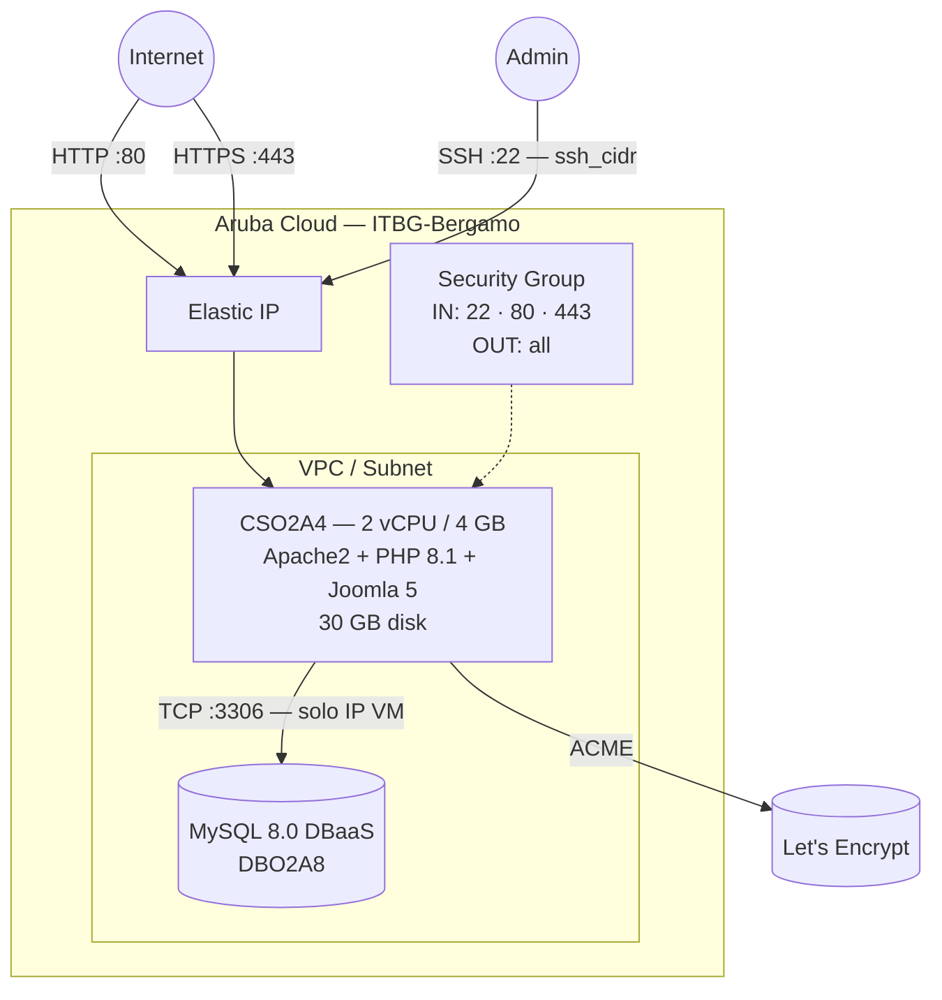

# Joomla su Aruba Cloud

Esegui il deployment di [Joomla 5](https://www.joomla.org) — un popolare CMS open-source — su Aruba Cloud tramite Terraform e cloud-init. Joomla viene installato tramite il CLI installer ufficiale con un backend MySQL 8.0 DBaaS gestito.

> **Versione provider:** arubacloud/arubacloud `~> 0.5` | **Terraform:** ≥ 1.9

---

## Introduzione

Joomla 5 è un CMS ricco di funzionalità adatto per siti web, intranet e applicazioni web. Questo esempio esegue il provisioning di:

- **Apache2 + PHP 8.1** con tutte le estensioni richieste da Joomla
- **Joomla** scaricato dalla release ufficiale su GitHub e installato tramite il CLI installer integrato in modalità completamente non presidiata
- **MySQL 8.0 gestito** tramite ArubaCloud DBaaS
- Porte 80 e 443 aperte a internet
- **HTTPS opzionale** tramite Let's Encrypt quando `domain` è impostato
- Directory di installazione rimossa automaticamente dopo la configurazione (requisito di sicurezza Joomla)

---

## Panoramica dell'architettura



---

## Infrastruttura creata

| Risorsa | Pattern del nome | Descrizione |
|---------|-----------------|-------------|
| `arubacloud_project` | `joomla-prod` | Contenitore del progetto |
| `arubacloud_vpc` | `joomla-prod-vpc` | Virtual Private Cloud |
| `arubacloud_subnet` | `joomla-prod-subnet` | Subnet base |
| `arubacloud_securitygroup` | `joomla-prod-vm-sg` | Security group VM |
| `arubacloud_securitygroup` | `joomla-prod-dbaas-sg` | Security group DBaaS |
| `arubacloud_securityrule` | `joomla-prod-vm-ssh` | Regola ingress SSH |
| `arubacloud_securityrule` | `joomla-prod-vm-http` | Regola ingress HTTP TCP 80 |
| `arubacloud_securityrule` | `joomla-prod-vm-https` | Regola ingress HTTPS TCP 443 |
| `arubacloud_securityrule` | `joomla-prod-db-mysql` | Regola ingress MySQL solo dall'IP VM |
| `arubacloud_elasticip` | `joomla-prod-vm-eip` | IP pubblico VM |
| `arubacloud_elasticip` | `joomla-prod-dbaas-eip` | IP pubblico DBaaS |
| `arubacloud_blockstorage` | `joomla-prod-boot` | Disco di boot da 30 GB (Performance) |
| `arubacloud_keypair` | `joomla-prod-keypair` | Chiave pubblica SSH |
| `arubacloud_dbaas` | `joomla-prod-dbaas` | MySQL 8.0 gestito |
| `arubacloud_database` | `joomla` | Database Joomla |
| `arubacloud_dbaasuser` | `joomla` | Utente DB Joomla |
| `arubacloud_cloudserver` | `joomla-prod-vm` | VM CloudServer |

---

## Costo mensile stimato

| Risorsa | Specifiche | Costo stimato/mese |
|---------|-----------|-------------------|
| VM CloudServer | CSO2A4 — 2 vCPU / 4 GB | ~€18 |
| Disco di boot | 30 GB Performance | ~€5 |
| Elastic IP (VM) | — | ~€3 |
| MySQL DBaaS | DBO2A8 + 20 GB | ~€30 |
| Elastic IP (DBaaS) | — | ~€3 |
| **Totale** | | **~€59/mese** |

---

## Requisiti

- Terraform ≥ 1.9
- ArubaCloud Terraform Provider `~> 0.5`
- Un account ArubaCloud con credenziali API OAuth2
- Una coppia di chiavi SSH

---

## Variabili

### Obbligatorie

| Variabile | Descrizione |
|-----------|-------------|
| `arubacloud_client_id` | Client ID OAuth2 di ArubaCloud |
| `arubacloud_client_secret` | Client secret OAuth2 di ArubaCloud |
| `ssh_public_key` | Contenuto della chiave pubblica SSH |
| `db_password` | Password utente MySQL Joomla (min 16 caratteri) |
| `admin_email` | Indirizzo email dell'amministratore Joomla |
| `admin_password` | Password amministratore Joomla (min 12 caratteri) |

### Opzionali

| Variabile | Default | Descrizione |
|-----------|---------|-------------|
| `app_name` | `"joomla"` | Nome breve usato in tutti i nomi delle risorse |
| `environment` | `"prod"` | Etichetta dell'ambiente |
| `location` | `"ITBG-Bergamo"` | Regione ArubaCloud |
| `zone` | `"ITBG-1"` | Zona di disponibilità |
| `billing_period` | `"Hour"` | `"Hour"` o `"Month"` |
| `vm_flavor` | `"CSO2A4"` | Flavor del CloudServer |
| `vm_image` | `"LU22-001"` | Immagine del disco di boot (Ubuntu 22.04 LTS) |
| `vm_disk_size_gb` | `30` | Dimensione del disco di boot in GB |
| `ssh_cidr` | `"0.0.0.0/0"` | CIDR per SSH — limita in produzione |
| `dbaas_flavor` | `"DBO2A8"` | Flavor istanza DBaaS |
| `db_storage_gb` | `20` | Dimensione storage iniziale DBaaS in GB |
| `site_name` | `"My Joomla Site"` | Nome visualizzato del sito |
| `admin_user` | `"admin"` | Nome utente amministratore Joomla |
| `admin_fullname` | `"Site Administrator"` | Nome completo amministratore Joomla |
| `joomla_version` | `"5.3.2"` | Versione di Joomla |
| `domain` | `""` | Dominio per HTTPS automatico con Let's Encrypt |

---

## Output

| Output | Descrizione |
|--------|-------------|
| `site_url` | URL del sito Joomla |
| `admin_url` | URL del pannello amministratore Joomla |
| `vm_public_ip` | Indirizzo IP pubblico della VM |
| `ssh_command` | Comando SSH per connettersi alla VM |
| `db_host` | Indirizzo host MySQL DBaaS |

---

## Istruzioni di deployment

### 1. Clona e naviga

```bash
git clone https://github.com/arubacloud/terraform-arubacloud-examples.git
cd terraform-arubacloud-examples/joomla
```

### 2. Configura le variabili

```bash
cp terraform.tfvars.example terraform.tfvars
```

### 3. Esegui il deployment

```bash
terraform init
terraform plan
terraform apply
```

Il bootstrap richiede circa **5–10 minuti**.

### 4. Accedi a Joomla

```bash
terraform output site_url
terraform output admin_url
```

Accedi a `/administrator` con `admin_user` e `admin_password`.

---

## Riferimenti

- [Documentazione Joomla](https://docs.joomla.org)
- [CLI Installer Joomla](https://docs.joomla.org/J4.x:CLI_Installation)
- [Provider Terraform ArubaCloud](https://registry.terraform.io/providers/arubacloud/arubacloud/latest/docs)
