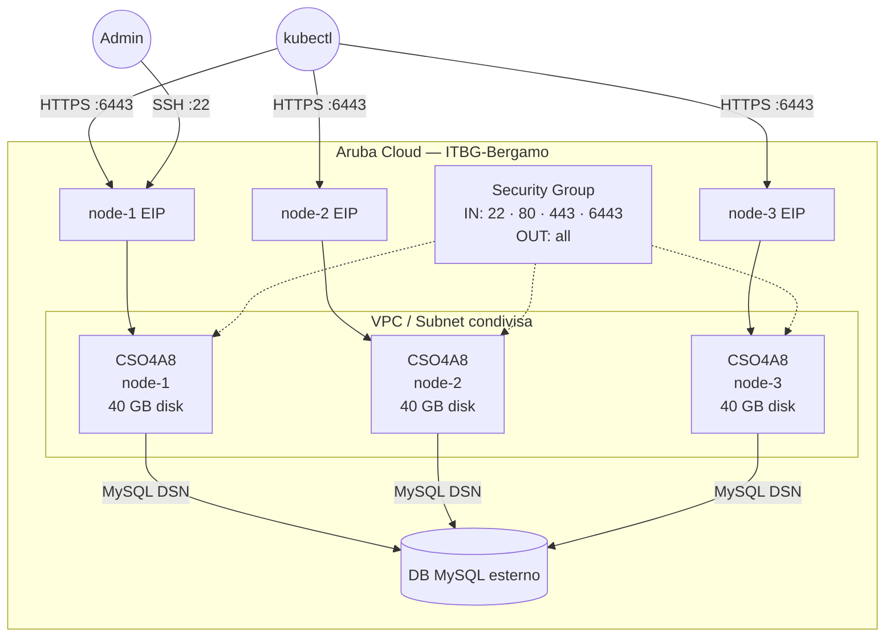

# Cluster k3s HA su Aruba Cloud

Esegui il deployment di un **cluster k3s HA con control-plane a 3 nodi** su Aruba Cloud tramite Terraform e cloud-init. Usa un database MySQL 8.0 esterno come datastore HA tramite lo shim [kine](https://github.com/k3s-io/kine) integrato.

> **Versione provider:** arubacloud/arubacloud `~> 0.5` | **Terraform:** ≥ 1.9

---

## Introduzione

[k3s](https://k3s.io/) è una distribuzione Kubernetes leggera, certificata CNCF, ottimizzata per ambienti edge e con risorse limitate. Questo esempio distribuisce un control-plane HA a 3 nodi — tutti e tre i nodi possono servire l'API Kubernetes e schedulare workload. Prevede:

- Creazione di **tre nodi di control-plane identici** (ciascuno con il proprio Elastic IP)
- Uso di un **datastore MySQL 8.0 esterno** per lo stato del cluster (ArubaCloud DBaaS o portalo tuo)
- Apertura di SSH (22), API Kubernetes (6443), HTTP (80) e HTTPS (443)
- Disabilitazione del ServiceLB integrato (Klipper) — usa un LB esterno o MetalLB

> **DB esterno obbligatorio:** Devi eseguire il provisioning di un database MySQL 8.0 separatamente prima di eseguire `terraform apply`. Crea un database `k3s` e un utente dedicato con privilegi completi su di esso.

---

## Panoramica dell'architettura



---

## Infrastruttura creata

| Risorsa | Numero | Pattern del nome | Descrizione |
|---------|--------|-----------------|-------------|
| `arubacloud_project` | 1 | `k3sha-prod` | Contenitore del progetto |
| `arubacloud_vpc` | 1 | `k3sha-prod-vpc` | Virtual Private Cloud |
| `arubacloud_subnet` | 1 | `k3sha-prod-subnet` | Subnet base |
| `arubacloud_securitygroup` | 1 | `k3sha-prod-sg` | Security group condiviso |
| `arubacloud_securityrule` | 5 | `k3sha-prod-{ssh,api,http,https,egress}` | Regole ingress/egress |
| `arubacloud_elasticip` | 3 | `k3sha-prod-node-{1,2,3}-eip` | Un IP pubblico per nodo |
| `arubacloud_blockstorage` | 3 | `k3sha-prod-node-{1,2,3}-boot` | Disco di boot da 40 GB per nodo |
| `arubacloud_keypair` | 1 | `k3sha-prod-keypair` | Chiave pubblica SSH condivisa |
| `arubacloud_cloudserver` | 3 | `k3sha-prod-node-{1,2,3}` | VM di control-plane |

---

## Costo mensile stimato

| Risorsa | Specifiche | Costo stimato/mese |
|---------|-----------|-------------------|
| 3× VM CloudServer | CSO4A8 — 4 vCPU / 8 GB | ~€120 |
| 3× Disco di boot | 40 GB Performance | ~€18 |
| 3× Elastic IP | — | ~€9 |
| MySQL esterno | ArubaCloud DBaaS (varia) | ~€15 |
| **Totale** | | **~€162/mese** |

---

## Requisiti

- Terraform ≥ 1.9
- ArubaCloud Terraform Provider `~> 0.5`
- Un account ArubaCloud con credenziali API OAuth2
- Una coppia di chiavi SSH
- Un database **MySQL 8.0** esterno raggiungibile dalle VM

---

## Variabili

### Obbligatorie

| Variabile | Descrizione |
|-----------|-------------|
| `arubacloud_client_id` | Client ID OAuth2 di ArubaCloud |
| `arubacloud_client_secret` | Client secret OAuth2 di ArubaCloud |
| `ssh_public_key` | Contenuto della chiave pubblica SSH |
| `k3s_token` | Token cluster condiviso (genera con `openssl rand -hex 32`, min 16 caratteri) |
| `db_host` | Hostname o IP MySQL 8.0 |
| `db_password` | Password MySQL |

### Opzionali

| Variabile | Default | Descrizione |
|-----------|---------|-------------|
| `k3s_version` | `"latest"` | Versione k3s (es. `"v1.32.0+k3s1"`) |
| `db_port` | `3306` | Porta MySQL |
| `db_name` | `"k3s"` | Nome database MySQL |
| `db_user` | `"k3s"` | Nome utente MySQL |
| `ssh_cidr` | `"0.0.0.0/0"` | CIDR per accesso SSH |
| `api_cidr` | `"0.0.0.0/0"` | CIDR per l'API server k3s (porta 6443) — limita in produzione |
| `app_name` | `"k3sha"` | Nome breve usato in tutti i nomi delle risorse |
| `environment` | `"prod"` | Etichetta dell'ambiente |
| `location` | `"ITBG-Bergamo"` | Regione ArubaCloud |
| `zone` | `"ITBG-1"` | Zona di disponibilità |
| `billing_period` | `"Hour"` | `"Hour"` o `"Month"` |
| `vm_flavor` | `"CSO4A8"` | Flavor CloudServer per nodo |
| `vm_disk_size_gb` | `40` | Dimensione disco di boot per nodo (min 20 GB) |

---

## Output

| Output | Descrizione |
|--------|-------------|
| `node_public_ips` | Mappa nome nodo → IP pubblico |
| `ssh_commands` | Mappa nome nodo → comando SSH |
| `api_endpoints` | Mappa nome nodo → `https://<IP>:6443` |

---

## Istruzioni di deployment

### 1. Esegui il provisioning del database MySQL esterno

Crea un database MySQL 8.0 prima del deployment:

```sql
CREATE DATABASE k3s;
CREATE USER 'k3s'@'%' IDENTIFIED BY 'your-password';
GRANT ALL PRIVILEGES ON k3s.* TO 'k3s'@'%';
FLUSH PRIVILEGES;
```

### 2. Clona e naviga

```bash
git clone https://github.com/arubacloud/terraform-arubacloud-examples.git
cd terraform-arubacloud-examples/k3s-ha
```

### 3. Configura le variabili

```bash
cp terraform.tfvars.example terraform.tfvars
```

### 4. Esegui il deployment

```bash
terraform init
terraform plan
terraform apply
```

I tre nodi vengono creati simultaneamente. Ciascuno esegue il bootstrap in **2–5 minuti**.

### 5. Recupera il kubeconfig

```bash
# SSH nel node-1
ssh ubuntu@<node-1-ip>
sudo cat /etc/rancher/k3s/k3s.yaml
```

Copia il kubeconfig sul tuo computer locale e sostituisci `127.0.0.1` con l'IP pubblico del nodo:

```bash
export KUBECONFIG=~/.kube/k3s-ha.yaml
kubectl get nodes
```

---

## Riferimenti

- [k3s HA con DB esterno](https://docs.k3s.io/datastore/ha)
- [Documentazione k3s](https://docs.k3s.io/)
- [kine — shim datastore SQL](https://github.com/k3s-io/kine)
- [Provider Terraform ArubaCloud](https://registry.terraform.io/providers/arubacloud/arubacloud/latest/docs)
