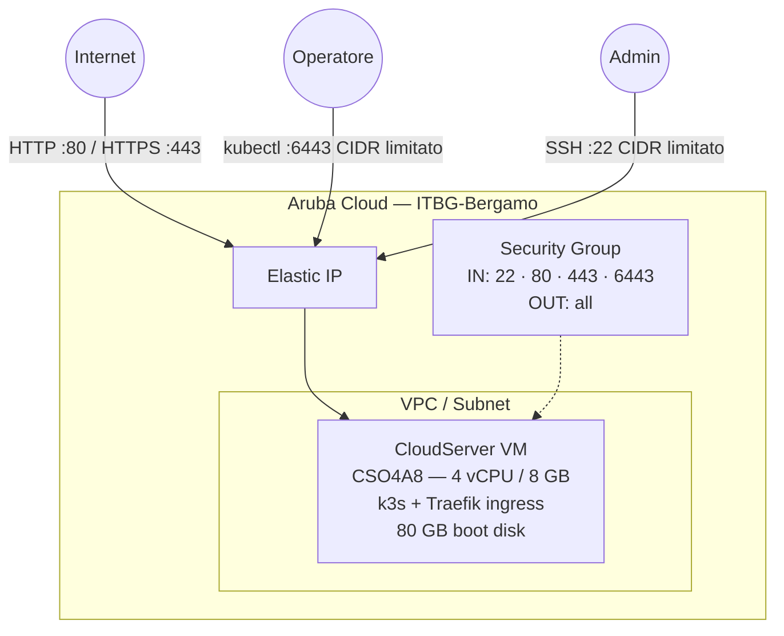

# k3s Single Node su Aruba Cloud

Esegui il deployment di un cluster Kubernetes single-node [k3s](https://k3s.io) pronto per la produzione su Aruba Cloud tramite Terraform e cloud-init. Include il controller ingress Traefik integrato — nessuna configurazione manuale richiesta.

> **Versione provider:** arubacloud/arubacloud `~> 0.5` | **Terraform:** ≥ 1.9

---

## Introduzione

k3s è una distribuzione Kubernetes leggera, certificata CNCF, confezionata come singolo binario. È ideale per edge computing, homelabs, ambienti CI e workload di produzione di piccole dimensioni. Questo esempio esegue il provisioning di un cluster k3s single-node su Aruba Cloud con:

- Una **VM CloudServer** (CSO4A8 — 4 vCPU / 8 GB) che esegue k3s, completamente avviata da cloud-init
- Il **controller ingress Traefik v2 integrato** per il routing del traffico HTTP/HTTPS verso i servizi
- Una **VPC, subnet e security group** dedicati tramite il modulo di rete condiviso
- Un **Elastic IP** fisso al nodo per un accesso esterno stabile
- Il server API Kubernetes preconfigurato con l'Elastic IP del nodo come **TLS SAN** — in modo che `kubectl` funzioni immediatamente dal tuo laptop senza errori di certificato
- Un **kubeconfig** pronto all'uso posizionato in `~ubuntu/.kube/config` sul nodo dopo il boot

---

## Panoramica dell'architettura

k3s viene eseguito come singolo servizio systemd che combina il control-plane e il worker node. Traefik è installato da k3s come DaemonSet e gestisce tutte le risorse Ingress.



---

## Infrastruttura creata

| Risorsa | Pattern del nome | Descrizione |
|---------|-----------------|-------------|
| `arubacloud_project` | `k3s-prod` | Contenitore del progetto |
| `arubacloud_vpc` | `k3s-prod-vpc` | Virtual Private Cloud |
| `arubacloud_subnet` | `k3s-prod-subnet` | Subnet base |
| `arubacloud_securitygroup` | `k3s-prod-vm-sg` | Security group |
| `arubacloud_securityrule` | `k3s-prod-vm-ssh` | Regola ingress SSH (CIDR limitato) |
| `arubacloud_securityrule` | `k3s-prod-vm-http` | Regola ingress HTTP (0.0.0.0/0) |
| `arubacloud_securityrule` | `k3s-prod-vm-https` | Regola ingress HTTPS (0.0.0.0/0) |
| `arubacloud_securityrule` | `k3s-prod-vm-k8s-api` | Regola ingress API Kubernetes (CIDR limitato) |
| `arubacloud_elasticip` | `k3s-prod-vm-eip` | IP pubblico del nodo |
| `arubacloud_blockstorage` | `k3s-prod-boot` | Disco di boot da 80 GB (Performance) |
| `arubacloud_keypair` | `k3s-prod-keypair` | Chiave pubblica SSH |
| `arubacloud_cloudserver` | `k3s-prod-vm` | VM CloudServer |

---

## Raccomandazione dimensionamento VM

| Workload | vCPU | RAM | Disco | Flavor |
|---------|------|-----|-------|--------|
| Dev / CI / basso traffico | 4 | 8 GB | 80 GB | `CSO4A8` *(default)* |
| Produzione media | 8 | 16 GB | 100 GB | `CSO8A16` |

Un cluster single-node non può ripianificare i pod in caso di guasto. Per l'alta disponibilità, considera una configurazione multi-nodo (vedi l'esempio k3s HA).

---

## Costo mensile stimato

> Prezzi approssimativi per ITBG-Bergamo, fatturazione oraria. I prezzi effettivi possono variare.

| Risorsa | Specifiche | Costo stimato/mese |
|---------|-----------|-------------------|
| VM CloudServer | CSO4A8 — 4 vCPU / 8 GB | ~€36 |
| Disco di boot | 80 GB Performance | ~€10 |
| Elastic IP | — | ~€3 |
| **Totale** | | **~€49/mese** |

---

## Requisiti

- Terraform ≥ 1.9
- ArubaCloud Terraform Provider `~> 0.5`
- Un account ArubaCloud con credenziali API OAuth2
- Una coppia di chiavi SSH
- `kubectl` installato localmente per interagire con il cluster

---

## Variabili

### Obbligatorie

| Variabile | Descrizione |
|-----------|-------------|
| `arubacloud_client_id` | Client ID OAuth2 di ArubaCloud |
| `arubacloud_client_secret` | Client secret OAuth2 di ArubaCloud |
| `ssh_public_key` | Contenuto della chiave pubblica SSH |

### Opzionali

| Variabile | Default | Descrizione |
|-----------|---------|-------------|
| `app_name` | `"k3s"` | Nome breve usato in tutti i nomi delle risorse |
| `environment` | `"prod"` | Etichetta dell'ambiente |
| `location` | `"ITBG-Bergamo"` | Regione ArubaCloud |
| `zone` | `"ITBG-1"` | Zona di disponibilità |
| `billing_period` | `"Hour"` | `"Hour"` o `"Month"` |
| `vm_flavor` | `"CSO4A8"` | Flavor del CloudServer |
| `vm_image` | `"LU22-001"` | Immagine del disco di boot (Ubuntu 22.04 LTS) |
| `vm_disk_size_gb` | `80` | Dimensione del disco di boot in GB |
| `ssh_cidr` | `"0.0.0.0/0"` | CIDR per SSH — **limita al tuo IP in produzione** |
| `api_cidr` | `"0.0.0.0/0"` | CIDR per l'API Kubernetes (porta 6443) — **limita al tuo IP in produzione** |
| `k3s_version` | `"v1.32.3+k3s1"` | Release k3s — controlla [github.com/k3s-io/k3s/releases](https://github.com/k3s-io/k3s/releases) |
| `cluster_domain` | `""` | Nome DNS opzionale aggiunto come TLS SAN al certificato dell'API server |

---

## Output

| Output | Descrizione |
|--------|-------------|
| `vm_public_ip` | Indirizzo IP pubblico del nodo k3s |
| `api_endpoint` | URL dell'API server Kubernetes |
| `ssh_command` | Comando SSH per connettersi al nodo |
| `kubeconfig_cmd` | One-liner per scaricare il kubeconfig sul tuo computer locale |

---

## Istruzioni di deployment

### 1. Clona e naviga

```bash
git clone https://github.com/arubacloud/terraform-arubacloud-examples.git
cd terraform-arubacloud-examples/k3s-single
```

### 2. Configura le variabili

```bash
cp terraform.tfvars.example terraform.tfvars
```

Modifica `terraform.tfvars` con le tue credenziali e chiave SSH.

### 3. Inizializza e distribuisci

```bash
terraform init
terraform plan
terraform apply
```

Il bootstrap richiede circa **3–5 minuti** — k3s si installa velocemente essendo un singolo binario.

### 4. Scarica il kubeconfig

```bash
# Copia il one-liner dagli output:
terraform output -raw kubeconfig_cmd | bash

# Oppure manualmente:
ssh ubuntu@$(terraform output -raw vm_public_ip) \
  'cat ~/.kube/config' > ~/.kube/k3s-arubacloud.yaml
export KUBECONFIG=~/.kube/k3s-arubacloud.yaml
```

### 5. Verifica il cluster

```bash
kubectl get nodes
# NAME          STATUS   ROLES                  AGE   VERSION
# k3s-prod-vm   Ready    control-plane,master   2m    v1.32.3+k3s1

kubectl get pods -A
# Traefik, CoreDNS e metrics-server dovrebbero essere tutti in Running.
```

### 6. Distribuisci un workload

```bash
kubectl create deployment hello --image=nginx --replicas=1
kubectl expose deployment hello --port=80 --type=ClusterIP

# Crea un Ingress per instradare il traffico esterno:
cat <<EOF | kubectl apply -f -
apiVersion: networking.k8s.io/v1
kind: Ingress
metadata:
  name: hello
  annotations:
    traefik.ingress.kubernetes.io/router.entrypoints: web
spec:
  rules:
  - http:
      paths:
      - path: /
        pathType: Prefix
        backend:
          service:
            name: hello
            port:
              number: 80
EOF

curl http://$(terraform output -raw vm_public_ip)
```

---

## Raccomandazioni di sicurezza

1. **Limita `api_cidr` al tuo IP.** Esporre la porta 6443 a `0.0.0.0/0` consente a chiunque di tentare l'autenticazione contro l'API. Imposta `api_cidr = "your.ip/32"`.

2. **Limita `ssh_cidr` al tuo IP.** Imposta `ssh_cidr = "your.ip/32"`.

3. **Ruota periodicamente il token del nodo.** Il token del nodo k3s si trova in `/var/lib/rancher/k3s/server/node-token`. Mantienilo segreto.

4. **Usa RBAC per i workload.** k3s viene fornito con RBAC abilitato. Crea service account con ruoli a privilegi minimi per ogni applicazione.

5. **Abilita TLS per Ingress.** Usa cert-manager con Let's Encrypt per il provisioning di certificati per le tue risorse Ingress, oppure configura il supporto ACME integrato di Traefik.

---

## Risoluzione dei problemi

### k3s non è in esecuzione dopo apply

```bash
ssh ubuntu@$(terraform output -raw vm_public_ip)
sudo systemctl status k3s
sudo journalctl -u k3s -n 100
sudo tail -f /var/log/cloud-init-output.log
```

### kubectl restituisce errore di certificato

Il certificato dell'API server include l'Elastic IP del nodo come SAN. Se hai impostato `cluster_domain`, assicurati che il DNS si risolva all'Elastic IP e usa il dominio nell'URL del server del tuo kubeconfig.

### Pod bloccati in Pending

Controlla le risorse del nodo:

```bash
kubectl describe node
kubectl get events --sort-by='.lastTimestamp'
```

I cluster single-node eseguono sia il control-plane che i workload sulla stessa VM — assicurati che il flavor abbia abbastanza memoria per i tuoi workload.

---

## Riferimenti

- [Documentazione k3s](https://docs.k3s.io/)
- [Release k3s](https://github.com/k3s-io/k3s/releases)
- [Traefik su k3s](https://docs.k3s.io/networking/traefik-ingress)
- [Provider Terraform ArubaCloud](https://registry.terraform.io/providers/arubacloud/arubacloud/latest/docs)
- [Riferimento cloud-init](https://cloudinit.readthedocs.io/)
