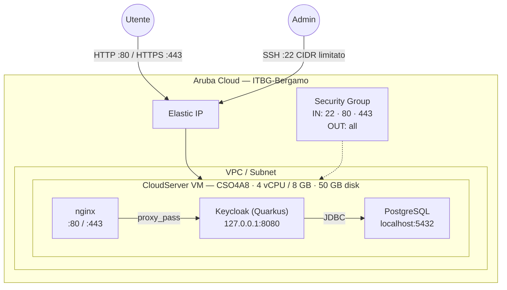

# Keycloak su Aruba Cloud

Esegui il deployment di [Keycloak](https://www.keycloak.org) — gestione delle identità e degli accessi enterprise — su Aruba Cloud tramite Terraform e cloud-init. Keycloak viene eseguito in modalità Quarkus di produzione con un database PostgreSQL locale.

> **Versione provider:** arubacloud/arubacloud `~> 0.5` | **Terraform:** ≥ 1.9

---

## Introduzione

Keycloak è una piattaforma IAM open-source certificata CNCF che fornisce SSO, OIDC, OAuth2 e SAML 2.0. Questo esempio distribuisce Keycloak con:

- **Distribuzione Keycloak Quarkus** in modalità server di produzione — non modalità dev, nessun database H2 effimero
- **PostgreSQL locale** — Keycloak supporta ufficialmente PostgreSQL e MariaDB. MySQL gestito da ArubaCloud DBaaS **non** è nella matrice di supporto di Keycloak e non viene usato qui
- **Reverse proxy nginx** sulle porte 80/443 con header di forwarding corretti (`X-Forwarded-*`), mentre Keycloak si lega a `127.0.0.1:8080`
- **Utente admin creato automaticamente** al primo avvio tramite file di ambiente systemd — accedi immediatamente dopo il bootstrap
- **HTTPS Let's Encrypt opzionale** quando viene fornito un dominio personalizzato

---

## Panoramica dell'architettura



---

## Infrastruttura creata

| Risorsa | Pattern del nome | Descrizione |
|---------|-----------------|-------------|
| `arubacloud_project` | `kc-prod` | Contenitore del progetto |
| `arubacloud_vpc` | `kc-prod-vpc` | Virtual Private Cloud |
| `arubacloud_subnet` | `kc-prod-subnet` | Subnet base |
| `arubacloud_securitygroup` | `kc-prod-vm-sg` | Security group |
| `arubacloud_securityrule` | `kc-prod-vm-ssh` | Regola ingress SSH |
| `arubacloud_securityrule` | `kc-prod-vm-http` | Regola ingress HTTP |
| `arubacloud_securityrule` | `kc-prod-vm-https` | Regola ingress HTTPS |
| `arubacloud_elasticip` | `kc-prod-vm-eip` | IP pubblico della VM |
| `arubacloud_blockstorage` | `kc-prod-boot` | Disco di boot da 50 GB (Performance) |
| `arubacloud_keypair` | `kc-prod-keypair` | Chiave pubblica SSH |
| `arubacloud_cloudserver` | `kc-prod-vm` | VM CloudServer |

---

## Costo mensile stimato

| Risorsa | Specifiche | Costo stimato/mese |
|---------|-----------|-------------------|
| VM CloudServer | CSO4A8 — 4 vCPU / 8 GB | ~€36 |
| Disco di boot | 50 GB Performance | ~€6 |
| Elastic IP | — | ~€3 |
| **Totale** | | **~€45/mese** |

---

## Requisiti

- Terraform ≥ 1.9
- ArubaCloud Terraform Provider `~> 0.5`
- Un account ArubaCloud con credenziali API OAuth2
- Una coppia di chiavi SSH

---

## Variabili

### Obbligatorie

| Variabile | Descrizione |
|-----------|-------------|
| `arubacloud_client_id` | Client ID OAuth2 di ArubaCloud |
| `arubacloud_client_secret` | Client secret OAuth2 di ArubaCloud |
| `ssh_public_key` | Contenuto della chiave pubblica SSH |
| `keycloak_admin_password` | Password admin Keycloak (min 12 caratteri) |
| `db_password` | Password utente Keycloak PostgreSQL (min 16 caratteri) |

### Opzionali

| Variabile | Default | Descrizione |
|-----------|---------|-------------|
| `app_name` | `"kc"` | Nome breve usato in tutti i nomi delle risorse |
| `environment` | `"prod"` | Etichetta dell'ambiente |
| `location` | `"ITBG-Bergamo"` | Regione ArubaCloud |
| `zone` | `"ITBG-1"` | Zona di disponibilità |
| `billing_period` | `"Hour"` | `"Hour"` o `"Month"` |
| `vm_flavor` | `"CSO4A8"` | Flavor del CloudServer |
| `vm_image` | `"LU22-001"` | Immagine del disco di boot (Ubuntu 22.04 LTS) |
| `vm_disk_size_gb` | `50` | Dimensione del disco di boot in GB |
| `ssh_cidr` | `"0.0.0.0/0"` | CIDR per SSH — **limita al tuo IP** |
| `keycloak_admin` | `"admin"` | Nome utente admin Keycloak |
| `keycloak_version` | `"26.0.7"` | Versione di Keycloak |
| `domain` | `""` | Dominio personalizzato per HTTPS — lascia vuoto per usare l'Elastic IP |

---

## Output

| Output | Descrizione |
|--------|-------------|
| `keycloak_url` | URL Keycloak |
| `admin_console_url` | URL della console admin Keycloak |
| `vm_public_ip` | IP pubblico della VM |
| `ssh_command` | Comando SSH per connettersi |
| `keycloak_admin` | Nome utente admin |

---

## Istruzioni di deployment

### 1. Clona e naviga

```bash
git clone https://github.com/arubacloud/terraform-arubacloud-examples.git
cd terraform-arubacloud-examples/keycloak
```

### 2. Configura le variabili

```bash
cp terraform.tfvars.example terraform.tfvars
```

Imposta `keycloak_admin_password` e `db_password`.

### 3. Esegui il deployment

```bash
terraform init
terraform plan
terraform apply
```

Il bootstrap richiede circa **8–12 minuti** — Keycloak scarica ~120 MB e `kc.sh build` compila l'app Quarkus.

### 4. Accedi alla console Admin

```bash
terraform output admin_console_url
```

Accedi con il nome utente admin e `keycloak_admin_password`. Crea i tuoi realm, client e utenti.

---

## Raccomandazioni di sicurezza

1. **Usa HTTPS.** Imposta `domain` per abilitare TLS Let's Encrypt. I token Keycloak trasmessi via HTTP possono essere intercettati.

2. **Limita SSH.** Imposta `ssh_cidr = "your.ip/32"`.

3. **Cambia la password admin** dopo il primo accesso con un valore univoco e robusto.

4. **Disabilita il master realm per uso in produzione.** Crea un realm dedicato per le tue applicazioni e disabilita l'accesso diretto al master realm.

5. **Abilita la protezione brute-force.** In Impostazioni Realm → Difese di Sicurezza → Rilevamento Brute Force.

6. **Esegui backup regolari del database PostgreSQL** — tutta la configurazione di realm, utenti e client è memorizzata lì.

---

## Risoluzione dei problemi

### Keycloak non raggiungibile dopo apply

```bash
sudo systemctl status keycloak
sudo journalctl -u keycloak -n 50
sudo tail -f /var/log/cloud-init-output.log
```

Keycloak impiega 2–4 minuti per avviarsi la prima volta (`kc.sh build` deve girare prima). Gli avvii successivi sono più veloci.

### La console admin restituisce 403

Assicurati che l'`hostname` in `keycloak.conf` corrisponda all'hostname da cui stai accedendo a Keycloak. Con accesso via IP e senza dominio, `hostname-strict=false` è già impostato.

### PostgreSQL connection refused

```bash
sudo systemctl status postgresql
sudo -u postgres psql -c "\l"   # elenca i database
sudo -u postgres psql -c "\du"  # elenca gli utenti
```

---

## Riferimenti

- [Documentazione Keycloak](https://www.keycloak.org/documentation)
- [Configurazione server Keycloak](https://www.keycloak.org/server/all-config)
- [Deployment produzione Keycloak](https://www.keycloak.org/server/configuration-production)
- [Release Keycloak](https://github.com/keycloak/keycloak/releases)
- [Provider Terraform ArubaCloud](https://registry.terraform.io/providers/arubacloud/arubacloud/latest/docs)
