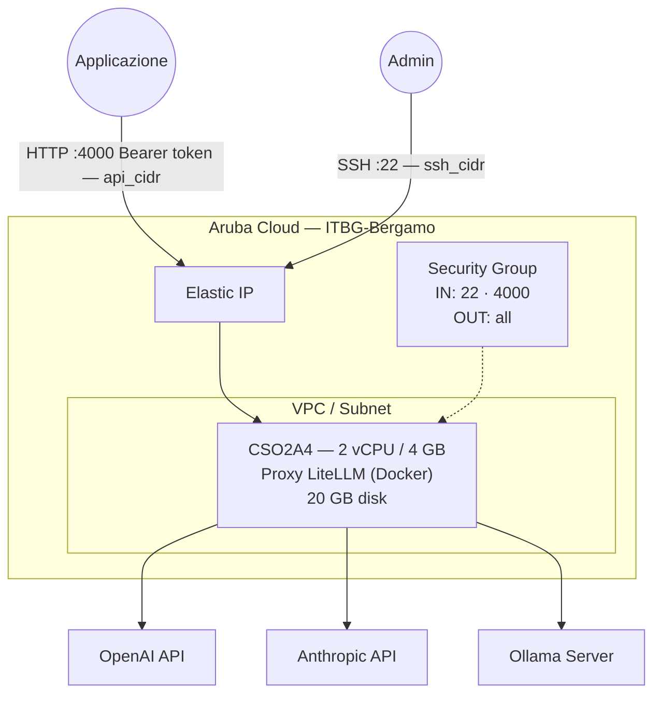

# LiteLLM su Aruba Cloud

Esegui il deployment di [LiteLLM](https://litellm.ai/) — un proxy API compatibile OpenAI che instrada le richieste a molteplici provider LLM — su Aruba Cloud tramite Terraform e cloud-init. Supporta OpenAI, Anthropic (Claude), Ollama, Azure OpenAI e oltre 100 altri provider tramite una singola API unificata.

> **Versione provider:** arubacloud/arubacloud `~> 0.5` | **Terraform:** ≥ 1.9

---

## Introduzione

LiteLLM traduce le chiamate API OpenAI nel formato richiesto da ciascun provider, consentendo alle applicazioni di passare da un modello all'altro senza modifiche al codice. Questo esempio distribuisce:

- **Proxy LiteLLM** tramite Docker
- REST API compatibile OpenAI sulla porta 4000
- Routing provider configurabile (OpenAI, Anthropic, Ollama)
- Autenticazione tramite master key

---

## Panoramica dell'architettura



---

## Infrastruttura creata

| Risorsa | Pattern del nome | Descrizione |
|---------|-----------------|-------------|
| `arubacloud_project` | `llm-prod` | Contenitore del progetto |
| `arubacloud_vpc` | `llm-prod-vpc` | Virtual Private Cloud |
| `arubacloud_subnet` | `llm-prod-subnet` | Subnet base |
| `arubacloud_securitygroup` | `llm-prod-vm-sg` | Security group |
| `arubacloud_securityrule` | `llm-prod-vm-ssh` | Regola ingress SSH |
| `arubacloud_securityrule` | `llm-prod-vm-api` | Proxy LiteLLM TCP 4000 |
| `arubacloud_elasticip` | `llm-prod-vm-eip` | IP pubblico della VM |
| `arubacloud_blockstorage` | `llm-prod-boot` | Disco di boot da 20 GB (Performance) |
| `arubacloud_keypair` | `llm-prod-keypair` | Chiave pubblica SSH |
| `arubacloud_cloudserver` | `llm-prod-vm` | VM CloudServer |

---

## Costo mensile stimato

| Risorsa | Specifiche | Costo stimato/mese |
|---------|-----------|-------------------|
| VM CloudServer | CSO2A4 — 2 vCPU / 4 GB | ~€20 |
| Disco di boot | 20 GB Performance | ~€3 |
| Elastic IP | — | ~€3 |
| **Totale** | | **~€26/mese** |

---

## Requisiti

- Terraform ≥ 1.9
- ArubaCloud Terraform Provider `~> 0.5`
- Un account ArubaCloud con credenziali API OAuth2
- Una coppia di chiavi SSH
- Almeno una chiave API di un provider LLM o un server Ollama

---

## Variabili

### Obbligatorie

| Variabile | Descrizione |
|-----------|-------------|
| `arubacloud_client_id` | Client ID OAuth2 di ArubaCloud |
| `arubacloud_client_secret` | Client secret OAuth2 di ArubaCloud |
| `ssh_public_key` | Contenuto della chiave pubblica SSH |
| `master_key` | Master API key LiteLLM (prefissa con `sk-`) |

### Opzionali

| Variabile | Default | Descrizione |
|-----------|---------|-------------|
| `app_name` | `"llm"` | Nome breve usato in tutti i nomi delle risorse |
| `environment` | `"prod"` | Etichetta dell'ambiente |
| `location` | `"ITBG-Bergamo"` | Regione ArubaCloud |
| `zone` | `"ITBG-1"` | Zona di disponibilità |
| `billing_period` | `"Hour"` | `"Hour"` o `"Month"` |
| `vm_flavor` | `"CSO2A4"` | Flavor del CloudServer |
| `vm_disk_size_gb` | `20` | Dimensione del disco di boot in GB |
| `ssh_cidr` | `"0.0.0.0/0"` | CIDR per SSH |
| `api_cidr` | `"0.0.0.0/0"` | CIDR per la porta API proxy 4000 — **limita ai tuoi server applicativi** |
| `openai_api_key` | `""` | Chiave API OpenAI |
| `anthropic_api_key` | `""` | Chiave API Anthropic |
| `ollama_base_url` | `""` | URL del server Ollama |
| `litellm_version` | `"main"` | Tag immagine Docker LiteLLM |

---

## Output

| Output | Descrizione |
|--------|-------------|
| `litellm_url` | URL dell'API proxy LiteLLM |
| `vm_public_ip` | Indirizzo IP pubblico della VM |
| `ssh_command` | Comando SSH per connettersi alla VM |
| `health_check` | Comando `curl` per verificare che il proxy sia in esecuzione |

---

## Istruzioni di deployment

### 1. Clona e naviga

```bash
git clone https://github.com/arubacloud/terraform-arubacloud-examples.git
cd terraform-arubacloud-examples/litellm
```

### 2. Configura le variabili

```bash
cp terraform.tfvars.example terraform.tfvars
```

Imposta la tua master key e le credenziali del provider:

```hcl
master_key        = "sk-my-master-key"
openai_api_key    = "sk-..."
anthropic_api_key = "sk-ant-..."
ollama_base_url   = "http://10.0.0.10:11434"
```

### 3. Esegui il deployment

```bash
terraform init
terraform plan
terraform apply
```

### 4. Testa

```bash
# Health check
curl http://$(terraform output -raw vm_public_ip):4000/health

# Elenca i modelli
curl -H "Authorization: Bearer sk-my-master-key" \
  http://$(terraform output -raw vm_public_ip):4000/models

# Chat completion (compatibile OpenAI)
curl -H "Authorization: Bearer sk-my-master-key" \
  -H "Content-Type: application/json" \
  -d '{"model":"gpt-4o","messages":[{"role":"user","content":"Hello!"}]}' \
  http://$(terraform output -raw vm_public_ip):4000/chat/completions
```

---

## Riferimenti

- [Documentazione LiteLLM](https://docs.litellm.ai/)
- [Provider supportati da LiteLLM](https://docs.litellm.ai/docs/providers)
- [Esempio Ollama](../ollama/README.md)
- [Provider Terraform ArubaCloud](https://registry.terraform.io/providers/arubacloud/arubacloud/latest/docs)
