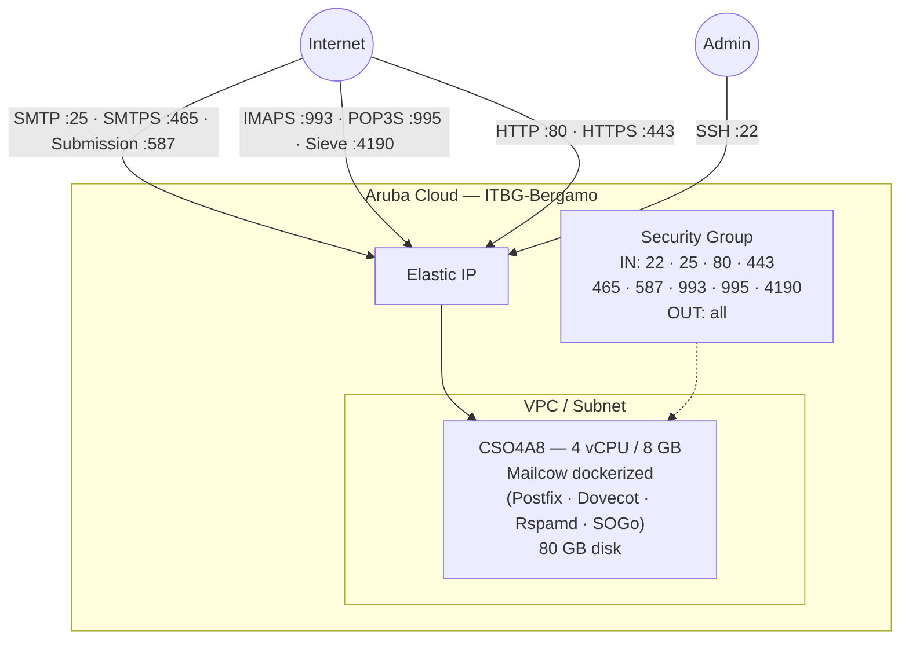

# Mailcow su Aruba Cloud

Distribuisci [Mailcow](https://mailcow.email/) — una suite completa di server email dockerizzata — su Aruba Cloud tramite Terraform e cloud-init. Mailcow raggruppa Postfix, Dovecot, Rspamd, ClamAV, SOGo e un pannello di amministrazione web in un unico stack Docker Compose.

> **Versione provider:** arubacloud/arubacloud `~> 0.5` | **Terraform:** ≥ 1.9

---

## Introduzione

Mailcow è la soluzione email self-hosted più diffusa con un'interfaccia web rifinita (SOGo), anti-spam integrato (Rspamd), anti-virus (ClamAV) e TLS automatico via Let's Encrypt. Questo esempio distribuisce:

- **Mailcow dockerized** tramite lo script di installazione ufficiale su una singola VM
- Tutte le porte necessarie aperte: SMTP (25), SMTPS (465), submission (587), IMAPS (993), POP3S (995), Sieve (4190), HTTP (80), HTTPS (443)
- Certificati TLS auto-provisionati da Let's Encrypt (il DNS deve risolvere prima dell'apply)

> **DNS prima di tutto:** L'integrazione Let's Encrypt di Mailcow viene eseguita all'avvio del container. Configura il tuo record `A` per `mail_hostname` → IP pubblico della VM prima di eseguire `terraform apply`.

---

## Panoramica dell'architettura



---

## Infrastruttura creata

| Risorsa | Pattern nome | Descrizione |
|---------|-------------|-------------|
| `arubacloud_project` | `mail-prod` | Contenitore progetto |
| `arubacloud_vpc` | `mail-prod-vpc` | Virtual Private Cloud |
| `arubacloud_subnet` | `mail-prod-subnet` | Subnet di base |
| `arubacloud_securitygroup` | `mail-prod-vm-sg` | Security group |
| `arubacloud_securityrule` | `mail-prod-vm-ssh` | Ingresso SSH (22) |
| `arubacloud_securityrule` | `mail-prod-vm-smtp` | Ingresso SMTP (25) |
| `arubacloud_securityrule` | `mail-prod-vm-http` | Ingresso HTTP (80) |
| `arubacloud_securityrule` | `mail-prod-vm-https` | Ingresso HTTPS (443) |
| `arubacloud_securityrule` | `mail-prod-vm-smtps` | Ingresso SMTPS (465) |
| `arubacloud_securityrule` | `mail-prod-vm-sub` | Ingresso Submission (587) |
| `arubacloud_securityrule` | `mail-prod-vm-imaps` | Ingresso IMAPS (993) |
| `arubacloud_securityrule` | `mail-prod-vm-pop3s` | Ingresso POP3S (995) |
| `arubacloud_securityrule` | `mail-prod-vm-sieve` | Ingresso Sieve (4190) |
| `arubacloud_elasticip` | `mail-prod-vm-eip` | IP pubblico VM |
| `arubacloud_blockstorage` | `mail-prod-boot` | Disco di avvio 80 GB (Performance) |
| `arubacloud_keypair` | `mail-prod-keypair` | Chiave pubblica SSH |
| `arubacloud_cloudserver` | `mail-prod-vm` | CloudServer VM |

---

## Costo mensile stimato

| Risorsa | Specifiche | Costo/mese stimato |
|---------|-----------|-------------------|
| CloudServer VM | CSO4A8 — 4 vCPU / 8 GB | ~€40 |
| Disco di avvio | 80 GB Performance | ~€12 |
| Elastic IP | — | ~€3 |
| **Totale** | | **~€55/mese** |

---

## Requisiti

- Terraform ≥ 1.9
- ArubaCloud Terraform Provider `~> 0.5`
- Un account ArubaCloud con credenziali API OAuth2
- Una coppia di chiavi SSH
- Un nome di dominio con controllo DNS (richiesto per TLS)

---

## Variabili

### Obbligatorie

| Variabile | Descrizione |
|-----------|-------------|
| `arubacloud_client_id` | Client ID OAuth2 ArubaCloud |
| `arubacloud_client_secret` | Client secret OAuth2 ArubaCloud |
| `ssh_public_key` | Contenuto della chiave pubblica SSH |
| `mail_hostname` | FQDN mail principale (es. `mail.example.com`) |

### Opzionali

| Variabile | Default | Descrizione |
|-----------|---------|-------------|
| `app_name` | `"mail"` | Nome breve usato in tutti i nomi delle risorse |
| `environment` | `"prod"` | Etichetta ambiente |
| `location` | `"ITBG-Bergamo"` | Regione ArubaCloud |
| `zone` | `"ITBG-1"` | Zona di disponibilità |
| `billing_period` | `"Hour"` | `"Hour"` o `"Month"` |
| `vm_flavor` | `"CSO4A8"` | Flavor CloudServer |
| `vm_disk_size_gb` | `80` | Dimensione disco di avvio in GB (min 40) |
| `ssh_cidr` | `"0.0.0.0/0"` | CIDR per accesso SSH |
| `mailcow_branch` | `"master"` | Branch Git di Mailcow |

---

## Output

| Output | Descrizione |
|--------|-------------|
| `mailcow_url` | URL interfaccia web Mailcow (HTTPS) |
| `vm_public_ip` | Indirizzo IP pubblico della VM |
| `ssh_command` | Comando SSH per connettersi alla VM |

---

## Istruzioni di distribuzione

### 1. Configura prima il DNS

Punta il record `A` del tuo hostname mail all'indirizzo dell'Elastic IP. Poiché l'IP è noto solo dopo l'apply, hai due opzioni:

- Pre-crea la risorsa Elastic IP separatamente e ottieni il suo IP, oppure
- Distribuisci temporaneamente con DNS disabilitato, poi aggiorna il DNS ed esegui nuovamente `terraform apply`.

### 2. Clona e naviga

```bash
git clone https://github.com/arubacloud/terraform-arubacloud-examples.git
cd terraform-arubacloud-examples/mailcow
```

### 3. Configura le variabili

```bash
cp terraform.tfvars.example terraform.tfvars
```

### 4. Distribuisci

```bash
terraform init
terraform plan
terraform apply
```

Il bootstrap richiede circa **5–10 minuti**.

### 5. Primo accesso

Naviga su `https://mail.example.com` e accedi con:

- Nome utente: `admin`
- Password: `moohoo`

**Cambia immediatamente la password admin dopo il primo accesso.**

---

## Checklist post-distribuzione

- [ ] Cambia la password admin
- [ ] Configura i record MX, SPF, DKIM e DMARC del tuo dominio
- [ ] Verifica che il record PTR (DNS inverso) corrisponda a `mail_hostname`
- [ ] Testa la consegna delle email con [mail-tester.com](https://www.mail-tester.com/)

---

## Riferimenti

- [Documentazione Mailcow](https://docs.mailcow.email/)
- [Mailcow GitHub](https://github.com/mailcow/mailcow-dockerized)
- [ArubaCloud Terraform Provider](https://registry.terraform.io/providers/arubacloud/arubacloud/latest/docs)
