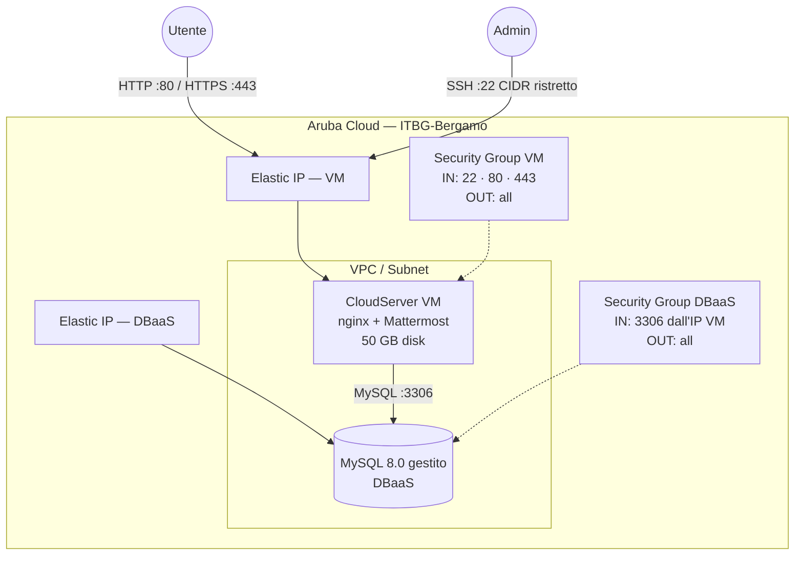

# Mattermost su Aruba Cloud

Distribuisci [Mattermost](https://mattermost.com) Team Edition — messaggistica di squadra open-source — su Aruba Cloud tramite Terraform e cloud-init. Servizio binario Mattermost + MySQL 8.0 gestito + reverse proxy nginx.

> **Versione provider:** arubacloud/arubacloud `~> 0.5` | **Terraform:** ≥ 1.9

---

## Introduzione

Mattermost è una piattaforma di messaggistica open-source self-hosted, compatibile con Slack, scritta in Go e React. Questo esempio distribuisce uno stack Mattermost Team Edition production-ready con:

- Una **CloudServer VM** (CSO4A8 — 4 vCPU / 8 GB) che esegue il binario Go di Mattermost come servizio systemd dietro nginx, completamente avviato da cloud-init
- Un'istanza **DBaaS MySQL 8.0 gestito** con storage autoscaling
- Una **VPC, subnet e security group** dedicati tramite il modulo network condiviso
- **Elastic IP** per VM e DBaaS
- Corretto **proxy WebSocket nginx** per la messaggistica in tempo reale
- **HTTPS Let's Encrypt** opzionale quando viene fornito un dominio personalizzato

Il primo utente a registrarsi sull'istanza diventa automaticamente l'Amministratore di sistema.

---

## Panoramica dell'architettura



---

## Infrastruttura creata

| Risorsa | Pattern nome | Descrizione |
|---------|-------------|-------------|
| `arubacloud_project` | `mm-prod` | Contenitore progetto |
| `arubacloud_vpc` | `mm-prod-vpc` | Virtual Private Cloud |
| `arubacloud_subnet` | `mm-prod-subnet` | Subnet di base |
| `arubacloud_securitygroup` | `mm-prod-vm-sg` | Security group VM |
| `arubacloud_securitygroup` | `mm-prod-db-sg` | Security group DBaaS |
| `arubacloud_securityrule` | `mm-prod-vm-ssh` | Ingresso SSH |
| `arubacloud_securityrule` | `mm-prod-vm-http` | Ingresso HTTP |
| `arubacloud_securityrule` | `mm-prod-vm-https` | Ingresso HTTPS |
| `arubacloud_securityrule` | `mm-prod-db-mysql` | Ingresso MySQL dall'IP VM |
| `arubacloud_elasticip` | `mm-prod-vm-eip` | IP pubblico VM |
| `arubacloud_elasticip` | `mm-prod-db-eip` | IP pubblico DBaaS |
| `arubacloud_blockstorage` | `mm-prod-boot` | Disco di avvio 50 GB (Performance) |
| `arubacloud_keypair` | `mm-prod-keypair` | Chiave pubblica SSH |
| `arubacloud_dbaas` | `mm-prod-dbaas` | MySQL 8.0 gestito |
| `arubacloud_database` | `mattermost` | Database logico Mattermost |
| `arubacloud_dbaasuser` | `mattermost` | Utente applicativo MySQL |
| `arubacloud_databasegrant` | — | Grant liteadmin |
| `arubacloud_cloudserver` | `mm-prod-vm` | CloudServer VM |

---

## Costo mensile stimato

> Prezzi approssimativi per ITBG-Bergamo, fatturazione oraria.

| Risorsa | Specifiche | Costo/mese stimato |
|---------|-----------|-------------------|
| CloudServer VM | CSO4A8 — 4 vCPU / 8 GB | ~€36 |
| Disco di avvio | 50 GB Performance | ~€6 |
| MySQL gestito | DBO2A8 — 2 vCPU / 8 GB | ~€35 |
| Storage DBaaS | 20 GB | ~€3 |
| Elastic IP × 2 | — | ~€5 |
| **Totale** | | **~€85/mese** |

---

## Requisiti

- Terraform ≥ 1.9
- ArubaCloud Terraform Provider `~> 0.5`
- Un account ArubaCloud con credenziali API OAuth2
- Una coppia di chiavi SSH

---

## Variabili

### Obbligatorie

| Variabile | Descrizione |
|-----------|-------------|
| `arubacloud_client_id` | Client ID OAuth2 ArubaCloud |
| `arubacloud_client_secret` | Client secret OAuth2 ArubaCloud |
| `ssh_public_key` | Contenuto della chiave pubblica SSH |
| `db_password` | Password MySQL per l'utente Mattermost (min 16 caratteri, no newline) |

### Opzionali

| Variabile | Default | Descrizione |
|-----------|---------|-------------|
| `app_name` | `"mm"` | Nome breve usato in tutti i nomi delle risorse |
| `environment` | `"prod"` | Etichetta ambiente |
| `location` | `"ITBG-Bergamo"` | Regione ArubaCloud |
| `zone` | `"ITBG-1"` | Zona di disponibilità |
| `billing_period` | `"Hour"` | `"Hour"` o `"Month"` |
| `vm_flavor` | `"CSO4A8"` | Flavor CloudServer |
| `vm_image` | `"LU22-001"` | Immagine disco di avvio (Ubuntu 22.04 LTS) |
| `vm_disk_size_gb` | `50` | Dimensione disco di avvio in GB |
| `ssh_cidr` | `"0.0.0.0/0"` | CIDR per SSH — **limita al tuo IP** |
| `dbaas_flavor` | `"DBO2A8"` | Flavor DBaaS |
| `db_storage_gb` | `20` | Storage iniziale DBaaS in GB |
| `mattermost_version` | `"10.4.2"` | Versione Mattermost Team Edition |
| `domain` | `""` | Dominio personalizzato per HTTPS |

---

## Output

| Output | Descrizione |
|--------|-------------|
| `site_url` | URL Mattermost |
| `vm_public_ip` | Indirizzo IP pubblico della VM |
| `ssh_command` | Comando SSH per connettersi alla VM |
| `dbaas_host` | Endpoint DBaaS |
| `db_name` | Nome del database |
| `db_user` | Nome utente database |

---

## Istruzioni di distribuzione

### 1. Clona e naviga

```bash
git clone https://github.com/arubacloud/terraform-arubacloud-examples.git
cd terraform-arubacloud-examples/mattermost
```

### 2. Configura le variabili

```bash
cp terraform.tfvars.example terraform.tfvars
```

Imposta `db_password` e le tue credenziali.

### 3. Distribuisci

```bash
terraform init
terraform plan
terraform apply
```

Il bootstrap richiede circa **15–20 minuti** — cloud-init attende fino a 15 minuti che il DBaaS sia raggiungibile prima di avviare Mattermost.

### 4. Accedi a Mattermost

```bash
terraform output site_url
```

Apri l'URL e **registra il primo account** — quell'utente diventa Amministratore di sistema.

### 5. Monitora il progresso

```bash
ssh ubuntu@$(terraform output -raw vm_public_ip)
sudo tail -f /var/log/cloud-init-output.log
sudo journalctl -u mattermost -f
```

---

## Raccomandazioni di sicurezza

1. **Limita SSH al tuo IP.** Imposta `ssh_cidr = "tuo.ip/32"`.

2. **Usa HTTPS.** Imposta `domain` per abilitare TLS Let's Encrypt. Senza TLS, i token di sessione e i messaggi vengono trasmessi in chiaro.

3. **Registra prima l'account admin.** Il primo utente registrato diventa Amministratore di sistema. Registra subito dopo la distribuzione prima di condividere l'URL.

4. **Limita gli inviti al team.** In Consolle di sistema → Autenticazione → Email, configura la registrazione solo su invito una volta configurato il tuo team.

5. **Abilita MFA.** In Consolle di sistema → Autenticazione → MFA, richiedi l'autenticazione a più fattori per tutti gli utenti.

---

## Considerazioni sull'aggiornamento

### Aggiornamento Mattermost

```bash
ssh ubuntu@$(terraform output -raw vm_public_ip)

MM_VERSION=X.Y.Z
sudo systemctl stop mattermost
sudo mv /opt/mattermost /opt/mattermost-backup
curl -sSfL \
  "https://releases.mattermost.com/$MM_VERSION/mattermost-team-$MM_VERSION-linux-amd64.tar.gz" \
  | sudo tar -xz -C /opt
# Ripristina config e dati
sudo cp /opt/mattermost-backup/config/config.json /opt/mattermost/config/ 2>/dev/null || true
sudo chown -R mattermost:mattermost /opt/mattermost
sudo systemctl start mattermost
```

Consulta il [changelog di Mattermost](https://docs.mattermost.com/about/mattermost-changelog.html) prima di aggiornare.

---

## Risoluzione dei problemi

### Mattermost non raggiungibile

```bash
sudo systemctl status mattermost
sudo journalctl -u mattermost -n 50
sudo tail -100 /var/log/cloud-init-output.log
```

### Connessione WebSocket fallita

Verifica che la configurazione nginx includa il blocco location WebSocket per `/api/v[0-9]+/(users/)?websocket`:

```bash
sudo nginx -t
sudo cat /etc/nginx/sites-enabled/mattermost.conf
```

### Errore di connessione MySQL

```bash
mysql -u mattermost -p -h $(terraform output -raw dbaas_host) mattermost
```

---

## Riferimenti

- [Guida all'installazione Mattermost](https://docs.mattermost.com/install/install-ubuntu.html)
- [Rilasci Mattermost](https://github.com/mattermost/mattermost/releases)
- [Variabili d'ambiente Mattermost](https://docs.mattermost.com/configure/environment-variables.html)
- [ArubaCloud Terraform Provider](https://registry.terraform.io/providers/arubacloud/arubacloud/latest/docs)
