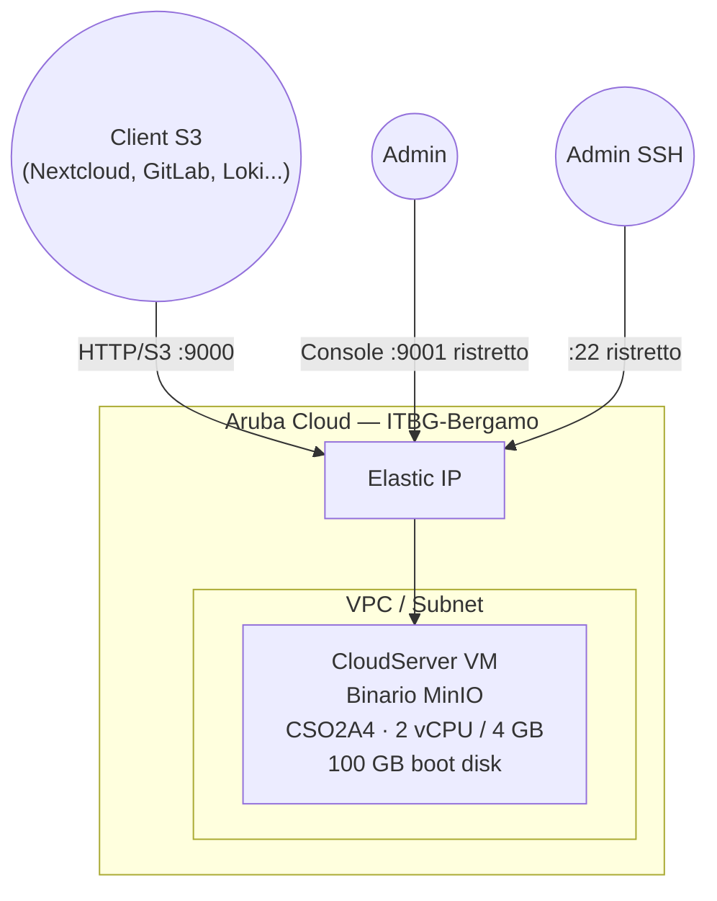

# MinIO su Aruba Cloud

Distribuisci [MinIO](https://min.io/) — un server di object storage compatibile S3 ad alte prestazioni — su Aruba Cloud. Usalo come backend S3 locale per Nextcloud, GitLab, Loki o qualsiasi applicazione compatibile S3.

> **Versione provider:** arubacloud/arubacloud `~> 0.5` | **Terraform:** ≥ 1.9

---

## Introduzione

MinIO viene eseguito come singolo binario gestito da systemd. Questo esempio distribuisce la configurazione single-node, single-drive — adatta per sviluppo, staging e carichi di lavoro di produzione di piccole dimensioni. Per l'alta disponibilità è necessaria una configurazione multi-nodo distribuita (vedi la roadmap Fase 3).

---

## Panoramica dell'architettura



---

## Infrastruttura creata

| Risorsa | Descrizione |
|---------|-------------|
| `arubacloud_cloudserver` | `minio-prod-vm` |
| `arubacloud_blockstorage` | Disco di avvio 100 GB (storage dati) |
| `arubacloud_elasticip` | IP pubblico |
| `arubacloud_securitygroup` | TCP 9000 (API), 9001 (console), 22 (SSH) |

---

## Dimensionamento VM

| Caso d'uso | vCPU | RAM | Disco | Flavor |
|-----------|------|-----|-------|--------|
| Dev / piccolo | 2 | 4 GB | 100 GB | `CSO2A4` *(default)* |
| Produzione | 4 | 8 GB | 500 GB+ | `CSO4A8` |

Imposta `vm_disk_size_gb` in base al volume di dati previsto. MinIO archivia tutti gli oggetti sul disco di avvio in questo esempio.

---

## Costo mensile stimato

| Risorsa | Specifiche | Costo/mese stimato |
|---------|-----------|-------------------|
| VM CSO2A4 | 2 vCPU / 4 GB | ~€20 |
| Disco 100 GB | Performance | ~€13 |
| Elastic IP | — | ~€5 |
| **Totale** | | **~€38/mese** |

---

## Variabili

### Obbligatorie

`arubacloud_client_id`, `arubacloud_client_secret`, `ssh_public_key`, `minio_root_password`

### Opzionali

| Variabile | Default | Descrizione |
|-----------|---------|-------------|
| `minio_root_user` | `"minioadmin"` | Chiave di accesso S3 |
| `minio_root_password` | — | Chiave segreta S3 (min 8 caratteri) |
| `minio_data_dir` | `"/data/minio"` | Percorso di archiviazione oggetti |
| `api_cidr` | `"0.0.0.0/0"` | CIDR per la porta API S3 |
| `console_cidr` | `"0.0.0.0/0"` | CIDR per la console web — **limita al tuo IP** |
| `vm_disk_size_gb` | `100` | Dimensione totale disco in GB |
| `vm_flavor` | `"CSO2A4"` | Dimensione VM |

---

## Distribuzione

```bash
cd terraform-arubacloud-examples/minio
cp terraform.tfvars.example terraform.tfvars
# Imposta minio_root_password
terraform init && terraform apply
```

Dopo la distribuzione:

```bash
terraform output console_url     # http://203.0.113.10:9001
terraform output s3_endpoint     # http://203.0.113.10:9000

# Usa mc (MinIO Client) per creare un bucket
mc alias set aruba $(terraform output -raw s3_endpoint) minioadmin <password>
mc mb aruba/my-bucket
```

---

## Distruzione

```bash
terraform destroy
```

---

## Raccomandazioni di sicurezza

1. **Limita `console_cidr`** — la console espone accesso admin completo. Restringi al tuo IP.
2. **Usa TLS in produzione** — metti MinIO dietro un reverse proxy (Traefik/Caddy) con un certificato valido, o configura il TLS integrato di MinIO.
3. **Crea chiavi di accesso specifiche per l'applicazione** — usa la console o `mc` per creare utenti con policy a livello di bucket; non usare le credenziali root nei file di configurazione delle applicazioni.
4. **Fai backup dei dati oggetti** — MinIO non ha backup integrato. Usa `mc mirror` per sincronizzare in una posizione remota.

---

## Risoluzione dei problemi

### MinIO non si avvia

```bash
ssh ubuntu@$(terraform output -raw public_ip)
sudo systemctl status minio
sudo journalctl -u minio -n 50
```

### Disco pieno

```bash
df -h /data/minio
```

Distruggi e ri-applica con un `vm_disk_size_gb` più grande. Nota: i dati andranno persi; esegui prima uno snapshot del disco.

---

## Riferimenti

- [MinIO Single-Node Quickstart](https://min.io/docs/minio/linux/operations/install-deploy-manage/deploy-minio-single-node-single-drive.html)
- [MinIO Client (mc) Quickstart](https://min.io/docs/minio/linux/reference/minio-mc.html)
- [Compatibilità S3](https://min.io/product/s3-compatibility)
