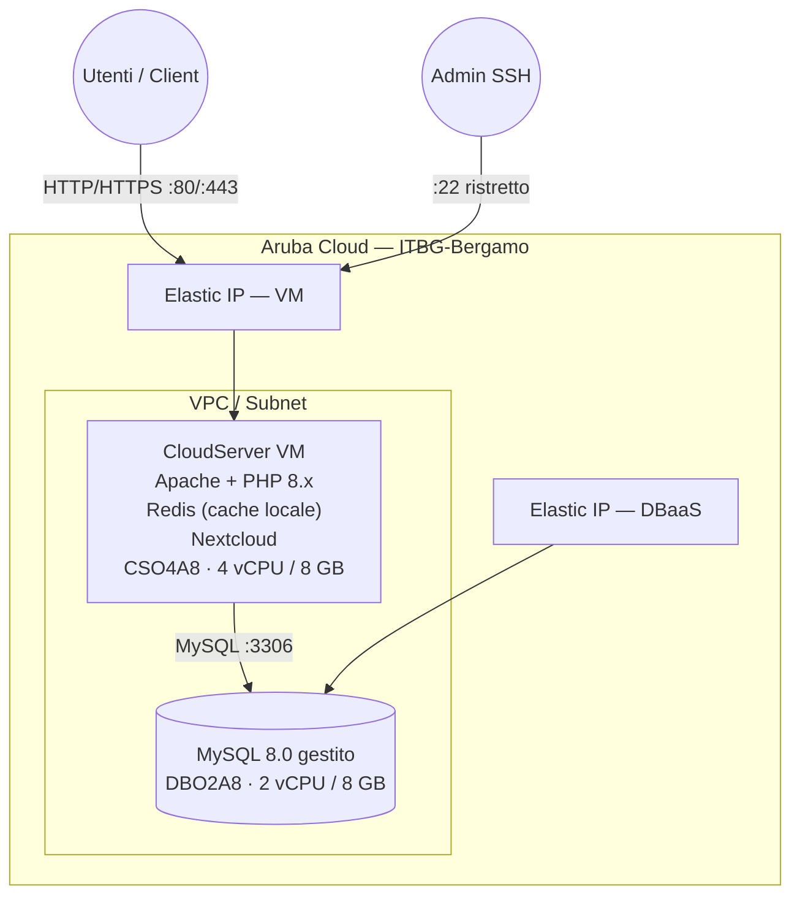

# Nextcloud su Aruba Cloud

Distribuisci [Nextcloud](https://nextcloud.com/) — una piattaforma self-hosted per la sincronizzazione file e la collaborazione — su Aruba Cloud con Apache 2.4, PHP 8.x, Redis per la cache e un backend DBaaS MySQL 8.0 gestito.

> **Versione provider:** arubacloud/arubacloud `~> 0.5` | **Terraform:** ≥ 1.9

---

## Introduzione

Nextcloud è una piattaforma cloud privata completa: sincronizzazione file, calendario, contatti, modifica documenti, videochiammate e altro. Questo esempio distribuisce un Nextcloud single-VM production-ready con database gestito — tutto avviato da cloud-init senza passaggi manuali.

---

## Panoramica dell'architettura



---

## Infrastruttura creata

| Risorsa | Descrizione |
|---------|-------------|
| `arubacloud_project` | `nc-prod` |
| `arubacloud_cloudserver` | `nc-prod-vm` — Apache + PHP + Nextcloud |
| `arubacloud_blockstorage` | Disco di avvio 80 GB (dati utente archiviati qui) |
| `arubacloud_dbaas` | MySQL 8.0 gestito |
| `arubacloud_database` | Database logico `nextcloud` |
| `arubacloud_elasticip` | 2× Elastic IP (VM + DBaaS) |
| `arubacloud_securitygroup` | 2× security group (VM + DBaaS) |

---

## Dimensionamento VM

| Caso d'uso | vCPU | RAM | Disco | Flavor |
|-----------|------|-----|-------|--------|
| Personale / piccolo team (< 10 utenti) | 4 | 8 GB | 80 GB | `CSO4A8` *(default)* |
| Team medio (10–50 utenti) | 8 | 16 GB | 200 GB | `CSO8A16` |
| Team grande | 16 | 32 GB | 500 GB+ | `CSO16A32` |

---

## Costo mensile stimato

| Risorsa | Specifiche | Costo/mese stimato |
|---------|-----------|-------------------|
| CloudServer VM | CSO4A8 — 4 vCPU / 8 GB | ~€35 |
| Disco di avvio | 80 GB Performance | ~€10 |
| MySQL gestito | DBO2A8 — 2 vCPU / 8 GB | ~€40 |
| Storage DBaaS | 20 GB | ~€3 |
| Elastic IP × 2 | — | ~€10 |
| **Totale** | | **~€98/mese** |

---

## Variabili

### Obbligatorie

| Variabile | Descrizione |
|-----------|-------------|
| `arubacloud_client_id` | Client ID OAuth2 |
| `arubacloud_client_secret` | Client secret OAuth2 |
| `ssh_public_key` | Chiave pubblica SSH |
| `db_password` | Password MySQL (min 16 caratteri, no newline) |
| `nc_admin_password` | Password admin Nextcloud (min 16 caratteri, no newline) |
| `nc_admin_email` | Email admin (anche per Let's Encrypt) |

### Opzionali

| Variabile | Default | Descrizione |
|-----------|---------|-------------|
| `domain` | `""` | Dominio per HTTPS — consigliato in produzione |
| `nc_admin_user` | `"ncadmin"` | Nome utente admin |
| `vm_flavor` | `"CSO4A8"` | Dimensione VM |
| `vm_disk_size_gb` | `80` | Disco — dimensiona in base al volume di dati previsto |
| `dbaas_flavor` | `"DBO2A8"` | Flavor DBaaS |
| `db_storage_gb` | `20` | Storage DBaaS in GB |
| `ssh_cidr` | `"0.0.0.0/0"` | CIDR SSH — limita al tuo IP |

---

## Distribuzione

```bash
cd terraform-arubacloud-examples/nextcloud
cp terraform.tfvars.example terraform.tfvars
# Inserisci password, email, dominio opzionale
terraform init && terraform apply
```

Il provisioning richiede 12–18 minuti (avvio VM + DBaaS + installazione pacchetti + installazione occ).

```bash
terraform output app_url       # es. https://cloud.example.com
terraform output admin_user
terraform output -raw admin_password
```

---

## Distruzione

```bash
terraform destroy
```

---

## Raccomandazioni di sicurezza

1. **Usa sempre HTTPS in produzione.** Imposta `domain` e punta il DNS prima di `terraform apply`.
2. **Limita SSH** con `ssh_cidr`.
3. **Abilita 2FA** in Nextcloud Impostazioni → Sicurezza → Autenticazione a due fattori.
4. **Fai backup di `/var/www/nextcloud/data`** e del database regolarmente.
5. **Mantieni Nextcloud aggiornato** — esegui `sudo -u www-data php occ upgrade` dopo aver aggiornato i file.

---

## Configurazione post-distribuzione

```bash
ssh ubuntu@$(terraform output -raw public_ip)

# Controlla lo stato dell'installazione
sudo -u www-data php /var/www/nextcloud/occ status

# Installa le app consigliate
sudo -u www-data php /var/www/nextcloud/occ app:install contacts
sudo -u www-data php /var/www/nextcloud/occ app:install calendar
sudo -u www-data php /var/www/nextcloud/occ app:install mail

# Configura un cron job per le attività in background
echo "*/5  *  *  *  * www-data php /var/www/nextcloud/occ background:cron" | sudo tee /etc/cron.d/nextcloud
```

---

## Risoluzione dei problemi

### Nextcloud in modalità manutenzione

```bash
sudo -u www-data php /var/www/nextcloud/occ maintenance:mode --off
```

### Errore di connessione al database

- Controlla che la regola di sicurezza DBaaS consenta TCP 3306 dall'IP della VM
- Verifica che `arubacloud_databasegrant` sia stato creato
- Controlla il log cloud-init: `sudo tail -100 /var/log/cloud-init-output.log`

### Errore "Trusted domain" dopo aver cambiato l'IP

```bash
sudo -u www-data php /var/www/nextcloud/occ config:system:set trusted_domains 0 --value="<nuovo-ip>"
```

---

## Riferimenti

- [Manuale di amministrazione Nextcloud](https://docs.nextcloud.com/server/latest/admin_manual/)
- [Comandi occ Nextcloud](https://docs.nextcloud.com/server/latest/admin_manual/configuration_server/occ_command.html)
- [Ottimizzazione delle prestazioni Nextcloud](https://docs.nextcloud.com/server/latest/admin_manual/installation/server_tuning.html)
