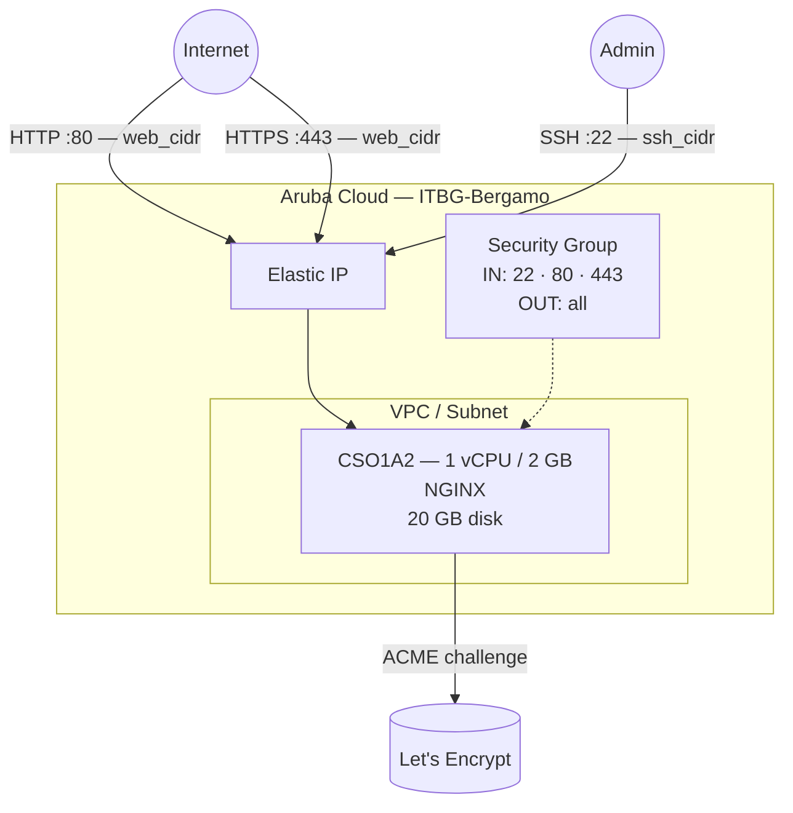

# NGINX su Aruba Cloud

Distribuisci [NGINX](https://nginx.org) come web server o reverse proxy su Aruba Cloud tramite Terraform e cloud-init. Questo esempio distribuisce un'istanza NGINX production-ready con un sito statico predefinito e HTTPS automatico opzionale tramite Let's Encrypt.

> **Versione provider:** arubacloud/arubacloud `~> 0.5` | **Terraform:** ≥ 1.9

---

## Introduzione

NGINX è un server HTTP ad alte prestazioni, reverse proxy e load balancer. Questo esempio distribuisce una VM minimale con NGINX in esecuzione con:

- NGINX installato dai **pacchetti ufficiali Ubuntu 22.04**
- Un **sito HTML statico** predefinito servito da `/var/www/html`
- Porte 80 (HTTP) e 443 (HTTPS) aperte verso `web_cidr`
- **HTTPS automatico opzionale** tramite Let's Encrypt / Certbot quando `domain` e `certbot_email` sono impostati

Dopo la distribuzione, sostituisci il sito predefinito con il tuo contenuto o aggiungi ulteriori blocchi `server {}` per virtual hosting o reverse proxying.

---

## Panoramica dell'architettura



---

## Infrastruttura creata

| Risorsa | Pattern nome | Descrizione |
|---------|-------------|-------------|
| `arubacloud_project` | `nginx-prod` | Contenitore progetto |
| `arubacloud_vpc` | `nginx-prod-vpc` | Virtual Private Cloud |
| `arubacloud_subnet` | `nginx-prod-subnet` | Subnet di base |
| `arubacloud_securitygroup` | `nginx-prod-vm-sg` | Security group |
| `arubacloud_securityrule` | `nginx-prod-vm-ssh` | Ingresso SSH |
| `arubacloud_securityrule` | `nginx-prod-vm-http` | Ingresso HTTP TCP 80 |
| `arubacloud_securityrule` | `nginx-prod-vm-https` | Ingresso HTTPS TCP 443 |
| `arubacloud_elasticip` | `nginx-prod-vm-eip` | IP pubblico VM |
| `arubacloud_blockstorage` | `nginx-prod-boot` | Disco di avvio 20 GB (Performance) |
| `arubacloud_keypair` | `nginx-prod-keypair` | Chiave pubblica SSH |
| `arubacloud_cloudserver` | `nginx-prod-vm` | CloudServer VM |

---

## Costo mensile stimato

| Risorsa | Specifiche | Costo/mese stimato |
|---------|-----------|-------------------|
| CloudServer VM | CSO1A2 — 1 vCPU / 2 GB | ~€9 |
| Disco di avvio | 20 GB Performance | ~€3 |
| Elastic IP | — | ~€3 |
| **Totale** | | **~€15/mese** |

---

## Requisiti

- Terraform ≥ 1.9
- ArubaCloud Terraform Provider `~> 0.5`
- Un account ArubaCloud con credenziali API OAuth2
- Una coppia di chiavi SSH
- (Per HTTPS) Un nome di dominio con un record A che punta all'Elastic IP della VM

---

## Variabili

### Obbligatorie

| Variabile | Descrizione |
|-----------|-------------|
| `arubacloud_client_id` | Client ID OAuth2 ArubaCloud |
| `arubacloud_client_secret` | Client secret OAuth2 ArubaCloud |
| `ssh_public_key` | Contenuto della chiave pubblica SSH |

### Opzionali

| Variabile | Default | Descrizione |
|-----------|---------|-------------|
| `app_name` | `"nginx"` | Nome breve usato in tutti i nomi delle risorse |
| `environment` | `"prod"` | Etichetta ambiente |
| `location` | `"ITBG-Bergamo"` | Regione ArubaCloud |
| `zone` | `"ITBG-1"` | Zona di disponibilità |
| `billing_period` | `"Hour"` | `"Hour"` o `"Month"` |
| `vm_flavor` | `"CSO1A2"` | Flavor CloudServer |
| `vm_image` | `"LU22-001"` | Immagine disco di avvio (Ubuntu 22.04 LTS) |
| `vm_disk_size_gb` | `20` | Dimensione disco di avvio in GB |
| `ssh_cidr` | `"0.0.0.0/0"` | CIDR per SSH — limita in produzione |
| `web_cidr` | `"0.0.0.0/0"` | CIDR per HTTP/HTTPS — tipicamente `0.0.0.0/0` per siti pubblici |
| `domain` | `""` | Nome dominio per HTTPS Let's Encrypt (il DNS deve puntare alla VM prima) |
| `certbot_email` | `""` | Email per le notifiche Let's Encrypt (richiesta con `domain`) |

---

## Output

| Output | Descrizione |
|--------|-------------|
| `http_url` | URL HTTP del web server |
| `https_url` | URL HTTPS (valido solo quando `domain` e certificato sono configurati) |
| `vm_public_ip` | Indirizzo IP pubblico della VM |
| `ssh_command` | Comando SSH per connettersi alla VM |

---

## Istruzioni di distribuzione

### 1. Clona e naviga

```bash
git clone https://github.com/arubacloud/terraform-arubacloud-examples.git
cd terraform-arubacloud-examples/nginx
```

### 2. Configura le variabili

```bash
cp terraform.tfvars.example terraform.tfvars
```

Per la distribuzione solo HTTP, sono necessari solo credenziali e chiave SSH. Per HTTPS:

```hcl
domain        = "example.com"
certbot_email = "admin@example.com"
```

> **Importante:** Il record DNS A per `domain` deve già puntare all'Elastic IP della VM prima dell'apply. Per ottenere prima l'IP, esegui `terraform apply` senza `domain`, prendi nota dell'output `vm_public_ip`, imposta il tuo record DNS, poi ri-applica con `domain` impostato.

### 3. Distribuisci

```bash
terraform init
terraform plan
terraform apply
```

Il bootstrap richiede circa **1–2 minuti** (3–5 minuti con Let's Encrypt).

### 4. Accedi al sito

```bash
terraform output http_url
```

### 5. Distribuisci il tuo contenuto

```bash
ssh ubuntu@$(terraform output -raw vm_public_ip)
# Sostituisci la pagina predefinita:
sudo cp my-site/* /var/www/html/
```

---

## Personalizzazione

### Servire un secondo sito (virtual hosting)

Crea una nuova configurazione del sito e abilitala:

```bash
sudo tee /etc/nginx/sites-available/mysite.conf << 'EOF'
server {
    listen 80;
    server_name mysite.example.com;
    root /var/www/mysite;
    index index.html;
    location / { try_files $uri $uri/ =404; }
}
EOF
sudo ln -s /etc/nginx/sites-available/mysite.conf /etc/nginx/sites-enabled/
sudo nginx -t && sudo systemctl reload nginx
```

### Reverse proxy

Sostituisci il blocco `location /`:

```nginx
location / {
    proxy_pass         http://127.0.0.1:8080;
    proxy_set_header   Host $host;
    proxy_set_header   X-Real-IP $remote_addr;
    proxy_set_header   X-Forwarded-For $proxy_add_x_forwarded_for;
    proxy_set_header   X-Forwarded-Proto $scheme;
}
```

---

## Raccomandazioni di sicurezza

1. **Limita `ssh_cidr` al tuo IP di gestione.** SSH su `0.0.0.0/0` è accettabile per un avvio rapido, ma espone la VM ad attacchi brute-force.

2. **Abilita HTTPS per qualsiasi sito di produzione.** Imposta `domain` e `certbot_email` per ottenere un certificato Let's Encrypt gratuito. Solo HTTP dovrebbe essere usato solo per siti interni o di sviluppo.

3. **Mantieni NGINX aggiornato.** Gli aggiornamenti non presidiati di Ubuntu gestiscono automaticamente le patch di sicurezza se abilitati. Controlla con `sudo unattended-upgrades --dry-run`.

---

## Risoluzione dei problemi

### NGINX non si avvia

```bash
sudo nginx -t
sudo systemctl status nginx
sudo journalctl -u nginx -n 30
```

### Certificato Let's Encrypt non emesso

```bash
# Controlla prima la propagazione DNS:
dig +short A example.com

# Riesegui certbot manualmente:
sudo certbot --nginx -d example.com -m admin@example.com --non-interactive --agree-tos --redirect
```

Cause comuni: record DNS A non ancora propagato, porta 80 bloccata da `web_cidr`, o `domain` digitato in modo errato.

---

## Riferimenti

- [Documentazione NGINX](https://nginx.org/en/docs/)
- [Guida introduttiva NGINX](https://nginx.org/en/docs/beginners_guide.html)
- [Documentazione Certbot](https://certbot.eff.org/instructions)
- [ArubaCloud Terraform Provider](https://registry.terraform.io/providers/arubacloud/arubacloud/latest/docs)
