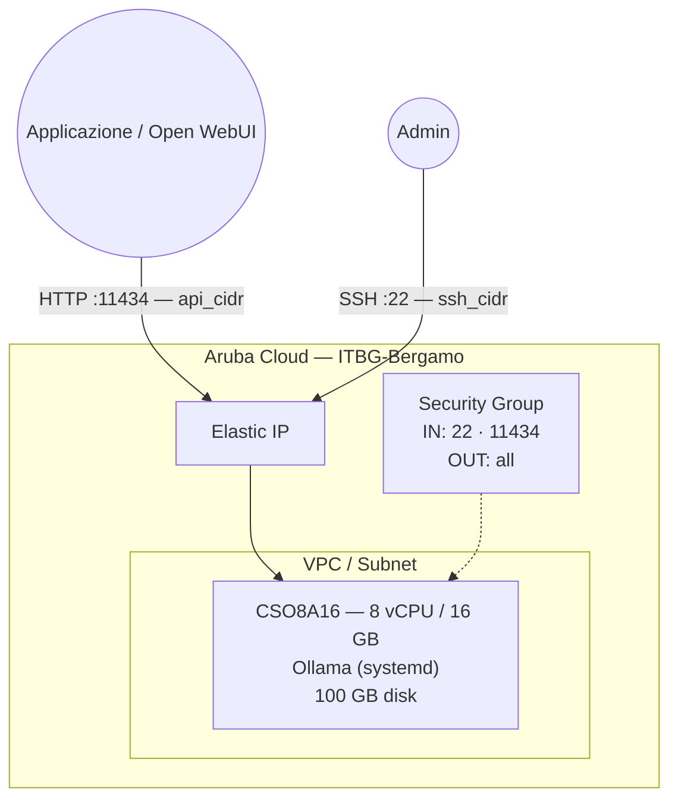

# Ollama su Aruba Cloud

Distribuisci [Ollama](https://ollama.ai/) — una piattaforma di inferenza LLM locale — su Aruba Cloud tramite Terraform e cloud-init. Esegui modelli linguistici di grandi dimensioni (LLama, Mistral, Gemma, ecc.) direttamente su CPU senza richiedere una GPU.

> **Versione provider:** arubacloud/arubacloud `~> 0.5` | **Terraform:** ≥ 1.9

---

## Introduzione

Ollama rende l'esecuzione di LLM in locale semplice come `ollama run llama3.2`. Fornisce un'API REST compatibile con OpenAI, consentendo la sostituzione diretta di OpenAI nelle applicazioni esistenti. Questo esempio distribuisce:

- **Ollama** installato tramite lo script di installazione ufficiale come servizio systemd
- API REST collegata a tutte le interfacce (porta 11434), limitata a `api_cidr`
- Pre-caricamento opzionale dei modelli al momento del bootstrap

> **Avviso risorse:** Gli LLM sono intensivi in memoria. Un modello da 7B richiede ~4–6 GB di RAM libera, uno da 13B ~8–10 GB e uno da 70B ~40+ GB. Pianifica il tuo `vm_flavor` di conseguenza.

---

## Panoramica dell'architettura



---

## Infrastruttura creata

| Risorsa | Pattern nome | Descrizione |
|---------|-------------|-------------|
| `arubacloud_project` | `ollama-prod` | Contenitore progetto |
| `arubacloud_vpc` | `ollama-prod-vpc` | Virtual Private Cloud |
| `arubacloud_subnet` | `ollama-prod-subnet` | Subnet di base |
| `arubacloud_securitygroup` | `ollama-prod-vm-sg` | Security group |
| `arubacloud_securityrule` | `ollama-prod-vm-ssh` | Ingresso SSH |
| `arubacloud_securityrule` | `ollama-prod-vm-api` | API Ollama TCP 11434 |
| `arubacloud_elasticip` | `ollama-prod-vm-eip` | IP pubblico VM |
| `arubacloud_blockstorage` | `ollama-prod-boot` | Disco di avvio 100 GB (Performance) |
| `arubacloud_keypair` | `ollama-prod-keypair` | Chiave pubblica SSH |
| `arubacloud_cloudserver` | `ollama-prod-vm` | CloudServer VM |

---

## Costo mensile stimato

| Risorsa | Specifiche | Costo/mese stimato |
|---------|-----------|-------------------|
| CloudServer VM | CSO8A16 — 8 vCPU / 16 GB | ~€55 |
| Disco di avvio | 100 GB Performance | ~€15 |
| Elastic IP | — | ~€3 |
| **Totale** | | **~€73/mese** |

I modelli più grandi richiedono l'aggiornamento a una VM con più RAM (e un costo corrispondentemente più elevato).

---

## Requisiti

- Terraform ≥ 1.9
- ArubaCloud Terraform Provider `~> 0.5`
- Un account ArubaCloud con credenziali API OAuth2
- Una coppia di chiavi SSH

---

## Variabili

### Obbligatorie

| Variabile | Descrizione |
|-----------|-------------|
| `arubacloud_client_id` | Client ID OAuth2 ArubaCloud |
| `arubacloud_client_secret` | Client secret OAuth2 ArubaCloud |
| `ssh_public_key` | Contenuto della chiave pubblica SSH |

### Opzionali

| Variabile | Default | Descrizione |
|-----------|---------|-------------|
| `app_name` | `"ollama"` | Nome breve usato in tutti i nomi delle risorse |
| `environment` | `"prod"` | Etichetta ambiente |
| `location` | `"ITBG-Bergamo"` | Regione ArubaCloud |
| `zone` | `"ITBG-1"` | Zona di disponibilità |
| `billing_period` | `"Hour"` | `"Hour"` o `"Month"` |
| `vm_flavor` | `"CSO8A16"` | Flavor CloudServer |
| `vm_image` | `"LU22-001"` | Immagine disco di avvio (Ubuntu 22.04 LTS) |
| `vm_disk_size_gb` | `100` | Dimensione disco di avvio in GB (min 50 GB) |
| `ssh_cidr` | `"0.0.0.0/0"` | CIDR per SSH |
| `api_cidr` | `"0.0.0.0/0"` | CIDR per la porta API REST 11434 — **limita ai tuoi server applicativi** |
| `preload_models` | `[]` | Modelli da scaricare al bootstrap (es. `["llama3.2"]`) |

---

## Output

| Output | Descrizione |
|--------|-------------|
| `ollama_url` | URL API REST Ollama |
| `vm_public_ip` | Indirizzo IP pubblico della VM |
| `ssh_command` | Comando SSH per connettersi alla VM |
| `health_check` | Comando `curl` per elencare i modelli disponibili |

---

## Istruzioni di distribuzione

### 1. Clona e naviga

```bash
git clone https://github.com/arubacloud/terraform-arubacloud-examples.git
cd terraform-arubacloud-examples/ollama
```

### 2. Configura le variabili

```bash
cp terraform.tfvars.example terraform.tfvars
```

Limita l'accesso all'API e opzionalmente pre-scarica i modelli:

```hcl
api_cidr       = "10.0.0.0/8"            # CIDR del tuo server Open WebUI
preload_models = ["llama3.2", "nomic-embed-text"]
```

### 3. Distribuisci

```bash
terraform init
terraform plan
terraform apply
```

Il bootstrap richiede **2–5 minuti** (più il tempo di download del modello — un modello da 7B è ~4 GB).

### 4. Verifica

```bash
curl http://$(terraform output -raw vm_public_ip):11434/api/tags
```

### 5. Esegui un modello

```bash
ssh ubuntu@$(terraform output -raw vm_public_ip)
ollama run llama3.2
```

---

## Modelli disponibili

```bash
# Sfoglia tutti i modelli disponibili
ollama list

# Modelli popolari
ollama pull llama3.2          # Meta Llama 3.2 3B — veloce, bassa RAM
ollama pull llama3.1          # Meta Llama 3.1 8B — bilanciato
ollama pull mistral           # Mistral 7B
ollama pull codellama         # LLaMA ottimizzato per il codice
ollama pull nomic-embed-text  # Modello di embedding testuale (per RAG)
ollama pull gemma2            # Google Gemma 2 9B
```

---

## Raccomandazioni di sicurezza

1. **Limita sempre `api_cidr`.** Ollama non ha autenticazione integrata. Una porta 11434 aperta consente a chiunque di eseguire modelli ed esaurire le risorse del server.

2. **Usa Open WebUI per l'accesso degli utenti.** Distribuisci [Open WebUI](../open-webui/README.md) come frontend con autenticazione e puntalo a questa istanza Ollama.

---

## Riferimenti

- [Documentazione Ollama](https://ollama.ai/docs)
- [Libreria modelli Ollama](https://ollama.ai/library)
- [Esempio Open WebUI](../open-webui/README.md)
- [ArubaCloud Terraform Provider](https://registry.terraform.io/providers/arubacloud/arubacloud/latest/docs)
