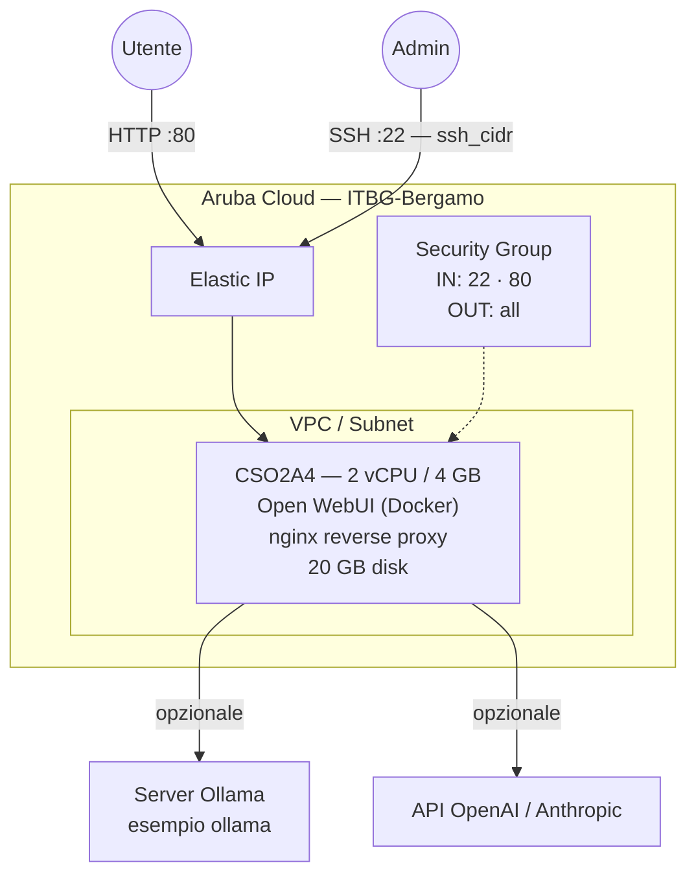

# Open WebUI su Aruba Cloud

Distribuisci [Open WebUI](https://openwebui.com/) — un'interfaccia web self-hosted per interagire con gli LLM — su Aruba Cloud tramite Terraform e cloud-init. Si connette a [Ollama](../ollama/README.md) per i modelli locali, OpenAI, Anthropic o qualsiasi endpoint compatibile con OpenAI.

> **Versione provider:** arubacloud/arubacloud `~> 0.5` | **Terraform:** ≥ 1.9

---

## Introduzione

Open WebUI fornisce un'interfaccia raffinata, simile a ChatGPT, per LLM locali e cloud. Supporta accesso multi-utente, cronologia delle chat, cambio di modello e RAG (retrieval-augmented generation). Questo esempio distribuisce:

- **Open WebUI** tramite l'immagine Docker ufficiale
- Reverse proxy **nginx** sulla porta 80
- Connessione opzionale a un server **Ollama** o all'API **OpenAI**
- Il primo utente registrato diventa l'admin

---

## Panoramica dell'architettura



---

## Infrastruttura creata

| Risorsa | Pattern nome | Descrizione |
|---------|-------------|-------------|
| `arubacloud_project` | `owui-prod` | Contenitore progetto |
| `arubacloud_vpc` | `owui-prod-vpc` | Virtual Private Cloud |
| `arubacloud_subnet` | `owui-prod-subnet` | Subnet di base |
| `arubacloud_securitygroup` | `owui-prod-vm-sg` | Security group |
| `arubacloud_securityrule` | `owui-prod-vm-ssh` | Ingresso SSH |
| `arubacloud_securityrule` | `owui-prod-vm-http` | Ingresso HTTP |
| `arubacloud_elasticip` | `owui-prod-vm-eip` | IP pubblico VM |
| `arubacloud_blockstorage` | `owui-prod-boot` | Disco di avvio 20 GB (Performance) |
| `arubacloud_keypair` | `owui-prod-keypair` | Chiave pubblica SSH |
| `arubacloud_cloudserver` | `owui-prod-vm` | CloudServer VM |

---

## Costo mensile stimato

| Risorsa | Specifiche | Costo/mese stimato |
|---------|-----------|-------------------|
| CloudServer VM | CSO2A4 — 2 vCPU / 4 GB | ~€20 |
| Disco di avvio | 20 GB Performance | ~€3 |
| Elastic IP | — | ~€3 |
| **Totale** | | **~€26/mese** |

---

## Requisiti

- Terraform ≥ 1.9
- ArubaCloud Terraform Provider `~> 0.5`
- Un account ArubaCloud con credenziali API OAuth2
- Una coppia di chiavi SSH
- Un server Ollama e/o una chiave API compatibile con OpenAI

---

## Variabili

### Obbligatorie

| Variabile | Descrizione |
|-----------|-------------|
| `arubacloud_client_id` | Client ID OAuth2 ArubaCloud |
| `arubacloud_client_secret` | Client secret OAuth2 ArubaCloud |
| `ssh_public_key` | Contenuto della chiave pubblica SSH |

### Opzionali

| Variabile | Default | Descrizione |
|-----------|---------|-------------|
| `app_name` | `"owui"` | Nome breve usato in tutti i nomi delle risorse |
| `environment` | `"prod"` | Etichetta ambiente |
| `location` | `"ITBG-Bergamo"` | Regione ArubaCloud |
| `zone` | `"ITBG-1"` | Zona di disponibilità |
| `billing_period` | `"Hour"` | `"Hour"` o `"Month"` |
| `vm_flavor` | `"CSO2A4"` | Flavor CloudServer |
| `vm_disk_size_gb` | `20` | Dimensione disco di avvio in GB |
| `ssh_cidr` | `"0.0.0.0/0"` | CIDR per SSH |
| `ollama_base_url` | `""` | URL server Ollama (es. `http://10.0.0.10:11434`) |
| `openai_api_key` | `""` | Chiave API OpenAI per accesso ai modelli cloud |
| `webui_secret_key` | `""` | Chiave segreta di sessione (auto-generata se vuota) |
| `open_webui_version` | `"main"` | Tag immagine Docker |

---

## Output

| Output | Descrizione |
|--------|-------------|
| `webui_url` | URL Open WebUI |
| `vm_public_ip` | Indirizzo IP pubblico della VM |
| `ssh_command` | Comando SSH per connettersi alla VM |

---

## Istruzioni di distribuzione

### 1. Clona e naviga

```bash
git clone https://github.com/arubacloud/terraform-arubacloud-examples.git
cd terraform-arubacloud-examples/open-webui
```

### 2. Configura le variabili

```bash
cp terraform.tfvars.example terraform.tfvars
```

Punta al tuo server Ollama o imposta una chiave API:

```hcl
ollama_base_url = "http://10.0.0.10:11434"
# openai_api_key = "sk-..."
```

### 3. Distribuisci

```bash
terraform init
terraform plan
terraform apply
```

Il bootstrap richiede circa **2–3 minuti**.

### 4. Accedi all'interfaccia

Naviga su `http://<IP>` e registra il primo account admin.

---

## Raccomandazioni di sicurezza

1. **Aggiungi HTTPS.** Posiziona un reverse proxy Caddy o Nginx (in questo repository) davanti, o usa l'integrazione Certbot nella configurazione nginx.

2. **Limita l'accesso SSH.** Imposta `ssh_cidr` al tuo indirizzo IP.

3. **Usa una chiave segreta robusta.** Imposta `webui_secret_key` su una stringa casuale di 32+ caratteri.

---

## Riferimenti

- [Documentazione Open WebUI](https://docs.openwebui.com/)
- [GitHub Open WebUI](https://github.com/open-webui/open-webui)
- [Esempio Ollama](../ollama/README.md)
- [ArubaCloud Terraform Provider](https://registry.terraform.io/providers/arubacloud/arubacloud/latest/docs)
