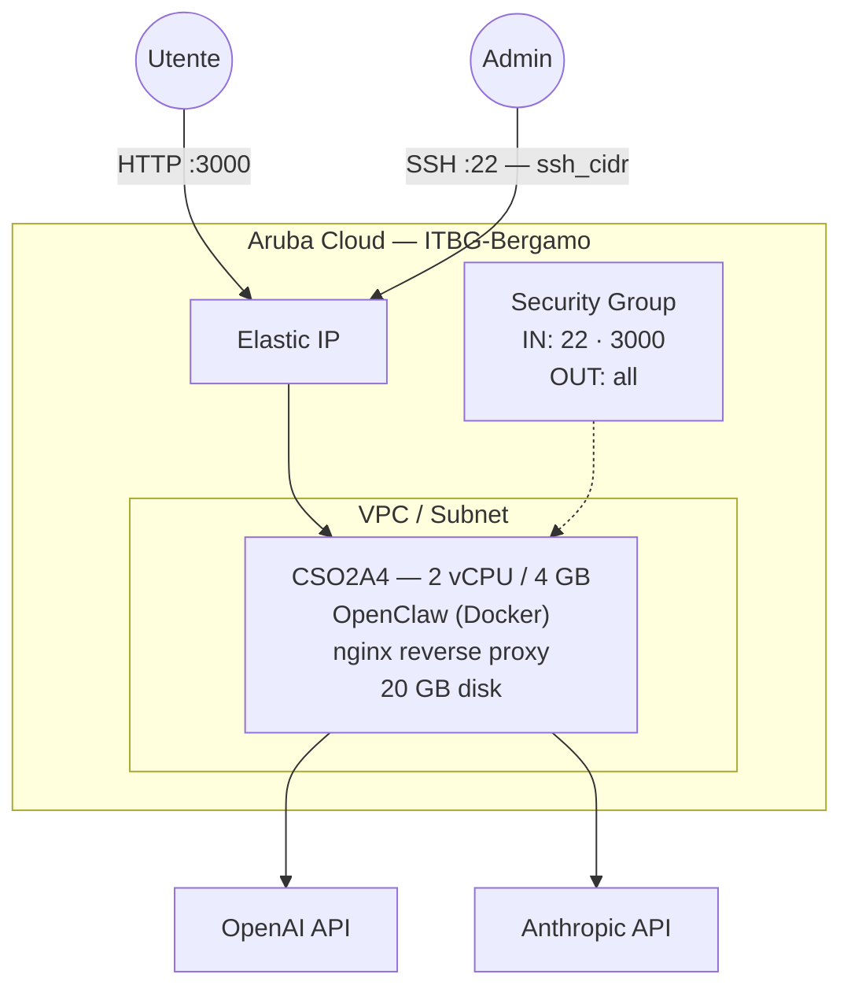

# OpenClaw su Aruba Cloud

Distribuisci [OpenClaw](https://openclaw.ai/) — un agente AI personale self-hosted con memoria persistente e oltre 29 integrazioni di canali di messaggistica — su Aruba Cloud tramite Terraform e cloud-init. Distribuito tramite Docker.

> **Versione provider:** arubacloud/arubacloud `~> 0.5` | **Terraform:** ≥ 1.9

---

## Introduzione

OpenClaw è una piattaforma di agenti AI self-hosted che mantiene la memoria persistente attraverso le conversazioni e si integra con i canali di messaggistica (Slack, Discord, Telegram, ecc.). Questo esempio distribuisce:

- **OpenClaw** tramite Docker con archiviazione dati persistente
- Reverse proxy **nginx** sulla porta 3000
- Chiavi API OpenAI e Anthropic configurabili

---

## Panoramica dell'architettura



---

## Infrastruttura creata

| Risorsa | Pattern nome | Descrizione |
|---------|-------------|-------------|
| `arubacloud_project` | `oclaw-prod` | Contenitore progetto |
| `arubacloud_vpc` | `oclaw-prod-vpc` | Virtual Private Cloud |
| `arubacloud_subnet` | `oclaw-prod-subnet` | Subnet di base |
| `arubacloud_securitygroup` | `oclaw-prod-vm-sg` | Security group |
| `arubacloud_securityrule` | `oclaw-prod-vm-ssh` | Ingresso SSH |
| `arubacloud_securityrule` | `oclaw-prod-vm-http` | Porta interfaccia web OpenClaw 3000 |
| `arubacloud_elasticip` | `oclaw-prod-vm-eip` | IP pubblico VM |
| `arubacloud_blockstorage` | `oclaw-prod-boot` | Disco di avvio 20 GB (Performance) |
| `arubacloud_keypair` | `oclaw-prod-keypair` | Chiave pubblica SSH |
| `arubacloud_cloudserver` | `oclaw-prod-vm` | CloudServer VM |

---

## Costo mensile stimato

| Risorsa | Specifiche | Costo/mese stimato |
|---------|-----------|-------------------|
| CloudServer VM | CSO2A4 — 2 vCPU / 4 GB | ~€20 |
| Disco di avvio | 20 GB Performance | ~€3 |
| Elastic IP | — | ~€3 |
| **Totale** | | **~€26/mese** |

---

## Requisiti

- Terraform ≥ 1.9
- ArubaCloud Terraform Provider `~> 0.5`
- Un account ArubaCloud con credenziali API OAuth2
- Una coppia di chiavi SSH
- Almeno una chiave API LLM (OpenAI o Anthropic)

---

## Variabili

### Obbligatorie

| Variabile | Descrizione |
|-----------|-------------|
| `arubacloud_client_id` | Client ID OAuth2 ArubaCloud |
| `arubacloud_client_secret` | Client secret OAuth2 ArubaCloud |
| `ssh_public_key` | Contenuto della chiave pubblica SSH |

### Opzionali

| Variabile | Default | Descrizione |
|-----------|---------|-------------|
| `app_name` | `"oclaw"` | Nome breve usato in tutti i nomi delle risorse |
| `environment` | `"prod"` | Etichetta ambiente |
| `location` | `"ITBG-Bergamo"` | Regione ArubaCloud |
| `zone` | `"ITBG-1"` | Zona di disponibilità |
| `billing_period` | `"Hour"` | `"Hour"` o `"Month"` |
| `vm_flavor` | `"CSO2A4"` | Flavor CloudServer |
| `vm_disk_size_gb` | `20` | Dimensione disco di avvio in GB |
| `ssh_cidr` | `"0.0.0.0/0"` | CIDR per SSH |
| `openai_api_key` | `""` | Chiave API OpenAI |
| `anthropic_api_key` | `""` | Chiave API Anthropic |

---

## Output

| Output | Descrizione |
|--------|-------------|
| `openclaw_url` | URL interfaccia web OpenClaw |
| `vm_public_ip` | Indirizzo IP pubblico della VM |
| `ssh_command` | Comando SSH per connettersi alla VM |

---

## Istruzioni di distribuzione

### 1. Clona e naviga

```bash
git clone https://github.com/arubacloud/terraform-arubacloud-examples.git
cd terraform-arubacloud-examples/openclaw
```

### 2. Configura le variabili

```bash
cp terraform.tfvars.example terraform.tfvars
```

Imposta le tue chiavi API:

```hcl
openai_api_key    = "sk-..."
anthropic_api_key = "sk-ant-..."
```

### 3. Distribuisci

```bash
terraform init
terraform plan
terraform apply
```

### 4. Accedi

Naviga su `http://<IP>:3000` per accedere all'interfaccia web di OpenClaw.

---

## Riferimenti

- [Sito web OpenClaw](https://openclaw.ai/)
- [ArubaCloud Terraform Provider](https://registry.terraform.io/providers/arubacloud/arubacloud/latest/docs)
