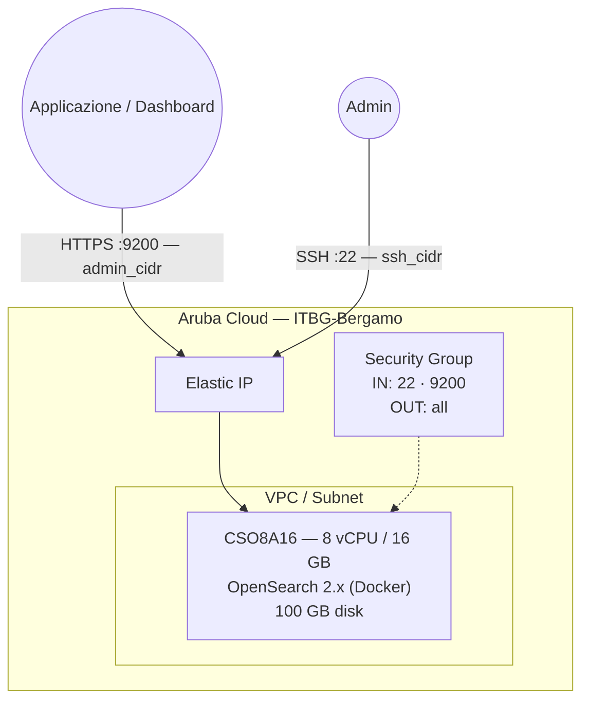

# OpenSearch su Aruba Cloud

Distribuisci [OpenSearch 2.x](https://opensearch.org/) — la suite open-source guidata dalla community per la ricerca e l'analisi — su Aruba Cloud tramite Terraform e cloud-init. Distribuito tramite l'immagine Docker ufficiale con API REST protetta da TLS e password superutente `admin` configurata al momento del bootstrap.

> **Versione provider:** arubacloud/arubacloud `~> 0.5` | **Terraform:** ≥ 1.9

---

## Introduzione

OpenSearch è il fork con licenza Apache 2.0 di Elasticsearch mantenuto da AWS e dalla community open-source. Fornisce ricerca full-text, analisi dei log e esplorazione dati in tempo reale su larga scala — senza problemi di licenza SSPL. Questo esempio distribuisce un'istanza OpenSearch **single-node** con:

- **OpenSearch 2.x** tramite l'immagine Docker ufficiale
- **TLS abilitato** sull'API REST (porta HTTPS 9200) — tutte le richieste API richiedono credenziali
- Password superutente `admin` impostata al momento del bootstrap
- Tuning del kernel `vm.max_map_count=262144` applicato persistentemente
- API REST sulla porta HTTPS 9200, limitata a `admin_cidr`

> **Nota su Elasticsearch:** Se la licenza SSPL di Elastic non è un problema per il tuo caso d'uso, vedi l'[esempio Elasticsearch](/examples/elasticsearch) in questo repository.

---

## Panoramica dell'architettura



---

## Infrastruttura creata

| Risorsa | Pattern nome | Descrizione |
|---------|-------------|-------------|
| `arubacloud_project` | `os-prod` | Contenitore progetto |
| `arubacloud_vpc` | `os-prod-vpc` | Virtual Private Cloud |
| `arubacloud_subnet` | `os-prod-subnet` | Subnet di base |
| `arubacloud_securitygroup` | `os-prod-vm-sg` | Security group |
| `arubacloud_securityrule` | `os-prod-vm-ssh` | Ingresso SSH |
| `arubacloud_securityrule` | `os-prod-vm-api` | Ingresso API REST TCP 9200 |
| `arubacloud_elasticip` | `os-prod-vm-eip` | IP pubblico VM |
| `arubacloud_blockstorage` | `os-prod-boot` | Disco di avvio 100 GB (Performance) |
| `arubacloud_keypair` | `os-prod-keypair` | Chiave pubblica SSH |
| `arubacloud_cloudserver` | `os-prod-vm` | CloudServer VM |

---

## Costo mensile stimato

| Risorsa | Specifiche | Costo/mese stimato |
|---------|-----------|-------------------|
| CloudServer VM | CSO8A16 — 8 vCPU / 16 GB | ~€55 |
| Disco di avvio | 100 GB Performance | ~€15 |
| Elastic IP | — | ~€3 |
| **Totale** | | **~€73/mese** |

---

## Requisiti

- Terraform ≥ 1.9
- ArubaCloud Terraform Provider `~> 0.5`
- Un account ArubaCloud con credenziali API OAuth2
- Una coppia di chiavi SSH

---

## Variabili

### Obbligatorie

| Variabile | Descrizione |
|-----------|-------------|
| `arubacloud_client_id` | Client ID OAuth2 ArubaCloud |
| `arubacloud_client_secret` | Client secret OAuth2 ArubaCloud |
| `ssh_public_key` | Contenuto della chiave pubblica SSH |
| `admin_password` | Password per l'utente `admin` (8+ caratteri, maiuscole + minuscole + cifra + speciale) |

### Opzionali

| Variabile | Default | Descrizione |
|-----------|---------|-------------|
| `app_name` | `"os"` | Nome breve usato in tutti i nomi delle risorse |
| `environment` | `"prod"` | Etichetta ambiente |
| `location` | `"ITBG-Bergamo"` | Regione ArubaCloud |
| `zone` | `"ITBG-1"` | Zona di disponibilità |
| `billing_period` | `"Hour"` | `"Hour"` o `"Month"` |
| `vm_flavor` | `"CSO8A16"` | Flavor CloudServer |
| `vm_image` | `"LU22-001"` | Immagine disco di avvio (Ubuntu 22.04 LTS) |
| `vm_disk_size_gb` | `100` | Dimensione disco di avvio in GB (min 50 GB) |
| `ssh_cidr` | `"0.0.0.0/0"` | CIDR per SSH |
| `admin_cidr` | `"0.0.0.0/0"` | CIDR per la porta API REST 9200 — **limita sempre** |
| `cluster_name` | `"opensearch"` | Nome cluster OpenSearch |
| `opensearch_version` | `"2"` | Tag immagine Docker OpenSearch |

---

## Output

| Output | Descrizione |
|--------|-------------|
| `opensearch_url` | URL API REST OpenSearch (HTTPS) |
| `vm_public_ip` | Indirizzo IP pubblico della VM |
| `ssh_command` | Comando SSH per connettersi alla VM |
| `health_check` | Comando `curl` per verificare lo stato del cluster |

---

## Istruzioni di distribuzione

### 1. Clona e naviga

```bash
git clone https://github.com/arubacloud/terraform-arubacloud-examples.git
cd terraform-arubacloud-examples/opensearch
```

### 2. Configura le variabili

```bash
cp terraform.tfvars.example terraform.tfvars
```

Imposta la password e limita l'accesso API ai tuoi server applicativi:

```hcl
admin_password = "Change-Me-1!"    # deve soddisfare i requisiti di complessità
admin_cidr     = "10.0.0.0/8"     # CIDR del tuo server applicativo
ssh_cidr       = "203.0.113.42/32"
```

### 3. Distribuisci

```bash
terraform init
terraform plan
terraform apply
```

Il bootstrap richiede circa **3–5 minuti** (pull immagine Docker + inizializzazione OpenSearch).

### 4. Verifica

```bash
curl -ku admin:<tua-password> \
  "$(terraform output -raw opensearch_url)/_cluster/health?pretty"
```

Output atteso:

```json
{
  "cluster_name" : "opensearch",
  "status" : "green",
  "number_of_nodes" : 1,
  ...
}
```

---

## Connessione di OpenSearch Dashboards

Per visualizzare e interrogare i dati, distribuisci OpenSearch Dashboards separatamente e puntalo a questa istanza:

```yaml
# opensearch_dashboards.yml
opensearch.hosts: ["https://<os-ip>:9200"]
opensearch.username: "kibanaserver"
opensearch.password: "<kibanaserver-password>"
opensearch.ssl.verificationMode: none
```

---

## Raccomandazioni di sicurezza

1. **Limita sempre `admin_cidr`.** OpenSearch non ha limitazione della velocità sull'autenticazione — aprire la porta 9200 a `0.0.0.0/0` espone i tuoi dati ad attacchi di credential stuffing.

2. **Usa ruoli dedicati.** Non usare il superutente `admin` per le connessioni delle applicazioni. Crea un ruolo con privilegi minimi:

   ```bash
   curl -ku admin:<password> -X PUT \
     "https://<ip>:9200/_plugins/_security/api/roles/app_role" \
     -H "Content-Type: application/json" \
     -d '{"index_permissions":[{"index_patterns":["app-*"],"allowed_actions":["read","write","create_index"]}]}'
   ```

3. **Considera un reverse proxy.** Posiziona un reverse proxy NGINX o Caddy (in questo repository) davanti a OpenSearch per centralizzare il logging degli accessi e la gestione dei certificati TLS.

---

## Risoluzione dei problemi

### Container OpenSearch non si avvia

```bash
docker logs opensearch
# Causa comune: vm.max_map_count insufficiente
cat /proc/sys/vm/max_map_count   # dovrebbe essere 262144
# Causa comune: la password non soddisfa i requisiti di complessità (8+ caratteri, maiusc+minusc+cifra+speciale)
```

### Impossibile connettersi all'API REST

```bash
# Verifica che il container sia in esecuzione
docker ps
# Controlla il binding della porta
ss -tlnp | grep 9200
# Testa localmente (dalla VM)
curl -ku admin:<password> https://localhost:9200/_cluster/health
```

---

## Riferimenti

- [Documentazione OpenSearch](https://opensearch.org/docs/latest/)
- [Plugin di sicurezza OpenSearch](https://opensearch.org/docs/latest/security/)
- [Immagine Docker OpenSearch](https://hub.docker.com/r/opensearchproject/opensearch)
- [ArubaCloud Terraform Provider](https://registry.terraform.io/providers/arubacloud/arubacloud/latest/docs)
