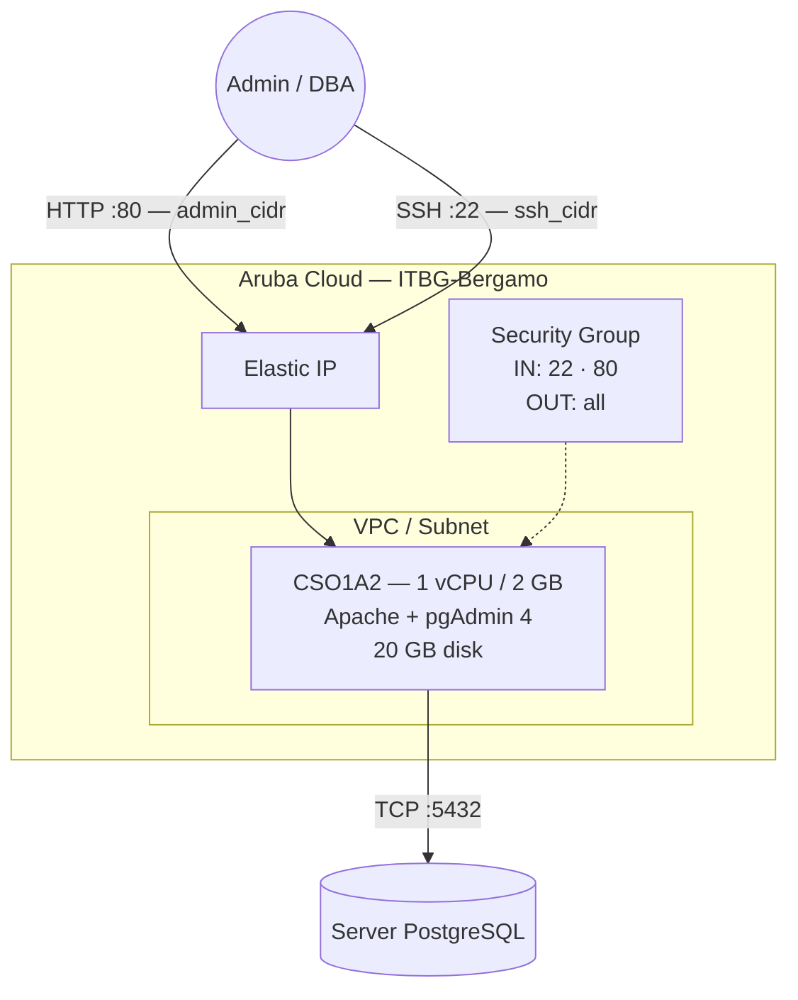

# pgAdmin su Aruba Cloud

Distribuisci [pgAdmin 4](https://www.pgadmin.org) — il principale strumento open-source per l'amministrazione di PostgreSQL — su Aruba Cloud tramite Terraform e cloud-init. pgAdmin è installato dal repository apt ufficiale in modalità web, servito da Apache sulla porta 80.

> **Versione provider:** arubacloud/arubacloud `~> 0.5` | **Terraform:** ≥ 1.9

---

## Introduzione

pgAdmin 4 è un'interfaccia grafica completa per la gestione dei database PostgreSQL. Questo esempio distribuisce un'istanza pgAdmin dedicata su Aruba Cloud con:

- pgAdmin 4 installato dal **repository apt ufficiale pgAdmin** (modalità web)
- **Apache** configurato automaticamente dallo script di setup pgAdmin
- Porta 80 limitata a `admin_cidr` — pgAdmin non deve mai essere esposto a internet pubblico
- Email e password admin configurati al momento del bootstrap

> **Nota di sicurezza:** pgAdmin ha accesso a tutti i database PostgreSQL che gli aggiungi. Limita sempre `admin_cidr` al tuo specifico IP di gestione e usa una password robusta. Considera di abbinare questo esempio al VPN [WireGuard](wireguard.md) così pgAdmin è raggiungibile solo dal tunnel VPN.

---

## Panoramica dell'architettura



---

## Infrastruttura creata

| Risorsa | Pattern nome | Descrizione |
|---------|-------------|-------------|
| `arubacloud_project` | `pgadmin-prod` | Contenitore progetto |
| `arubacloud_vpc` | `pgadmin-prod-vpc` | Virtual Private Cloud |
| `arubacloud_subnet` | `pgadmin-prod-subnet` | Subnet di base |
| `arubacloud_securitygroup` | `pgadmin-prod-vm-sg` | Security group |
| `arubacloud_securityrule` | `pgadmin-prod-vm-ssh` | Ingresso SSH |
| `arubacloud_securityrule` | `pgadmin-prod-vm-admin-ui` | Ingresso interfaccia admin TCP 80 |
| `arubacloud_elasticip` | `pgadmin-prod-vm-eip` | IP pubblico VM |
| `arubacloud_blockstorage` | `pgadmin-prod-boot` | Disco di avvio 20 GB (Performance) |
| `arubacloud_keypair` | `pgadmin-prod-keypair` | Chiave pubblica SSH |
| `arubacloud_cloudserver` | `pgadmin-prod-vm` | CloudServer VM |

---

## Costo mensile stimato

| Risorsa | Specifiche | Costo/mese stimato |
|---------|-----------|-------------------|
| CloudServer VM | CSO1A2 — 1 vCPU / 2 GB | ~€9 |
| Disco di avvio | 20 GB Performance | ~€3 |
| Elastic IP | — | ~€3 |
| **Totale** | | **~€15/mese** |

---

## Requisiti

- Terraform ≥ 1.9
- ArubaCloud Terraform Provider `~> 0.5`
- Un account ArubaCloud con credenziali API OAuth2
- Una coppia di chiavi SSH
- Uno o più server PostgreSQL raggiungibili dalla VM

---

## Variabili

### Obbligatorie

| Variabile | Descrizione |
|-----------|-------------|
| `arubacloud_client_id` | Client ID OAuth2 ArubaCloud |
| `arubacloud_client_secret` | Client secret OAuth2 ArubaCloud |
| `ssh_public_key` | Contenuto della chiave pubblica SSH |
| `pgadmin_email` | Indirizzo email di accesso per pgAdmin |
| `pgadmin_password` | Password di accesso per pgAdmin (min 8 caratteri) |

### Opzionali

| Variabile | Default | Descrizione |
|-----------|---------|-------------|
| `app_name` | `"pgadmin"` | Nome breve usato in tutti i nomi delle risorse |
| `environment` | `"prod"` | Etichetta ambiente |
| `location` | `"ITBG-Bergamo"` | Regione ArubaCloud |
| `zone` | `"ITBG-1"` | Zona di disponibilità |
| `billing_period` | `"Hour"` | `"Hour"` o `"Month"` |
| `vm_flavor` | `"CSO1A2"` | Flavor CloudServer |
| `vm_image` | `"LU22-001"` | Immagine disco di avvio (Ubuntu 22.04 LTS) |
| `vm_disk_size_gb` | `20` | Dimensione disco di avvio in GB |
| `ssh_cidr` | `"0.0.0.0/0"` | CIDR per SSH — limita in produzione |
| `admin_cidr` | `"0.0.0.0/0"` | CIDR per interfaccia web — **limita sempre** |

---

## Output

| Output | Descrizione |
|--------|-------------|
| `pgadmin_url` | URL interfaccia web pgAdmin |
| `pgadmin_email` | Indirizzo email di accesso |
| `vm_public_ip` | Indirizzo IP pubblico della VM |
| `ssh_command` | Comando SSH per connettersi alla VM |

---

## Istruzioni di distribuzione

### 1. Clona e naviga

```bash
git clone https://github.com/arubacloud/terraform-arubacloud-examples.git
cd terraform-arubacloud-examples/pgadmin
```

### 2. Configura le variabili

```bash
cp terraform.tfvars.example terraform.tfvars
```

Imposta credenziali, email, password e **limita i CIDR**:

```hcl
pgadmin_email    = "admin@example.com"
pgadmin_password = "your-strong-password"
admin_cidr       = "203.0.113.42/32"
ssh_cidr         = "203.0.113.42/32"
```

### 3. Distribuisci

```bash
terraform init
terraform plan
terraform apply
```

Il bootstrap richiede circa **5–8 minuti** (download pacchetto pgAdmin + configurazione Apache).

### 4. Apri pgAdmin

```bash
terraform output pgadmin_url
```

Accedi con `pgadmin_email` e `pgadmin_password`. pgAdmin 4 si apre su `/pgadmin4`.

### 5. Aggiungi un server PostgreSQL

Nell'interfaccia pgAdmin: **Object → Register → Server**

- **General → Name:** qualsiasi nome descrittivo
- **Connection → Host:** IP o hostname del tuo server PostgreSQL
- **Connection → Port:** 5432
- **Connection → Username / Password:** le tue credenziali PostgreSQL

La VM pgAdmin deve poter raggiungere il server PostgreSQL sulla porta TCP 5432. Assicurati che il security group o il firewall del server PostgreSQL consenta le connessioni in ingresso dall'IP della VM pgAdmin.

---

## Raccomandazioni di sicurezza

1. **Limita sempre `admin_cidr`.** pgAdmin memorizza le credenziali PostgreSQL — non esporlo mai a `0.0.0.0/0` in produzione.

2. **Usa l'accesso VPN.** La configurazione più sicura è mantenere `admin_cidr` impostato sul CIDR del tunnel VPN WireGuard e accedere a pgAdmin solo dall'interno della VPN. Vedi l'[esempio WireGuard](wireguard.md).

3. **Usa il tunneling SSH come alternativa.** Se preferisci non esporre la porta 80 del tutto, imposta `admin_cidr = "127.0.0.1/32"` e accedi a pgAdmin tramite un tunnel SSH:

   ```bash
   ssh -L 5050:localhost:80 ubuntu@<vm-ip>
   # Poi apri http://localhost:5050/pgadmin4 nel browser
   ```

---

## Risoluzione dei problemi

### Pagina pgAdmin non si carica

```bash
sudo systemctl status apache2
sudo cat /var/log/apache2/error.log | tail -20
sudo cat /var/log/cloud-init-output.log | tail -30
```

### Impossibile connettersi a PostgreSQL

Dalla VM pgAdmin, verifica la connettività TCP:

```bash
nc -zv <postgres-host> 5432
```

Controlla che `pg_hba.conf` di PostgreSQL consenta le connessioni dall'IP della VM pgAdmin e che qualsiasi security group o firewall sul server PostgreSQL permetta la porta 5432.

---

## Riferimenti

- [Documentazione pgAdmin](https://www.pgadmin.org/docs/)
- [Repository apt pgAdmin](https://www.pgadmin.org/download/pgadmin-4-apt/)
- [ArubaCloud Terraform Provider](https://registry.terraform.io/providers/arubacloud/arubacloud/latest/docs)
