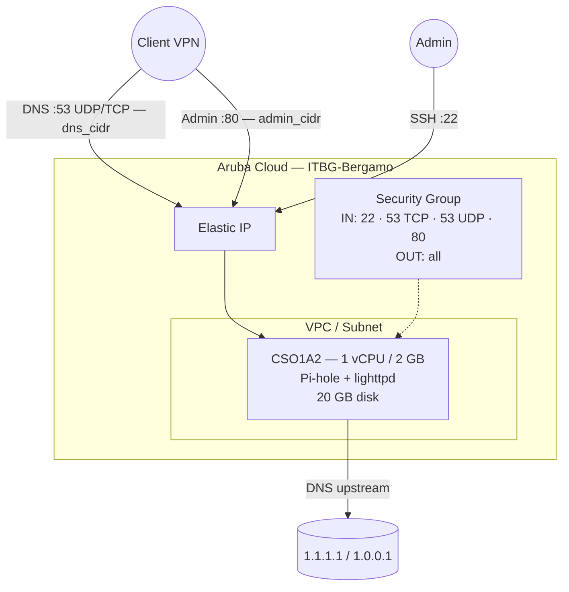

# Pi-hole su Aruba Cloud

Distribuisci [Pi-hole](https://pi-hole.net) — filtraggio DNS e blocco pubblicità a livello di rete — su Aruba Cloud tramite Terraform e cloud-init. Pi-hole si abbina naturalmente all'[esempio WireGuard](wireguard.md): punta i tuoi client VPN al server DNS Pi-hole e ottieni una navigazione senza pubblicità ovunque sia attiva la VPN.

> **Versione provider:** arubacloud/arubacloud `~> 0.5` | **Terraform:** ≥ 1.9

---

## Introduzione

Pi-hole è un DNS sinkhole che blocca pubblicità, tracker e domini malevoli a livello di rete, prima che raggiungano il tuo dispositivo. Questo esempio distribuisce un'istanza Pi-hole leggera su Aruba Cloud con:

- La **VM più piccola disponibile** (CSO1A2 — 1 vCPU / 2 GB) — Pi-hole è molto snello
- Pi-hole installato tramite il **programma di installazione automatico ufficiale**
- **DNS sulla porta 53 (UDP + TCP)** — UDP per le query standard, TCP per le risposte grandi
- **Interfaccia web admin sulla porta 80** — entrambe limitate da `admin_cidr`
- Listener stub `systemd-resolved` disabilitato così Pi-hole può gestire la porta 53
- **Nessun DBaaS** — Pi-hole archivia i log delle query in SQLite sul disco di avvio

> **Best practice:** Distribuisci insieme all'esempio [WireGuard](wireguard.md). Imposta `dns_cidr` e `admin_cidr` sul tuo CIDR del tunnel WireGuard (es. `10.8.0.0/24`). Punta il DNS dei client VPN all'Elastic IP di Pi-hole.

---

## Panoramica dell'architettura



---

## Infrastruttura creata

| Risorsa | Pattern nome | Descrizione |
|---------|-------------|-------------|
| `arubacloud_project` | `pihole-prod` | Contenitore progetto |
| `arubacloud_vpc` | `pihole-prod-vpc` | Virtual Private Cloud |
| `arubacloud_subnet` | `pihole-prod-subnet` | Subnet di base |
| `arubacloud_securitygroup` | `pihole-prod-vm-sg` | Security group |
| `arubacloud_securityrule` | `pihole-prod-vm-ssh` | Ingresso SSH |
| `arubacloud_securityrule` | `pihole-prod-vm-admin-ui` | Ingresso interfaccia admin TCP 80 |
| `arubacloud_securityrule` | `pihole-prod-vm-dns-tcp` | Ingresso DNS TCP 53 |
| `arubacloud_securityrule` | `pihole-prod-vm-dns-udp` | Ingresso DNS UDP 53 |
| `arubacloud_elasticip` | `pihole-prod-vm-eip` | IP pubblico VM |
| `arubacloud_blockstorage` | `pihole-prod-boot` | Disco di avvio 20 GB (Performance) |
| `arubacloud_keypair` | `pihole-prod-keypair` | Chiave pubblica SSH |
| `arubacloud_cloudserver` | `pihole-prod-vm` | CloudServer VM |

---

## Costo mensile stimato

| Risorsa | Specifiche | Costo/mese stimato |
|---------|-----------|-------------------|
| CloudServer VM | CSO1A2 — 1 vCPU / 2 GB | ~€9 |
| Disco di avvio | 20 GB Performance | ~€3 |
| Elastic IP | — | ~€3 |
| **Totale** | | **~€15/mese** |

---

## Requisiti

- Terraform ≥ 1.9
- ArubaCloud Terraform Provider `~> 0.5`
- Un account ArubaCloud con credenziali API OAuth2
- Una coppia di chiavi SSH

---

## Variabili

### Obbligatorie

| Variabile | Descrizione |
|-----------|-------------|
| `arubacloud_client_id` | Client ID OAuth2 ArubaCloud |
| `arubacloud_client_secret` | Client secret OAuth2 ArubaCloud |
| `ssh_public_key` | Contenuto della chiave pubblica SSH |
| `pihole_password` | Password interfaccia web admin Pi-hole (min 8 caratteri) |

### Opzionali

| Variabile | Default | Descrizione |
|-----------|---------|-------------|
| `app_name` | `"pihole"` | Nome breve usato in tutti i nomi delle risorse |
| `environment` | `"prod"` | Etichetta ambiente |
| `location` | `"ITBG-Bergamo"` | Regione ArubaCloud |
| `zone` | `"ITBG-1"` | Zona di disponibilità |
| `billing_period` | `"Hour"` | `"Hour"` o `"Month"` |
| `vm_flavor` | `"CSO1A2"` | Flavor CloudServer |
| `vm_image` | `"LU22-001"` | Immagine disco di avvio (Ubuntu 22.04 LTS) |
| `vm_disk_size_gb` | `20` | Dimensione disco di avvio in GB |
| `ssh_cidr` | `"0.0.0.0/0"` | CIDR per SSH |
| `dns_cidr` | `"0.0.0.0/0"` | CIDR per DNS porta 53 — **limita al CIDR del tunnel VPN** |
| `admin_cidr` | `"0.0.0.0/0"` | CIDR per interfaccia admin porta 80 — **limita al CIDR del tunnel VPN** |
| `upstream_dns_1` | `"1.1.1.1"` | Resolver upstream primario |
| `upstream_dns_2` | `"1.0.0.1"` | Resolver upstream secondario |

---

## Output

| Output | Descrizione |
|--------|-------------|
| `admin_url` | URL interfaccia web admin Pi-hole |
| `dns_server` | IP da usare come server DNS sui client VPN |
| `vm_public_ip` | Indirizzo IP pubblico della VM |
| `ssh_command` | Comando SSH per connettersi alla VM |

---

## Istruzioni di distribuzione

### 1. Clona e naviga

```bash
git clone https://github.com/arubacloud/terraform-arubacloud-examples.git
cd terraform-arubacloud-examples/pi-hole
```

### 2. Configura le variabili

```bash
cp terraform.tfvars.example terraform.tfvars
```

Imposta `pihole_password`. In produzione, imposta anche:

```hcl
dns_cidr   = "10.8.0.0/24"   # il tuo CIDR del tunnel WireGuard
admin_cidr = "10.8.0.0/24"
ssh_cidr   = "203.0.113.42/32"
```

### 3. Distribuisci

```bash
terraform init
terraform plan
terraform apply
```

Il bootstrap richiede circa **5–8 minuti** (Pi-hole scarica le blocklist alla prima installazione).

### 4. Punta i client VPN a Pi-hole

```bash
terraform output dns_server
```

Usa l'IP di output come server DNS nella configurazione del tuo client WireGuard:

```ini
# Nella sezione [Peer] del tuo client WireGuard:
DNS = <output di dns_server>
```

Oppure impostalo come DNS nella configurazione del tuo server WireGuard così tutti i client VPN lo usano automaticamente.

### 5. Accedi all'interfaccia admin

```bash
terraform output admin_url
```

Accedi con `pihole_password` per visualizzare i log delle query, gestire le blocklist e mettere in whitelist i domini.

---

## Raccomandazioni di sicurezza

1. **Limita sempre `dns_cidr` e `admin_cidr`.** Lasciare la porta 53 aperta a `0.0.0.0/0` rende il tuo Pi-hole un resolver DNS aperto — verrà abusato per attacchi di amplificazione DNS. Imposta entrambi i CIDR sul CIDR del tuo tunnel WireGuard.

2. **Non esporre pubblicamente l'interfaccia admin.** La porta 80 dovrebbe essere raggiungibile solo dai client connessi alla VPN.

3. **Usa Pi-hole con WireGuard.** Il modello di distribuzione previsto: WireGuard VPN sullo stesso VM o adiacente fornisce accesso sicuro tramite tunnel, e i client indirizzano il DNS attraverso Pi-hole. Vedi l'[esempio WireGuard](wireguard.md).

---

## Considerazioni sull'aggiornamento

Pi-hole si aggiorna in-place:

```bash
ssh ubuntu@$(terraform output -raw vm_public_ip)
pihole -up
```

Non è necessaria la sostituzione della VM per gli aggiornamenti di versione di Pi-hole.

---

## Risoluzione dei problemi

### Pi-hole non risponde alle query DNS

```bash
sudo systemctl status pihole-FTL
sudo pihole status
# Controlla che la porta 53 sia in ascolto:
sudo ss -ulnp | grep :53
sudo ss -tlnp | grep :53
```

### Porta 53 già in uso dopo l'installazione

Il listener stub `systemd-resolved` non è stato disabilitato. Controlla:

```bash
sudo ss -ulnp sport = :53
cat /etc/systemd/resolved.conf | grep DNSStubListener
sudo systemctl restart systemd-resolved
sudo systemctl restart pihole-FTL
```

### Interfaccia admin non si carica

Verifica che lighttpd sia in esecuzione e che la porta 80 sia raggiungibile dalla tua rete attuale:

```bash
sudo systemctl status lighttpd
curl -sv http://localhost/admin/
```

---

## Riferimenti

- [Documentazione Pi-hole](https://docs.pi-hole.net/)
- [Installazione automatica Pi-hole](https://docs.pi-hole.net/main/post-install/)
- [Esempio WireGuard](wireguard.md)
- [ArubaCloud Terraform Provider](https://registry.terraform.io/providers/arubacloud/arubacloud/latest/docs)
