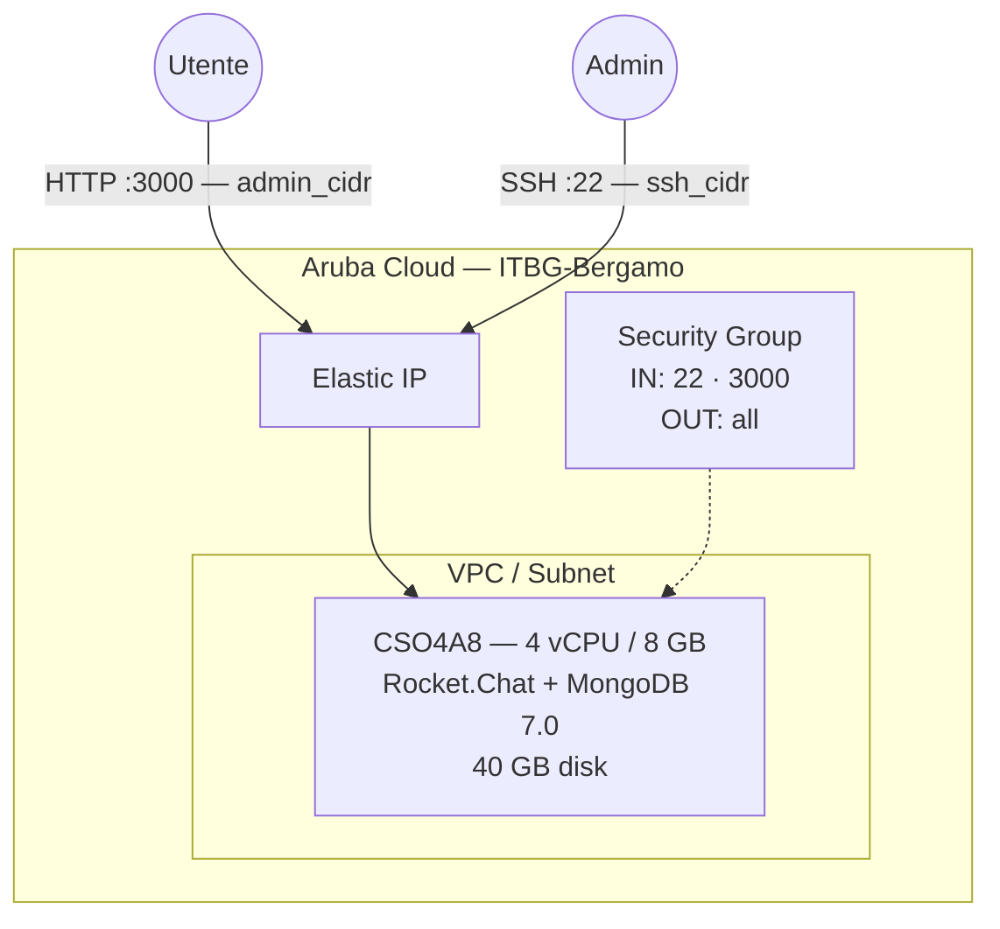

# Rocket.Chat su Aruba Cloud

Distribuisci [Rocket.Chat](https://rocket.chat) — una piattaforma open-source per la messaggistica e la collaborazione del team — su Aruba Cloud tramite Terraform e cloud-init. Rocket.Chat e MongoDB 7.0 vengono eseguiti come servizi Docker Compose con l'account admin pre-configurato al momento del bootstrap.

> **Versione provider:** arubacloud/arubacloud `~> 0.5` | **Terraform:** ≥ 1.9

---

## Introduzione

Rocket.Chat è un'alternativa self-hosted a Slack e Microsoft Teams, che offre messaggistica in tempo reale, videochiamate e condivisione di file. Questo esempio distribuisce:

- **Rocket.Chat** (ultima versione stabile) e **MongoDB 7.0** tramite Docker Compose
- Replica set MongoDB inizializzata automaticamente (richiesta da Rocket.Chat per il tailing oplog)
- Account admin creato al primo avvio tramite variabili d'ambiente — nessuna procedura guidata di configurazione manuale
- Porta 3000 per l'interfaccia web, limitata a `admin_cidr`

> **Confronto con Mattermost:** Rocket.Chat è più ricco di funzionalità ma più pesante (MongoDB vs. PostgreSQL). Per una soluzione di messaggistica più semplice con minore utilizzo delle risorse, considera l'[esempio Mattermost](mattermost.md).

---

## Panoramica dell'architettura



---

## Infrastruttura creata

| Risorsa | Pattern nome | Descrizione |
|---------|-------------|-------------|
| `arubacloud_project` | `rc-prod` | Contenitore progetto |
| `arubacloud_vpc` | `rc-prod-vpc` | Virtual Private Cloud |
| `arubacloud_subnet` | `rc-prod-subnet` | Subnet di base |
| `arubacloud_securitygroup` | `rc-prod-vm-sg` | Security group |
| `arubacloud_securityrule` | `rc-prod-vm-ssh` | Ingresso SSH |
| `arubacloud_securityrule` | `rc-prod-vm-admin-ui` | Ingresso interfaccia web TCP 3000 |
| `arubacloud_elasticip` | `rc-prod-vm-eip` | IP pubblico VM |
| `arubacloud_blockstorage` | `rc-prod-boot` | Disco di avvio 40 GB (Performance) |
| `arubacloud_keypair` | `rc-prod-keypair` | Chiave pubblica SSH |
| `arubacloud_cloudserver` | `rc-prod-vm` | CloudServer VM |

---

## Costo mensile stimato

| Risorsa | Specifiche | Costo/mese stimato |
|---------|-----------|-------------------|
| CloudServer VM | CSO4A8 — 4 vCPU / 8 GB | ~€35 |
| Disco di avvio | 40 GB Performance | ~€6 |
| Elastic IP | — | ~€3 |
| **Totale** | | **~€44/mese** |

---

## Requisiti

- Terraform ≥ 1.9
- ArubaCloud Terraform Provider `~> 0.5`
- Un account ArubaCloud con credenziali API OAuth2
- Una coppia di chiavi SSH

---

## Variabili

### Obbligatorie

| Variabile | Descrizione |
|-----------|-------------|
| `arubacloud_client_id` | Client ID OAuth2 ArubaCloud |
| `arubacloud_client_secret` | Client secret OAuth2 ArubaCloud |
| `ssh_public_key` | Contenuto della chiave pubblica SSH |
| `admin_email` | Indirizzo email admin Rocket.Chat |
| `admin_password` | Password admin Rocket.Chat (min 8 caratteri) |

### Opzionali

| Variabile | Default | Descrizione |
|-----------|---------|-------------|
| `app_name` | `"rc"` | Nome breve usato in tutti i nomi delle risorse |
| `environment` | `"prod"` | Etichetta ambiente |
| `location` | `"ITBG-Bergamo"` | Regione ArubaCloud |
| `zone` | `"ITBG-1"` | Zona di disponibilità |
| `billing_period` | `"Hour"` | `"Hour"` o `"Month"` |
| `vm_flavor` | `"CSO4A8"` | Flavor CloudServer |
| `vm_image` | `"LU22-001"` | Immagine disco di avvio (Ubuntu 22.04 LTS) |
| `vm_disk_size_gb` | `40` | Dimensione disco di avvio in GB |
| `ssh_cidr` | `"0.0.0.0/0"` | CIDR per SSH |
| `admin_cidr` | `"0.0.0.0/0"` | CIDR per l'interfaccia web porta 3000 |
| `admin_username` | `"admin"` | Nome utente admin Rocket.Chat |
| `admin_fullname` | `"Administrator"` | Nome visualizzato admin Rocket.Chat |

---

## Output

| Output | Descrizione |
|--------|-------------|
| `rocketchat_url` | URL interfaccia web Rocket.Chat |
| `vm_public_ip` | Indirizzo IP pubblico della VM |
| `ssh_command` | Comando SSH per connettersi alla VM |

---

## Istruzioni di distribuzione

### 1. Clona e naviga

```bash
git clone https://github.com/arubacloud/terraform-arubacloud-examples.git
cd terraform-arubacloud-examples/rocketchat
```

### 2. Configura le variabili

```bash
cp terraform.tfvars.example terraform.tfvars
```

### 3. Distribuisci

```bash
terraform init
terraform plan
terraform apply
```

Il bootstrap richiede circa **5–8 minuti** (installazione Docker + inizializzazione replica set MongoDB + primo avvio Rocket.Chat).

### 4. Accedi a Rocket.Chat

```bash
terraform output rocketchat_url
```

Accedi con `admin_username` / `admin_password`. Attendi 2–3 minuti perché Rocket.Chat si inizializzi completamente al primo avvio.

---

## Risoluzione dei problemi

### Rocket.Chat non si carica

```bash
ssh ubuntu@$(terraform output -raw vm_public_ip)
docker compose -f /opt/rocketchat/docker-compose.yml ps
docker compose -f /opt/rocketchat/docker-compose.yml logs rocketchat --tail 50
```

### Replica set MongoDB non inizializzata

```bash
docker compose -f /opt/rocketchat/docker-compose.yml exec mongo mongosh \
  --eval "rs.status()"
```

Se `rs.status()` restituisce un errore, inizializza manualmente:

```bash
docker compose -f /opt/rocketchat/docker-compose.yml exec mongo mongosh \
  --eval "rs.initiate({_id:'rs0',members:[{_id:0,host:'localhost:27017'}]})"
```

---

## Riferimenti

- [Documentazione Rocket.Chat](https://docs.rocket.chat)
- [Guida Docker Compose Rocket.Chat](https://docs.rocket.chat/deploy/deploy-rocket.chat/deploy-with-docker-and-docker-compose)
- [Esempio Mattermost](mattermost.md)
- [ArubaCloud Terraform Provider](https://registry.terraform.io/providers/arubacloud/arubacloud/latest/docs)
