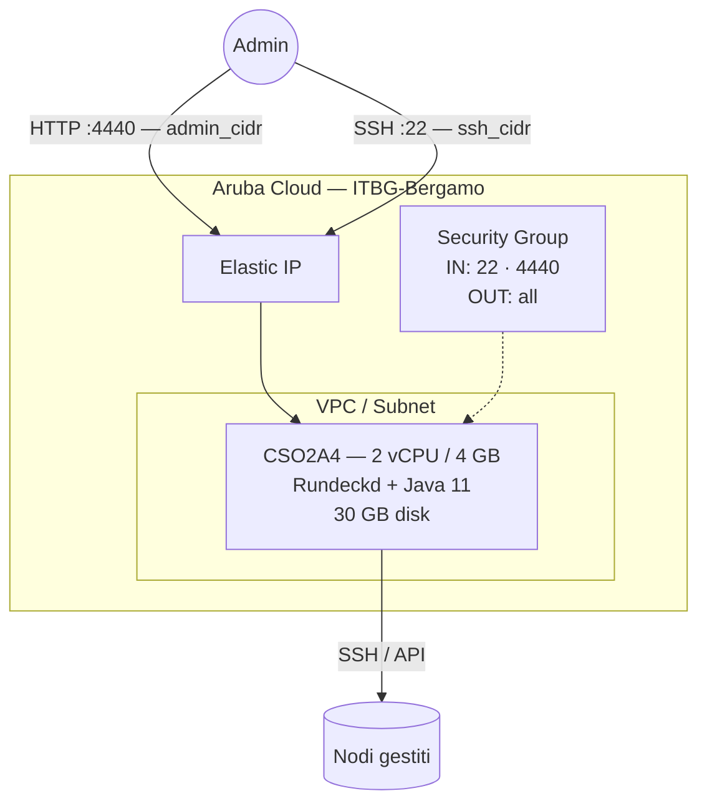

# Rundeck su Aruba Cloud

Distribuisci [Rundeck](https://www.rundeck.com) — un pianificatore di job open-source e piattaforma di automazione runbook — su Aruba Cloud tramite Terraform e cloud-init. Rundeck ti permette di definire, pianificare e verificare le operazioni di infrastruttura da un'interfaccia web centrale.

> **Versione provider:** arubacloud/arubacloud `~> 0.5` | **Terraform:** ≥ 1.9

---

## Introduzione

Rundeck consente ai team di automatizzare le attività operative di routine (distribuzioni, backup, manutenzione del database, ecc.) con un controllo degli accessi granulare e un log di audit completo. Questo esempio distribuisce:

- **Rundeck** installato dal repository apt ufficiale packagecloud
- **OpenJDK 11** (requisito runtime Java)
- Password admin impostata al momento del bootstrap tramite realm.properties con hash MD5
- Interfaccia web sulla porta 4440, limitata a `admin_cidr`
- URL esterno pre-configurato così webhook e link funzionano correttamente

> **Nota di sicurezza:** Rundeck ha accesso per eseguire comandi arbitrari su qualsiasi nodo che gestisce. Limita sempre `admin_cidr` al tuo IP di gestione e usa una password robusta.

---

## Panoramica dell'architettura



---

## Infrastruttura creata

| Risorsa | Pattern nome | Descrizione |
|---------|-------------|-------------|
| `arubacloud_project` | `rundeck-prod` | Contenitore progetto |
| `arubacloud_vpc` | `rundeck-prod-vpc` | Virtual Private Cloud |
| `arubacloud_subnet` | `rundeck-prod-subnet` | Subnet di base |
| `arubacloud_securitygroup` | `rundeck-prod-vm-sg` | Security group |
| `arubacloud_securityrule` | `rundeck-prod-vm-ssh` | Ingresso SSH |
| `arubacloud_securityrule` | `rundeck-prod-vm-admin-ui` | Ingresso interfaccia web TCP 4440 |
| `arubacloud_elasticip` | `rundeck-prod-vm-eip` | IP pubblico VM |
| `arubacloud_blockstorage` | `rundeck-prod-boot` | Disco di avvio 30 GB (Performance) |
| `arubacloud_keypair` | `rundeck-prod-keypair` | Chiave pubblica SSH |
| `arubacloud_cloudserver` | `rundeck-prod-vm` | CloudServer VM |

---

## Costo mensile stimato

| Risorsa | Specifiche | Costo/mese stimato |
|---------|-----------|-------------------|
| CloudServer VM | CSO2A4 — 2 vCPU / 4 GB | ~€18 |
| Disco di avvio | 30 GB Performance | ~€5 |
| Elastic IP | — | ~€3 |
| **Totale** | | **~€26/mese** |

---

## Requisiti

- Terraform ≥ 1.9
- ArubaCloud Terraform Provider `~> 0.5`
- Un account ArubaCloud con credenziali API OAuth2
- Una coppia di chiavi SSH

---

## Variabili

### Obbligatorie

| Variabile | Descrizione |
|-----------|-------------|
| `arubacloud_client_id` | Client ID OAuth2 ArubaCloud |
| `arubacloud_client_secret` | Client secret OAuth2 ArubaCloud |
| `ssh_public_key` | Contenuto della chiave pubblica SSH |
| `admin_password` | Password admin Rundeck (min 8 caratteri) |

### Opzionali

| Variabile | Default | Descrizione |
|-----------|---------|-------------|
| `app_name` | `"rundeck"` | Nome breve usato in tutti i nomi delle risorse |
| `environment` | `"prod"` | Etichetta ambiente |
| `location` | `"ITBG-Bergamo"` | Regione ArubaCloud |
| `zone` | `"ITBG-1"` | Zona di disponibilità |
| `billing_period` | `"Hour"` | `"Hour"` o `"Month"` |
| `vm_flavor` | `"CSO2A4"` | Flavor CloudServer (min 4 GB RAM consigliato) |
| `vm_image` | `"LU22-001"` | Immagine disco di avvio (Ubuntu 22.04 LTS) |
| `vm_disk_size_gb` | `30` | Dimensione disco di avvio in GB |
| `ssh_cidr` | `"0.0.0.0/0"` | CIDR per SSH — limita in produzione |
| `admin_cidr` | `"0.0.0.0/0"` | CIDR per interfaccia web — **limita sempre** |
| `rundeck_url` | auto | Override URL esterno (default: `http://<elastic-ip>:4440`) |

---

## Output

| Output | Descrizione |
|--------|-------------|
| `rundeck_url` | URL interfaccia web Rundeck |
| `vm_public_ip` | Indirizzo IP pubblico della VM |
| `ssh_command` | Comando SSH per connettersi alla VM |

---

## Istruzioni di distribuzione

### 1. Clona e naviga

```bash
git clone https://github.com/arubacloud/terraform-arubacloud-examples.git
cd terraform-arubacloud-examples/rundeck
```

### 2. Configura le variabili

```bash
cp terraform.tfvars.example terraform.tfvars
```

Imposta credenziali, password e limita i CIDR:

```hcl
admin_password = "your-strong-password"
admin_cidr     = "203.0.113.42/32"
ssh_cidr       = "203.0.113.42/32"
```

### 3. Distribuisci

```bash
terraform init
terraform plan
terraform apply
```

Il bootstrap richiede circa **3–5 minuti**. Rundeck stesso ha bisogno di altri **1–2 minuti** per avviarsi dopo il completamento di cloud-init.

### 4. Accedi a Rundeck

```bash
terraform output rundeck_url
```

Accedi con `admin` / `admin_password`.

---

## Primi passi con Rundeck

### Aggiungi un nodo

Nell'interfaccia Rundeck: **Project Settings → Edit Nodes → Add a new Node Source**

Aggiungi la VM Aruba Cloud o qualsiasi server accessibile tramite SSH come nodo. Rundeck userà la chiave SSH sulla VM Rundeck per connettersi.

### Crea il tuo primo job

Naviga su **Jobs → Create Job** nell'interfaccia Rundeck.

Esempio: un job che esegue `df -h` su tutti i nodi per verificare l'utilizzo del disco:

- **Name:** Controlla utilizzo disco
- **Workflow Step:** Command — `df -h`
- **Nodes:** Tutti i nodi

---

## Risoluzione dei problemi

### Interfaccia web Rundeck non si carica

```bash
sudo systemctl status rundeckd
sudo journalctl -u rundeckd -n 50
# Log Rundeck:
sudo tail -f /var/log/rundeck/service.log
```

Rundeck si avvia lentamente al primo avvio mentre inizializza il database H2 incorporato. Attendi 2–3 minuti e ricarica.

### Login rifiutato dopo la password corretta

L'hash MD5 di realm.properties potrebbe non essersi applicato correttamente:

```bash
sudo cat /etc/rundeck/realm.properties
# Dovrebbe mostrare: admin:MD5:<hash>,user,admin,...
sudo systemctl restart rundeckd
```

---

## Riferimenti

- [Documentazione Rundeck](https://docs.rundeck.com)
- [Repository apt Rundeck](https://packagecloud.io/pagerduty/rundeck)
- [ArubaCloud Terraform Provider](https://registry.terraform.io/providers/arubacloud/arubacloud/latest/docs)
