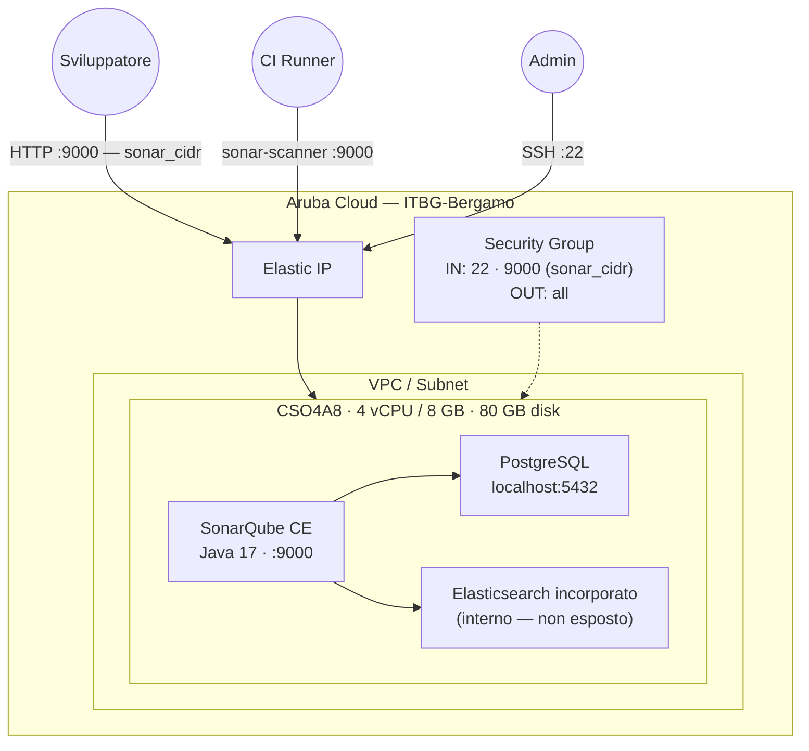

# SonarQube su Aruba Cloud

Distribuisci [SonarQube](https://www.sonarsource.com/products/sonarqube/) Community Edition — analisi continua della qualità e sicurezza del codice — su Aruba Cloud tramite Terraform e cloud-init. Database PostgreSQL locale, Java 17, accesso diretto sulla porta 9000.

> **Versione provider:** arubacloud/arubacloud `~> 0.5` | **Terraform:** ≥ 1.9

---

## Introduzione

SonarQube è la principale piattaforma open-source per l'ispezione continua della qualità del codice. Esegue analisi statica su 30+ linguaggi, rilevando bug, vulnerabilità e code smell come parte della tua pipeline CI/CD. Questo esempio distribuisce SonarQube Community Edition con:

- Una **CloudServer VM** (CSO4A8 — 4 vCPU / 8 GB) che esegue il server SonarQube sulla porta 9000
- **Java 17** (OpenJDK) — richiesto da SonarQube 10.x
- **PostgreSQL locale** — il database consigliato (H2 è solo per valutazione; MySQL non è supportato)
- **Tuning critico del kernel** (`vm.max_map_count=524288`, `fs.file-max=131072`) applicato tramite sysctl — richiesto dall'Elasticsearch incorporato che alimenta la ricerca di SonarQube

---

## Panoramica dell'architettura



---

## Infrastruttura creata

| Risorsa | Pattern nome | Descrizione |
|---------|-------------|-------------|
| `arubacloud_project` | `sonar-prod` | Contenitore progetto |
| `arubacloud_vpc` | `sonar-prod-vpc` | Virtual Private Cloud |
| `arubacloud_subnet` | `sonar-prod-subnet` | Subnet di base |
| `arubacloud_securitygroup` | `sonar-prod-vm-sg` | Security group |
| `arubacloud_securityrule` | `sonar-prod-vm-ssh` | Ingresso SSH |
| `arubacloud_securityrule` | `sonar-prod-vm-sonar` | Interfaccia web SonarQube (porta 9000) |
| `arubacloud_elasticip` | `sonar-prod-vm-eip` | IP pubblico VM |
| `arubacloud_blockstorage` | `sonar-prod-boot` | Disco di avvio 80 GB (Performance) |
| `arubacloud_keypair` | `sonar-prod-keypair` | Chiave pubblica SSH |
| `arubacloud_cloudserver` | `sonar-prod-vm` | CloudServer VM |

---

## Costo mensile stimato

| Risorsa | Specifiche | Costo/mese stimato |
|---------|-----------|-------------------|
| CloudServer VM | CSO4A8 — 4 vCPU / 8 GB | ~€36 |
| Disco di avvio | 80 GB Performance | ~€10 |
| Elastic IP | — | ~€3 |
| **Totale** | | **~€49/mese** |

Per team più grandi o monorepo, usa `CSO8A16` (8 vCPU / 16 GB) — il componente Elasticsearch beneficia significativamente di RAM aggiuntiva.

---

## Requisiti

- Terraform ≥ 1.9
- ArubaCloud Terraform Provider `~> 0.5`
- Un account ArubaCloud con credenziali API OAuth2
- Una coppia di chiavi SSH

---

## Variabili

### Obbligatorie

| Variabile | Descrizione |
|-----------|-------------|
| `arubacloud_client_id` | Client ID OAuth2 ArubaCloud |
| `arubacloud_client_secret` | Client secret OAuth2 ArubaCloud |
| `ssh_public_key` | Contenuto della chiave pubblica SSH |
| `db_password` | Password PostgreSQL per l'utente sonarqube (min 16 caratteri) |

### Opzionali

| Variabile | Default | Descrizione |
|-----------|---------|-------------|
| `app_name` | `"sonar"` | Nome breve usato in tutti i nomi delle risorse |
| `environment` | `"prod"` | Etichetta ambiente |
| `location` | `"ITBG-Bergamo"` | Regione ArubaCloud |
| `zone` | `"ITBG-1"` | Zona di disponibilità |
| `billing_period` | `"Hour"` | `"Hour"` o `"Month"` |
| `vm_flavor` | `"CSO4A8"` | Flavor CloudServer |
| `vm_image` | `"LU22-001"` | Immagine disco di avvio (Ubuntu 22.04 LTS) |
| `vm_disk_size_gb` | `80` | Dimensione disco di avvio in GB |
| `ssh_cidr` | `"0.0.0.0/0"` | CIDR per SSH |
| `sonar_cidr` | `"0.0.0.0/0"` | CIDR per porta 9000 — **limita al tuo ufficio/VPN** |
| `sonarqube_version` | `"10.7.0.96327"` | Versione SonarQube CE (include il numero di build) |

---

## Output

| Output | Descrizione |
|--------|-------------|
| `sonarqube_url` | URL interfaccia web SonarQube |
| `vm_public_ip` | Indirizzo IP pubblico |
| `ssh_command` | Comando SSH per connettersi |

---

## Istruzioni di distribuzione

### 1. Clona e naviga

```bash
git clone https://github.com/arubacloud/terraform-arubacloud-examples.git
cd terraform-arubacloud-examples/sonarqube
```

### 2. Configura le variabili

```bash
cp terraform.tfvars.example terraform.tfvars
```

Imposta `db_password`. Opzionalmente limita `sonar_cidr` al CIDR del tuo ufficio/VPN.

### 3. Distribuisci

```bash
terraform init
terraform plan
terraform apply
```

Il bootstrap richiede circa **8–12 minuti** — SonarQube scarica ~280 MB e Elasticsearch ha bisogno di tempo per inizializzare i suoi indici.

### 4. Accedi a SonarQube

```bash
terraform output sonarqube_url
```

Accedi con `admin` / `admin`. Verrà immediatamente richiesto di cambiare la password.

### 5. Integra con la tua pipeline CI

Installa la CLI `sonar-scanner` o usa un plugin CI. Esempio per un progetto Maven:

```bash
mvn sonar:sonar \
  -Dsonar.host.url=$(terraform output -raw sonarqube_url) \
  -Dsonar.login=<tuo-token>
```

---

## Raccomandazioni di sicurezza

1. **Limita `sonar_cidr`.** La porta 9000 dovrebbe essere raggiungibile solo dalla tua rete di sviluppo, dai CI runner o dalla VPN. Lasciarla aperta a `0.0.0.0/0` espone pubblicamente i risultati della tua analisi del codice.

2. **Cambia la password admin** immediatamente dopo il primo accesso — SonarQube lo impone al primo accesso.

3. **Crea token per progetto** per l'integrazione CI. Non usare mai le credenziali dell'account admin nelle pipeline CI.

4. **Abilita HTTPS.** Aggiungi un reverse proxy nginx con un certificato Let's Encrypt davanti a SonarQube per l'accesso cifrato.

---

## Considerazioni sull'aggiornamento

### Aggiornamento SonarQube

Gli aggiornamenti SonarQube richiedono un passaggio di migrazione del database. Fai sempre prima il backup di PostgreSQL:

```bash
ssh ubuntu@$(terraform output -raw vm_public_ip)
sudo -u postgres pg_dump sonarqube > /tmp/sonarqube-backup.sql

SQ_VERSION=X.Y.Z.BUILD
sudo systemctl stop sonarqube
curl -sSfL \
  "https://binaries.sonarsource.com/Distribution/sonarqube/sonarqube-$SQ_VERSION.zip" \
  -o /tmp/sonarqube.zip
sudo unzip -q /tmp/sonarqube.zip -d /opt
sudo mv /opt/sonarqube /opt/sonarqube-old
sudo mv /opt/sonarqube-$SQ_VERSION /opt/sonarqube
sudo cp /opt/sonarqube-old/conf/sonar.properties /opt/sonarqube/conf/
sudo chown -R sonarqube:sonarqube /opt/sonarqube
sudo systemctl start sonarqube
# Visita http://<IP>:9000/setup per avviare la migrazione del database
```

---

## Risoluzione dei problemi

### SonarQube non raggiungibile dopo l'apply

```bash
ssh ubuntu@$(terraform output -raw vm_public_ip)
sudo systemctl status sonarqube
sudo tail -100 /opt/sonarqube/logs/sonar.log
sudo tail -100 /var/log/cloud-init-output.log
```

### Elasticsearch non si avvia — vm.max_map_count

Verifica che il valore sysctl sia stato applicato:

```bash
sysctl vm.max_map_count
# Deve essere >= 524288
sudo sysctl -w vm.max_map_count=524288
sudo systemctl restart sonarqube
```

### Memoria insufficiente / Elasticsearch va in crash

Aggiorna a `CSO8A16` (8 vCPU / 16 GB) e regola le dimensioni heap JVM in `sonar.properties` di conseguenza (es. `sonar.search.javaOpts=-Xmx2g -Xms2g`).

---

## Riferimenti

- [Documentazione SonarQube](https://docs.sonarsource.com/sonarqube/latest/)
- [Requisiti SonarQube](https://docs.sonarsource.com/sonarqube/latest/setup-and-upgrade/install-the-server/introduction/)
- [Download SonarQube](https://www.sonarsource.com/products/sonarqube/downloads/)
- [ArubaCloud Terraform Provider](https://registry.terraform.io/providers/arubacloud/arubacloud/latest/docs)
