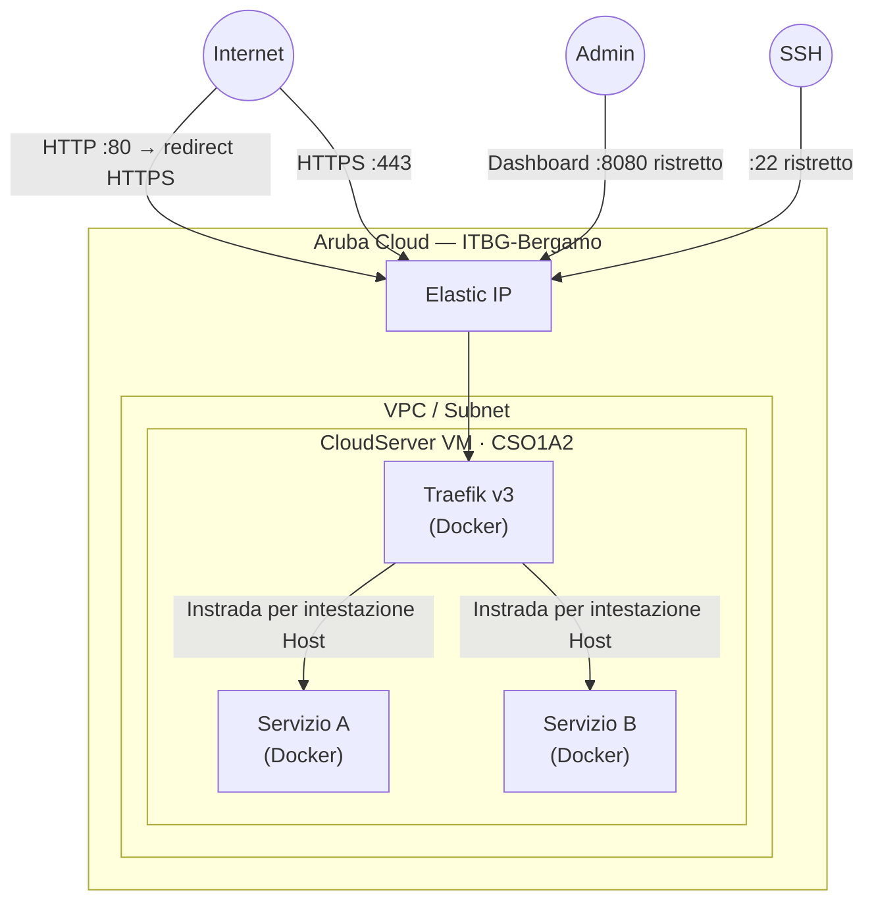

# Traefik su Aruba Cloud

Distribuisci [Traefik v3](https://traefik.io/traefik/) — un reverse proxy cloud-native con TLS Let's Encrypt automatico — su Aruba Cloud. Usalo come punto di ingresso HTTPS per qualsiasi altro servizio in esecuzione sulla stessa VM o nella stessa rete Docker.

> **Versione provider:** arubacloud/arubacloud `~> 0.5` | **Terraform:** ≥ 1.9

---

## Introduzione

Traefik scopre automaticamente i container Docker e instrada il traffico HTTPS verso di essi usando le label dei servizi. I certificati TLS vengono emessi e rinnovati da Let's Encrypt senza intervento manuale. Aggiungi qualsiasi container Docker alla rete `traefik-public` ed etichettalo — Traefik instrada il traffico automaticamente.

---

## Panoramica dell'architettura



---

## Infrastruttura creata

| Risorsa | Descrizione |
|---------|-------------|
| `arubacloud_cloudserver` | `traefik-prod-vm` (CSO1A2) |
| `arubacloud_blockstorage` | Disco di avvio 20 GB |
| `arubacloud_elasticip` | IP pubblico |
| `arubacloud_securitygroup` | Ingresso TCP 80/443/8080/22 |

---

## Costo mensile stimato

| Risorsa | Costo/mese stimato |
|---------|-------------------|
| VM CSO1A2 | ~€10 |
| Disco 20 GB | ~€3 |
| Elastic IP | ~€5 |
| **Totale** | **~€18/mese** |

---

## Variabili

### Obbligatorie

`arubacloud_client_id`, `arubacloud_client_secret`, `ssh_public_key`, `acme_email`

### Opzionali

| Variabile | Default | Descrizione |
|-----------|---------|-------------|
| `traefik_version` | `"v3.2"` | Tag immagine Docker |
| `enable_dashboard` | `true` | Abilita dashboard web sulla porta 8080 |
| `dashboard_cidr` | `"0.0.0.0/0"` | CIDR sorgente dashboard — **limita al tuo IP** |
| `ssh_cidr` | `"0.0.0.0/0"` | CIDR sorgente SSH — limita al tuo IP |

---

## Distribuzione

```bash
cd terraform-arubacloud-examples/traefik
cp terraform.tfvars.example terraform.tfvars
# Imposta acme_email in terraform.tfvars
terraform init && terraform apply
```

## Aggiunta di un servizio dietro Traefik

Connettiti via SSH alla VM e aggiungi un container Docker con le label Traefik:

```yaml
# In qualsiasi docker-compose.yml sulla stessa VM
services:
  myapp:
    image: nginx
    labels:
      - "traefik.enable=true"
      - "traefik.http.routers.myapp.rule=Host(`myapp.example.com`)"
      - "traefik.http.routers.myapp.entrypoints=websecure"
      - "traefik.http.routers.myapp.tls.certresolver=letsencrypt"
    networks:
      - traefik-public

networks:
  traefik-public:
    external: true
```

---

## Distruzione

```bash
terraform destroy
```

---

## Raccomandazioni di sicurezza

1. **Limita `dashboard_cidr`** — la dashboard mostra tutte le route e la configurazione. Restringi al tuo IP.
2. **Disabilita la dashboard in produzione** (`enable_dashboard = false`) se non la usi attivamente.
3. **Usa i middleware** per l'autenticazione: `basicAuth` o `forwardAuth` (con Keycloak/Authentik) davanti ai servizi.

---

## Risoluzione dei problemi

### Certificati non emessi

- Il record DNS A deve puntare all'Elastic IP prima della prima richiesta.
- Controlla i log Traefik: `ssh ubuntu@<IP> 'docker logs traefik --tail 100'`
- La porta 80 deve essere raggiungibile (Traefik usa la challenge HTTP-01).

### Dashboard non accessibile

```bash
docker ps  # Verifica che il container traefik sia in esecuzione
docker logs traefik
```

---

## Riferimenti

- [Documentazione Traefik](https://doc.traefik.io/traefik/)
- [Configurazione provider Docker](https://doc.traefik.io/traefik/providers/docker/)
- [Let's Encrypt con Traefik](https://doc.traefik.io/traefik/https/acme/)
