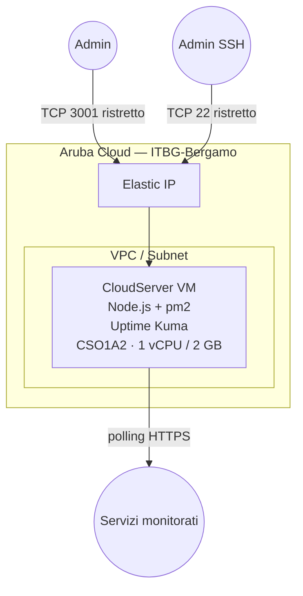

# Uptime Kuma su Aruba Cloud

Distribuisci [Uptime Kuma](https://github.com/louislam/uptime-kuma) — uno strumento di monitoraggio self-hosted e pagina di stato — su una VM Aruba Cloud minimale.

> **Versione provider:** arubacloud/arubacloud `~> 0.5` | **Terraform:** ≥ 1.9

---

## Introduzione

Uptime Kuma monitora siti web, API, porte TCP, record DNS e altro. Fornisce notifiche in tempo reale tramite Telegram, Slack, Discord, email e molti altri canali. Una pagina di stato pubblica può essere condivisa con i tuoi utenti.

Distribuiscilo su Aruba Cloud per monitorare tutti gli altri esempi Aruba Cloud dalla stessa regione.

---

## Panoramica dell'architettura



---

## Infrastruttura creata

| Risorsa | Descrizione |
|---------|-------------|
| `arubacloud_project` | `kuma-prod` |
| `arubacloud_cloudserver` | `kuma-prod-vm` (CSO1A2) |
| `arubacloud_blockstorage` | Disco di avvio 20 GB |
| `arubacloud_elasticip` | IP pubblico |
| `arubacloud_securitygroup` | TCP 3001 + SSH 22 ingresso |

---

## Dimensionamento VM

Una VM `CSO1A2` (1 vCPU / 2 GB) è sufficiente per centinaia di monitor. Scala verso l'alto solo se esegui molti controlli concorrenti con intervalli inferiori al secondo.

---

## Costo mensile stimato

| Risorsa | Costo/mese stimato |
|---------|-------------------|
| VM CSO1A2 | ~€10 |
| Disco 20 GB | ~€3 |
| Elastic IP | ~€5 |
| **Totale** | **~€18/mese** |

---

## Variabili

### Obbligatorie

`arubacloud_client_id`, `arubacloud_client_secret`, `ssh_public_key`

### Opzionali

| Variabile | Default | Descrizione |
|-----------|---------|-------------|
| `kuma_port` | `3001` | Porta interfaccia web |
| `admin_cidr` | `"0.0.0.0/0"` | CIDR per accesso interfaccia web — **limita al tuo IP** |
| `ssh_cidr` | `"0.0.0.0/0"` | CIDR per SSH — **limita al tuo IP** |
| `vm_flavor` | `"CSO1A2"` | VM più piccola disponibile |
| `vm_disk_size_gb` | `20` | Disco in GB |

---

## Distribuzione

```bash
cd terraform-arubacloud-examples/uptime-kuma
cp terraform.tfvars.example terraform.tfvars
terraform init && terraform apply
```

Dopo ~5 minuti:

```bash
terraform output app_url
# http://203.0.113.10:3001
```

Apri l'URL e crea il tuo account admin alla prima visita.

---

## Distruzione

```bash
terraform destroy
```

---

## Raccomandazioni di sicurezza

1. **Limita `admin_cidr` al tuo IP** — l'interfaccia web non ha limitazione della velocità sui tentativi di accesso.
2. **Aggiungi HTTPS** — metti Uptime Kuma dietro l'esempio Traefik per la terminazione TLS, o usa Caddy come reverse proxy sulla stessa VM.
3. **Abilita 2FA** in Uptime Kuma Impostazioni → Autenticazione a due fattori.

---

## Risoluzione dei problemi

### Interfaccia non si carica

```bash
ssh ubuntu@$(terraform output -raw public_ip)
sudo -u kuma pm2 status
sudo -u kuma pm2 logs uptime-kuma --lines 50
```

### Servizio non si avvia dopo il riavvio

```bash
sudo systemctl status pm2-kuma
sudo systemctl start pm2-kuma
```

---

## Riferimenti

- [GitHub Uptime Kuma](https://github.com/louislam/uptime-kuma)
- [Wiki Uptime Kuma](https://github.com/louislam/uptime-kuma/wiki)
