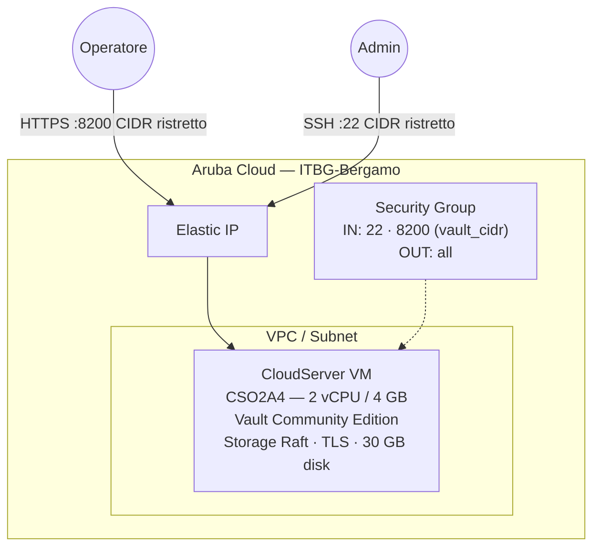

# HashiCorp Vault su Aruba Cloud

Distribuisci [HashiCorp Vault](https://www.vaultproject.io) Community Edition in modalità di produzione su Aruba Cloud tramite Terraform e cloud-init. Storage integrato Raft — nessun database esterno richiesto.

> **Versione provider:** arubacloud/arubacloud `~> 0.5` | **Terraform:** ≥ 1.9

---

## Introduzione

HashiCorp Vault è un sistema di gestione dei segreti e della cifratura basato sull'identità. Fornisce un'interfaccia unificata a qualsiasi segreto — chiavi API, password, certificati, chiavi di cifratura — garantendo un controllo degli accessi rigoroso e registrando un log di audit dettagliato. Questo esempio distribuisce Vault in **modalità server di produzione** con:

- **Storage integrato Raft** — il deposito di consenso integrato di Vault; non è richiesto alcun database esterno o cluster Consul
- **TLS sulla porta 8200** — viene generato un certificato autofirmato all'avvio; un `tls_san` opzionale aggiunge un nome DNS come Subject Alternative Name
- **Inizializzazione automatica** — `vault operator init` viene eseguito al primo avvio, salvando le chiavi di unseal e il token root in `/root/vault-init.json`
- **Unseal automatico** — 3 delle 5 chiavi Shamir di unseal vengono applicate dopo l'init così Vault è subito pronto
- Porta 8200 **limitata da `vault_cidr`** — non esporre mai Vault a `0.0.0.0/0` in produzione

> **Importante:** Questo esempio automatizza l'inizializzazione per comodità di avvio. In produzione, rimuovi immediatamente l'output init dal server e usa [Vault Auto-unseal](https://developer.hashicorp.com/vault/docs/concepts/seal#auto-unseal) con un KMS cloud.

---

## Panoramica dell'architettura



---

## Infrastruttura creata

| Risorsa | Pattern nome | Descrizione |
|---------|-------------|-------------|
| `arubacloud_project` | `vault-prod` | Contenitore progetto |
| `arubacloud_vpc` | `vault-prod-vpc` | Virtual Private Cloud |
| `arubacloud_subnet` | `vault-prod-subnet` | Subnet di base |
| `arubacloud_securitygroup` | `vault-prod-vm-sg` | Security group |
| `arubacloud_securityrule` | `vault-prod-vm-ssh` | Ingresso SSH (CIDR ristretto) |
| `arubacloud_securityrule` | `vault-prod-vm-vault` | API Vault + UI (porta 8200, CIDR ristretto) |
| `arubacloud_elasticip` | `vault-prod-vm-eip` | IP pubblico VM |
| `arubacloud_blockstorage` | `vault-prod-boot` | Disco di avvio 30 GB (Performance) |
| `arubacloud_keypair` | `vault-prod-keypair` | Chiave pubblica SSH |
| `arubacloud_cloudserver` | `vault-prod-vm` | CloudServer VM |

---

## Costo mensile stimato

> Prezzi approssimativi per ITBG-Bergamo, fatturazione oraria.

| Risorsa | Specifiche | Costo/mese stimato |
|---------|-----------|-------------------|
| CloudServer VM | CSO2A4 — 2 vCPU / 4 GB | ~€18 |
| Disco di avvio | 30 GB Performance | ~€4 |
| Elastic IP | — | ~€3 |
| **Totale** | | **~€25/mese** |

---

## Requisiti

- Terraform ≥ 1.9
- ArubaCloud Terraform Provider `~> 0.5`
- Un account ArubaCloud con credenziali API OAuth2
- Una coppia di chiavi SSH
- CLI `vault` installata localmente (opzionale, per interagire con Vault)

---

## Variabili

### Obbligatorie

| Variabile | Descrizione |
|-----------|-------------|
| `arubacloud_client_id` | Client ID OAuth2 ArubaCloud |
| `arubacloud_client_secret` | Client secret OAuth2 ArubaCloud |
| `ssh_public_key` | Contenuto della chiave pubblica SSH |

### Opzionali

| Variabile | Default | Descrizione |
|-----------|---------|-------------|
| `app_name` | `"vault"` | Nome breve usato in tutti i nomi delle risorse |
| `environment` | `"prod"` | Etichetta ambiente |
| `location` | `"ITBG-Bergamo"` | Regione ArubaCloud |
| `zone` | `"ITBG-1"` | Zona di disponibilità |
| `billing_period` | `"Hour"` | `"Hour"` o `"Month"` |
| `vm_flavor` | `"CSO2A4"` | Flavor CloudServer |
| `vm_image` | `"LU22-001"` | Immagine disco di avvio (Ubuntu 22.04 LTS) |
| `vm_disk_size_gb` | `30` | Dimensione disco di avvio in GB |
| `ssh_cidr` | `"0.0.0.0/0"` | CIDR per SSH — **limita al tuo IP** |
| `vault_cidr` | `"0.0.0.0/0"` | CIDR per API/UI Vault (porta 8200) — **limita al tuo IP** |
| `vault_version` | `"1.18.4"` | Versione Vault dal repo APT HashiCorp |
| `tls_san` | `""` | SAN DNS aggiuntivo per il certificato TLS autofirmato |

---

## Output

| Output | Descrizione |
|--------|-------------|
| `vault_url` | Endpoint API e UI Vault |
| `vm_public_ip` | Indirizzo IP pubblico della VM |
| `ssh_command` | Comando SSH per connettersi alla VM |
| `init_output_cmd` | Comando SSH per recuperare chiavi di unseal + token root |
| `env_hint` | Variabili d'ambiente `VAULT_ADDR` e `VAULT_SKIP_VERIFY` |

---

## Istruzioni di distribuzione

### 1. Clona e naviga

```bash
git clone https://github.com/arubacloud/terraform-arubacloud-examples.git
cd terraform-arubacloud-examples/vault
```

### 2. Configura le variabili

```bash
cp terraform.tfvars.example terraform.tfvars
```

**Limita sempre** `vault_cidr` al tuo IP prima di distribuire in produzione:

```hcl
vault_cidr = "203.0.113.42/32"
ssh_cidr   = "203.0.113.42/32"
```

### 3. Distribuisci

```bash
terraform init
terraform plan
terraform apply
```

Il bootstrap richiede circa **3–5 minuti**.

### 4. Imposta le variabili d'ambiente

```bash
eval "$(terraform output -raw env_hint)"
# Equivalente a:
# export VAULT_ADDR=https://<IP>:8200
# export VAULT_SKIP_VERIFY=true
```

### 5. Recupera l'output di init

```bash
terraform output -raw init_output_cmd | bash | tee vault-init-KEEP-SAFE.json
```

> **Avviso:** `/root/vault-init.json` sul server contiene le tue chiavi Shamir di unseal e il token root in testo chiaro. Copialo in una posizione offline sicura ed elimina la copia dal server:

```bash
ssh ubuntu@$(terraform output -raw vm_public_ip) \
  'sudo shred -u /root/vault-init.json'
```

### 6. Verifica Vault

```bash
vault status
vault login   # usa il root_token da vault-init.json
vault secrets list
```

### 7. Accedi all'interfaccia

Apri `$(terraform output -raw vault_url)/ui` nel browser e accedi con il token root. Accetta l'avviso TLS (certificato autofirmato).

---

## Istruzioni di distruzione

```bash
terraform destroy
```

Tutte le risorse e i dati Vault vengono eliminati definitivamente.

---

## Raccomandazioni di sicurezza

1. **Limita immediatamente `vault_cidr`.** Vault custodisce i tuoi segreti — non lasciare mai la porta 8200 aperta a `0.0.0.0/0`.

2. **Rimuovi l'output init dal server.** Dopo aver copiato `vault-init.json` in una posizione sicura, distruggilo sulla VM (`sudo shred -u /root/vault-init.json`).

3. **Sostituisci il token root.** Dopo la configurazione iniziale, crea un token con scope appropriato, revoca il token root e archivia le chiavi di unseal in posizioni sicure separate (gestore password, busta sigillata, HSM).

4. **Abilita il logging di audit.** Dopo il login: `vault audit enable file file_path=/var/log/vault/audit.log`.

5. **Usa Auto-unseal in produzione.** L'unseal manuale richiede intervento umano dopo ogni riavvio. Integra con un KMS cloud (AWS KMS, GCP KMS, Azure Key Vault) per l'unseal automatico. Vedi [la documentazione Vault Auto-unseal](https://developer.hashicorp.com/vault/docs/concepts/seal#auto-unseal).

6. **Abilita la verifica TLS.** Sostituisci il certificato autofirmato con uno firmato da una CA attendibile, poi rimuovi `VAULT_SKIP_VERIFY=true`.

---

## Considerazioni sull'aggiornamento

### Aggiornamento versione Vault

```bash
ssh ubuntu@$(terraform output -raw vm_public_ip)
sudo apt-get update
sudo apt-get install --only-upgrade vault
sudo systemctl restart vault
# Ri-unseal se necessario:
vault operator unseal <key1>
vault operator unseal <key2>
vault operator unseal <key3>
```

Consulta la [guida all'aggiornamento Vault](https://developer.hashicorp.com/vault/docs/upgrading) prima di aggiornare tra versioni principali.

---

## Risoluzione dei problemi

### Vault è sealed dopo un riavvio

L'unseal manuale è necessario ad ogni riavvio (a meno che non sia configurato Auto-unseal):

```bash
eval "$(terraform output -raw env_hint)"
vault operator unseal <key1>
vault operator unseal <key2>
vault operator unseal <key3>
```

### Errori di certificato TLS

Il certificato autofirmato causa avvisi nel browser e errori CLI. O:

- Imposta `VAULT_SKIP_VERIFY=true` per i test
- Fidati del certificato: `sudo cp /etc/vault.d/tls/vault.crt /usr/local/share/ca-certificates/ && sudo update-ca-certificates`
- Sostituisci con un certificato valido firmato da una CA attendibile

### cloud-init non si è completato

```bash
ssh ubuntu@$(terraform output -raw vm_public_ip)
sudo tail -100 /var/log/cloud-init-output.log
sudo systemctl status vault
sudo journalctl -u vault -n 30
```

---

## Riferimenti

- [Documentazione Vault](https://developer.hashicorp.com/vault/docs)
- [Storage Raft Vault](https://developer.hashicorp.com/vault/docs/configuration/storage/raft)
- [Hardening produzione Vault](https://developer.hashicorp.com/vault/tutorials/operations/production-hardening)
- [Vault Auto-unseal](https://developer.hashicorp.com/vault/docs/concepts/seal#auto-unseal)
- [ArubaCloud Terraform Provider](https://registry.terraform.io/providers/arubacloud/arubacloud/latest/docs)
