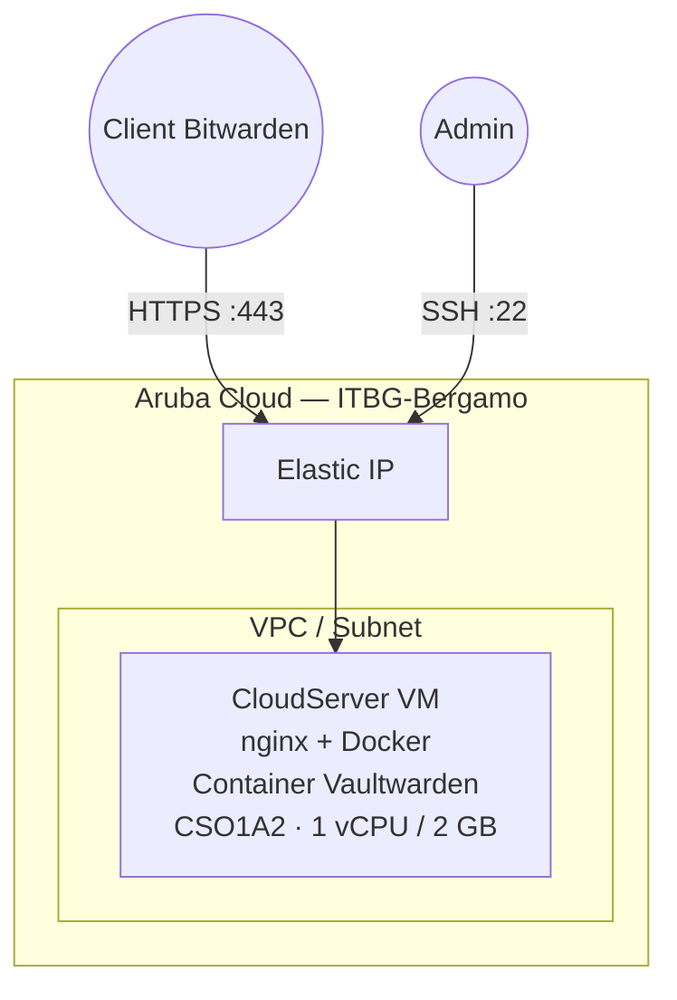

# Vaultwarden su Aruba Cloud

Distribuisci [Vaultwarden](https://github.com/dani-garcia/vaultwarden) — un server non ufficiale compatibile con Bitwarden — per la gestione self-hosted delle password su Aruba Cloud.

> **Versione provider:** arubacloud/arubacloud `~> 0.5` | **Terraform:** ≥ 1.9

---

## Introduzione

Vaultwarden è un'implementazione Rust leggera dell'API server Bitwarden, compatibile con tutti i client Bitwarden ufficiali (desktop, mobile, estensione browser). Le tue password sono archiviate interamente sulla tua VM Aruba Cloud — non su infrastrutture di terze parti.

> **HTTPS è richiesto** per i client Bitwarden mobile. Imposta la variabile `domain` e punta il tuo DNS prima di distribuire.

---

## Panoramica dell'architettura



---

## Infrastruttura creata

| Risorsa | Descrizione |
|---------|-------------|
| `arubacloud_cloudserver` | `vw-prod-vm` — nginx + Vaultwarden in Docker |
| `arubacloud_blockstorage` | Disco di avvio 20 GB |
| `arubacloud_elasticip` | IP pubblico |
| `arubacloud_securitygroup` | Ingresso TCP 80/443/22 |

---

## Dimensionamento VM

`CSO1A2` (1 vCPU / 2 GB) gestisce comodamente una famiglia o un piccolo team. Vaultwarden è estremamente leggero.

---

## Costo mensile stimato

| Risorsa | Costo/mese stimato |
|---------|-------------------|
| VM CSO1A2 | ~€10 |
| Disco 20 GB | ~€3 |
| Elastic IP | ~€5 |
| **Totale** | **~€18/mese** |

---

## Variabili

### Obbligatorie

`arubacloud_client_id`, `arubacloud_client_secret`, `ssh_public_key`

### Opzionali

| Variabile | Default | Descrizione |
|-----------|---------|-------------|
| `domain` | `""` | Dominio per HTTPS — **richiesto per i client mobile** |
| `admin_email` | `""` | Email per Let's Encrypt (richiesta quando `domain` è impostato) |
| `admin_token` | `""` | Token per il pannello `/admin`; lascia vuoto per disabilitare |
| `vaultwarden_version` | `"latest"` | Tag immagine Docker |
| `ssh_cidr` | `"0.0.0.0/0"` | CIDR sorgente SSH — limita al tuo IP |
| `vm_flavor` | `"CSO1A2"` | Dimensione VM |

---

## Distribuzione

```bash
cd terraform-arubacloud-examples/vaultwarden
cp terraform.tfvars.example terraform.tfvars
# Imposta domain, admin_email, admin_token in terraform.tfvars
# Crea record DNS A: domain → (sarà l'Elastic IP)
terraform init && terraform apply
```

Apri `terraform output app_url` nel browser e crea il tuo account.

---

## Distruzione

```bash
terraform destroy
```

---

## Raccomandazioni di sicurezza

1. **Usa sempre HTTPS** — imposta `domain` e configura il DNS prima della distribuzione. I client mobile rifiutano HTTP.
2. **Disabilita il pannello admin** se non ne hai bisogno (lascia `admin_token` vuoto). Il pannello admin fornisce accesso completo al server.
3. **Fai backup di `/opt/vaultwarden/data`** regolarmente — contiene il tuo database del vault cifrato.
4. **Blocca la versione dell'immagine** — imposta `vaultwarden_version = "1.32.0"` invece di `latest` in produzione.

---

## Backup e ripristino

```bash
# Backup (esegui sul server)
sudo tar -czf /tmp/vaultwarden-backup-$(date +%Y%m%d).tar.gz /opt/vaultwarden/data
scp ubuntu@<IP>:/tmp/vaultwarden-backup-*.tar.gz ./

# Ripristino
scp ./vaultwarden-backup-*.tar.gz ubuntu@<IP>:/tmp/
ssh ubuntu@<IP> 'docker stop vaultwarden && sudo tar -xzf /tmp/vaultwarden-backup-*.tar.gz -C / && docker start vaultwarden'
```

---

## Risoluzione dei problemi

### Il client mobile dice "Certificato SSL non valido"

Il dominio deve risolvere all'IP del server **prima** di `terraform apply`. Controlla la propagazione DNS e ri-esegui l'apply (Certbot riproverà).

### Impossibile accedere dal mobile dopo una distribuzione solo HTTP

I client mobile richiedono HTTPS. Imposta la variabile `domain` e ri-applica.

### Container non in esecuzione

```bash
ssh ubuntu@$(terraform output -raw public_ip)
docker ps -a
docker logs vaultwarden
```

---

## Riferimenti

- [Wiki Vaultwarden](https://github.com/dani-garcia/vaultwarden/wiki)
- [Client Bitwarden](https://bitwarden.com/download/)
