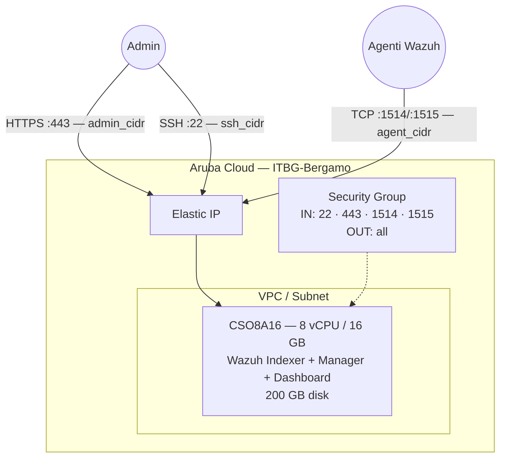

# Wazuh su Aruba Cloud

Distribuisci [Wazuh](https://wazuh.com) — una piattaforma open-source SIEM, XDR e CSPM — su Aruba Cloud tramite Terraform e cloud-init. Questo esempio distribuisce un **deployment all-in-one single-node** usando lo script di installazione rapida ufficiale di Wazuh.

> **Versione provider:** arubacloud/arubacloud `~> 0.5` | **Terraform:** ≥ 1.9

---

## Introduzione

Wazuh è una piattaforma di sicurezza unificata che combina un sistema SIEM (Security Information and Event Management), XDR (Extended Detection and Response) e CSPM (Cloud Security Posture Management) in un'unica soluzione. Il deployment all-in-one include:

- **Wazuh Indexer** — motore di indicizzazione log e alerting basato su OpenSearch
- **Wazuh Manager** — gestione agenti, correlazione regole e rilevamento minacce
- **Wazuh Dashboard** — interfaccia web basata su Kibana per alert, conformità e investigazione

> **Requisiti di risorse:** Wazuh è intensivo in risorse. Il minimo per un deployment all-in-one utilizzabile è **8 vCPU / 16 GB RAM** e **200 GB di disco**. Non tentare di distribuire su una VM più piccola — l'indexer OpenSearch andrà in OOM e fallirà.
>
> **Tempo di bootstrap:** L'installer scarica e configura più componenti. Aspetta **20–30 minuti** prima che la dashboard sia accessibile.

---

## Panoramica dell'architettura



---

## Infrastruttura creata

| Risorsa | Pattern nome | Descrizione |
|---------|-------------|-------------|
| `arubacloud_project` | `wazuh-prod` | Contenitore progetto |
| `arubacloud_vpc` | `wazuh-prod-vpc` | Virtual Private Cloud |
| `arubacloud_subnet` | `wazuh-prod-subnet` | Subnet di base |
| `arubacloud_securitygroup` | `wazuh-prod-vm-sg` | Security group |
| `arubacloud_securityrule` | `wazuh-prod-vm-ssh` | Ingresso SSH |
| `arubacloud_securityrule` | `wazuh-prod-vm-dashboard` | Dashboard HTTPS TCP 443 |
| `arubacloud_securityrule` | `wazuh-prod-vm-agent-events` | Eventi agente TCP 1514 |
| `arubacloud_securityrule` | `wazuh-prod-vm-agent-enroll` | Registrazione agente TCP 1515 |
| `arubacloud_elasticip` | `wazuh-prod-vm-eip` | IP pubblico VM |
| `arubacloud_blockstorage` | `wazuh-prod-boot` | Disco di avvio 200 GB (Performance) |
| `arubacloud_keypair` | `wazuh-prod-keypair` | Chiave pubblica SSH |
| `arubacloud_cloudserver` | `wazuh-prod-vm` | CloudServer VM |

---

## Costo mensile stimato

| Risorsa | Specifiche | Costo/mese stimato |
|---------|-----------|-------------------|
| CloudServer VM | CSO8A16 — 8 vCPU / 16 GB | ~€95 |
| Disco di avvio | 200 GB Performance | ~€30 |
| Elastic IP | — | ~€3 |
| **Totale** | | **~€128/mese** |

---

## Requisiti

- Terraform ≥ 1.9
- ArubaCloud Terraform Provider `~> 0.5`
- Un account ArubaCloud con credenziali API OAuth2
- Una coppia di chiavi SSH

---

## Variabili

### Obbligatorie

| Variabile | Descrizione |
|-----------|-------------|
| `arubacloud_client_id` | Client ID OAuth2 ArubaCloud |
| `arubacloud_client_secret` | Client secret OAuth2 ArubaCloud |
| `ssh_public_key` | Contenuto della chiave pubblica SSH |
| `admin_password` | Password admin dashboard Wazuh (min 8 caratteri, deve includere maiusc, minusc, cifra, speciale) |

### Opzionali

| Variabile | Default | Descrizione |
|-----------|---------|-------------|
| `app_name` | `"wazuh"` | Nome breve usato in tutti i nomi delle risorse |
| `environment` | `"prod"` | Etichetta ambiente |
| `location` | `"ITBG-Bergamo"` | Regione ArubaCloud |
| `zone` | `"ITBG-1"` | Zona di disponibilità |
| `billing_period` | `"Hour"` | `"Hour"` o `"Month"` |
| `vm_flavor` | `"CSO8A16"` | Flavor CloudServer (min 8 vCPU / 16 GB) |
| `vm_image` | `"LU22-001"` | Immagine disco di avvio (Ubuntu 22.04 LTS) |
| `vm_disk_size_gb` | `200` | Dimensione disco di avvio in GB (min 50 GB) |
| `ssh_cidr` | `"0.0.0.0/0"` | CIDR per SSH — limita in produzione |
| `admin_cidr` | `"0.0.0.0/0"` | CIDR per dashboard HTTPS — **limita sempre** |
| `agent_cidr` | `"0.0.0.0/0"` | CIDR per porte agente 1514/1515 |

---

## Output

| Output | Descrizione |
|--------|-------------|
| `dashboard_url` | URL HTTPS dashboard Wazuh |
| `vm_public_ip` | Indirizzo IP pubblico della VM |
| `ssh_command` | Comando SSH per connettersi alla VM |
| `agent_manager_ip` | IP del manager da configurare in `ossec.conf` dell'agente |

---

## Istruzioni di distribuzione

### 1. Clona e naviga

```bash
git clone https://github.com/arubacloud/terraform-arubacloud-examples.git
cd terraform-arubacloud-examples/wazuh
```

### 2. Configura le variabili

```bash
cp terraform.tfvars.example terraform.tfvars
```

Imposta credenziali, una password admin robusta e limita i CIDR:

```hcl
admin_password = "Ch@ngeMe2024!"
admin_cidr     = "203.0.113.42/32"
agent_cidr     = "10.0.0.0/8"
ssh_cidr       = "203.0.113.42/32"
```

### 3. Distribuisci

```bash
terraform init
terraform plan
terraform apply
```

> `terraform apply` si completa in ~2 minuti (VM distribuita). Il bootstrap Wazuh continua in background per **20–30 minuti**. Monitora il progresso:
>
> ```bash
> ssh ubuntu@$(terraform output -raw vm_public_ip)
> sudo tail -f /var/log/wazuh-install.log
> ```

### 4. Accedi alla dashboard

```bash
terraform output dashboard_url
```

Accedi con `admin` / `admin_password`. Accetta l'avviso del certificato autofirmato (o installa un certificato attendibile in seguito).

### 5. Installa gli agenti sugli host monitorati

Su ogni host che vuoi monitorare:

```bash
curl -s https://packages.wazuh.com/key/GPG-KEY-WAZUH | apt-key add -
echo "deb https://packages.wazuh.com/4.x/apt/ stable main" \
  | tee /etc/apt/sources.list.d/wazuh.list
apt-get update && apt-get install -y wazuh-agent

# Configura l'indirizzo del manager
WAZUH_MANAGER="$(terraform output -raw agent_manager_ip)" \
  systemctl start wazuh-agent
systemctl enable wazuh-agent
```

---

## Raccomandazioni di sicurezza

1. **Limita sempre `admin_cidr`** al tuo IP di gestione. La dashboard Wazuh contiene i dati completi degli eventi di sicurezza per la tua infrastruttura.

2. **Limita `agent_cidr`** al CIDR della tua infrastruttura monitorata, non `0.0.0.0/0`. Questo impedisce la registrazione di agenti arbitrari.

3. **Sostituisci il certificato autofirmato.** L'installazione rapida genera un certificato autofirmato. Per la produzione, usa un certificato appropriato — tramite Let's Encrypt (richiede un dominio) o la tua CA.

---

## Risoluzione dei problemi

### Dashboard non si carica dopo 30 minuti

```bash
ssh ubuntu@$(terraform output -raw vm_public_ip)
sudo tail -50 /var/log/wazuh-install.log
sudo systemctl status wazuh-indexer wazuh-manager wazuh-dashboard
```

La causa più comune è RAM insufficiente — verifica che la VM abbia almeno 16 GB e che OpenSearch non venga terminato per OOM:

```bash
sudo journalctl -u wazuh-indexer -n 50
dmesg | grep -i "killed process"
```

### Login fallisce dopo la distribuzione

Il cambio password potrebbe aver fallito. Controlla il log:

```bash
sudo cat /var/log/wazuh-password-change.log
```

Se necessario, connettiti via SSH alla VM e riesegui manualmente lo strumento per le password:

```bash
sudo bash /root/wazuh-install-files/wazuh-passwords-tool.sh \
  -u admin -p "YourNewPassword" -A
sudo systemctl restart wazuh-indexer wazuh-manager wazuh-dashboard
```

---

## Riferimenti

- [Documentazione Wazuh](https://documentation.wazuh.com)
- [Guida rapida Wazuh](https://documentation.wazuh.com/current/quickstart.html)
- [Installazione agente Wazuh](https://documentation.wazuh.com/current/installation-guide/wazuh-agent/index.html)
- [ArubaCloud Terraform Provider](https://registry.terraform.io/providers/arubacloud/arubacloud/latest/docs)
