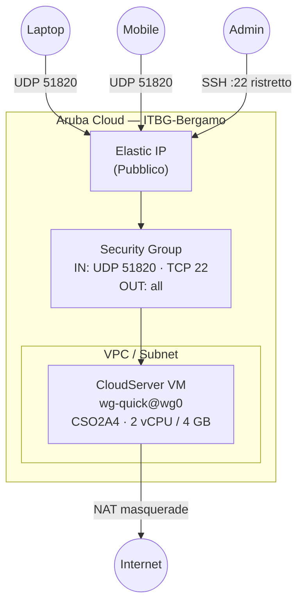

# WireGuard VPN su Aruba Cloud

Distribuisci un server VPN [WireGuard](https://www.wireguard.com/) production-ready su Aruba Cloud. Tutta la configurazione è gestita da cloud-init — nessun SSH manuale richiesto dopo la distribuzione.

> **Versione provider:** arubacloud/arubacloud `~> 0.5` | **Terraform:** ≥ 1.9

---

## Introduzione

WireGuard è un protocollo VPN moderno e ad alte prestazioni integrato nel kernel Linux. È più semplice, veloce e sicuro di OpenVPN o IPsec. Questo esempio distribuisce un server WireGuard a cui i tuoi dispositivi possono connettersi per l'accesso a internet cifrato o il tunneling di rete privata.

Casi d'uso comuni:

- Accesso remoto sicuro alle tue VM Aruba Cloud senza esporre porte aggiuntive
- Instrada tutto il traffico del dispositivo attraverso un IP Aruba Cloud affidabile
- Accesso split-tunnel alle risorse VPC private

---

## Panoramica dell'architettura

Una singola CloudServer VM esegue il servizio systemd `wg-quick@wg0`. Le chiavi del server WireGuard vengono generate al primo avvio da cloud-init. I client si connettono tramite UDP 51820. SSH è limitato al tuo IP admin; non vengono aperte porte HTTP/HTTPS.



---

## Infrastruttura creata

| Risorsa | Pattern nome | Descrizione |
|---------|-------------|-------------|
| `arubacloud_project` | `wg-prod` | Contenitore progetto |
| `arubacloud_vpc` | `wg-prod-vpc` | Virtual Private Cloud |
| `arubacloud_subnet` | `wg-prod-subnet` | Subnet di base |
| `arubacloud_securitygroup` | `wg-prod-vm-sg` | Security group VM |
| `arubacloud_securityrule` | `wg-prod-vm-ssh` | Ingresso SSH (CIDR admin) |
| `arubacloud_securityrule` | `wg-prod-wg-udp` | Ingresso UDP WireGuard |
| `arubacloud_elasticip` | `wg-prod-vm-eip` | IP pubblico VM |
| `arubacloud_blockstorage` | `wg-prod-boot` | Disco di avvio 20 GB |
| `arubacloud_keypair` | `wg-prod-keypair` | Chiave pubblica SSH |
| `arubacloud_cloudserver` | `wg-prod-vm` | VM WireGuard |

---

## Raccomandazione dimensionamento VM

| Caso d'uso | vCPU | RAM | Disco | Flavor |
|-----------|------|-----|-------|--------|
| VPN personale | 1–2 | 2–4 GB | 20 GB | `CSO2A4` *(default)* |
| VPN team (10–50 utenti) | 2 | 4 GB | 20 GB | `CSO2A4` |
| Alta throughput | 4 | 8 GB | 20 GB | `CSO4A8` |

WireGuard è estremamente efficiente in termini di CPU — una VM `CSO2A4` gestisce comodamente 50+ client simultanei.

---

## Costo mensile stimato

| Risorsa | Specifiche | Costo/mese stimato |
|---------|-----------|-------------------|
| CloudServer VM | CSO2A4 — 2 vCPU / 4 GB | ~€20 |
| Disco di avvio | 20 GB Performance | ~€3 |
| Elastic IP | — | ~€5 |
| **Totale** | | **~€28/mese** |

---

## Requisiti

- Terraform ≥ 1.9
- ArubaCloud Terraform Provider `~> 0.5`
- Account ArubaCloud con credenziali OAuth2
- Una coppia di chiavi SSH

---

## Variabili

### Obbligatorie

| Variabile | Descrizione |
|-----------|-------------|
| `arubacloud_client_id` | Client ID OAuth2 ArubaCloud |
| `arubacloud_client_secret` | Client secret OAuth2 ArubaCloud |
| `ssh_public_key` | Contenuto della chiave pubblica SSH |

### Opzionali

| Variabile | Default | Descrizione |
|-----------|---------|-------------|
| `app_name` | `"wg"` | Nome breve per i nomi delle risorse |
| `environment` | `"prod"` | Etichetta ambiente |
| `location` | `"ITBG-Bergamo"` | Regione ArubaCloud |
| `zone` | `"ITBG-1"` | Zona di disponibilità |
| `vm_flavor` | `"CSO2A4"` | Flavor CloudServer |
| `vm_disk_size_gb` | `20` | Dimensione disco di avvio in GB |
| `ssh_cidr` | `"0.0.0.0/0"` | CIDR per SSH — **limita al tuo IP** |
| `vpn_port` | `51820` | Porta UDP WireGuard |
| `vpn_server_address` | `"10.8.0.1/24"` | Indirizzo interfaccia VPN del server |
| `dns_servers` | `["1.1.1.1","1.0.0.1"]` | DNS inviato ai client |
| `billing_period` | `"Hour"` | `"Hour"` o `"Month"` |

---

## Istruzioni di distribuzione

### 1. Clona e naviga

```bash
git clone https://github.com/arubacloud/terraform-arubacloud-examples.git
cd terraform-arubacloud-examples/wireguard
```

### 2. Configura le variabili

```bash
cp terraform.tfvars.example terraform.tfvars
# Modifica terraform.tfvars
```

### 3. Distribuisci

```bash
terraform init
terraform plan
terraform apply
```

### 4. Recupera la chiave pubblica del server

Dopo la distribuzione, ottieni la chiave pubblica del server (necessaria per configurare i client):

```bash
terraform output -raw get_server_pubkey_command | bash
# Output di esempio: 8Zn3...abc=
```

### 5. Configura il tuo client

Genera una coppia di chiavi client sul tuo dispositivo:

```bash
wg genkey | tee client.key | wg pubkey > client.pub
```

Ottieni il template di configurazione client da Terraform:

```bash
terraform output client_config_template
```

Sostituisci `<CLIENT_PRIVATE_KEY>` con il contenuto di `client.key` e `<SERVER_PUBKEY>` con la chiave pubblica del server.

### 6. Aggiungi un peer al server

Connettiti via SSH al server e aggiungi la chiave pubblica del tuo client:

```bash
ssh ubuntu@$(terraform output -raw server_public_ip)
sudo wg set wg0 peer <CLIENT_PUBKEY> allowed-ips 10.8.0.2/32
sudo wg-quick save wg0
```

---

## Istruzioni di distruzione

```bash
terraform destroy
```

---

## Raccomandazioni di sicurezza

1. **Limita SSH al tuo IP.** Imposta `ssh_cidr = "tuo.ip/32"`. La porta UDP WireGuard dovrebbe essere aperta a tutti (i client si connettono da IP variabili).
2. **Ruota le chiavi del server se compromesse.** Connettiti via SSH, esegui `wg genkey | tee /etc/wireguard/server.key | wg pubkey > /etc/wireguard/server.pub`, poi riavvia il servizio. Tutti i client dovranno aggiornare la `PublicKey` del peer.
3. **Usa indirizzi VPN diversi per ogni client.** Assegna IP univoci (`10.8.0.2/32`, `10.8.0.3/32`, ...) così puoi revocare i singoli client rimuovendo la loro voce peer.
4. **Mantieni il kernel aggiornato.** WireGuard è un modulo kernel — `apt-get upgrade` lo mantiene aggiornato.

---

## Considerazioni sull'aggiornamento

WireGuard stesso fa parte del kernel Linux — non sono necessari aggiornamenti binari. Per aggiornare il sistema operativo:

```bash
ssh ubuntu@$(terraform output -raw server_public_ip)
sudo apt-get update && sudo apt-get upgrade -y
sudo reboot  # riconnettiti dopo ~30 secondi
```

---

## Screenshot

> **Segnaposto screenshot.** Aggiungi uno screenshot dell'output di `sudo wg show` che conferma i peer attivi.

---

## Risoluzione dei problemi

### Impossibile connettersi dal client

1. Controlla il firewall: `sudo wg show` — se non ci sono peer, hai dimenticato di aggiungere il peer con `wg set wg0 peer ...`.
2. Controlla che la porta UDP sia aperta: da un'altra macchina, `nc -u <SERVER_IP> 51820`.
3. Controlla il forwarding IP: `cat /proc/sys/net/ipv4/ip_forward` dovrebbe restituire `1`.
4. Controlla che il servizio sia in esecuzione: `sudo systemctl status wg-quick@wg0`.

### Le chiavi non sono state generate (cloud-init fallito)

```bash
ssh ubuntu@<SERVER_IP>
sudo tail -100 /var/log/cloud-init-output.log
```

Se `/etc/wireguard/server.key` manca, riesegui il setup manualmente:

```bash
sudo wg genkey | sudo tee /etc/wireguard/server.key | sudo wg pubkey | sudo tee /etc/wireguard/server.pub
sudo chmod 600 /etc/wireguard/server.key
sudo systemctl restart wg-quick@wg0
```

---

## Riferimenti

- [Guida rapida WireGuard](https://www.wireguard.com/quickstart/)
- [Man page WireGuard](https://man7.org/linux/man-pages/man8/wg.8.html)
- [ArubaCloud Terraform Provider](https://registry.terraform.io/providers/arubacloud/arubacloud/latest/docs)
