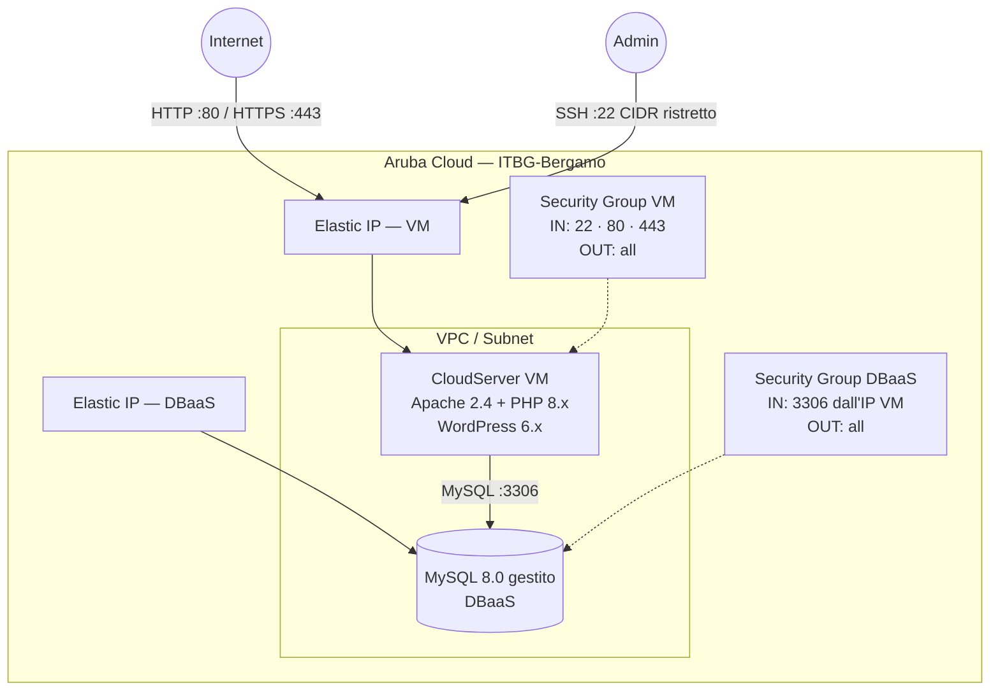

# WordPress su Aruba Cloud

Distribuisci un sito [WordPress](https://wordpress.org) production-ready su Aruba Cloud tramite Terraform e cloud-init. Nessuna configurazione manuale del server richiesta.

> **Versione provider:** arubacloud/arubacloud `~> 0.5` | **Terraform:** ≥ 1.9

---

## Introduzione

WordPress è il sistema di gestione dei contenuti più popolare al mondo, che alimenta oltre il 40% di tutti i siti web. Questo esempio distribuisce uno stack WordPress completo su Aruba Cloud con:

- Una **CloudServer VM** con Apache 2.4 e PHP 8.x, completamente avviata da cloud-init
- Un'istanza **DBaaS MySQL 8.0 gestito** — nessun server database autogestito
- Una **VPC, subnet e security group** dedicati tramite il modulo network condiviso
- **Elastic IP** per VM e DBaaS
- **HTTPS Let's Encrypt** opzionale quando viene fornito un dominio personalizzato

---

## Panoramica dell'architettura

La VM ospita WordPress dietro Apache. Il database è eseguito su un'istanza DBaaS gestita separata nella stessa VPC. Il security group MySQL consente connessioni in ingresso solo dall'Elastic IP della VM.



---

## Infrastruttura creata

| Risorsa | Pattern nome | Descrizione |
|---------|-------------|-------------|
| `arubacloud_project` | `wp-prod` | Contenitore progetto |
| `arubacloud_vpc` | `wp-prod-vpc` | Virtual Private Cloud |
| `arubacloud_subnet` | `wp-prod-subnet` | Subnet di base |
| `arubacloud_securitygroup` | `wp-prod-vm-sg` | Security group VM |
| `arubacloud_securitygroup` | `wp-prod-db-sg` | Security group DBaaS |
| `arubacloud_securityrule` | `wp-prod-vm-ssh` | Ingresso SSH (CIDR ristretto) |
| `arubacloud_securityrule` | `wp-prod-vm-http` | Ingresso HTTP (0.0.0.0/0) |
| `arubacloud_securityrule` | `wp-prod-vm-https` | Ingresso HTTPS (0.0.0.0/0) |
| `arubacloud_securityrule` | `wp-prod-db-mysql` | Ingresso MySQL solo dall'IP VM |
| `arubacloud_elasticip` | `wp-prod-vm-eip` | IP pubblico VM |
| `arubacloud_elasticip` | `wp-prod-db-eip` | IP pubblico DBaaS |
| `arubacloud_blockstorage` | `wp-prod-boot` | Disco di avvio 40 GB (Performance) |
| `arubacloud_keypair` | `wp-prod-keypair` | Chiave pubblica SSH |
| `arubacloud_dbaas` | `wp-prod-dbaas` | MySQL 8.0 gestito |
| `arubacloud_database` | `wordpress` | Database logico WordPress |
| `arubacloud_dbaasuser` | `wordpress` | Utente applicativo MySQL |
| `arubacloud_databasegrant` | — | Grant liteadmin |
| `arubacloud_cloudserver` | `wp-prod-vm` | CloudServer VM |

---

## Raccomandazione dimensionamento VM

| Carico di lavoro | vCPU | RAM | Disco | Flavor |
|-----------------|------|-----|-------|--------|
| Sviluppo / test | 2 | 4 GB | 20 GB | `CSO2A4` |
| Sito piccolo (< 5k visite/giorno) | 4 | 8 GB | 40 GB | `CSO4A8` *(default)* |
| Sito medio (< 50k visite/giorno) | 8 | 16 GB | 80 GB | `CSO8A16` |
| Alto traffico | — | — | — | Aggiungi un livello di cache (Redis, Varnish) prima di scalare |

Per il DBaaS: `DBO2A8` (2 vCPU / 8 GB) copre la maggior parte dei siti WordPress. Aggiungi repliche in lettura per carichi di lettura elevati.

---

## Costo mensile stimato

> Prezzi approssimativi per ITBG-Bergamo, fatturazione oraria. I prezzi effettivi possono variare — verifica nella [console ArubaCloud](https://www.cloud.it).

| Risorsa | Specifiche | Costo/mese stimato |
|---------|-----------|-------------------|
| CloudServer VM | CSO4A8 — 4 vCPU / 8 GB | ~€35 |
| Disco di avvio | 40 GB Performance | ~€5 |
| MySQL gestito | DBO2A8 — 2 vCPU / 8 GB | ~€40 |
| Storage DBaaS | 20 GB | ~€3 |
| Elastic IP × 2 | — | ~€10 |
| **Totale** | | **~€93/mese** |

---

## Requisiti

- Terraform ≥ 1.9
- ArubaCloud Terraform Provider `~> 0.5`
- Un account ArubaCloud con credenziali API OAuth2
- Una coppia di chiavi SSH

---

## Variabili

### Obbligatorie

| Variabile | Descrizione |
|-----------|-------------|
| `arubacloud_client_id` | Client ID OAuth2 ArubaCloud |
| `arubacloud_client_secret` | Client secret OAuth2 ArubaCloud |
| `ssh_public_key` | Contenuto della chiave pubblica SSH (es. contenuto di `~/.ssh/id_ed25519.pub`) |
| `db_password` | Password MySQL per l'utente WordPress (min 16 caratteri, no newline) |
| `wp_admin_password` | Password admin WordPress (min 16 caratteri, no newline) |
| `wp_admin_email` | Email admin WordPress (usata anche per la registrazione Let's Encrypt) |

### Opzionali

| Variabile | Default | Descrizione |
|-----------|---------|-------------|
| `app_name` | `"wp"` | Nome breve usato in tutti i nomi delle risorse |
| `environment` | `"prod"` | Etichetta ambiente (`prod`, `staging`, `dev`) |
| `location` | `"ITBG-Bergamo"` | Regione ArubaCloud |
| `zone` | `"ITBG-1"` | Zona di disponibilità |
| `billing_period` | `"Hour"` | `"Hour"` o `"Month"` |
| `vm_flavor` | `"CSO4A8"` | Flavor CloudServer |
| `vm_image` | `"LU22-001"` | Immagine disco di avvio (Ubuntu 22.04 LTS) |
| `vm_disk_size_gb` | `40` | Dimensione disco di avvio in GB |
| `ssh_cidr` | `"0.0.0.0/0"` | CIDR per accesso SSH — **limita al tuo IP in produzione** |
| `dbaas_flavor` | `"DBO2A8"` | Flavor DBaaS |
| `db_storage_gb` | `20` | Storage iniziale DBaaS in GB |
| `wp_admin_user` | `"admin"` | Nome utente admin WordPress |
| `wp_title` | `"My WordPress Site"` | Titolo del sito |
| `domain` | `""` | Dominio personalizzato per HTTPS — lascia vuoto per usare l'Elastic IP |

---

## Istruzioni di distribuzione

### 1. Clona e naviga

```bash
git clone https://github.com/arubacloud/terraform-arubacloud-examples.git
cd terraform-arubacloud-examples/wordpress
```

### 2. Configura le variabili

```bash
cp terraform.tfvars.example terraform.tfvars
```

Modifica `terraform.tfvars` con le tue credenziali e password.

> **Suggerimento:** Archivia le credenziali come variabili d'ambiente per evitare di scriverle su disco:

```bash
export TF_VAR_arubacloud_client_id="your-id"
export TF_VAR_arubacloud_client_secret="your-secret"
```

### 3. Inizializza e distribuisci

```bash
terraform init
terraform plan   # rivedi il piano di esecuzione
terraform apply
```

### 4. Accedi a WordPress

Dopo il completamento dell'apply (tipicamente 10–15 minuti):

```bash
terraform output site_url          # es. http://203.0.113.10
terraform output wp_admin_url      # es. http://203.0.113.10/wp-admin
terraform output -raw wp_admin_password
```

Apri l'URL admin nel browser e accedi.

### 5. Monitora il progresso di cloud-init (opzionale)

Mentre cloud-init è in esecuzione, puoi seguire il log di bootstrap:

```bash
ssh ubuntu@$(terraform output -raw vm_public_ip)
sudo tail -f /var/log/cloud-init-output.log
```

---

## Istruzioni di distruzione

```bash
terraform destroy
```

Questo rimuove tutte le risorse create. I dati del DBaaS **vengono distrutti** — esegui prima uno snapshot se devi preservare i dati:

```bash
# Esegui un backup DBaaS prima di distruggere (passaggio manuale tramite console o API)
terraform destroy
```

---

## Raccomandazioni di sicurezza

1. **Limita SSH al tuo IP.** Imposta `ssh_cidr = "tuo.ip.indirizzo/32"` in `terraform.tfvars`. Il default `0.0.0.0/0` è solo per comodità iniziale.

2. **Usa un dominio personalizzato con HTTPS.** Imposta la variabile `domain`. Certbot provisionerà e rinnoverà automaticamente un certificato Let's Encrypt. WordPress archivia l'URL del sito nel database — passare da HTTP a HTTPS dopo la distribuzione richiede un aggiornamento dell'URL nel database.

3. **Cambia il nome utente admin predefinito.** Imposta `wp_admin_user` su qualcosa di diverso da `"admin"` per ridurre l'esposizione agli attacchi brute-force.

4. **Mantieni WordPress e i plugin aggiornati.** Abilita gli aggiornamenti automatici tramite la dashboard WordPress o `wp-cron`.

5. **Installa un plugin di sicurezza.** Considera Wordfence o iThemes Security dopo la distribuzione.

6. **Non esporre MySQL pubblicamente.** Il security group DBaaS limita già MySQL all'IP della VM. Non aggiungere regole di ingresso `0.0.0.0/0` al security group DBaaS.

---

## Considerazioni sull'aggiornamento

### Aggiornamenti WordPress core / plugin

Aggiorna tramite la dashboard admin di WordPress o tramite WP-CLI:

```bash
ssh ubuntu@$(terraform output -raw vm_public_ip)
sudo -u www-data wp --path=/var/www/html core update
sudo -u www-data wp --path=/var/www/html plugin update --all
```

### Aggiornamento versione PHP

Modifica i pacchetti PHP in `cloud-init.yaml.tpl` e avvia una sostituzione della VM modificando `user_data` (es. aggiungi un commento con timestamp). Esegui `terraform apply` per sostituire l'istanza con un nuovo bootstrap.

### Aggiornamento provider

Quando il provider rilascia una nuova versione minore, aggiorna il constraint in `versions.tf` ed esegui `terraform init -upgrade`. Rivedi sempre il CHANGELOG del provider prima di aggiornare.

---

## Screenshot

> **Segnaposto screenshot.** Dopo la distribuzione, aggiungi screenshot della pagina principale di WordPress e della dashboard admin qui.

| Dashboard admin | Pagina principale |
|-----------------|-------------------|
| *(screenshot)* | *(screenshot)* |

---

## Credenziali di accesso dopo la distribuzione

| Servizio | URL | Nome utente | Password |
|---------|-----|-------------|----------|
| Admin WordPress | `$(terraform output wp_admin_url)` | `$(terraform output wp_admin_user)` | `$(terraform output -raw wp_admin_password)` |
| MySQL | `$(terraform output dbaas_host):3306` | `wordpress` | `$(terraform output -raw db_password)` |
| SSH | `$(terraform output ssh_command)` | `ubuntu` | Chiave SSH |

---

## Risoluzione dei problemi

### "Errore nello stabilire una connessione al database"

1. **DBaaS non ancora pronto.** cloud-init attende fino a 15 minuti per MySQL. Se la VM si è avviata prima che il DBaaS fosse pronto, connettiti via SSH e controlla `/var/log/cloud-init-output.log`.
2. **Grant database mancante.** Verifica che `arubacloud_databasegrant.wordpress` sia stato creato correttamente (`terraform state show arubacloud_databasegrant.wordpress`).
3. **Firewall.** Conferma che il security group DBaaS abbia una regola di ingresso MySQL (`arubacloud_securityrule.dbaas_mysql`) con l'IP sorgente corretto.

### Apache serve "It works!" invece di WordPress

Lo script cloud-init rimuove `/var/www/html/index.html` dopo aver distribuito WordPress. Se hai applicato una versione precedente, connettiti via SSH ed esegui:

```bash
sudo rm -f /var/www/html/index.html
```

### Certbot non riesce a emettere un certificato

- Il DNS deve risolvere il dominio all'Elastic IP della VM **prima** di `terraform apply`.
- Certbot richiede che le porte 80 e 443 siano raggiungibili. Verifica le regole del security group.
- Controlla `/var/log/letsencrypt/letsencrypt.log` per i dettagli.

### Bootstrap cloud-init non completato

```bash
ssh ubuntu@$(terraform output -raw vm_public_ip)
sudo systemctl status cloud-init
sudo cat /var/log/cloud-init-output.log
```

Cerca il `final_message` verso la fine del log. Se manca, scorri verso l'alto per trovare l'errore.

### Errori di plan: "il nome della risorsa esiste già"

Un precedente `terraform destroy` potrebbe non essersi completato. Termina la distruzione o cambia `app_name` / `environment` per usare un prefisso di nome risorsa diverso.

---

## Riferimenti

- [Documentazione WordPress](https://wordpress.org/documentation/)
- [Comandi WP-CLI](https://developer.wordpress.org/cli/commands/)
- [ArubaCloud Terraform Provider](https://registry.terraform.io/providers/arubacloud/arubacloud/latest/docs)
- [Documentazione API ArubaCloud](https://api.arubacloud.com/docs/)
- [Riferimento cloud-init](https://cloudinit.readthedocs.io/)
- [Documentazione Certbot](https://certbot.eff.org/docs/)
