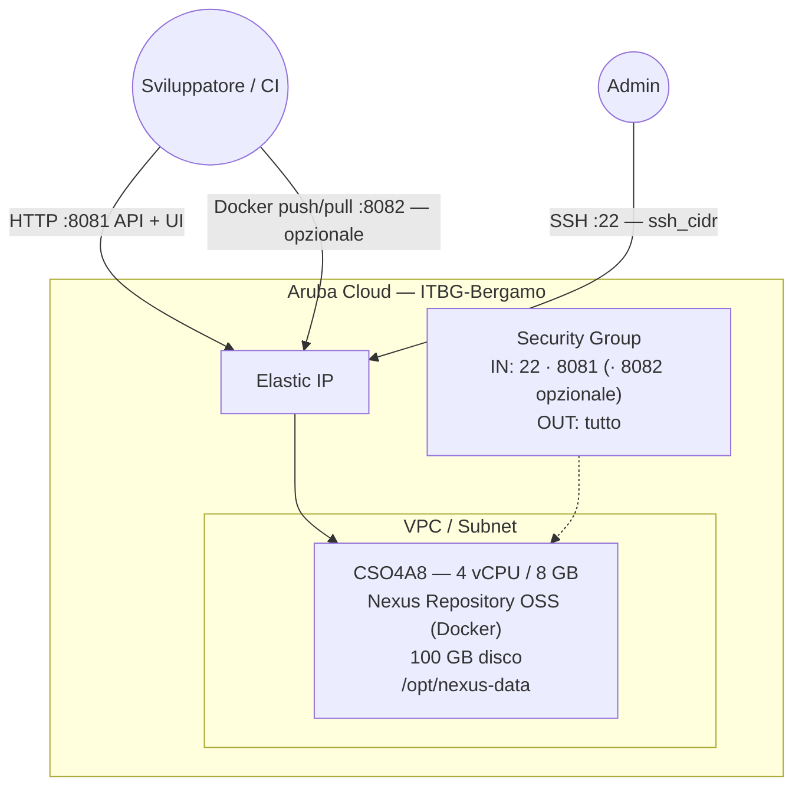

# Nexus Repository su Aruba Cloud

Distribuisci [Sonatype Nexus Repository OSS](https://www.sonatype.com/products/sonatype-nexus-oss) — un registry universale di artefatti con supporto per Maven, npm, Docker, PyPI, RubyGems e altro — su Aruba Cloud tramite Terraform e cloud-init.

> **Versione provider:** arubacloud/arubacloud `~> 1.0` | **Terraform:** ≥ 1.9

---

## Introduzione

Nexus Repository OSS è il gestore di artefatti open-source più diffuso. Gira sulla JVM con un database integrato e non richiede un database esterno. Questo esempio distribuisce:

- **Nexus Repository OSS** tramite l'immagine Docker ufficiale su una VM CSO4A8
- Storage persistente degli artefatti su `/opt/nexus-data` (volume host)
- Interfaccia web e API sulla porta **8081**
- Registry Docker opzionale sulla porta **8082** (`enable_docker_registry = true`)
- Password admin auto-generata recuperata dopo il bootstrap

> **Avvio JVM:** Nexus impiega **2–3 minuti** per avviarsi. Il health-check cloud-init attende automaticamente.

---

## Panoramica dell'architettura



---

## Infrastruttura creata

| Risorsa | Pattern nome | Descrizione |
|---------|-------------|-------------|
| `arubacloud_project` | `nexus-prod` | Contenitore progetto |
| `arubacloud_vpc` | `nexus-prod-vpc` | Virtual Private Cloud |
| `arubacloud_subnet` | `nexus-prod-subnet` | Subnet di base |
| `arubacloud_securitygroup` | `nexus-prod-vm-sg` | Security group |
| `arubacloud_securityrule` | `nexus-prod-vm-ssh` | Ingresso SSH (22) |
| `arubacloud_securityrule` | `nexus-prod-vm-http` | Ingresso interfaccia web Nexus (8081) |
| `arubacloud_securityrule` | `nexus-prod-vm-docker` | Ingresso registry Docker (8082, opzionale) |
| `arubacloud_elasticip` | `nexus-prod-vm-eip` | IP pubblico VM |
| `arubacloud_blockstorage` | `nexus-prod-boot` | Disco di avvio 100 GB (Performance) |
| `arubacloud_keypair` | `nexus-prod-keypair` | Chiave SSH pubblica |
| `arubacloud_cloudserver` | `nexus-prod-vm` | VM CloudServer |

---

## Costo mensile stimato

| Risorsa | Specifiche | Costo stimato/mese |
|---------|-----------|-------------------|
| CloudServer VM | CSO4A8 — 4 vCPU / 8 GB | ~€40 |
| Disco di avvio | 100 GB Performance | ~€15 |
| Elastic IP | — | ~€3 |
| **Totale** | | **~€58/mese** |

---

## Variabili

### Obbligatorie

| Variabile | Descrizione |
|-----------|-------------|
| `arubacloud_client_id` | Client ID OAuth2 ArubaCloud |
| `arubacloud_client_secret` | Client secret OAuth2 ArubaCloud |

### Opzionali

| Variabile | Default | Descrizione |
|-----------|---------|-------------|
| `ssh_public_key` | chiave del progetto | Contenuto della chiave SSH pubblica |
| `app_name` | `"nexus"` | Nome breve usato nei nomi delle risorse |
| `environment` | `"prod"` | Etichetta ambiente |
| `location` | `"ITBG-Bergamo"` | Regione ArubaCloud |
| `zone` | `"ITBG-1"` | Zona di disponibilità |
| `billing_period` | `"Hour"` | `"Hour"` o `"Month"` |
| `vm_flavor` | `"CSO4A8"` | Flavor CloudServer (min 4 GB RAM per JVM) |
| `vm_disk_size_gb` | `100` | Dimensione disco di avvio in GB (min 50) |
| `ssh_cidr` | `"0.0.0.0/0"` | CIDR per accesso SSH |
| `nexus_version` | `"latest"` | Tag immagine Docker Nexus |
| `enable_docker_registry` | `false` | Apre la porta 8082 per il registry Docker |

---

## Output

| Output | Descrizione |
|--------|-------------|
| `nexus_url` | URL interfaccia web Nexus |
| `nexus_docker_registry_url` | URL registry Docker (quando abilitato) |
| `vm_public_ip` | IP pubblico della VM |
| `ssh_command` | Comando SSH per connettersi |
| `admin_password_command` | Comando per recuperare la password admin auto-generata |

---

## Istruzioni di distribuzione

### 1. Clona e naviga

```bash
git clone https://github.com/arubacloud/terraform-arubacloud-examples.git
cd terraform-arubacloud-examples/nexus
```

### 2. Configura le variabili

```bash
cp terraform.tfvars.example terraform.tfvars
```

### 3. Distribuisci

```bash
terraform init
terraform plan
terraform apply
```

Il bootstrap richiede circa **3–5 minuti** (avvio JVM).

### 4. Recupera la password admin

```bash
ssh ubuntu@<vm_public_ip> 'docker exec nexus cat /nexus-data/admin.password'
```

Oppure usa l'output Terraform `admin_password_command`.

### 5. Primo accesso

Vai su `http://<vm_public_ip>:8081`, accedi con `admin` e la password recuperata, poi completa il wizard di configurazione. Il file `admin.password` viene eliminato automaticamente dopo il primo accesso.

---

## Abilitazione del registry Docker

Imposta `enable_docker_registry = true` in `terraform.tfvars`, poi ri-applica. Dopo l'apply:

1. Accedi all'interfaccia web di Nexus
2. Crea un nuovo repository **hosted** di tipo `docker (hosted)` sulla porta HTTP **8082**
3. Invia immagini: `docker push <ip_vm>:8082/mia-immagine:tag`

---

## Riferimenti

- [Documentazione Nexus Repository OSS](https://help.sonatype.com/en/sonatype-nexus-repository.html)
- [Nexus Docker Hub](https://hub.docker.com/r/sonatype/nexus3)
- [ArubaCloud Terraform Provider](https://registry.terraform.io/providers/arubacloud/arubacloud/latest/docs)
