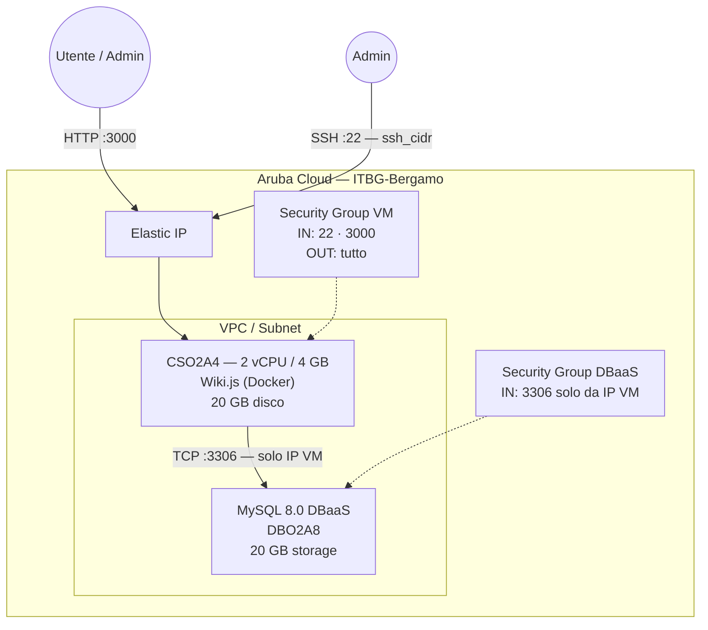

# Wiki.js su Aruba Cloud

Distribuisci [Wiki.js](https://js.wiki/) — una moderna piattaforma wiki open-source con supporto Markdown, ricerca full-text e autenticazione modulare — su Aruba Cloud tramite Terraform e cloud-init. Utilizza MySQL 8.0 gestito come backend database.

> **Versione provider:** arubacloud/arubacloud `~> 1.0` | **Terraform:** ≥ 1.9

---

## Introduzione

Wiki.js è un wiki leggero basato su Node.js che gira interamente in Docker. Questo esempio distribuisce:

- **Wiki.js** tramite l'immagine Docker ufficiale su una VM CSO2A4
- **MySQL 8.0 gestito** (Aruba Cloud DBaaS) per uno storage affidabile
- Interfaccia web sulla porta **3000**
- Wizard di configurazione al primo accesso per creare l'account amministratore

---

## Panoramica dell'architettura



---

## Infrastruttura creata

| Risorsa | Pattern nome | Descrizione |
|---------|-------------|-------------|
| `arubacloud_project` | `wikijs-prod` | Contenitore progetto |
| `arubacloud_vpc` | `wikijs-prod-vpc` | Virtual Private Cloud |
| `arubacloud_subnet` | `wikijs-prod-subnet` | Subnet di base |
| `arubacloud_securitygroup` | `wikijs-prod-vm-sg` | Security group VM |
| `arubacloud_securitygroup` | `wikijs-prod-dbaas-sg` | Security group DBaaS |
| `arubacloud_securityrule` | `wikijs-prod-vm-ssh` | Ingresso SSH (22) |
| `arubacloud_securityrule` | `wikijs-prod-vm-http` | Ingresso Wiki.js (3000) |
| `arubacloud_securityrule` | `wikijs-prod-db-mysql` | Ingresso MySQL (3306, solo IP VM) |
| `arubacloud_elasticip` | `wikijs-prod-vm-eip` | IP pubblico VM |
| `arubacloud_elasticip` | `wikijs-prod-dbaas-eip` | IP pubblico DBaaS |
| `arubacloud_dbaas` | `wikijs-prod-dbaas` | Istanza MySQL 8.0 gestita |
| `arubacloud_database` | `wikijs` | Schema database |
| `arubacloud_dbaasuser` | `wikijs` | Utente database |
| `arubacloud_databasegrant` | — | Grant completo sul database wikijs |
| `arubacloud_blockstorage` | `wikijs-prod-boot` | Disco di avvio 20 GB (Performance) |
| `arubacloud_keypair` | `wikijs-prod-keypair` | Chiave SSH pubblica |
| `arubacloud_cloudserver` | `wikijs-prod-vm` | VM CloudServer |

---

## Costo mensile stimato

| Risorsa | Specifiche | Costo stimato/mese |
|---------|-----------|-------------------|
| CloudServer VM | CSO2A4 — 2 vCPU / 4 GB | ~€20 |
| Disco di avvio | 20 GB Performance | ~€3 |
| Elastic IP (VM) | — | ~€3 |
| MySQL DBaaS | DBO2A8 · 20 GB | ~€30 |
| Elastic IP (DBaaS) | — | ~€3 |
| **Totale** | | **~€59/mese** |

---

## Variabili

### Obbligatorie

| Variabile | Descrizione |
|-----------|-------------|
| `arubacloud_client_id` | Client ID OAuth2 ArubaCloud |
| `arubacloud_client_secret` | Client secret OAuth2 ArubaCloud |

### Opzionali

| Variabile | Default | Descrizione |
|-----------|---------|-------------|
| `ssh_public_key` | chiave del progetto | Contenuto della chiave SSH pubblica |
| `db_password` | default preimpostato | Password MySQL (min 16 caratteri, senza newline) |
| `app_name` | `"wikijs"` | Nome breve usato nei nomi delle risorse |
| `environment` | `"prod"` | Etichetta ambiente |
| `location` | `"ITBG-Bergamo"` | Regione ArubaCloud |
| `zone` | `"ITBG-1"` | Zona di disponibilità |
| `billing_period` | `"Hour"` | `"Hour"` o `"Month"` |
| `vm_flavor` | `"CSO2A4"` | Flavor CloudServer |
| `vm_disk_size_gb` | `20` | Dimensione disco di avvio in GB |
| `ssh_cidr` | `"0.0.0.0/0"` | CIDR per accesso SSH |
| `dbaas_flavor` | `"DBO2A8"` | Flavor MySQL gestito |
| `db_storage_gb` | `20` | Storage DBaaS iniziale in GB |
| `wikijs_version` | `"2"` | Tag immagine Docker Wiki.js |

---

## Output

| Output | Descrizione |
|--------|-------------|
| `wikijs_url` | URL interfaccia web Wiki.js |
| `vm_public_ip` | IP pubblico della VM |
| `ssh_command` | Comando SSH per connettersi |
| `db_host` | Indirizzo IP pubblico DBaaS |

---

## Istruzioni di distribuzione

### 1. Clona e naviga

```bash
git clone https://github.com/arubacloud/terraform-arubacloud-examples.git
cd terraform-arubacloud-examples/wikijs
```

### 2. Configura le variabili

```bash
cp terraform.tfvars.example terraform.tfvars
```

### 3. Distribuisci

```bash
terraform init
terraform plan
terraform apply
```

Il bootstrap richiede circa **2–3 minuti**.

### 4. Configurazione iniziale

Vai su `http://<vm_public_ip>:3000` e completa il wizard di installazione per creare l'account amministratore e configurare il sito.

---

## Riferimenti

- [Documentazione Wiki.js](https://docs.requarks.io/)
- [Wiki.js Docker Hub](https://hub.docker.com/r/requarks/wiki)
- [ArubaCloud Terraform Provider](https://registry.terraform.io/providers/arubacloud/arubacloud/latest/docs)
