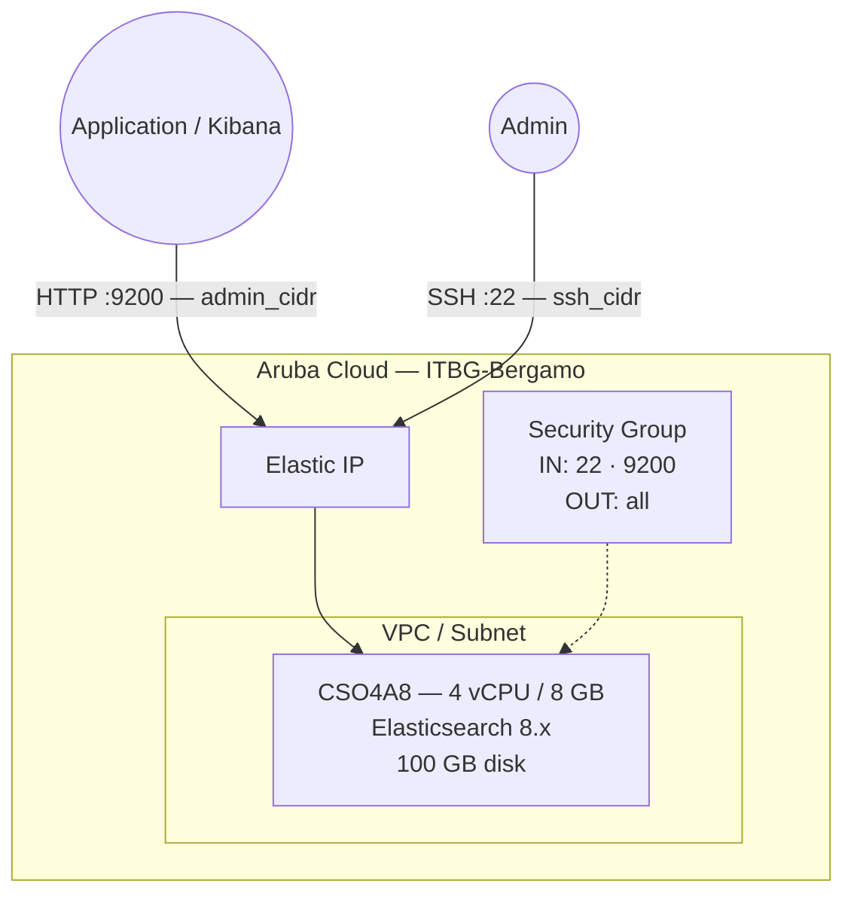

# Elasticsearch on Aruba Cloud

Deploy [Elasticsearch 8.x](https://www.elastic.co/elasticsearch/) — the leading open-source distributed search and analytics engine — on Aruba Cloud using Terraform and cloud-init. Installed from the official Elastic apt repository with x-pack security enabled and the `elastic` superuser password configured at bootstrap time.

> **Provider version:** arubacloud/arubacloud `~> 0.5` | **Terraform:** ≥ 1.9

---

## Introduction

Elasticsearch is the core of the Elastic Stack (ELK/ELK+APM), providing full-text search, log analytics, and real-time data exploration at scale. This example provisions a **single-node** Elasticsearch instance with:

- **Elasticsearch 8.x** installed from the official Elastic apt repository
- **x-pack security enabled** — all API requests require authentication
- HTTP TLS disabled for simplicity (terminate TLS at a reverse proxy for production)
- `elastic` superuser password set at bootstrap time — no manual post-install steps
- `vm.max_map_count=262144` kernel tuning applied persistently
- REST API on port 9200, restricted to `admin_cidr`

> **OpenSearch note:** For new open-source deployments where Elastic's SSPL licence is a concern, consider [OpenSearch](https://opensearch.org) — the community-driven fork maintained by AWS. Wazuh (in this repository) includes an embedded OpenSearch instance for reference.

---

## Architecture Overview



---

## Infrastructure Created

| Resource | Name pattern | Description |
|----------|-------------|-------------|
| `arubacloud_project` | `es-prod` | Project container |
| `arubacloud_vpc` | `es-prod-vpc` | Virtual Private Cloud |
| `arubacloud_subnet` | `es-prod-subnet` | Basic subnet |
| `arubacloud_securitygroup` | `es-prod-vm-sg` | Security group |
| `arubacloud_securityrule` | `es-prod-vm-ssh` | SSH ingress |
| `arubacloud_securityrule` | `es-prod-vm-api` | REST API ingress TCP 9200 |
| `arubacloud_elasticip` | `es-prod-vm-eip` | VM public IP |
| `arubacloud_blockstorage` | `es-prod-boot` | 100 GB boot disk (Performance) |
| `arubacloud_keypair` | `es-prod-keypair` | SSH public key |
| `arubacloud_cloudserver` | `es-prod-vm` | CloudServer VM |

---

## Estimated Monthly Cost

| Resource | Spec | Est. cost/mo |
|----------|------|-------------|
| CloudServer VM | CSO4A8 — 4 vCPU / 8 GB | ~€35 |
| Boot disk | 100 GB Performance | ~€15 |
| Elastic IP | — | ~€3 |
| **Total** | | **~€53/mo** |

For production workloads, upgrade to CSO8A16 (8 vCPU / 16 GB, ~€95/mo).

---

## Requirements

- Terraform ≥ 1.9
- ArubaCloud Terraform Provider `~> 0.5`
- An ArubaCloud account with OAuth2 API credentials
- An SSH key pair

---

## Variables

### Required

| Variable | Description |
|----------|-------------|
| `arubacloud_client_id` | ArubaCloud OAuth2 client ID |
| `arubacloud_client_secret` | ArubaCloud OAuth2 client secret |
| `ssh_public_key` | SSH public key content |
| `elastic_password` | Password for the `elastic` superuser (min 6 chars) |

### Optional

| Variable | Default | Description |
|----------|---------|-------------|
| `app_name` | `"es"` | Short name used in all resource names |
| `environment` | `"prod"` | Environment label |
| `location` | `"ITBG-Bergamo"` | ArubaCloud region |
| `zone` | `"ITBG-1"` | Availability zone |
| `billing_period` | `"Hour"` | `"Hour"` or `"Month"` |
| `vm_flavor` | `"CSO4A8"` | CloudServer flavor |
| `vm_image` | `"LU22-001"` | Boot disk image (Ubuntu 22.04 LTS) |
| `vm_disk_size_gb` | `100` | Boot disk size in GB (min 50 GB) |
| `ssh_cidr` | `"0.0.0.0/0"` | CIDR for SSH |
| `admin_cidr` | `"0.0.0.0/0"` | CIDR for REST API port 9200 — **always restrict** |
| `cluster_name` | `"elasticsearch"` | Elasticsearch cluster name |

---

## Outputs

| Output | Description |
|--------|-------------|
| `elasticsearch_url` | Elasticsearch REST API URL |
| `vm_public_ip` | Public IP address of the VM |
| `ssh_command` | SSH command to connect to the VM |
| `health_check` | `curl` command to verify the cluster is healthy |

---

## Deployment Instructions

### 1. Clone and navigate

```bash
git clone https://github.com/arubacloud/terraform-arubacloud-examples.git
cd terraform-arubacloud-examples/elasticsearch
```

### 2. Configure variables

```bash
cp terraform.tfvars.example terraform.tfvars
```

Set the password and restrict API access to your application servers:

```hcl
elastic_password = "your-strong-password"
admin_cidr       = "10.0.0.0/8"    # your app server CIDR
ssh_cidr         = "203.0.113.42/32"
```

### 3. Deploy

```bash
terraform init
terraform plan
terraform apply
```

Bootstrap takes approximately **3–5 minutes**.

### 4. Verify

```bash
curl -u elastic:<your-password> \
  "$(terraform output -raw elasticsearch_url)/_cluster/health?pretty"
```

Expected output:

```json
{
  "cluster_name" : "elasticsearch",
  "status" : "green",
  "number_of_nodes" : 1,
  ...
}
```

---

## Connecting Kibana

To visualise and query data, deploy Kibana separately and point it at this Elasticsearch instance:

```yaml
# kibana.yml
elasticsearch.hosts: ["http://<es-ip>:9200"]
elasticsearch.username: "kibana_system"
elasticsearch.password: "<generated-kibana-system-password>"
```

Create the `kibana_system` user password from the Elasticsearch VM:

```bash
ssh ubuntu@$(terraform output -raw vm_public_ip)
sudo /usr/share/elasticsearch/bin/elasticsearch-reset-password \
  -u kibana_system --batch
```

---

## Security Recommendations

1. **Always restrict `admin_cidr`.** Elasticsearch has no rate limiting on authentication — open port 9200 to `0.0.0.0/0` exposes your data to credential-stuffing attacks.

2. **Enable HTTP TLS for production.** This example disables HTTP TLS for simplicity. For production, terminate TLS at NGINX or Caddy (in this repository), or enable Elasticsearch's built-in TLS using `xpack.security.http.ssl.enabled: true` with a certificate.

3. **Use dedicated roles.** Do not use the `elastic` superuser for application connections. Create a least-privilege role:

   ```bash
   curl -u elastic:<password> -X POST \
     "http://<ip>:9200/_security/role/app_role" \
     -H "Content-Type: application/json" \
     -d '{"indices":[{"names":["app-*"],"privileges":["read","write","create_index"]}]}'
   ```

---

## Troubleshooting

### Elasticsearch not starting

```bash
sudo systemctl status elasticsearch
sudo journalctl -u elasticsearch -n 50
# Common cause: insufficient vm.max_map_count
cat /proc/sys/vm/max_map_count   # should be 262144
```

### Password reset failed

The password reset tool requires the node to be running. Check service status first:

```bash
sudo systemctl status elasticsearch
sudo /usr/share/elasticsearch/bin/elasticsearch-reset-password \
  -u elastic -p "new-password" --batch
```

---

## References

- [Elasticsearch Documentation](https://www.elastic.co/guide/en/elasticsearch/reference/current/index.html)
- [Elasticsearch Security Guide](https://www.elastic.co/guide/en/elasticsearch/reference/current/secure-cluster.html)
- [OpenSearch (open-source fork)](https://opensearch.org)
- [ArubaCloud Terraform Provider](https://registry.terraform.io/providers/arubacloud/arubacloud/latest/docs)
