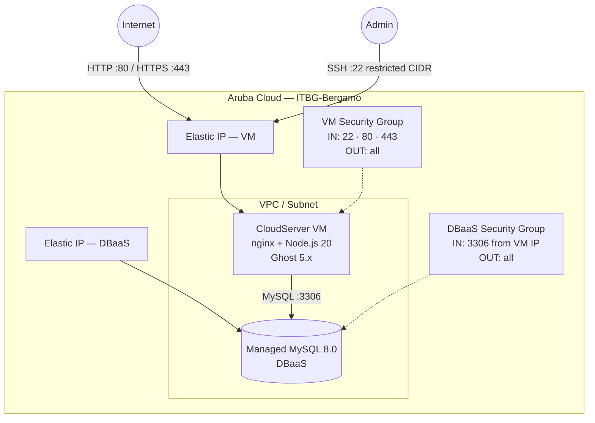

# Ghost on Aruba Cloud

Deploy a production-ready [Ghost](https://ghost.org) blog on Aruba Cloud using Terraform and cloud-init. No manual server configuration required.

> **Provider version:** arubacloud/arubacloud `~> 0.5` | **Terraform:** ≥ 1.9

---

## Introduction

Ghost is a modern open-source publishing platform built with Node.js, designed for professional bloggers, newsletters, and membership sites. This example provisions a complete Ghost stack on Aruba Cloud with:

- A **CloudServer VM** running Node.js 20 and Ghost served behind nginx, fully bootstrapped by cloud-init
- A **Managed MySQL 8.0 DBaaS** instance — no self-managed database server
- A dedicated **VPC, subnet, and security groups** via the shared network module
- **Elastic IPs** for the VM and DBaaS
- Optional **Let's Encrypt HTTPS** when a custom domain is provided

The Ghost admin account is created on first browser visit to `/ghost` — no passwords are set during provisioning.

---

## Architecture Overview

Ghost listens on port 2368 and is proxied by nginx on port 80/443. The database runs on a separate managed DBaaS instance in the same VPC. The MySQL security group allows inbound connections only from the VM's Elastic IP.



---

## Infrastructure Created

| Resource | Name pattern | Description |
|----------|-------------|-------------|
| `arubacloud_project` | `ghost-prod` | Project container |
| `arubacloud_vpc` | `ghost-prod-vpc` | Virtual Private Cloud |
| `arubacloud_subnet` | `ghost-prod-subnet` | Basic subnet |
| `arubacloud_securitygroup` | `ghost-prod-vm-sg` | VM security group |
| `arubacloud_securitygroup` | `ghost-prod-db-sg` | DBaaS security group |
| `arubacloud_securityrule` | `ghost-prod-vm-ssh` | SSH ingress (restricted CIDR) |
| `arubacloud_securityrule` | `ghost-prod-vm-http` | HTTP ingress (0.0.0.0/0) |
| `arubacloud_securityrule` | `ghost-prod-vm-https` | HTTPS ingress (0.0.0.0/0) |
| `arubacloud_securityrule` | `ghost-prod-db-mysql` | MySQL ingress from VM IP only |
| `arubacloud_elasticip` | `ghost-prod-vm-eip` | VM public IP |
| `arubacloud_elasticip` | `ghost-prod-db-eip` | DBaaS public IP |
| `arubacloud_blockstorage` | `ghost-prod-boot` | 30 GB boot disk (Performance) |
| `arubacloud_keypair` | `ghost-prod-keypair` | SSH public key |
| `arubacloud_dbaas` | `ghost-prod-dbaas` | Managed MySQL 8.0 |
| `arubacloud_database` | `ghost` | Ghost logical database |
| `arubacloud_dbaasuser` | `ghost` | MySQL application user |
| `arubacloud_databasegrant` | — | liteadmin grant |
| `arubacloud_cloudserver` | `ghost-prod-vm` | CloudServer VM |

---

## VM Sizing Recommendation

| Workload | vCPU | RAM | Disk | Flavor |
|----------|------|-----|------|--------|
| Personal blog / newsletter | 2 | 4 GB | 30 GB | `CSO2A4` *(default)* |
| High-traffic / membership site | 4 | 8 GB | 40 GB | `CSO4A8` |

For the DBaaS: `DBO2A8` (2 vCPU / 8 GB) covers most Ghost sites. Ghost is Node.js-based and is more memory-efficient than PHP stacks, so the 2 vCPU / 4 GB VM tier handles typical blog and newsletter workloads well.

---

## Estimated Monthly Cost

> Approximate prices for ITBG-Bergamo, hourly billing. Actual prices may vary — verify in the [ArubaCloud console](https://www.cloud.it).

| Resource | Spec | Est. cost/mo |
|----------|------|-------------|
| CloudServer VM | CSO2A4 — 2 vCPU / 4 GB | ~€18 |
| Boot disk | 30 GB Performance | ~€4 |
| Managed MySQL | DBO2A8 — 2 vCPU / 8 GB | ~€35 |
| DBaaS storage | 20 GB | ~€3 |
| Elastic IP × 2 | — | ~€5 |
| **Total** | | **~€65/mo** |

---

## Requirements

- Terraform ≥ 1.9
- ArubaCloud Terraform Provider `~> 0.5`
- An ArubaCloud account with OAuth2 API credentials
- An SSH key pair

---

## Variables

### Required

| Variable | Description |
|----------|-------------|
| `arubacloud_client_id` | ArubaCloud OAuth2 client ID |
| `arubacloud_client_secret` | ArubaCloud OAuth2 client secret |
| `ssh_public_key` | SSH public key content (e.g. contents of `~/.ssh/id_ed25519.pub`) |
| `db_password` | MySQL password for the Ghost user (min 16 chars, no newlines) |

### Optional

| Variable | Default | Description |
|----------|---------|-------------|
| `app_name` | `"ghost"` | Short name used in all resource names |
| `environment` | `"prod"` | Environment label (`prod`, `staging`, `dev`) |
| `location` | `"ITBG-Bergamo"` | ArubaCloud region |
| `zone` | `"ITBG-1"` | Availability zone |
| `billing_period` | `"Hour"` | `"Hour"` or `"Month"` |
| `vm_flavor` | `"CSO2A4"` | CloudServer flavor |
| `vm_image` | `"LU22-001"` | Boot disk image (Ubuntu 22.04 LTS) |
| `vm_disk_size_gb` | `30` | Boot disk size in GB |
| `ssh_cidr` | `"0.0.0.0/0"` | CIDR for SSH access — **restrict to your IP in production** |
| `dbaas_flavor` | `"DBO2A8"` | DBaaS flavor |
| `db_storage_gb` | `20` | DBaaS initial storage in GB |
| `domain` | `""` | Custom domain for HTTPS — leave empty to use the Elastic IP |

---

## Deployment Instructions

### 1. Clone and navigate

```bash
git clone https://github.com/arubacloud/terraform-arubacloud-examples.git
cd terraform-arubacloud-examples/ghost
```

### 2. Configure variables

```bash
cp terraform.tfvars.example terraform.tfvars
```

Edit `terraform.tfvars` with your credentials and database password.

> **Tip:** Store credentials as environment variables to avoid writing them to disk:

```bash
export TF_VAR_arubacloud_client_id="your-id"
export TF_VAR_arubacloud_client_secret="your-secret"
```

### 3. Initialize and deploy

```bash
terraform init
terraform plan   # review the execution plan
terraform apply
```

### 4. Access Ghost

After apply completes (typically 10–15 minutes for cloud-init):

```bash
terraform output site_url          # e.g. http://203.0.113.10
terraform output ghost_admin_url   # e.g. http://203.0.113.10/ghost
```

Open the admin URL in your browser. The **first visit** registers your admin account — fill in your name, email, and password. This is the only user created during setup.

### 5. Follow cloud-init progress (optional)

While cloud-init runs, you can tail the bootstrap log:

```bash
ssh ubuntu@$(terraform output -raw vm_public_ip)
sudo tail -f /var/log/cloud-init-output.log
```

---

## Destroy Instructions

```bash
terraform destroy
```

This removes all created resources. The DBaaS data **is destroyed** — take a snapshot first if you need to preserve it:

```bash
# Take a DBaaS backup before destroying (manual step via console or API)
terraform destroy
```

---

## Security Recommendations

1. **Restrict SSH to your IP.** Set `ssh_cidr = "your.ip.address/32"` in `terraform.tfvars`. The default `0.0.0.0/0` is for getting-started convenience only.

2. **Use a custom domain with HTTPS.** Set the `domain` variable. Certbot will automatically provision and renew a Let's Encrypt certificate.

3. **Choose a strong admin password.** When registering the admin account on first visit, use a unique password of at least 16 characters.

4. **Keep Ghost updated.** SSH into the VM and run `ghost update --dir /var/www/ghost` as the ghost user (see Upgrade Considerations below).

5. **Do not expose MySQL publicly.** The DBaaS security group already restricts MySQL to the VM's IP. Do not add `0.0.0.0/0` ingress rules to the DBaaS security group.

---

## Upgrade Considerations

### Ghost version upgrades

Ghost CLI handles in-place upgrades:

```bash
ssh ubuntu@$(terraform output -raw vm_public_ip)
sudo -u ghost ghost update --dir /var/www/ghost
```

Always review the [Ghost changelog](https://ghost.org/docs/faq/upgrades/) for breaking changes before upgrading.

### Node.js version upgrade

Change the NodeSource setup script URL in `cloud-init.yaml.tpl` (e.g. `setup_22.x`) and trigger a VM replacement by modifying `user_data`. Run `terraform apply` to replace the instance with a fresh bootstrap.

### Provider upgrade

When the provider releases a new minor version, update the constraint in `versions.tf` and run `terraform init -upgrade`. Always review the provider CHANGELOG before upgrading.

---

## Screenshots

> **Screenshot placeholder.** After deployment, add screenshots of the Ghost front page and admin dashboard here.

| Admin dashboard | Front page |
|-----------------|------------|
| *(screenshot)* | *(screenshot)* |

---

## Login Credentials After Deployment

Ghost does not set an admin password during provisioning. On first access, navigate to the admin URL and register your account.

| Service | URL | Username | Password |
|---------|-----|----------|----------|
| Ghost Admin | `$(terraform output ghost_admin_url)` | *(set on first visit)* | *(set on first visit)* |
| MySQL | `$(terraform output dbaas_host):3306` | `ghost` | `$(terraform output -raw db_password)` |
| SSH | `$(terraform output ssh_command)` | `ubuntu` | SSH key |

---

## Troubleshooting

### Ghost is not reachable after apply

1. **cloud-init still running.** Ghost installation takes 10–15 minutes after VM boot. Check the log:

   ```bash
   ssh ubuntu@$(terraform output -raw vm_public_ip)
   sudo tail -f /var/log/cloud-init-output.log
   ```

2. **DBaaS not ready yet.** cloud-init waits up to 15 minutes for MySQL. If the wait timed out, check the DBaaS status in the console and restart cloud-init manually.

3. **Ghost service not started.** Verify Ghost is running:

   ```bash
   sudo -u ghost ghost status --dir /var/www/ghost
   ```

### nginx returns 502 Bad Gateway

Ghost is not running or listening on port 2368:

```bash
sudo -u ghost ghost status --dir /var/www/ghost
sudo -u ghost ghost start --dir /var/www/ghost
```

### Certbot fails to issue a certificate

- DNS must resolve the domain to the VM's Elastic IP **before** `terraform apply`.
- Certbot requires ports 80 and 443 to be reachable. Verify your security group rules.
- Check `/var/log/letsencrypt/letsencrypt.log` for details.

### cloud-init bootstrap did not complete

```bash
ssh ubuntu@$(terraform output -raw vm_public_ip)
sudo systemctl status cloud-init
sudo cat /var/log/cloud-init-output.log
```

Look for the `final_message` near the end of the log. If missing, scroll up to find the error.

### Plan errors: "resource name already exists"

A previous `terraform destroy` may not have completed. Either finish destroying or change `app_name` / `environment` to use a different resource name prefix.

---

## References

- [Ghost Documentation](https://ghost.org/docs/)
- [Ghost CLI Reference](https://ghost.org/docs/ghost-cli/)
- [ArubaCloud Terraform Provider](https://registry.terraform.io/providers/arubacloud/arubacloud/latest/docs)
- [ArubaCloud API Documentation](https://api.arubacloud.com/docs/)
- [cloud-init Reference](https://cloudinit.readthedocs.io/)
- [Certbot Documentation](https://certbot.eff.org/docs/)
