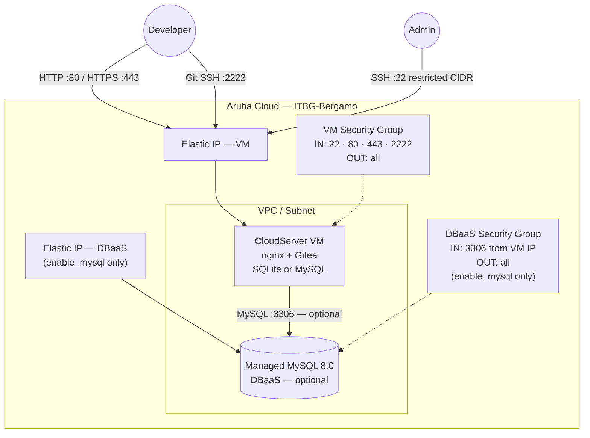

# Gitea on Aruba Cloud

Deploy a production-ready [Gitea](https://gitea.com) self-hosted Git service on Aruba Cloud using Terraform and cloud-init. No manual server configuration required.

> **Provider version:** arubacloud/arubacloud `~> 0.5` | **Terraform:** ≥ 1.9

---

## Introduction

Gitea is a lightweight, self-hosted Git service written in Go. It provides a GitHub-like interface for hosting repositories, managing issues and pull requests, and running CI/CD via Gitea Actions. This example provisions a complete Gitea stack on Aruba Cloud with:

- A **CloudServer VM** running the Gitea binary behind an nginx reverse proxy, fully bootstrapped by cloud-init
- A choice of **SQLite** (default, zero extra cost) or **Managed MySQL 8.0 DBaaS** for larger teams
- A dedicated **VPC, subnet, and security groups** via the shared network module
- **Elastic IP** for the VM (and DBaaS when MySQL is enabled)
- Optional **Let's Encrypt HTTPS** when a custom domain is provided
- **Git SSH access on port 2222** so Gitea's built-in SSH server does not conflict with the admin SSH on port 22

The first user to register via the web interface automatically becomes the instance administrator — no credentials are pre-set during provisioning.

---

## Architecture Overview

Gitea runs as a systemd service listening on `127.0.0.1:3000`. nginx terminates public HTTP/HTTPS traffic and proxies it to Gitea. Gitea's built-in SSH server listens on port 2222 for `git clone` / `git push` operations.



---

## Infrastructure Created

Resources with *(MySQL only)* are created only when `enable_mysql = true`.

| Resource | Name pattern | Description |
|----------|-------------|-------------|
| `arubacloud_project` | `gitea-prod` | Project container |
| `arubacloud_vpc` | `gitea-prod-vpc` | Virtual Private Cloud |
| `arubacloud_subnet` | `gitea-prod-subnet` | Basic subnet |
| `arubacloud_securitygroup` | `gitea-prod-vm-sg` | VM security group |
| `arubacloud_securitygroup` | `gitea-prod-db-sg` | DBaaS security group *(MySQL only)* |
| `arubacloud_securityrule` | `gitea-prod-vm-ssh` | SSH ingress (restricted CIDR) |
| `arubacloud_securityrule` | `gitea-prod-vm-http` | HTTP ingress |
| `arubacloud_securityrule` | `gitea-prod-vm-https` | HTTPS ingress |
| `arubacloud_securityrule` | `gitea-prod-vm-git-ssh` | Git SSH ingress (port 2222) |
| `arubacloud_securityrule` | `gitea-prod-db-mysql` | MySQL ingress from VM IP *(MySQL only)* |
| `arubacloud_elasticip` | `gitea-prod-vm-eip` | VM public IP |
| `arubacloud_elasticip` | `gitea-prod-db-eip` | DBaaS public IP *(MySQL only)* |
| `arubacloud_blockstorage` | `gitea-prod-boot` | 30 GB boot disk (Performance) |
| `arubacloud_keypair` | `gitea-prod-keypair` | SSH public key |
| `arubacloud_dbaas` | `gitea-prod-dbaas` | Managed MySQL 8.0 *(MySQL only)* |
| `arubacloud_database` | `gitea` | Gitea logical database *(MySQL only)* |
| `arubacloud_dbaasuser` | `gitea` | MySQL application user *(MySQL only)* |
| `arubacloud_databasegrant` | — | liteadmin grant *(MySQL only)* |
| `arubacloud_cloudserver` | `gitea-prod-vm` | CloudServer VM |

---

## VM Sizing Recommendation

| Workload | vCPU | RAM | Disk | Flavor | Database |
|----------|------|-----|------|--------|----------|
| Personal / small team (≤ 10 users) | 2 | 4 GB | 30 GB | `CSO2A4` *(default)* | SQLite |
| Small organisation (≤ 50 users) | 2 | 4 GB | 50 GB | `CSO2A4` | MySQL `DBO2A8` |
| Medium organisation (≤ 200 users) | 4 | 8 GB | 50 GB | `CSO4A8` | MySQL `DBO4A16` |

For SQLite deployments the repositories live on the boot disk — increase `vm_disk_size_gb` to match your expected repository size.

---

## Estimated Monthly Cost

> Approximate prices for ITBG-Bergamo, hourly billing. Actual prices may vary — verify in the [ArubaCloud console](https://www.cloud.it).

### SQLite (default)

| Resource | Spec | Est. cost/mo |
|----------|------|-------------|
| CloudServer VM | CSO2A4 — 2 vCPU / 4 GB | ~€18 |
| Boot disk | 30 GB Performance | ~€4 |
| Elastic IP | — | ~€3 |
| **Total** | | **~€25/mo** |

### MySQL (enable_mysql = true)

| Resource | Spec | Est. cost/mo |
|----------|------|-------------|
| CloudServer VM | CSO2A4 — 2 vCPU / 4 GB | ~€18 |
| Boot disk | 30 GB Performance | ~€4 |
| Managed MySQL | DBO2A8 — 2 vCPU / 8 GB | ~€35 |
| DBaaS storage | 20 GB | ~€3 |
| Elastic IP × 2 | — | ~€5 |
| **Total** | | **~€65/mo** |

---

## Requirements

- Terraform ≥ 1.9
- ArubaCloud Terraform Provider `~> 0.5`
- An ArubaCloud account with OAuth2 API credentials
- An SSH key pair
- `db_password` (min 16 chars) — only when `enable_mysql = true`

---

## Variables

### Required

| Variable | Description |
|----------|-------------|
| `arubacloud_client_id` | ArubaCloud OAuth2 client ID |
| `arubacloud_client_secret` | ArubaCloud OAuth2 client secret |
| `ssh_public_key` | SSH public key content (e.g. contents of `~/.ssh/id_ed25519.pub`) |

### Optional

| Variable | Default | Description |
|----------|---------|-------------|
| `app_name` | `"gitea"` | Short name used in all resource names |
| `environment` | `"prod"` | Environment label (`prod`, `staging`, `dev`) |
| `location` | `"ITBG-Bergamo"` | ArubaCloud region |
| `zone` | `"ITBG-1"` | Availability zone |
| `billing_period` | `"Hour"` | `"Hour"` or `"Month"` |
| `vm_flavor` | `"CSO2A4"` | CloudServer flavor |
| `vm_image` | `"LU22-001"` | Boot disk image (Ubuntu 22.04 LTS) |
| `vm_disk_size_gb` | `30` | Boot disk size in GB |
| `ssh_cidr` | `"0.0.0.0/0"` | CIDR for SSH access — **restrict to your IP in production** |
| `enable_mysql` | `false` | Provision Managed MySQL instead of SQLite |
| `dbaas_flavor` | `"DBO2A8"` | DBaaS flavor (only when `enable_mysql = true`) |
| `db_storage_gb` | `20` | DBaaS initial storage in GB (only when `enable_mysql = true`) |
| `db_password` | `""` | MySQL password (required when `enable_mysql = true`, min 16 chars) |
| `gitea_version` | `"1.23.5"` | Gitea release version — check [dl.gitea.com](https://dl.gitea.com/gitea/) |
| `domain` | `""` | Custom domain for HTTPS — leave empty to use the Elastic IP |

---

## Outputs

| Output | Description |
|--------|-------------|
| `web_url` | Gitea web interface URL |
| `ssh_clone_base` | Base SSH clone URL (append `/<owner>/<repo>.git`) |
| `vm_public_ip` | Public IP address of the VM |
| `ssh_command` | SSH command to connect to the VM |
| `dbaas_host` | DBaaS endpoint (null when `enable_mysql = false`) |

---

## Deployment Instructions

### 1. Clone and navigate

```bash
git clone https://github.com/arubacloud/terraform-arubacloud-examples.git
cd terraform-arubacloud-examples/gitea
```

### 2. Configure variables

```bash
cp terraform.tfvars.example terraform.tfvars
```

Edit `terraform.tfvars` with your credentials. At minimum set `arubacloud_client_id`, `arubacloud_client_secret`, and `ssh_public_key`.

> **Tip:** Store credentials as environment variables to avoid writing them to disk:

```bash
export TF_VAR_arubacloud_client_id="your-id"
export TF_VAR_arubacloud_client_secret="your-secret"
```

### 3. Initialize and deploy

```bash
terraform init
terraform plan   # review the execution plan
terraform apply
```

### 4. Access Gitea

After apply completes (typically 5–10 minutes for cloud-init with SQLite, 15–20 minutes with MySQL):

```bash
terraform output web_url
```

Open the URL in your browser. **The first user to register becomes the instance administrator.**

### 5. Follow cloud-init progress (optional)

```bash
ssh ubuntu@$(terraform output -raw vm_public_ip)
sudo tail -f /var/log/cloud-init-output.log
```

### 6. Clone a repository over SSH

```bash
# After creating a repo via the web UI:
git clone ssh://git@$(terraform output -raw vm_public_ip):2222/<username>/<repo>.git
```

---

## Destroy Instructions

```bash
terraform destroy
```

All resources are deleted. Repositories and data are **permanently lost** — back up before destroying:

```bash
ssh ubuntu@$(terraform output -raw vm_public_ip) \
  "tar czf - /var/lib/gitea/repos" > gitea-repos-backup.tar.gz
terraform destroy
```

---

## Security Recommendations

1. **Restrict SSH to your IP.** Set `ssh_cidr = "your.ip.address/32"` in `terraform.tfvars`.

2. **Use a custom domain with HTTPS.** Set the `domain` variable. Certbot provisions and auto-renews a Let's Encrypt certificate.

3. **Disable public registration after setup.** Once your team has registered, go to Site Administration → Configuration and set `DISABLE_REGISTRATION = true`, or toggle it under Admin Panel → Configuration.

4. **Set a strong admin password** when registering the first account.

5. **Do not expose MySQL publicly** (already enforced — the DBaaS security group allows ingress only from the VM's Elastic IP).

---

## Upgrade Considerations

### Gitea version upgrades

```bash
ssh ubuntu@$(terraform output -raw vm_public_ip)

GITEA_VERSION="X.Y.Z"
sudo systemctl stop gitea
sudo curl -sSfL \
  "https://dl.gitea.com/gitea/$GITEA_VERSION/gitea-$GITEA_VERSION-linux-amd64" \
  -o /usr/local/bin/gitea
sudo chmod +x /usr/local/bin/gitea
sudo systemctl start gitea
```

Review the [Gitea changelog](https://github.com/go-gitea/gitea/releases) and run `gitea migrate` if prompted after a major version bump.

---

## Troubleshooting

### Gitea is not reachable after apply

1. **cloud-init still running.** Check the bootstrap log:

   ```bash
   ssh ubuntu@$(terraform output -raw vm_public_ip)
   sudo tail -f /var/log/cloud-init-output.log
   ```

2. **Gitea service not started:**

   ```bash
   sudo systemctl status gitea
   sudo journalctl -u gitea -n 50
   ```

3. **MySQL not ready** (when `enable_mysql = true`). cloud-init waits up to 15 minutes. Check the log for the "MySQL ready" message.

### nginx returns 502 Bad Gateway

```bash
sudo systemctl start gitea
sudo systemctl status gitea
```

### Git SSH clone fails (port 2222)

```bash
ssh -p 2222 git@$(terraform output -raw vm_public_ip)
# Should print: "Hi <user>! You've successfully authenticated..."
```

### Certbot fails to issue a certificate

DNS must resolve the domain to the VM's Elastic IP before `terraform apply`. Check `/var/log/letsencrypt/letsencrypt.log`.

---

## References

- [Gitea Documentation](https://docs.gitea.com)
- [Gitea Downloads](https://dl.gitea.com/gitea/)
- [ArubaCloud Terraform Provider](https://registry.terraform.io/providers/arubacloud/arubacloud/latest/docs)
- [cloud-init Reference](https://cloudinit.readthedocs.io/)
- [Certbot Documentation](https://certbot.eff.org/docs/)
