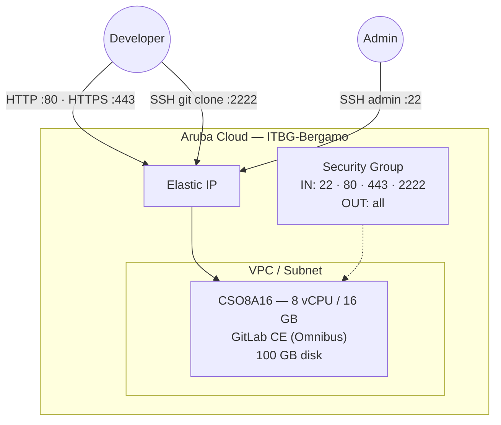

# GitLab CE on Aruba Cloud

Deploy [GitLab Community Edition](https://gitlab.com/oss/gitlab-ce) — a complete DevOps platform with Git hosting, CI/CD, issue tracking, and container registry — on Aruba Cloud using Terraform and cloud-init.

> **Provider version:** arubacloud/arubacloud `~> 0.5` | **Terraform:** ≥ 1.9

---

## Introduction

GitLab CE is a self-hosted alternative to GitHub and GitHub Actions. This example deploys:

- **GitLab CE** via the official Omnibus package on a single VM
- Automatic **Let's Encrypt TLS** when a `letsencrypt_email` is provided
- Separate SSH port **2222** for git operations (port 22 reserved for admin access)
- Web UI, CI/CD runners (bring your own), and container registry ready

> **DNS first:** With HTTPS, GitLab requests a Let's Encrypt certificate during install. Set your `A` record for `gitlab_hostname` → VM public IP before running `terraform apply`.

---

## Architecture Overview



---

## Infrastructure Created

| Resource | Name pattern | Description |
|----------|-------------|-------------|
| `arubacloud_project` | `gitlab-prod` | Project container |
| `arubacloud_vpc` | `gitlab-prod-vpc` | Virtual Private Cloud |
| `arubacloud_subnet` | `gitlab-prod-subnet` | Basic subnet |
| `arubacloud_securitygroup` | `gitlab-prod-vm-sg` | Security group |
| `arubacloud_securityrule` | `gitlab-prod-vm-ssh` | Admin SSH ingress (22) |
| `arubacloud_securityrule` | `gitlab-prod-vm-http` | HTTP ingress (80) |
| `arubacloud_securityrule` | `gitlab-prod-vm-https` | HTTPS ingress (443) |
| `arubacloud_securityrule` | `gitlab-prod-vm-gitssh` | Git SSH ingress (2222) |
| `arubacloud_elasticip` | `gitlab-prod-vm-eip` | VM public IP |
| `arubacloud_blockstorage` | `gitlab-prod-boot` | 100 GB boot disk (Performance) |
| `arubacloud_keypair` | `gitlab-prod-keypair` | SSH public key |
| `arubacloud_cloudserver` | `gitlab-prod-vm` | CloudServer VM |

---

## Estimated Monthly Cost

| Resource | Spec | Est. cost/mo |
|----------|------|-------------|
| CloudServer VM | CSO8A16 — 8 vCPU / 16 GB | ~€80 |
| Boot disk | 100 GB Performance | ~€15 |
| Elastic IP | — | ~€3 |
| **Total** | | **~€98/mo** |

---

## Requirements

- Terraform ≥ 1.9
- ArubaCloud Terraform Provider `~> 0.5`
- An ArubaCloud account with OAuth2 API credentials
- An SSH key pair
- A domain name with DNS control (required for HTTPS / Let's Encrypt)

---

## Variables

### Required

| Variable | Description |
|----------|-------------|
| `arubacloud_client_id` | ArubaCloud OAuth2 client ID |
| `arubacloud_client_secret` | ArubaCloud OAuth2 client secret |
| `ssh_public_key` | SSH public key content |
| `gitlab_hostname` | Public FQDN for GitLab (e.g. `gitlab.example.com`) |
| `gitlab_root_password` | Initial password for the `root` user (min 8 chars) |

### Optional

| Variable | Default | Description |
|----------|---------|-------------|
| `letsencrypt_email` | `""` | Email for Let's Encrypt — enables auto-TLS when set |
| `app_name` | `"gitlab"` | Short name used in all resource names |
| `environment` | `"prod"` | Environment label |
| `location` | `"ITBG-Bergamo"` | ArubaCloud region |
| `zone` | `"ITBG-1"` | Availability zone |
| `billing_period` | `"Hour"` | `"Hour"` or `"Month"` |
| `vm_flavor` | `"CSO8A16"` | CloudServer flavor (min recommended) |
| `vm_disk_size_gb` | `100` | Boot disk size in GB (min 50) |
| `ssh_cidr` | `"0.0.0.0/0"` | CIDR for admin SSH access |

---

## Outputs

| Output | Description |
|--------|-------------|
| `gitlab_url` | GitLab web UI URL |
| `vm_public_ip` | Public IP address of the VM |
| `ssh_command` | SSH admin command |
| `git_ssh_clone` | Example SSH clone URL (port 2222) |

---

## Deployment Instructions

### 1. Clone and navigate

```bash
git clone https://github.com/arubacloud/terraform-arubacloud-examples.git
cd terraform-arubacloud-examples/gitlab
```

### 2. Configure variables

```bash
cp terraform.tfvars.example terraform.tfvars
```

Set `gitlab_hostname` to your FQDN. Set `letsencrypt_email` to enable HTTPS with auto-TLS.

### 3. Point DNS before applying (HTTPS only)

If using `letsencrypt_email`, create the DNS `A` record for `gitlab_hostname` → Elastic IP before running apply.

### 4. Deploy

```bash
terraform init
terraform plan
terraform apply
```

Bootstrap takes approximately **5–10 minutes** (longer with Let's Encrypt).

### 5. Log in

Navigate to the `gitlab_url` output and log in with:

- Username: `root`
- Password: value of `gitlab_root_password`

---

## SSH Git Clone

GitLab CE listens for git SSH operations on port **2222** (port 22 is reserved for admin SSH). Configure your SSH client:

```text
Host gitlab.example.com
  HostName gitlab.example.com
  Port 2222
  User git
```

Then clone normally with `git clone git@gitlab.example.com:<user>/<project>.git`.

---

## References

- [GitLab CE Documentation](https://docs.gitlab.com/ee/)
- [GitLab Omnibus Install Guide](https://docs.gitlab.com/omnibus/installation/)
- [ArubaCloud Terraform Provider](https://registry.terraform.io/providers/arubacloud/arubacloud/latest/docs)
