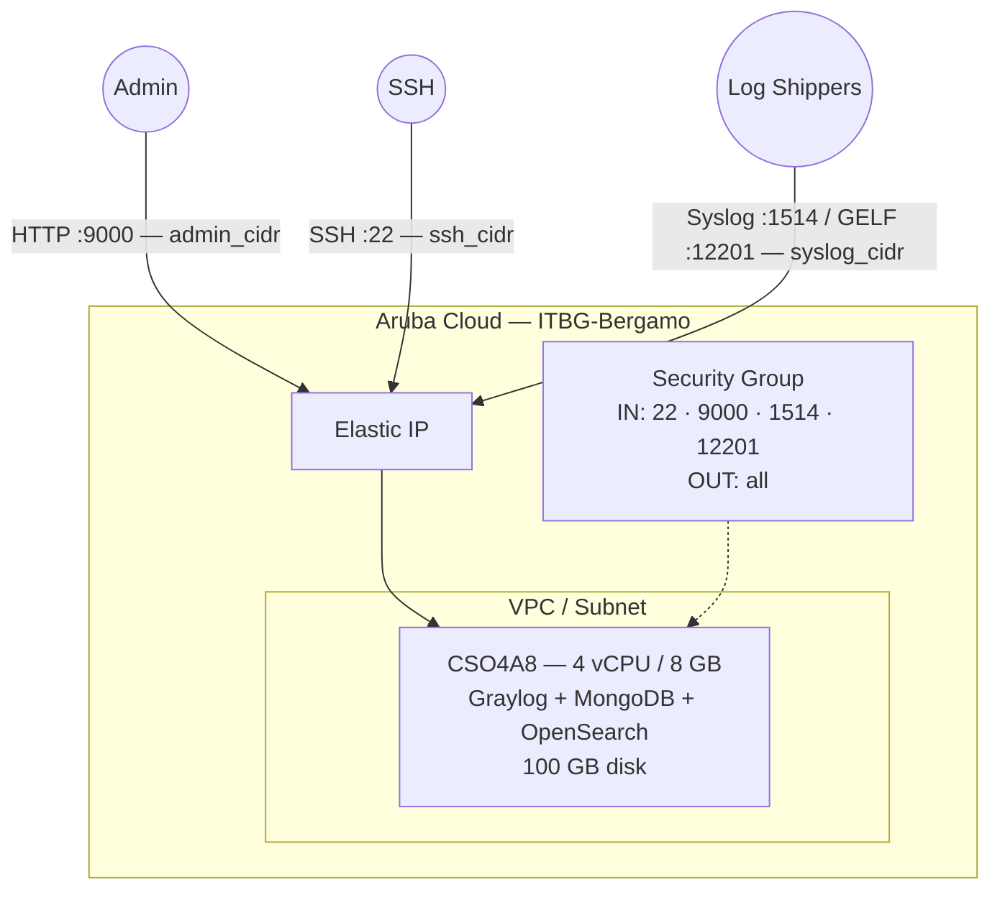

# Graylog on Aruba Cloud

Deploy [Graylog](https://graylog.org/) — centralized log management with search and alerting — on Aruba Cloud using Terraform and cloud-init. Deployed via Docker Compose with MongoDB and OpenSearch co-located on a single node.

> **Provider version:** arubacloud/arubacloud `~> 0.5` | **Terraform:** ≥ 1.9

---

## Introduction

Graylog provides a powerful log aggregation platform with structured search, dashboards, alerting, and stream processing. It requires MongoDB (metadata) and OpenSearch (log index). This example provisions:

- **Graylog** via the official Docker image
- **MongoDB 6** for configuration storage
- **OpenSearch 2** for log indexing and search
- Web UI on port 9000, Syslog input on 1514, GELF input on 12201

---

## Architecture Overview



---

## Infrastructure Created

| Resource | Name pattern | Description |
|----------|-------------|-------------|
| `arubacloud_project` | `gl-prod` | Project container |
| `arubacloud_vpc` | `gl-prod-vpc` | Virtual Private Cloud |
| `arubacloud_subnet` | `gl-prod-subnet` | Basic subnet |
| `arubacloud_securitygroup` | `gl-prod-vm-sg` | Security group |
| `arubacloud_securityrule` | `gl-prod-vm-ssh` | SSH ingress |
| `arubacloud_securityrule` | `gl-prod-vm-webui` | Graylog web UI TCP 9000 |
| `arubacloud_securityrule` | `gl-prod-vm-syslog` | Syslog TCP/UDP 1514 |
| `arubacloud_securityrule` | `gl-prod-vm-gelf` | GELF UDP 12201 |
| `arubacloud_elasticip` | `gl-prod-vm-eip` | VM public IP |
| `arubacloud_blockstorage` | `gl-prod-boot` | 100 GB boot disk (Performance) |
| `arubacloud_keypair` | `gl-prod-keypair` | SSH public key |
| `arubacloud_cloudserver` | `gl-prod-vm` | CloudServer VM |

---

## Estimated Monthly Cost

| Resource | Spec | Est. cost/mo |
|----------|------|-------------|
| CloudServer VM | CSO4A8 — 4 vCPU / 8 GB | ~€35 |
| Boot disk | 100 GB Performance | ~€15 |
| Elastic IP | — | ~€3 |
| **Total** | | **~€53/mo** |

For production log volumes, upgrade to CSO8A16 (8 vCPU / 16 GB, ~€95/mo).

---

## Requirements

- Terraform ≥ 1.9
- ArubaCloud Terraform Provider `~> 0.5`
- An ArubaCloud account with OAuth2 API credentials
- An SSH key pair

---

## Variables

### Required

| Variable | Description |
|----------|-------------|
| `arubacloud_client_id` | ArubaCloud OAuth2 client ID |
| `arubacloud_client_secret` | ArubaCloud OAuth2 client secret |
| `ssh_public_key` | SSH public key content |
| `graylog_admin_password` | Graylog admin password (min 8 chars) |
| `graylog_secret` | Graylog password secret (min 16 chars — generate with `pwgen -N 1 -s 96`) |

### Optional

| Variable | Default | Description |
|----------|---------|-------------|
| `app_name` | `"gl"` | Short name used in all resource names |
| `environment` | `"prod"` | Environment label |
| `location` | `"ITBG-Bergamo"` | ArubaCloud region |
| `zone` | `"ITBG-1"` | Availability zone |
| `billing_period` | `"Hour"` | `"Hour"` or `"Month"` |
| `vm_flavor` | `"CSO4A8"` | CloudServer flavor |
| `vm_image` | `"LU22-001"` | Boot disk image (Ubuntu 22.04 LTS) |
| `vm_disk_size_gb` | `100` | Boot disk size in GB (min 50 GB) |
| `ssh_cidr` | `"0.0.0.0/0"` | CIDR for SSH |
| `admin_cidr` | `"0.0.0.0/0"` | CIDR for web UI port 9000 |
| `syslog_cidr` | `"0.0.0.0/0"` | CIDR for syslog/GELF inputs |
| `graylog_version` | `"6"` | Graylog Docker image tag |

---

## Outputs

| Output | Description |
|--------|-------------|
| `graylog_url` | Graylog web UI URL |
| `vm_public_ip` | Public IP address of the VM |
| `ssh_command` | SSH command to connect to the VM |
| `syslog_endpoint` | Syslog TCP/UDP endpoint |
| `gelf_endpoint` | GELF UDP endpoint |

---

## Deployment Instructions

### 1. Clone and navigate

```bash
git clone https://github.com/arubacloud/terraform-arubacloud-examples.git
cd terraform-arubacloud-examples/graylog
```

### 2. Configure variables

```bash
cp terraform.tfvars.example terraform.tfvars
```

Generate a strong secret:

```bash
pwgen -N 1 -s 96
```

### 3. Deploy

```bash
terraform init
terraform plan
terraform apply
```

Bootstrap takes approximately **5–10 minutes** (OpenSearch initialisation is the slowest step).

### 4. Access the UI

Navigate to `http://<IP>:9000` and log in as `admin` with your `graylog_admin_password`.

### 5. Configure an input

In the web UI: **System → Inputs → Launch new input**. Select **Syslog UDP** and bind to port 1514.

---

## Sending Logs

```bash
# rsyslog: add to /etc/rsyslog.d/90-graylog.conf
*.* @<graylog-ip>:1514;RSYSLOG_SyslogProtocol23Format

# filebeat: in filebeat.yml
output.logstash:
  hosts: ["<graylog-ip>:5044"]
```

---

## References

- [Graylog Documentation](https://docs.graylog.org/)
- [Graylog Docker Setup](https://docs.graylog.org/docs/docker)
- [ArubaCloud Terraform Provider](https://registry.terraform.io/providers/arubacloud/arubacloud/latest/docs)
