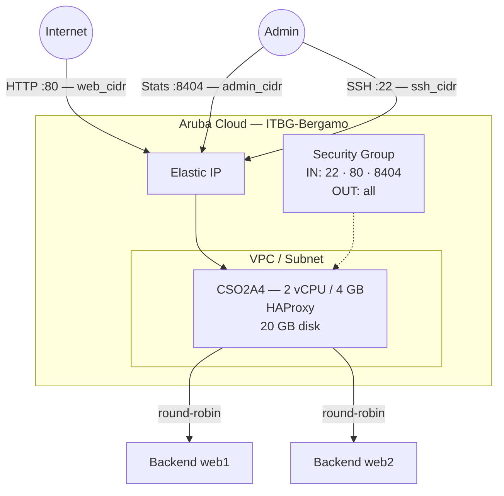

# HAProxy on Aruba Cloud

Deploy [HAProxy](https://www.haproxy.org) — a high-performance TCP/HTTP load balancer and proxy — on Aruba Cloud using Terraform and cloud-init. Backend servers are configured directly as a Terraform variable, making it easy to wire HAProxy in front of other examples in this repository.

> **Provider version:** arubacloud/arubacloud `~> 0.5` | **Terraform:** ≥ 1.9

---

## Introduction

HAProxy is the de-facto standard open-source load balancer for high-availability web applications. This example provisions:

- **HAProxy** installed from Ubuntu 22.04 packages
- **HTTP frontend** on port 80 with configurable round-robin backends
- **Stats page** on port 8404 (restricted to `admin_cidr`) with password auth
- Backend servers supplied via the `backends` Terraform variable — add or remove servers with `terraform apply`

> **No backends?** Deploy without backends and HAProxy will return 503 on port 80. Add backend IPs later by updating `backends` and re-applying.

---

## Architecture Overview



---

## Infrastructure Created

| Resource | Name pattern | Description |
|----------|-------------|-------------|
| `arubacloud_project` | `haproxy-prod` | Project container |
| `arubacloud_vpc` | `haproxy-prod-vpc` | Virtual Private Cloud |
| `arubacloud_subnet` | `haproxy-prod-subnet` | Basic subnet |
| `arubacloud_securitygroup` | `haproxy-prod-vm-sg` | Security group |
| `arubacloud_securityrule` | `haproxy-prod-vm-ssh` | SSH ingress |
| `arubacloud_securityrule` | `haproxy-prod-vm-http` | HTTP ingress TCP 80 |
| `arubacloud_securityrule` | `haproxy-prod-vm-stats` | Stats page TCP 8404 |
| `arubacloud_elasticip` | `haproxy-prod-vm-eip` | VM public IP |
| `arubacloud_blockstorage` | `haproxy-prod-boot` | 20 GB boot disk (Performance) |
| `arubacloud_keypair` | `haproxy-prod-keypair` | SSH public key |
| `arubacloud_cloudserver` | `haproxy-prod-vm` | CloudServer VM |

---

## Estimated Monthly Cost

| Resource | Spec | Est. cost/mo |
|----------|------|-------------|
| CloudServer VM | CSO2A4 — 2 vCPU / 4 GB | ~€18 |
| Boot disk | 20 GB Performance | ~€3 |
| Elastic IP | — | ~€3 |
| **Total** | | **~€24/mo** |

---

## Requirements

- Terraform ≥ 1.9
- ArubaCloud Terraform Provider `~> 0.5`
- An ArubaCloud account with OAuth2 API credentials
- An SSH key pair

---

## Variables

### Required

| Variable | Description |
|----------|-------------|
| `arubacloud_client_id` | ArubaCloud OAuth2 client ID |
| `arubacloud_client_secret` | ArubaCloud OAuth2 client secret |
| `ssh_public_key` | SSH public key content |
| `stats_password` | Password for HAProxy stats page (username: `admin`) |

### Optional

| Variable | Default | Description |
|----------|---------|-------------|
| `app_name` | `"haproxy"` | Short name used in all resource names |
| `environment` | `"prod"` | Environment label |
| `location` | `"ITBG-Bergamo"` | ArubaCloud region |
| `zone` | `"ITBG-1"` | Availability zone |
| `billing_period` | `"Hour"` | `"Hour"` or `"Month"` |
| `vm_flavor` | `"CSO2A4"` | CloudServer flavor |
| `vm_image` | `"LU22-001"` | Boot disk image (Ubuntu 22.04 LTS) |
| `vm_disk_size_gb` | `20` | Boot disk size in GB |
| `ssh_cidr` | `"0.0.0.0/0"` | CIDR for SSH |
| `web_cidr` | `"0.0.0.0/0"` | CIDR for HTTP frontend port 80 |
| `admin_cidr` | `"0.0.0.0/0"` | CIDR for stats page port 8404 — restrict in production |
| `backends` | `[]` | Backend server list in `host:port` format |

---

## Outputs

| Output | Description |
|--------|-------------|
| `proxy_url` | HAProxy HTTP frontend URL |
| `stats_url` | HAProxy stats page URL |
| `vm_public_ip` | Public IP address of the VM |
| `ssh_command` | SSH command to connect to the VM |

---

## Deployment Instructions

### 1. Clone and navigate

```bash
git clone https://github.com/arubacloud/terraform-arubacloud-examples.git
cd terraform-arubacloud-examples/haproxy
```

### 2. Configure variables

```bash
cp terraform.tfvars.example terraform.tfvars
```

Set the stats password and optionally your backend servers:

```hcl
stats_password = "your-stats-password"
backends       = ["10.0.0.1:80", "10.0.0.2:80"]
```

### 3. Deploy

```bash
terraform init
terraform plan
terraform apply
```

Bootstrap takes approximately **1–2 minutes**.

### 4. Access the stats page

```bash
terraform output stats_url
```

Log in with `admin` / `stats_password` to view live connection counts, traffic rates, and backend health.

### 5. Add or remove backends

Update the `backends` variable and re-apply — no VM restart needed:

```bash
# terraform.tfvars
backends = ["10.0.0.1:80", "10.0.0.2:80", "10.0.0.3:80"]
```

```bash
terraform apply
```

HAProxy reloads gracefully without dropping active connections.

---

## Security Recommendations

1. **Restrict `admin_cidr`** to your management IP. The stats page exposes server IPs, connection counts, and configuration details.

2. **Use HTTPS for production.** Pair HAProxy with a TLS terminator (e.g., Caddy or NGINX in front) or configure HAProxy to terminate SSL directly using a certificate in `/etc/ssl/`.

---

## Troubleshooting

### HAProxy not starting

```bash
sudo haproxy -c -f /etc/haproxy/haproxy.cfg   # config check
sudo systemctl status haproxy
sudo journalctl -u haproxy -n 30
```

### Backend servers showing DOWN in stats

HAProxy performs `GET /` health checks on each backend. Ensure:

- Backends are reachable from the HAProxy VM on the configured port
- The backend HTTP server returns 2xx on `GET /`

Check connectivity:

```bash
curl -sv http://<backend-ip>:<port>/
```

---

## References

- [HAProxy Documentation](https://docs.haproxy.org)
- [HAProxy Configuration Manual](https://docs.haproxy.org/2.8/configuration.html)
- [ArubaCloud Terraform Provider](https://registry.terraform.io/providers/arubacloud/arubacloud/latest/docs)
