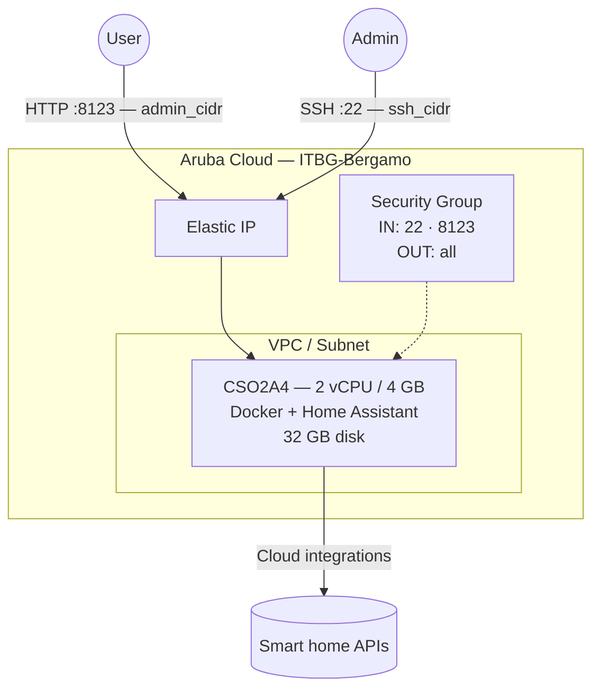

# Home Assistant on Aruba Cloud

Deploy [Home Assistant](https://www.home-assistant.io) — the leading open-source home automation platform — on Aruba Cloud using Terraform and cloud-init. Home Assistant runs as a Docker container (Home Assistant Container edition) with persistent configuration storage.

> **Provider version:** arubacloud/arubacloud `~> 0.5` | **Terraform:** ≥ 1.9

---

## Introduction

Home Assistant is a privacy-focused home automation hub that integrates with thousands of smart home devices. This example deploys the **Home Assistant Container** edition, which provides the full Home Assistant core experience in a Docker container. It provisions:

- **Docker** installed from the official Docker apt repository
- **Home Assistant Container** (`ghcr.io/home-assistant/home-assistant:stable`) managed by Docker Compose
- Persistent configuration stored in `/opt/homeassistant/config`
- A systemd service that starts Home Assistant automatically on boot
- Port 8123 for the web UI, restricted to `admin_cidr`
- Configurable timezone

> **First-time setup:** The first visit to the Home Assistant UI triggers the onboarding wizard where you create your admin account and configure your home location. No credentials are pre-set by Terraform.

---

## Architecture Overview



---

## Infrastructure Created

| Resource | Name pattern | Description |
|----------|-------------|-------------|
| `arubacloud_project` | `ha-prod` | Project container |
| `arubacloud_vpc` | `ha-prod-vpc` | Virtual Private Cloud |
| `arubacloud_subnet` | `ha-prod-subnet` | Basic subnet |
| `arubacloud_securitygroup` | `ha-prod-vm-sg` | Security group |
| `arubacloud_securityrule` | `ha-prod-vm-ssh` | SSH ingress |
| `arubacloud_securityrule` | `ha-prod-vm-admin-ui` | Web UI ingress TCP 8123 |
| `arubacloud_elasticip` | `ha-prod-vm-eip` | VM public IP |
| `arubacloud_blockstorage` | `ha-prod-boot` | 32 GB boot disk (Performance) |
| `arubacloud_keypair` | `ha-prod-keypair` | SSH public key |
| `arubacloud_cloudserver` | `ha-prod-vm` | CloudServer VM |

---

## Estimated Monthly Cost

| Resource | Spec | Est. cost/mo |
|----------|------|-------------|
| CloudServer VM | CSO2A4 — 2 vCPU / 4 GB | ~€18 |
| Boot disk | 32 GB Performance | ~€5 |
| Elastic IP | — | ~€3 |
| **Total** | | **~€26/mo** |

---

## Requirements

- Terraform ≥ 1.9
- ArubaCloud Terraform Provider `~> 0.5`
- An ArubaCloud account with OAuth2 API credentials
- An SSH key pair

---

## Variables

### Required

| Variable | Description |
|----------|-------------|
| `arubacloud_client_id` | ArubaCloud OAuth2 client ID |
| `arubacloud_client_secret` | ArubaCloud OAuth2 client secret |
| `ssh_public_key` | SSH public key content |

### Optional

| Variable | Default | Description |
|----------|---------|-------------|
| `app_name` | `"ha"` | Short name used in all resource names |
| `environment` | `"prod"` | Environment label |
| `location` | `"ITBG-Bergamo"` | ArubaCloud region |
| `zone` | `"ITBG-1"` | Availability zone |
| `billing_period` | `"Hour"` | `"Hour"` or `"Month"` |
| `vm_flavor` | `"CSO2A4"` | CloudServer flavor |
| `vm_image` | `"LU22-001"` | Boot disk image (Ubuntu 22.04 LTS) |
| `vm_disk_size_gb` | `32` | Boot disk size in GB |
| `ssh_cidr` | `"0.0.0.0/0"` | CIDR for SSH |
| `admin_cidr` | `"0.0.0.0/0"` | CIDR for web UI port 8123 — restrict in production |
| `timezone` | `"UTC"` | Timezone for Home Assistant |

---

## Outputs

| Output | Description |
|--------|-------------|
| `home_assistant_url` | Home Assistant web UI URL |
| `vm_public_ip` | Public IP address of the VM |
| `ssh_command` | SSH command to connect to the VM |

---

## Deployment Instructions

### 1. Clone and navigate

```bash
git clone https://github.com/arubacloud/terraform-arubacloud-examples.git
cd terraform-arubacloud-examples/home-assistant
```

### 2. Configure variables

```bash
cp terraform.tfvars.example terraform.tfvars
```

Set your credentials, timezone, and restrict the UI to your IP:

```hcl
timezone   = "Europe/Rome"
admin_cidr = "203.0.113.42/32"
ssh_cidr   = "203.0.113.42/32"
```

### 3. Deploy

```bash
terraform init
terraform plan
terraform apply
```

Bootstrap takes approximately **3–5 minutes** (Docker install + image pull).

### 4. Complete onboarding

```bash
terraform output home_assistant_url
```

Open the URL — the first visit shows the onboarding wizard. Create your admin account, set your home location, and start adding integrations.

---

## Security Recommendations

1. **Restrict `admin_cidr`** to your IP or VPN tunnel CIDR. Home Assistant on `0.0.0.0/0` is acceptable for initial setup, but should be locked down before connecting any real devices.

2. **Enable HTTPS.** Home Assistant supports TLS natively. After onboarding, go to **Settings → System → Network** and configure a trusted network or enable the built-in HTTPS proxy. Alternatively, place it behind Caddy or NGINX (from this repo) for automatic TLS.

3. **Use a VPN.** The recommended long-term setup: restrict `admin_cidr` to your WireGuard tunnel CIDR and access Home Assistant exclusively over VPN.

---

## Troubleshooting

### Home Assistant not loading after deploy

```bash
ssh ubuntu@$(terraform output -raw vm_public_ip)
docker logs homeassistant --tail 50
sudo systemctl status homeassistant
```

The first start pulls ~200 MB from GitHub Container Registry — give it 3–5 minutes.

### Updating Home Assistant

```bash
ssh ubuntu@$(terraform output -raw vm_public_ip)
cd /opt/homeassistant
docker compose pull
docker compose up -d
```

Home Assistant releases new versions monthly. Consider enabling **Settings → System → Updates** in the HA UI for in-place updates.

---

## References

- [Home Assistant Container Installation](https://www.home-assistant.io/installation/linux#docker-compose)
- [Home Assistant Integrations](https://www.home-assistant.io/integrations/)
- [WireGuard Example](wireguard.md)
- [ArubaCloud Terraform Provider](https://registry.terraform.io/providers/arubacloud/arubacloud/latest/docs)
