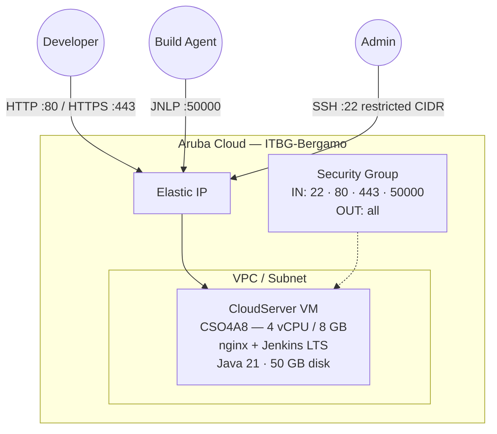

# Jenkins on Aruba Cloud

Deploy a production-ready [Jenkins](https://www.jenkins.io) CI/CD automation server on Aruba Cloud using Terraform and cloud-init. Java 21 + Jenkins LTS installed from the official APT repository — no manual configuration required.

> **Provider version:** arubacloud/arubacloud `~> 0.5` | **Terraform:** ≥ 1.9

---

## Introduction

Jenkins is the most widely used open-source automation server for building, testing, and deploying software. This example provisions a complete Jenkins LTS stack on Aruba Cloud with:

- A **CloudServer VM** (CSO4A8 — 4 vCPU / 8 GB) running Jenkins LTS behind an nginx reverse proxy, fully bootstrapped by cloud-init
- **Java 21 (OpenJDK)** — the recommended JVM for Jenkins LTS
- A dedicated **VPC, subnet, and security group** via the shared network module
- An **Elastic IP** for stable external access
- Port **50000** open for remote build agents connecting via the JNLP protocol
- Optional **Let's Encrypt HTTPS** when a custom domain is provided

The initial admin password is generated automatically and printed in the bootstrap log. The first login completes the Jenkins setup wizard.

---

## Architecture Overview

Jenkins listens on port 8080. nginx proxies all HTTP/HTTPS traffic to Jenkins on the same host, with `proxy_buffering off` to support pipeline log streaming. Remote agents connect directly on port 50000.



---

## Infrastructure Created

| Resource | Name pattern | Description |
|----------|-------------|-------------|
| `arubacloud_project` | `jenkins-prod` | Project container |
| `arubacloud_vpc` | `jenkins-prod-vpc` | Virtual Private Cloud |
| `arubacloud_subnet` | `jenkins-prod-subnet` | Basic subnet |
| `arubacloud_securitygroup` | `jenkins-prod-vm-sg` | Security group |
| `arubacloud_securityrule` | `jenkins-prod-vm-ssh` | SSH ingress (restricted CIDR) |
| `arubacloud_securityrule` | `jenkins-prod-vm-http` | HTTP ingress |
| `arubacloud_securityrule` | `jenkins-prod-vm-https` | HTTPS ingress |
| `arubacloud_securityrule` | `jenkins-prod-vm-jnlp` | JNLP agent ingress (port 50000) |
| `arubacloud_elasticip` | `jenkins-prod-vm-eip` | VM public IP |
| `arubacloud_blockstorage` | `jenkins-prod-boot` | 50 GB boot disk (Performance) |
| `arubacloud_keypair` | `jenkins-prod-keypair` | SSH public key |
| `arubacloud_cloudserver` | `jenkins-prod-vm` | CloudServer VM |

---

## VM Sizing Recommendation

| Workload | vCPU | RAM | Disk | Flavor |
|----------|------|-----|------|--------|
| Small team / few pipelines | 4 | 8 GB | 50 GB | `CSO4A8` *(default)* |
| Medium team / many parallel builds | 8 | 16 GB | 100 GB | `CSO8A16` |

Jenkins runs builds directly on the controller by default. For production, offload builds to dedicated agents and increase `vm_disk_size_gb` to store build artifacts and workspace data.

---

## Estimated Monthly Cost

> Approximate prices for ITBG-Bergamo, hourly billing.

| Resource | Spec | Est. cost/mo |
|----------|------|-------------|
| CloudServer VM | CSO4A8 — 4 vCPU / 8 GB | ~€36 |
| Boot disk | 50 GB Performance | ~€6 |
| Elastic IP | — | ~€3 |
| **Total** | | **~€45/mo** |

---

## Requirements

- Terraform ≥ 1.9
- ArubaCloud Terraform Provider `~> 0.5`
- An ArubaCloud account with OAuth2 API credentials
- An SSH key pair

---

## Variables

### Required

| Variable | Description |
|----------|-------------|
| `arubacloud_client_id` | ArubaCloud OAuth2 client ID |
| `arubacloud_client_secret` | ArubaCloud OAuth2 client secret |
| `ssh_public_key` | SSH public key content |

### Optional

| Variable | Default | Description |
|----------|---------|-------------|
| `app_name` | `"jenkins"` | Short name used in all resource names |
| `environment` | `"prod"` | Environment label |
| `location` | `"ITBG-Bergamo"` | ArubaCloud region |
| `zone` | `"ITBG-1"` | Availability zone |
| `billing_period` | `"Hour"` | `"Hour"` or `"Month"` |
| `vm_flavor` | `"CSO4A8"` | CloudServer flavor |
| `vm_image` | `"LU22-001"` | Boot disk image (Ubuntu 22.04 LTS) |
| `vm_disk_size_gb` | `50` | Boot disk size in GB |
| `ssh_cidr` | `"0.0.0.0/0"` | CIDR for SSH — **restrict to your IP in production** |
| `agent_cidr` | `"0.0.0.0/0"` | CIDR for JNLP agent port 50000 — restrict to your agent network |
| `domain` | `""` | Custom domain for HTTPS — leave empty to use the Elastic IP |

---

## Outputs

| Output | Description |
|--------|-------------|
| `jenkins_url` | Jenkins web interface URL |
| `vm_public_ip` | Public IP address of the VM |
| `ssh_command` | SSH command to connect to the VM |
| `initial_password_cmd` | Command to retrieve the initial admin password |
| `jnlp_agent_port` | JNLP port for remote build agents (50000) |

---

## Deployment Instructions

### 1. Clone and navigate

```bash
git clone https://github.com/arubacloud/terraform-arubacloud-examples.git
cd terraform-arubacloud-examples/jenkins
```

### 2. Configure variables

```bash
cp terraform.tfvars.example terraform.tfvars
```

Edit `terraform.tfvars` with your credentials and SSH key.

### 3. Initialize and deploy

```bash
terraform init
terraform plan
terraform apply
```

Bootstrap takes approximately **5–8 minutes** (Java and Jenkins install from APT).

### 4. Retrieve the initial admin password

```bash
terraform output -raw initial_password_cmd | bash
```

### 5. Complete the setup wizard

Open the Jenkins URL in your browser:

```bash
terraform output jenkins_url
```

Paste the initial admin password, install suggested plugins, and create your admin account.

### 6. Follow cloud-init progress (optional)

```bash
ssh ubuntu@$(terraform output -raw vm_public_ip)
sudo tail -f /var/log/cloud-init-output.log
```

---

## Destroy Instructions

```bash
terraform destroy
```

All resources including the boot disk (and any Jenkins jobs, credentials, and build history stored on it) are permanently deleted.

---

## Security Recommendations

1. **Restrict SSH to your IP.** Set `ssh_cidr = "your.ip/32"`.

2. **Restrict JNLP to your agent network.** Set `agent_cidr` to the IP range of your build agents. Exposing port 50000 publicly allows anyone to attempt agent registration.

3. **Use a custom domain with HTTPS.** Set the `domain` variable to enable TLS. Without HTTPS, credentials submitted via the web UI are transmitted in cleartext.

4. **Disable agent-to-controller security bypass.** In Jenkins → Manage Jenkins → Security, ensure "Agent → Controller Security" is enabled.

5. **Create a non-admin service account** for pipelines. Avoid running pipelines as the Jenkins admin.

6. **Back up `JENKINS_HOME`.** All job configuration, credentials, and build history live in `/var/lib/jenkins`. Schedule regular snapshots.

---

## Upgrade Considerations

### Jenkins LTS upgrade

Jenkins LTS is installed via APT. To upgrade:

```bash
ssh ubuntu@$(terraform output -raw vm_public_ip)
sudo apt-get update
sudo apt-get install --only-upgrade jenkins
sudo systemctl status jenkins
```

Jenkins performs automatic data migration on startup. Review the [Jenkins LTS changelog](https://www.jenkins.io/changelog-stable/) for breaking changes before upgrading.

### Java upgrade

If a future Jenkins LTS requires a newer Java version, update the `openjdk-21-jdk-headless` package name in `cloud-init.yaml.tpl` and redeploy the VM.

---

## Troubleshooting

### Jenkins not reachable after apply

```bash
ssh ubuntu@$(terraform output -raw vm_public_ip)
sudo systemctl status jenkins
sudo journalctl -u jenkins -n 50
sudo tail -f /var/log/cloud-init-output.log
```

### nginx returns 502 Bad Gateway

Jenkins is still starting. Jenkins takes 1–2 minutes to initialize on first boot:

```bash
sudo systemctl status jenkins
# Wait for "Jenkins is fully up and running" in the logs:
sudo journalctl -u jenkins -f
```

### Setup wizard asks for initial password after Certbot redirect

The initial password file does not move after HTTPS is configured:

```bash
sudo cat /var/lib/jenkins/secrets/initialAdminPassword
```

### Build agents cannot connect on port 50000

Verify the security group rule and the configured TCP port in Jenkins → Manage Jenkins → Security → Agent protocols. The JNLP port must match both the security group rule and the Jenkins configuration.

---

## References

- [Jenkins Documentation](https://www.jenkins.io/doc/)
- [Jenkins LTS Releases](https://www.jenkins.io/changelog-stable/)
- [Jenkins on Ubuntu/Debian](https://www.jenkins.io/doc/book/installing/linux/#debianubuntu)
- [ArubaCloud Terraform Provider](https://registry.terraform.io/providers/arubacloud/arubacloud/latest/docs)
- [cloud-init Reference](https://cloudinit.readthedocs.io/)
