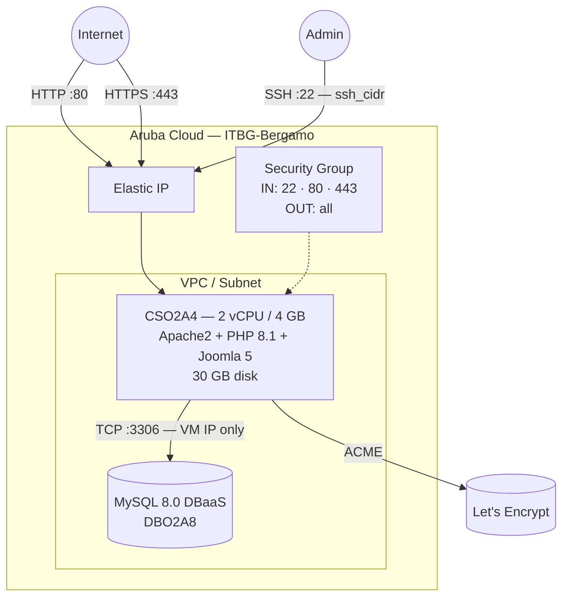

# Joomla on Aruba Cloud

Deploy [Joomla 5](https://www.joomla.org) — a popular open-source CMS — on Aruba Cloud using Terraform and cloud-init. Joomla is installed via the official CLI installer with a managed MySQL 8.0 DBaaS backend.

> **Provider version:** arubacloud/arubacloud `~> 0.5` | **Terraform:** ≥ 1.9

---

## Introduction

Joomla 5 is a feature-rich CMS suitable for websites, intranets, and web applications. This example provisions:

- **Apache2 + PHP 8.1** with all Joomla-required extensions
- **Joomla** downloaded from the official GitHub release and installed via the built-in CLI installer in fully unattended mode
- **Managed MySQL 8.0** via ArubaCloud DBaaS
- Ports 80 and 443 open to the internet
- **Optional HTTPS** via Let's Encrypt when `domain` is set
- Installation directory removed automatically after setup (Joomla security requirement)

---

## Architecture Overview



---

## Infrastructure Created

| Resource | Name pattern | Description |
|----------|-------------|-------------|
| `arubacloud_project` | `joomla-prod` | Project container |
| `arubacloud_vpc` | `joomla-prod-vpc` | Virtual Private Cloud |
| `arubacloud_subnet` | `joomla-prod-subnet` | Basic subnet |
| `arubacloud_securitygroup` | `joomla-prod-vm-sg` | VM security group |
| `arubacloud_securitygroup` | `joomla-prod-dbaas-sg` | DBaaS security group |
| `arubacloud_securityrule` | `joomla-prod-vm-ssh` | SSH ingress |
| `arubacloud_securityrule` | `joomla-prod-vm-http` | HTTP ingress TCP 80 |
| `arubacloud_securityrule` | `joomla-prod-vm-https` | HTTPS ingress TCP 443 |
| `arubacloud_securityrule` | `joomla-prod-db-mysql` | MySQL ingress from VM IP only |
| `arubacloud_elasticip` | `joomla-prod-vm-eip` | VM public IP |
| `arubacloud_elasticip` | `joomla-prod-dbaas-eip` | DBaaS public IP |
| `arubacloud_blockstorage` | `joomla-prod-boot` | 30 GB boot disk (Performance) |
| `arubacloud_keypair` | `joomla-prod-keypair` | SSH public key |
| `arubacloud_dbaas` | `joomla-prod-dbaas` | Managed MySQL 8.0 |
| `arubacloud_database` | `joomla` | Joomla database |
| `arubacloud_dbaasuser` | `joomla` | Joomla DB user |
| `arubacloud_cloudserver` | `joomla-prod-vm` | CloudServer VM |

---

## Estimated Monthly Cost

| Resource | Spec | Est. cost/mo |
|----------|------|-------------|
| CloudServer VM | CSO2A4 — 2 vCPU / 4 GB | ~€18 |
| Boot disk | 30 GB Performance | ~€5 |
| Elastic IP (VM) | — | ~€3 |
| MySQL DBaaS | DBO2A8 + 20 GB | ~€30 |
| Elastic IP (DBaaS) | — | ~€3 |
| **Total** | | **~€59/mo** |

---

## Requirements

- Terraform ≥ 1.9
- ArubaCloud Terraform Provider `~> 0.5`
- An ArubaCloud account with OAuth2 API credentials
- An SSH key pair

---

## Variables

### Required

| Variable | Description |
|----------|-------------|
| `arubacloud_client_id` | ArubaCloud OAuth2 client ID |
| `arubacloud_client_secret` | ArubaCloud OAuth2 client secret |
| `ssh_public_key` | SSH public key content |
| `db_password` | Joomla MySQL user password (min 16 chars) |
| `admin_email` | Joomla admin email address |
| `admin_password` | Joomla admin password (min 12 chars) |

### Optional

| Variable | Default | Description |
|----------|---------|-------------|
| `app_name` | `"joomla"` | Short name used in all resource names |
| `environment` | `"prod"` | Environment label |
| `location` | `"ITBG-Bergamo"` | ArubaCloud region |
| `zone` | `"ITBG-1"` | Availability zone |
| `billing_period` | `"Hour"` | `"Hour"` or `"Month"` |
| `vm_flavor` | `"CSO2A4"` | CloudServer flavor |
| `vm_image` | `"LU22-001"` | Boot disk image (Ubuntu 22.04 LTS) |
| `vm_disk_size_gb` | `30` | Boot disk size in GB |
| `ssh_cidr` | `"0.0.0.0/0"` | CIDR for SSH — restrict in production |
| `dbaas_flavor` | `"DBO2A8"` | DBaaS instance flavor |
| `db_storage_gb` | `20` | DBaaS initial storage size in GB |
| `site_name` | `"My Joomla Site"` | Site display name |
| `admin_user` | `"admin"` | Joomla admin username |
| `admin_fullname` | `"Site Administrator"` | Joomla admin full name |
| `joomla_version` | `"5.3.2"` | Joomla release version |
| `domain` | `""` | Domain for automatic Let's Encrypt HTTPS |

---

## Outputs

| Output | Description |
|--------|-------------|
| `site_url` | Joomla site URL |
| `admin_url` | Joomla administrator panel URL |
| `vm_public_ip` | Public IP address of the VM |
| `ssh_command` | SSH command to connect to the VM |
| `db_host` | MySQL DBaaS host address |

---

## Deployment Instructions

### 1. Clone and navigate

```bash
git clone https://github.com/arubacloud/terraform-arubacloud-examples.git
cd terraform-arubacloud-examples/joomla
```

### 2. Configure variables

```bash
cp terraform.tfvars.example terraform.tfvars
```

### 3. Deploy

```bash
terraform init
terraform plan
terraform apply
```

Bootstrap takes approximately **5–10 minutes**.

### 4. Access Joomla

```bash
terraform output site_url
terraform output admin_url
```

Log in to `/administrator` with `admin_user` and `admin_password`.

---

## References

- [Joomla Documentation](https://docs.joomla.org)
- [Joomla CLI Installer](https://docs.joomla.org/J4.x:CLI_Installation)
- [ArubaCloud Terraform Provider](https://registry.terraform.io/providers/arubacloud/arubacloud/latest/docs)
