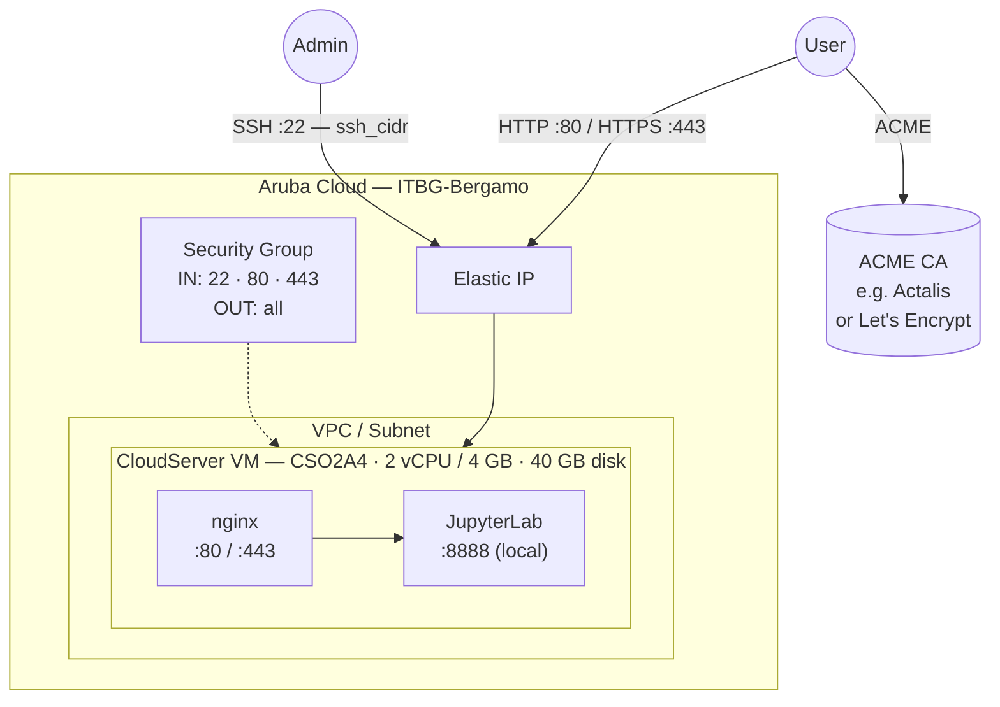

# JupyterLab on Aruba Cloud

Deploy [JupyterLab](https://jupyterlab.readthedocs.io) — the next-generation web-based notebook interface — on Aruba Cloud using Terraform and cloud-init. This example provisions a password-protected JupyterLab server behind nginx with optional automatic HTTPS.

> **Provider version:** arubacloud/arubacloud `~> 1.0` | **Terraform:** ≥ 1.9

---

## Introduction

JupyterLab is the standard interactive computing environment for data science, machine learning, and scientific computing. This example provisions a single VM running:

- **JupyterLab** served on port 8888 (localhost only)
- **nginx** reverse proxy on ports 80/443 — the only publicly exposed entry point
- **Password authentication** via jupyter_server hashed credentials
- **Python virtual environment** in `/opt/jupyterlab` — add packages without affecting the system Python
- **Notebook storage** in `/opt/notebooks` — persistent across server restarts

---

## Architecture Overview



---

## Infrastructure Created

| Resource | Name pattern | Description |
|----------|-------------|-------------|
| `arubacloud_project` | `jupyter-prod` | Project container |
| `arubacloud_vpc` | `jupyter-prod-vpc` | Virtual Private Cloud |
| `arubacloud_subnet` | `jupyter-prod-subnet` | Basic subnet |
| `arubacloud_securitygroup` | `jupyter-prod-vm-sg` | Security group |
| `arubacloud_securityrule` | `jupyter-prod-vm-ssh` | SSH ingress |
| `arubacloud_securityrule` | `jupyter-prod-vm-http` | HTTP ingress TCP 80 |
| `arubacloud_securityrule` | `jupyter-prod-vm-https` | HTTPS ingress TCP 443 |
| `arubacloud_elasticip` | `jupyter-prod-vm-eip` | VM public IP |
| `arubacloud_blockstorage` | `jupyter-prod-boot` | 40 GB boot disk (Performance) |
| `arubacloud_keypair` | `jupyter-prod-keypair` | SSH public key |
| `arubacloud_cloudserver` | `jupyter-prod-vm` | CloudServer VM |

---

## Estimated Monthly Cost

| Resource | Spec | Est. cost/mo |
|----------|------|-------------|
| CloudServer VM | CSO2A4 — 2 vCPU / 4 GB | ~€18 |
| Boot disk | 40 GB Performance | ~€6 |
| Elastic IP | — | ~€3 |
| **Total** | | **~€27/mo** |

Upgrade to `CSO4A8` (4 vCPU / 8 GB, ~€36/mo) for compute-intensive workloads or large datasets.

---

## Requirements

- Terraform ≥ 1.9
- ArubaCloud Terraform Provider `~> 1.0`
- An ArubaCloud account with OAuth2 API credentials
- An SSH key pair

---

## Variables

### Required

| Variable | Description |
|----------|-------------|
| `arubacloud_client_id` | ArubaCloud OAuth2 client ID |
| `arubacloud_client_secret` | ArubaCloud OAuth2 client secret |
| `ssh_public_key` | SSH public key content |
| `jupyter_password` | Password for JupyterLab web interface (min 8 chars) |

### Optional

| Variable | Default | Description |
|----------|---------|-------------|
| `app_name` | `"jupyter"` | Short name used in all resource names |
| `environment` | `"prod"` | Environment label |
| `location` | `"ITBG-Bergamo"` | ArubaCloud region |
| `zone` | `"ITBG-1"` | Availability zone |
| `billing_period` | `"Hour"` | `"Hour"` or `"Month"` |
| `vm_flavor` | `"CSO2A4"` | CloudServer flavor |
| `vm_image` | `"LU22-001"` | Boot disk image (Ubuntu 22.04 LTS) |
| `vm_disk_size_gb` | `40` | Boot disk size in GB |
| `ssh_cidr` | `"0.0.0.0/0"` | CIDR for SSH — **restrict to your IP in production** |
| `domain` | `""` | Custom domain for ACME HTTPS |

---

## Outputs

| Output | Description |
|--------|-------------|
| `app_url` | JupyterLab web interface URL |
| `vm_public_ip` | Public IP address of the VM |
| `ssh_command` | SSH command to connect to the VM |

---

## Deployment Instructions

### 1. Clone and navigate

```bash
git clone https://github.com/arubacloud/terraform-arubacloud-examples.git
cd terraform-arubacloud-examples/jupyterlab
```

### 2. Configure variables

```bash
cp terraform.tfvars.example terraform.tfvars
```

Set `jupyter_password` to a strong value, along with your credentials and SSH key.

### 3. Deploy

```bash
terraform init
terraform plan
terraform apply
```

Bootstrap takes approximately **5–8 minutes** (Python venv creation and JupyterLab installation via pip).

### 4. Open JupyterLab

```bash
terraform output app_url
```

Open the URL in your browser and log in with the `jupyter_password` you set.

---

## Enabling HTTPS (ACME)

When `domain` is set to a real domain:

1. Create a DNS A record: `notebooks.example.com → <vm_public_ip>`
2. Set `domain = "notebooks.example.com"` in `terraform.tfvars`
3. Re-apply — Certbot provisions a certificate via an ACME provider such as [Actalis](https://guide.actalis.com/it/ssl/attivazione/acme) or Let's Encrypt

---

## Installing Additional Packages

SSH into the VM and install into the JupyterLab virtual environment:

```bash
ssh ubuntu@$(terraform output -raw vm_public_ip)
/opt/jupyterlab/bin/pip install pandas scikit-learn matplotlib seaborn
sudo systemctl restart jupyterlab
```

---

## Security Recommendations

1. **Restrict SSH to your IP.** Set `ssh_cidr = "your.ip/32"`.
2. **Use a custom domain with HTTPS.** The password is transmitted in cleartext over HTTP.
3. **Do not run as root.** JupyterLab runs as the `jupyter` system user with no sudo access.
4. **Back up notebooks regularly.** Notebook files in `/opt/notebooks` are stored on the boot disk. Create snapshots or sync to object storage.

---

## Troubleshooting

### JupyterLab not loading after apply

```bash
ssh ubuntu@$(terraform output -raw vm_public_ip)
sudo systemctl status jupyterlab
sudo journalctl -u jupyterlab -n 50
sudo tail -50 /var/log/cloud-init-output.log
```

### Password not accepted

The password is hashed during bootstrap. If you change `jupyter_password` in `terraform.tfvars`, run `terraform apply` to replace the VM and re-run bootstrap.

---

## References

- [JupyterLab Documentation](https://jupyterlab.readthedocs.io/en/latest/)
- [jupyter_server Configuration](https://jupyter-server.readthedocs.io/en/latest/operators/configuring-jupyter-server.html)
- [ArubaCloud Terraform Provider](https://registry.terraform.io/providers/arubacloud/arubacloud/latest/docs)
- [cloud-init Reference](https://cloudinit.readthedocs.io/)
