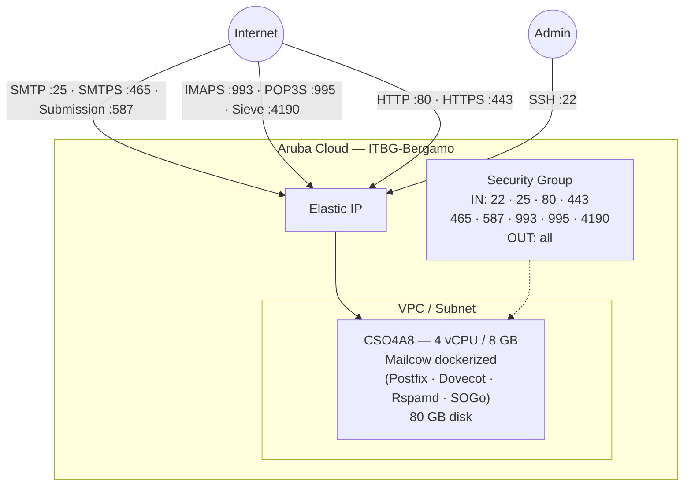

# Mailcow on Aruba Cloud

Deploy [Mailcow](https://mailcow.email/) — a complete dockerized email server suite — on Aruba Cloud using Terraform and cloud-init. Mailcow bundles Postfix, Dovecot, Rspamd, ClamAV, SOGo, and a web admin panel in a single Docker Compose stack.

> **Provider version:** arubacloud/arubacloud `~> 0.5` | **Terraform:** ≥ 1.9

---

## Introduction

Mailcow is the most widely-deployed self-hosted email solution with a polished web UI (SOGo), built-in anti-spam (Rspamd), anti-virus (ClamAV), and automatic TLS via Let's Encrypt. This example deploys:

- **Mailcow dockerized** via the official install script on a single VM
- All required ports open: SMTP (25), SMTPS (465), submission (587), IMAPS (993), POP3S (995), Sieve (4190), HTTP (80), HTTPS (443)
- TLS certificates auto-provisioned by Let's Encrypt (DNS must resolve before apply)

> **DNS first:** Mailcow's Let's Encrypt integration runs at container start. Set your `A` record for `mail_hostname` → VM public IP before running `terraform apply`.

---

## Architecture Overview



---

## Infrastructure Created

| Resource | Name pattern | Description |
|----------|-------------|-------------|
| `arubacloud_project` | `mail-prod` | Project container |
| `arubacloud_vpc` | `mail-prod-vpc` | Virtual Private Cloud |
| `arubacloud_subnet` | `mail-prod-subnet` | Basic subnet |
| `arubacloud_securitygroup` | `mail-prod-vm-sg` | Security group |
| `arubacloud_securityrule` | `mail-prod-vm-ssh` | SSH ingress (22) |
| `arubacloud_securityrule` | `mail-prod-vm-smtp` | SMTP ingress (25) |
| `arubacloud_securityrule` | `mail-prod-vm-http` | HTTP ingress (80) |
| `arubacloud_securityrule` | `mail-prod-vm-https` | HTTPS ingress (443) |
| `arubacloud_securityrule` | `mail-prod-vm-smtps` | SMTPS ingress (465) |
| `arubacloud_securityrule` | `mail-prod-vm-sub` | Submission ingress (587) |
| `arubacloud_securityrule` | `mail-prod-vm-imaps` | IMAPS ingress (993) |
| `arubacloud_securityrule` | `mail-prod-vm-pop3s` | POP3S ingress (995) |
| `arubacloud_securityrule` | `mail-prod-vm-sieve` | Sieve ingress (4190) |
| `arubacloud_elasticip` | `mail-prod-vm-eip` | VM public IP |
| `arubacloud_blockstorage` | `mail-prod-boot` | 80 GB boot disk (Performance) |
| `arubacloud_keypair` | `mail-prod-keypair` | SSH public key |
| `arubacloud_cloudserver` | `mail-prod-vm` | CloudServer VM |

---

## Estimated Monthly Cost

| Resource | Spec | Est. cost/mo |
|----------|------|-------------|
| CloudServer VM | CSO4A8 — 4 vCPU / 8 GB | ~€40 |
| Boot disk | 80 GB Performance | ~€12 |
| Elastic IP | — | ~€3 |
| **Total** | | **~€55/mo** |

---

## Requirements

- Terraform ≥ 1.9
- ArubaCloud Terraform Provider `~> 0.5`
- An ArubaCloud account with OAuth2 API credentials
- An SSH key pair
- A domain name with DNS control (required for TLS)

---

## Variables

### Required

| Variable | Description |
|----------|-------------|
| `arubacloud_client_id` | ArubaCloud OAuth2 client ID |
| `arubacloud_client_secret` | ArubaCloud OAuth2 client secret |
| `ssh_public_key` | SSH public key content |
| `mail_hostname` | Primary mail FQDN (e.g. `mail.example.com`) |

### Optional

| Variable | Default | Description |
|----------|---------|-------------|
| `app_name` | `"mail"` | Short name used in all resource names |
| `environment` | `"prod"` | Environment label |
| `location` | `"ITBG-Bergamo"` | ArubaCloud region |
| `zone` | `"ITBG-1"` | Availability zone |
| `billing_period` | `"Hour"` | `"Hour"` or `"Month"` |
| `vm_flavor` | `"CSO4A8"` | CloudServer flavor |
| `vm_disk_size_gb` | `80` | Boot disk size in GB (min 40) |
| `ssh_cidr` | `"0.0.0.0/0"` | CIDR for SSH access |
| `mailcow_branch` | `"master"` | Mailcow Git branch |

---

## Outputs

| Output | Description |
|--------|-------------|
| `mailcow_url` | Mailcow web UI URL (HTTPS) |
| `vm_public_ip` | Public IP address of the VM |
| `ssh_command` | SSH command to connect to the VM |

---

## Deployment Instructions

### 1. Set up DNS first

Point your mail hostname `A` record at the Elastic IP address. Since the IP is only known after apply, you have two options:

- Pre-create the Elastic IP resource separately and get its IP, or
- Deploy with DNS disabled temporarily, then update DNS and run `terraform apply` again.

### 2. Clone and navigate

```bash
git clone https://github.com/arubacloud/terraform-arubacloud-examples.git
cd terraform-arubacloud-examples/mailcow
```

### 3. Configure variables

```bash
cp terraform.tfvars.example terraform.tfvars
```

### 4. Deploy

```bash
terraform init
terraform plan
terraform apply
```

Bootstrap takes approximately **5–10 minutes**.

### 5. First login

Navigate to `https://mail.example.com` and log in with:

- Username: `admin`
- Password: `moohoo`

**Change the admin password immediately after first login.**

---

## Post-deploy Checklist

- [ ] Change admin password
- [ ] Configure your domain's MX, SPF, DKIM, and DMARC records
- [ ] Verify PTR (reverse DNS) record matches `mail_hostname`
- [ ] Test mail delivery with [mail-tester.com](https://www.mail-tester.com/)

---

## References

- [Mailcow Documentation](https://docs.mailcow.email/)
- [Mailcow GitHub](https://github.com/mailcow/mailcow-dockerized)
- [ArubaCloud Terraform Provider](https://registry.terraform.io/providers/arubacloud/arubacloud/latest/docs)
