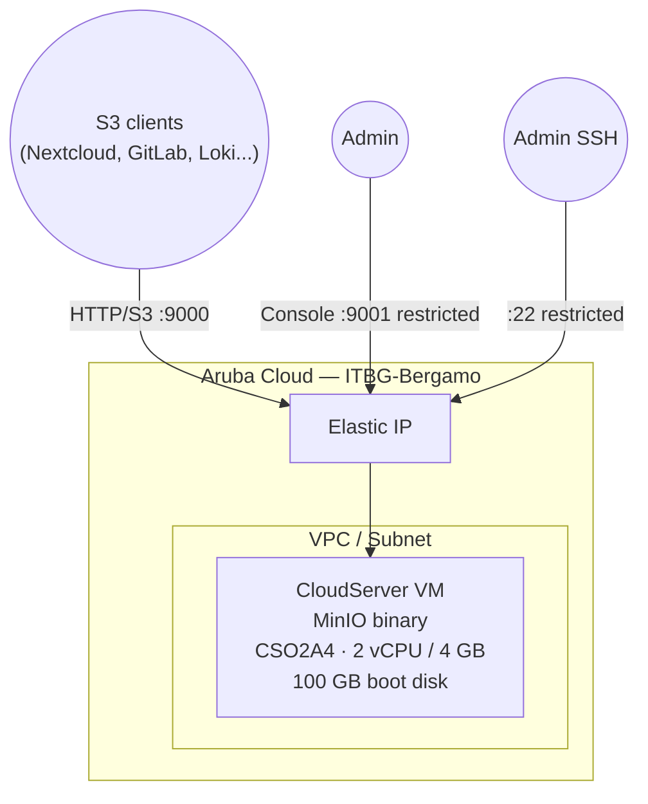

# MinIO on Aruba Cloud

Deploy [MinIO](https://min.io/) — a high-performance S3-compatible object storage server — on Aruba Cloud. Use it as a local S3 backend for Nextcloud, GitLab, Loki, or any S3-compatible application.

> **Provider version:** arubacloud/arubacloud `~> 0.5` | **Terraform:** ≥ 1.9

---

## Introduction

MinIO runs as a single binary managed by systemd. This example deploys the single-node, single-drive configuration — suitable for development, staging, and small production workloads. For high availability, a distributed multi-node setup is required (see the Phase 3 roadmap).

---

## Architecture Overview



---

## Infrastructure Created

| Resource | Description |
|----------|-------------|
| `arubacloud_cloudserver` | `minio-prod-vm` |
| `arubacloud_blockstorage` | 100 GB boot disk (data storage) |
| `arubacloud_elasticip` | Public IP |
| `arubacloud_securitygroup` | TCP 9000 (API), 9001 (console), 22 (SSH) |

---

## VM Sizing

| Use case | vCPU | RAM | Disk | Flavor |
|----------|------|-----|------|--------|
| Dev / small | 2 | 4 GB | 100 GB | `CSO2A4` *(default)* |
| Production | 4 | 8 GB | 500 GB+ | `CSO4A8` |

Set `vm_disk_size_gb` to your expected data volume. MinIO stores all objects on the boot disk in this example.

---

## Estimated Monthly Cost

| Resource | Spec | Est. cost/mo |
|----------|------|-------------|
| CSO2A4 VM | 2 vCPU / 4 GB | ~€20 |
| 100 GB disk | Performance | ~€13 |
| Elastic IP | — | ~€5 |
| **Total** | | **~€38/mo** |

---

## Variables

### Required

`arubacloud_client_id`, `arubacloud_client_secret`, `ssh_public_key`, `minio_root_password`

### Optional

| Variable | Default | Description |
|----------|---------|-------------|
| `minio_root_user` | `"minioadmin"` | S3 access key |
| `minio_root_password` | — | S3 secret key (min 8 chars) |
| `minio_data_dir` | `"/data/minio"` | Object storage path |
| `api_cidr` | `"0.0.0.0/0"` | CIDR for S3 API port |
| `console_cidr` | `"0.0.0.0/0"` | CIDR for web console — **restrict to your IP** |
| `vm_disk_size_gb` | `100` | Total disk size in GB |
| `vm_flavor` | `"CSO2A4"` | VM size |

---

## Deployment

```bash
cd terraform-arubacloud-examples/minio
cp terraform.tfvars.example terraform.tfvars
# Set minio_root_password
terraform init && terraform apply
```

After deployment:

```bash
terraform output console_url     # http://203.0.113.10:9001
terraform output s3_endpoint     # http://203.0.113.10:9000

# Use mc (MinIO Client) to create a bucket
mc alias set aruba $(terraform output -raw s3_endpoint) minioadmin <password>
mc mb aruba/my-bucket
```

---

## Destroy

```bash
terraform destroy
```

---

## Security Recommendations

1. **Restrict `console_cidr`** — the console exposes full admin access. Limit to your IP.
2. **Use TLS for production** — put MinIO behind a reverse proxy (Traefik/Caddy) with a valid certificate, or configure MinIO's built-in TLS.
3. **Create application-specific access keys** — use the console or `mc` to create users with bucket-level policies; don't use the root credentials in application configs.
4. **Back up object data** — MinIO itself has no built-in backup. Use `mc mirror` to sync to a remote location.

---

## Troubleshooting

### MinIO not starting

```bash
ssh ubuntu@$(terraform output -raw public_ip)
sudo systemctl status minio
sudo journalctl -u minio -n 50
```

### Disk full

```bash
df -h /data/minio
```

Destroy and re-apply with a larger `vm_disk_size_gb`. Note: data will be lost; snapshot the disk first.

---

## References

- [MinIO Single-Node Quickstart](https://min.io/docs/minio/linux/operations/install-deploy-manage/deploy-minio-single-node-single-drive.html)
- [MinIO Client (mc) Quickstart](https://min.io/docs/minio/linux/reference/minio-mc.html)
- [S3 Compatibility](https://min.io/product/s3-compatibility)
