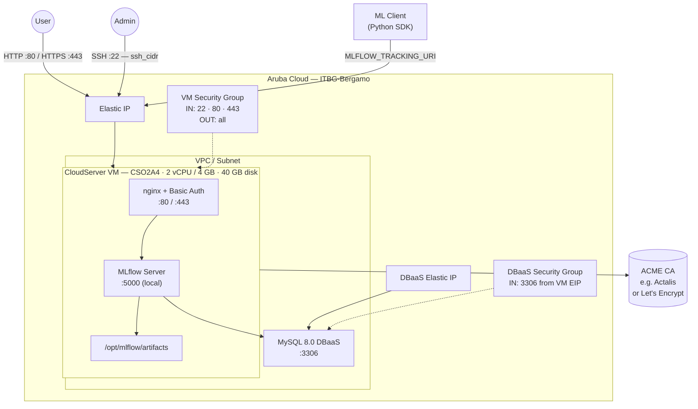

# MLflow on Aruba Cloud

Deploy [MLflow](https://mlflow.org) — the open-source platform for the machine learning lifecycle — on Aruba Cloud using Terraform and cloud-init. This example provisions an MLflow tracking server with a Managed MySQL DBaaS backend, nginx with HTTP Basic Auth, and optional automatic HTTPS.

> **Provider version:** arubacloud/arubacloud `~> 1.0` | **Terraform:** ≥ 1.9

---

## Introduction

MLflow provides experiment tracking, model versioning, and a model registry for machine learning workflows. This example provisions:

| Component | Role | Port |
|-----------|------|------|
| **MLflow Tracking Server** | REST API and web UI for experiments and models | 5000 (proxied by nginx) |
| **MySQL DBaaS** | Experiment and run metadata backend store | 3306 (DBaaS Elastic IP) |
| **nginx** | Reverse proxy with HTTP Basic Auth on 80/443 | 80 / 443 |

Artifact files (model binaries, plots, datasets) are stored on the VM boot disk under `/opt/mlflow/artifacts`. For larger artifact volumes, mount an additional block storage volume or configure an S3-compatible backend (e.g. the MinIO example).

---

## Architecture Overview



---

## Infrastructure Created

| Resource | Name pattern | Description |
|----------|-------------|-------------|
| `arubacloud_project` | `mlflow-prod` | Project container |
| `arubacloud_vpc` | `mlflow-prod-vpc` | Virtual Private Cloud |
| `arubacloud_subnet` | `mlflow-prod-subnet` | Basic subnet |
| `arubacloud_securitygroup` | `mlflow-prod-vm-sg` | VM security group |
| `arubacloud_securitygroup` | `mlflow-prod-dbaas-sg` | DBaaS security group |
| `arubacloud_securityrule` | `mlflow-prod-vm-ssh` | SSH ingress |
| `arubacloud_securityrule` | `mlflow-prod-vm-http` | HTTP ingress TCP 80 |
| `arubacloud_securityrule` | `mlflow-prod-vm-https` | HTTPS ingress TCP 443 |
| `arubacloud_securityrule` | `mlflow-prod-db-mysql` | MySQL ingress from VM Elastic IP |
| `arubacloud_elasticip` | `mlflow-prod-vm-eip` | VM public IP |
| `arubacloud_elasticip` | `mlflow-prod-dbaas-eip` | DBaaS public IP |
| `arubacloud_blockstorage` | `mlflow-prod-boot` | 40 GB boot disk (Performance) |
| `arubacloud_keypair` | `mlflow-prod-keypair` | SSH public key |
| `arubacloud_dbaas` | `mlflow-prod-dbaas` | Managed MySQL 8.0 DBaaS |
| `arubacloud_database` | `mlflow` | MLflow tracking database |
| `arubacloud_dbaasuser` | `mlflow` | MLflow DB user |
| `arubacloud_cloudserver` | `mlflow-prod-vm` | CloudServer VM |

---

## Estimated Monthly Cost

| Resource | Spec | Est. cost/mo |
|----------|------|-------------|
| CloudServer VM | CSO2A4 — 2 vCPU / 4 GB | ~€18 |
| Boot disk | 40 GB Performance | ~€6 |
| Elastic IP (VM) | — | ~€3 |
| MySQL DBaaS | DBO2A8 | ~€35 |
| Elastic IP (DBaaS) | — | ~€3 |
| **Total** | | **~€65/mo** |

Increase `vm_disk_size_gb` or use an additional volume if you store large model artifacts locally.

---

## Requirements

- Terraform ≥ 1.9
- ArubaCloud Terraform Provider `~> 1.0`
- An ArubaCloud account with OAuth2 API credentials
- An SSH key pair

---

## Variables

### Required

| Variable | Description |
|----------|-------------|
| `arubacloud_client_id` | ArubaCloud OAuth2 client ID |
| `arubacloud_client_secret` | ArubaCloud OAuth2 client secret |
| `ssh_public_key` | SSH public key content |
| `db_password` | MySQL password for the MLflow tracking DB user |
| `mlflow_admin_password` | Password for nginx HTTP Basic Auth |

### Optional

| Variable | Default | Description |
|----------|---------|-------------|
| `app_name` | `"mlflow"` | Short name used in all resource names |
| `environment` | `"prod"` | Environment label |
| `location` | `"ITBG-Bergamo"` | ArubaCloud region |
| `zone` | `"ITBG-1"` | Availability zone |
| `billing_period` | `"Hour"` | `"Hour"` or `"Month"` |
| `vm_flavor` | `"CSO2A4"` | CloudServer flavor |
| `vm_disk_size_gb` | `40` | Boot disk size in GB |
| `ssh_cidr` | `"0.0.0.0/0"` | CIDR for SSH — **restrict to your IP in production** |
| `dbaas_flavor` | `"DBO2A8"` | DBaaS flavor |
| `db_storage_gb` | `20` | DBaaS initial storage in GB |
| `mlflow_admin_user` | `"admin"` | nginx Basic Auth username |
| `mlflow_version` | `"2.16.0"` | MLflow version to install |
| `domain` | `""` | Custom domain for ACME HTTPS |

---

## Outputs

| Output | Description |
|--------|-------------|
| `app_url` | MLflow web interface URL |
| `mlflow_tracking_uri` | Set as `MLFLOW_TRACKING_URI` in your experiment code |
| `vm_public_ip` | Public IP address of the VM |
| `ssh_command` | SSH command to connect to the VM |

---

## Deployment Instructions

### 1. Clone and navigate

```bash
git clone https://github.com/arubacloud/terraform-arubacloud-examples.git
cd terraform-arubacloud-examples/mlflow
```

### 2. Configure variables

```bash
cp terraform.tfvars.example terraform.tfvars
```

Set `db_password`, `mlflow_admin_password`, your credentials, and SSH key.

### 3. Deploy

```bash
terraform init
terraform plan
terraform apply
```

Bootstrap takes approximately **5–8 minutes**.

### 4. Open the tracking UI

```bash
terraform output app_url
```

Open the URL in your browser and log in with `mlflow_admin_user` / `mlflow_admin_password`.

### 5. Configure your experiments

In your Python environment:

```bash
pip install mlflow
```

```python
import mlflow

mlflow.set_tracking_uri("http://<vm_public_ip>")  # or https://<domain>

# If HTTP Basic Auth is required, set credentials:
import os
os.environ["MLFLOW_TRACKING_USERNAME"] = "admin"
os.environ["MLFLOW_TRACKING_PASSWORD"] = "your-password"

mlflow.set_experiment("my-experiment")

with mlflow.start_run():
    mlflow.log_param("learning_rate", 0.01)
    mlflow.log_metric("accuracy", 0.95)
    mlflow.sklearn.log_model(model, "model")
```

---

## Enabling HTTPS (ACME)

When `domain` is set to a real domain:

1. Create a DNS A record: `mlflow.example.com → <vm_public_ip>`
2. Set `domain = "mlflow.example.com"` in `terraform.tfvars`
3. Re-apply — Certbot provisions a certificate via an ACME provider such as [Actalis](https://guide.actalis.com/it/ssl/attivazione/acme) or Let's Encrypt

With HTTPS, update your client to use the secure URI and set `MLFLOW_TRACKING_INSECURE_TLS=false`.

---

## Large Artifact Storage

By default artifacts are stored on the boot disk at `/opt/mlflow/artifacts`. For production:

- **Increase disk:** Set `vm_disk_size_gb = 200` or more.
- **Use MinIO:** Deploy the [MinIO example](../minio) and point `MLFLOW_DEFAULT_ARTIFACT_ROOT` to `s3://bucket/mlflow-artifacts` with the MinIO endpoint configured.

---

## Security Recommendations

1. **Restrict SSH to your IP.** Set `ssh_cidr = "your.ip/32"`.
2. **Use HTTPS.** Without TLS, credentials and model artifacts are transmitted in cleartext.
3. **Keep the tracking server internal** where possible — expose it only to your data science team's IP ranges via `ssh_cidr` and a VPN.

---

## Troubleshooting

### MLflow server not responding

```bash
ssh ubuntu@$(terraform output -raw vm_public_ip)
sudo systemctl status mlflow
sudo journalctl -u mlflow -n 50
sudo tail -50 /var/log/cloud-init-output.log
```

### 401 Unauthorized from Python client

Ensure `MLFLOW_TRACKING_USERNAME` and `MLFLOW_TRACKING_PASSWORD` environment variables are set to match the `mlflow_admin_user` and `mlflow_admin_password` values.

---

## References

- [MLflow Documentation](https://mlflow.org/docs/latest/index.html)
- [MLflow Tracking](https://mlflow.org/docs/latest/tracking.html)
- [MLflow Model Registry](https://mlflow.org/docs/latest/model-registry.html)
- [ArubaCloud Terraform Provider](https://registry.terraform.io/providers/arubacloud/arubacloud/latest/docs)
- [cloud-init Reference](https://cloudinit.readthedocs.io/)
