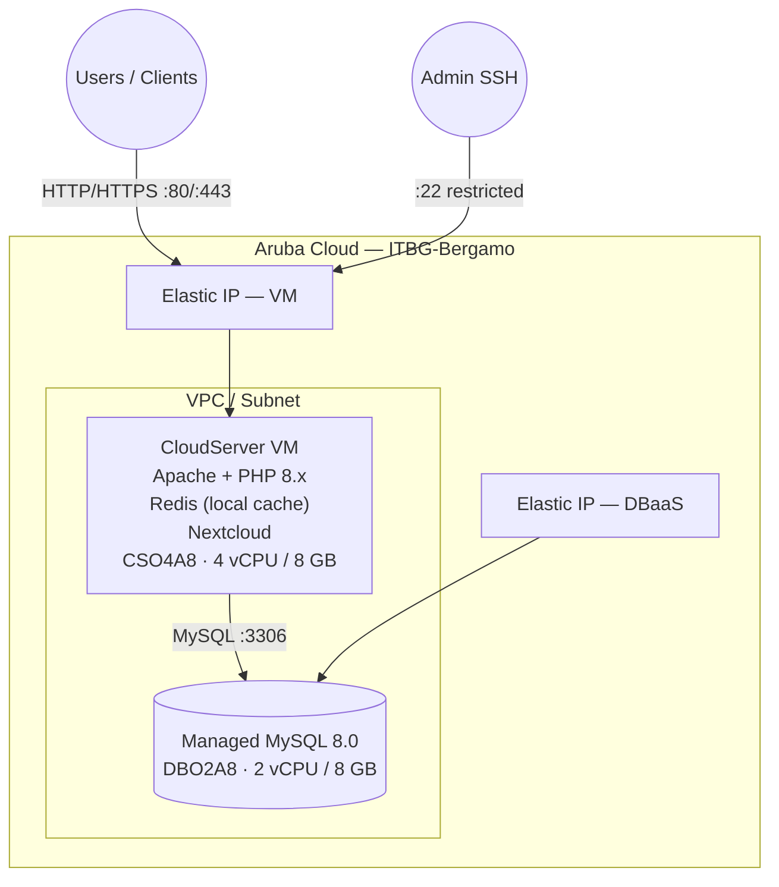

# Nextcloud on Aruba Cloud

Deploy [Nextcloud](https://nextcloud.com/) — a self-hosted file sync and collaboration platform — on Aruba Cloud with Apache 2.4, PHP 8.x, Redis for caching, and a Managed MySQL 8.0 DBaaS backend.

> **Provider version:** arubacloud/arubacloud `~> 0.5` | **Terraform:** ≥ 1.9

---

## Introduction

Nextcloud is a full-featured private cloud platform: file sync, calendar, contacts, document editing, video calls, and more. This example provisions a production-capable single-VM Nextcloud with a managed database — all bootstrapped by cloud-init with no manual steps.

---

## Architecture Overview



---

## Infrastructure Created

| Resource | Description |
|----------|-------------|
| `arubacloud_project` | `nc-prod` |
| `arubacloud_cloudserver` | `nc-prod-vm` — Apache + PHP + Nextcloud |
| `arubacloud_blockstorage` | 80 GB boot disk (user data stored here) |
| `arubacloud_dbaas` | Managed MySQL 8.0 |
| `arubacloud_database` | `nextcloud` logical database |
| `arubacloud_elasticip` | 2× Elastic IPs (VM + DBaaS) |
| `arubacloud_securitygroup` | 2× security groups (VM + DBaaS) |

---

## VM Sizing

| Use case | vCPU | RAM | Disk | Flavor |
|----------|------|-----|------|--------|
| Personal / small team (< 10 users) | 4 | 8 GB | 80 GB | `CSO4A8` *(default)* |
| Medium team (10–50 users) | 8 | 16 GB | 200 GB | `CSO8A16` |
| Large team | 16 | 32 GB | 500 GB+ | `CSO16A32` |

---

## Estimated Monthly Cost

| Resource | Spec | Est. cost/mo |
|----------|------|-------------|
| CloudServer VM | CSO4A8 — 4 vCPU / 8 GB | ~€35 |
| Boot disk | 80 GB Performance | ~€10 |
| Managed MySQL | DBO2A8 — 2 vCPU / 8 GB | ~€40 |
| DBaaS storage | 20 GB | ~€3 |
| Elastic IPs × 2 | — | ~€10 |
| **Total** | | **~€98/mo** |

---

## Variables

### Required

| Variable | Description |
|----------|-------------|
| `arubacloud_client_id` | OAuth2 client ID |
| `arubacloud_client_secret` | OAuth2 client secret |
| `ssh_public_key` | SSH public key |
| `db_password` | MySQL password (min 16 chars, no newlines) |
| `nc_admin_password` | Nextcloud admin password (min 16 chars, no newlines) |
| `nc_admin_email` | Admin email (also for Let's Encrypt) |

### Optional

| Variable | Default | Description |
|----------|---------|-------------|
| `domain` | `""` | Domain for HTTPS — recommended for production |
| `nc_admin_user` | `"ncadmin"` | Admin username |
| `vm_flavor` | `"CSO4A8"` | VM size |
| `vm_disk_size_gb` | `80` | Disk — size for expected data volume |
| `dbaas_flavor` | `"DBO2A8"` | DBaaS flavor |
| `db_storage_gb` | `20` | DBaaS storage in GB |
| `ssh_cidr` | `"0.0.0.0/0"` | SSH CIDR — restrict to your IP |

---

## Deployment

```bash
cd terraform-arubacloud-examples/nextcloud
cp terraform.tfvars.example terraform.tfvars
# Fill in passwords, email, optional domain
terraform init && terraform apply
```

Provisioning takes 12–18 minutes (VM boot + DBaaS + package install + occ install).

```bash
terraform output app_url       # e.g. https://cloud.example.com
terraform output admin_user
terraform output -raw admin_password
```

---

## Destroy

```bash
terraform destroy
```

---

## Security Recommendations

1. **Always use HTTPS in production.** Set `domain` and point DNS before `terraform apply`.
2. **Restrict SSH** with `ssh_cidr`.
3. **Enable 2FA** in Nextcloud Settings → Security → Two-Factor Authentication.
4. **Back up `/var/www/nextcloud/data`** and the database regularly.
5. **Keep Nextcloud updated** — run `sudo -u www-data php occ upgrade` after updating the files.

---

## Post-Deployment Configuration

```bash
ssh ubuntu@$(terraform output -raw public_ip)

# Check installation status
sudo -u www-data php /var/www/nextcloud/occ status

# Install recommended apps
sudo -u www-data php /var/www/nextcloud/occ app:install contacts
sudo -u www-data php /var/www/nextcloud/occ app:install calendar
sudo -u www-data php /var/www/nextcloud/occ app:install mail

# Set up a cron job for background tasks
echo "*/5  *  *  *  * www-data php /var/www/nextcloud/occ background:cron" | sudo tee /etc/cron.d/nextcloud
```

---

## Troubleshooting

### Nextcloud maintenance mode

```bash
sudo -u www-data php /var/www/nextcloud/occ maintenance:mode --off
```

### Database connection error

- Check the DBaaS security rule allows TCP 3306 from the VM IP
- Verify `arubacloud_databasegrant` was created
- Check cloud-init log: `sudo tail -100 /var/log/cloud-init-output.log`

### "Trusted domain" error after changing the IP

```bash
sudo -u www-data php /var/www/nextcloud/occ config:system:set trusted_domains 0 --value="<new-ip>"
```

---

## References

- [Nextcloud Administration Manual](https://docs.nextcloud.com/server/latest/admin_manual/)
- [Nextcloud occ Commands](https://docs.nextcloud.com/server/latest/admin_manual/configuration_server/occ_command.html)
- [Nextcloud Performance Tuning](https://docs.nextcloud.com/server/latest/admin_manual/installation/server_tuning.html)
