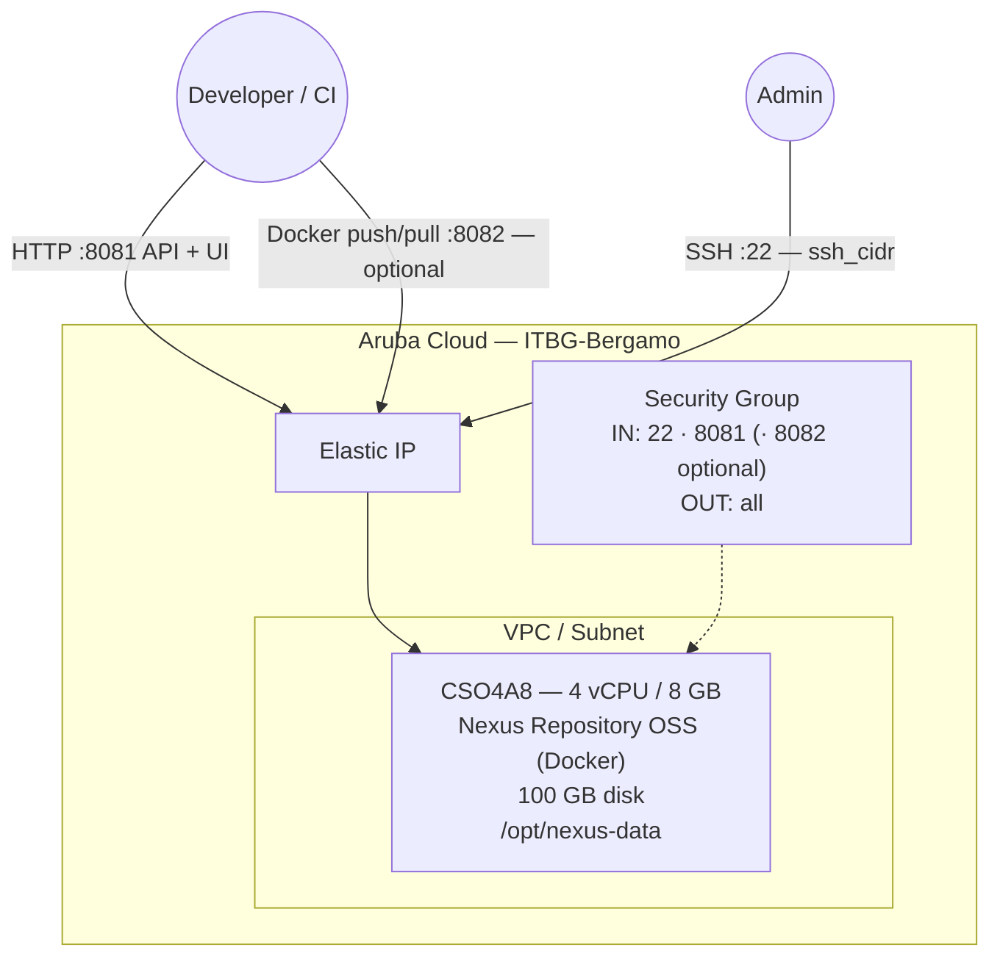

# Nexus Repository on Aruba Cloud

Deploy [Sonatype Nexus Repository OSS](https://www.sonatype.com/products/sonatype-nexus-oss) — a universal artifact registry supporting Maven, npm, Docker, PyPI, RubyGems, and more — on Aruba Cloud using Terraform and cloud-init.

> **Provider version:** arubacloud/arubacloud `~> 0.5` | **Terraform:** ≥ 1.9

---

## Introduction

Nexus Repository OSS is the most widely-deployed open-source artifact manager. It runs on the JVM with an embedded database and requires no external database. This example deploys:

- **Nexus Repository OSS** via the official Docker image on a CSO4A8 VM
- Persistent artifact storage on `/opt/nexus-data` (host volume)
- Web UI and API on port **8081**
- Optional Docker registry on port **8082** (`enable_docker_registry = true`)
- Auto-generated admin password retrieved after bootstrap

> **JVM startup:** Nexus takes **2–3 minutes** to start. The cloud-init health-check waits automatically.

---

## Architecture Overview



---

## Infrastructure Created

| Resource | Name pattern | Description |
|----------|-------------|-------------|
| `arubacloud_project` | `nexus-prod` | Project container |
| `arubacloud_vpc` | `nexus-prod-vpc` | Virtual Private Cloud |
| `arubacloud_subnet` | `nexus-prod-subnet` | Basic subnet |
| `arubacloud_securitygroup` | `nexus-prod-vm-sg` | Security group |
| `arubacloud_securityrule` | `nexus-prod-vm-ssh` | SSH ingress (22) |
| `arubacloud_securityrule` | `nexus-prod-vm-http` | Nexus web UI ingress (8081) |
| `arubacloud_securityrule` | `nexus-prod-vm-docker` | Docker registry ingress (8082, optional) |
| `arubacloud_elasticip` | `nexus-prod-vm-eip` | VM public IP |
| `arubacloud_blockstorage` | `nexus-prod-boot` | 100 GB boot disk (Performance) |
| `arubacloud_keypair` | `nexus-prod-keypair` | SSH public key |
| `arubacloud_cloudserver` | `nexus-prod-vm` | CloudServer VM |

---

## Estimated Monthly Cost

| Resource | Spec | Est. cost/mo |
|----------|------|-------------|
| CloudServer VM | CSO4A8 — 4 vCPU / 8 GB | ~€40 |
| Boot disk | 100 GB Performance | ~€15 |
| Elastic IP | — | ~€3 |
| **Total** | | **~€58/mo** |

---

## Requirements

- Terraform ≥ 1.9
- ArubaCloud Terraform Provider `~> 0.5`
- An ArubaCloud account with OAuth2 API credentials
- An SSH key pair

---

## Variables

### Required

| Variable | Description |
|----------|-------------|
| `arubacloud_client_id` | ArubaCloud OAuth2 client ID |
| `arubacloud_client_secret` | ArubaCloud OAuth2 client secret |
| `ssh_public_key` | SSH public key content |

### Optional

| Variable | Default | Description |
|----------|---------|-------------|
| `app_name` | `"nexus"` | Short name used in resource names |
| `environment` | `"prod"` | Environment label |
| `location` | `"ITBG-Bergamo"` | ArubaCloud region |
| `zone` | `"ITBG-1"` | Availability zone |
| `billing_period` | `"Hour"` | `"Hour"` or `"Month"` |
| `vm_flavor` | `"CSO4A8"` | CloudServer flavor (min 4 GB RAM for JVM) |
| `vm_disk_size_gb` | `100` | Boot disk size in GB (min 50) |
| `ssh_cidr` | `"0.0.0.0/0"` | CIDR for SSH access |
| `nexus_version` | `"latest"` | Nexus Docker image tag |
| `enable_docker_registry` | `false` | Open port 8082 for Docker registry |

---

## Outputs

| Output | Description |
|--------|-------------|
| `nexus_url` | Nexus web UI URL |
| `nexus_docker_registry_url` | Docker registry URL (when enabled) |
| `vm_public_ip` | Public IP of the VM |
| `ssh_command` | SSH command to connect |
| `admin_password_command` | Command to retrieve the auto-generated admin password |

---

## Deployment Instructions

### 1. Clone and navigate

```bash
git clone https://github.com/arubacloud/terraform-arubacloud-examples.git
cd terraform-arubacloud-examples/nexus
```

### 2. Configure variables

```bash
cp terraform.tfvars.example terraform.tfvars
```

### 3. Deploy

```bash
terraform init
terraform plan
terraform apply
```

Bootstrap takes approximately **3–5 minutes** (JVM startup).

### 4. Retrieve the admin password

```bash
ssh ubuntu@<vm_public_ip> 'docker exec nexus cat /nexus-data/admin.password'
```

Or use the `admin_password_command` Terraform output.

### 5. First login

Navigate to `http://<vm_public_ip>:8081`, log in with `admin` and the retrieved password, then complete the setup wizard. The `admin.password` file is automatically deleted after the first login.

---

## Enabling the Docker Registry

Set `enable_docker_registry = true` in `terraform.tfvars`, then re-apply. After apply:

1. Log in to Nexus web UI
2. Create a new **hosted** repository of type `docker (hosted)` on HTTP port **8082**
3. Push images: `docker push <vm_ip>:8082/myimage:tag`

---

## References

- [Nexus Repository OSS Docs](https://help.sonatype.com/en/sonatype-nexus-repository.html)
- [Nexus Docker Hub](https://hub.docker.com/r/sonatype/nexus3)
- [ArubaCloud Terraform Provider](https://registry.terraform.io/providers/arubacloud/arubacloud/latest/docs)
