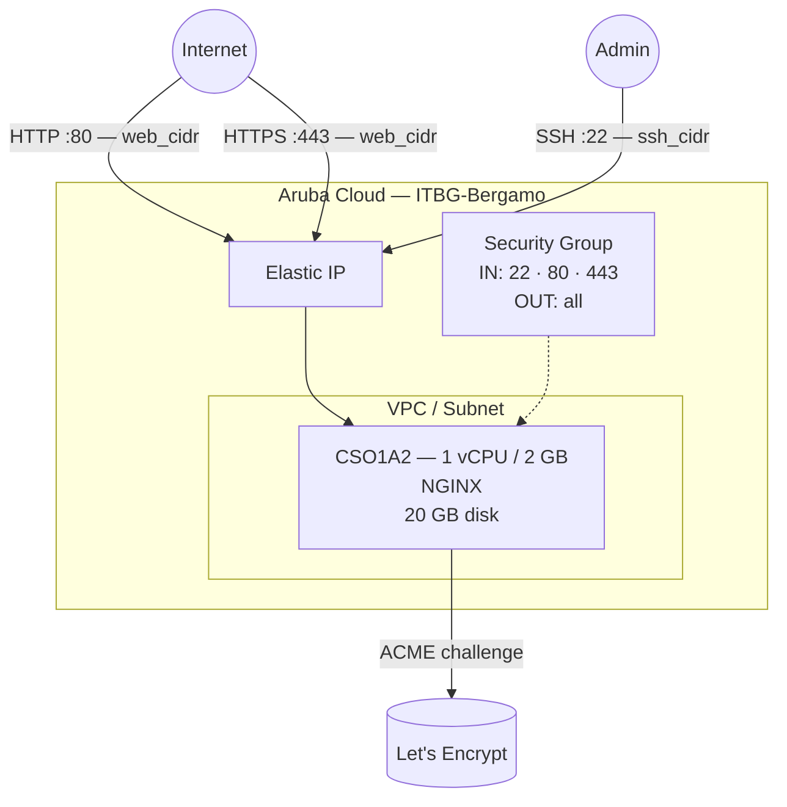

# NGINX on Aruba Cloud

Deploy [NGINX](https://nginx.org) as a web server or reverse proxy on Aruba Cloud using Terraform and cloud-init. This example provisions a production-ready NGINX instance with a default static site and optional automatic HTTPS via Let's Encrypt.

> **Provider version:** arubacloud/arubacloud `~> 0.5` | **Terraform:** ≥ 1.9

---

## Introduction

NGINX is a high-performance HTTP server, reverse proxy, and load balancer. This example provisions a minimal VM running NGINX with:

- NGINX installed from **Ubuntu 22.04 official packages**
- A default **static HTML site** served from `/var/www/html`
- Ports 80 (HTTP) and 443 (HTTPS) open to `web_cidr`
- **Optional automatic HTTPS** via Let's Encrypt / Certbot when `domain` and `certbot_email` are set

After deployment, replace the default site with your own content or additional `server {}` blocks for virtual hosting or reverse proxying.

---

## Architecture Overview



---

## Infrastructure Created

| Resource | Name pattern | Description |
|----------|-------------|-------------|
| `arubacloud_project` | `nginx-prod` | Project container |
| `arubacloud_vpc` | `nginx-prod-vpc` | Virtual Private Cloud |
| `arubacloud_subnet` | `nginx-prod-subnet` | Basic subnet |
| `arubacloud_securitygroup` | `nginx-prod-vm-sg` | Security group |
| `arubacloud_securityrule` | `nginx-prod-vm-ssh` | SSH ingress |
| `arubacloud_securityrule` | `nginx-prod-vm-http` | HTTP ingress TCP 80 |
| `arubacloud_securityrule` | `nginx-prod-vm-https` | HTTPS ingress TCP 443 |
| `arubacloud_elasticip` | `nginx-prod-vm-eip` | VM public IP |
| `arubacloud_blockstorage` | `nginx-prod-boot` | 20 GB boot disk (Performance) |
| `arubacloud_keypair` | `nginx-prod-keypair` | SSH public key |
| `arubacloud_cloudserver` | `nginx-prod-vm` | CloudServer VM |

---

## Estimated Monthly Cost

| Resource | Spec | Est. cost/mo |
|----------|------|-------------|
| CloudServer VM | CSO1A2 — 1 vCPU / 2 GB | ~€9 |
| Boot disk | 20 GB Performance | ~€3 |
| Elastic IP | — | ~€3 |
| **Total** | | **~€15/mo** |

---

## Requirements

- Terraform ≥ 1.9
- ArubaCloud Terraform Provider `~> 0.5`
- An ArubaCloud account with OAuth2 API credentials
- An SSH key pair
- (For HTTPS) A domain name with an A record pointing to the VM's Elastic IP

---

## Variables

### Required

| Variable | Description |
|----------|-------------|
| `arubacloud_client_id` | ArubaCloud OAuth2 client ID |
| `arubacloud_client_secret` | ArubaCloud OAuth2 client secret |
| `ssh_public_key` | SSH public key content |

### Optional

| Variable | Default | Description |
|----------|---------|-------------|
| `app_name` | `"nginx"` | Short name used in all resource names |
| `environment` | `"prod"` | Environment label |
| `location` | `"ITBG-Bergamo"` | ArubaCloud region |
| `zone` | `"ITBG-1"` | Availability zone |
| `billing_period` | `"Hour"` | `"Hour"` or `"Month"` |
| `vm_flavor` | `"CSO1A2"` | CloudServer flavor |
| `vm_image` | `"LU22-001"` | Boot disk image (Ubuntu 22.04 LTS) |
| `vm_disk_size_gb` | `20` | Boot disk size in GB |
| `ssh_cidr` | `"0.0.0.0/0"` | CIDR for SSH — restrict in production |
| `web_cidr` | `"0.0.0.0/0"` | CIDR for HTTP/HTTPS — typically `0.0.0.0/0` for public sites |
| `domain` | `""` | Domain name for Let's Encrypt HTTPS (DNS must point to VM first) |
| `certbot_email` | `""` | Email for Let's Encrypt notifications (required with `domain`) |

---

## Outputs

| Output | Description |
|--------|-------------|
| `http_url` | HTTP URL of the web server |
| `https_url` | HTTPS URL (only valid when `domain` and certificate are configured) |
| `vm_public_ip` | Public IP address of the VM |
| `ssh_command` | SSH command to connect to the VM |

---

## Deployment Instructions

### 1. Clone and navigate

```bash
git clone https://github.com/arubacloud/terraform-arubacloud-examples.git
cd terraform-arubacloud-examples/nginx
```

### 2. Configure variables

```bash
cp terraform.tfvars.example terraform.tfvars
```

For HTTP-only deployment, only credentials and SSH key are required. For HTTPS:

```hcl
domain        = "example.com"
certbot_email = "admin@example.com"
```

> **Important:** The DNS A record for `domain` must already point to the VM's Elastic IP before you apply. To get the IP first, run `terraform apply` without `domain`, note the `vm_public_ip` output, set your DNS record, then re-apply with `domain` set.

### 3. Deploy

```bash
terraform init
terraform plan
terraform apply
```

Bootstrap takes approximately **1–2 minutes** (3–5 minutes with Let's Encrypt).

### 4. Access the site

```bash
terraform output http_url
```

### 5. Deploy your content

```bash
ssh ubuntu@$(terraform output -raw vm_public_ip)
# Replace the default page:
sudo cp my-site/* /var/www/html/
```

---

## Customisation

### Serving a second site (virtual hosting)

Create a new site config and enable it:

```bash
sudo tee /etc/nginx/sites-available/mysite.conf << 'EOF'
server {
    listen 80;
    server_name mysite.example.com;
    root /var/www/mysite;
    index index.html;
    location / { try_files $uri $uri/ =404; }
}
EOF
sudo ln -s /etc/nginx/sites-available/mysite.conf /etc/nginx/sites-enabled/
sudo nginx -t && sudo systemctl reload nginx
```

### Reverse proxy

Replace the `location /` block:

```nginx
location / {
    proxy_pass         http://127.0.0.1:8080;
    proxy_set_header   Host $host;
    proxy_set_header   X-Real-IP $remote_addr;
    proxy_set_header   X-Forwarded-For $proxy_add_x_forwarded_for;
    proxy_set_header   X-Forwarded-Proto $scheme;
}
```

---

## Security Recommendations

1. **Restrict `ssh_cidr` to your management IP.** SSH on `0.0.0.0/0` is acceptable for a quick start, but exposes the VM to brute-force attacks.

2. **Enable HTTPS for any production site.** Set `domain` and `certbot_email` to get a free Let's Encrypt certificate. HTTP-only should only be used for internal or development sites.

3. **Keep NGINX updated.** Ubuntu's unattended-upgrades handles security patches automatically if enabled. Check with `sudo unattended-upgrades --dry-run`.

---

## Troubleshooting

### NGINX not starting

```bash
sudo nginx -t
sudo systemctl status nginx
sudo journalctl -u nginx -n 30
```

### Let's Encrypt certificate not issued

```bash
# Check DNS propagation first:
dig +short A example.com

# Re-run certbot manually:
sudo certbot --nginx -d example.com -m admin@example.com --non-interactive --agree-tos --redirect
```

Common causes: DNS A record not yet propagated, port 80 blocked by `web_cidr`, or `domain` mistyped.

---

## References

- [NGINX Documentation](https://nginx.org/en/docs/)
- [NGINX Beginner's Guide](https://nginx.org/en/docs/beginners_guide.html)
- [Certbot Documentation](https://certbot.eff.org/instructions)
- [ArubaCloud Terraform Provider](https://registry.terraform.io/providers/arubacloud/arubacloud/latest/docs)
