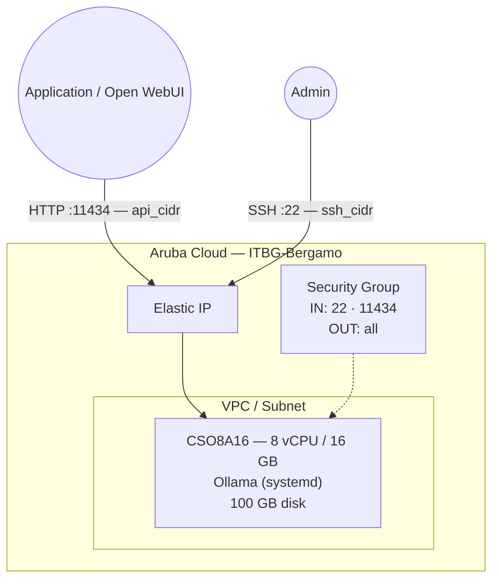

# Ollama on Aruba Cloud

Deploy [Ollama](https://ollama.ai/) — a local LLM inference platform — on Aruba Cloud using Terraform and cloud-init. Runs large language models (LLama, Mistral, Gemma, etc.) directly on CPU without requiring a GPU.

> **Provider version:** arubacloud/arubacloud `~> 0.5` | **Terraform:** ≥ 1.9

---

## Introduction

Ollama makes running LLMs locally as simple as `ollama run llama3.2`. It provides an OpenAI-compatible REST API, enabling drop-in replacement for OpenAI in existing applications. This example provisions:

- **Ollama** installed via the official install script as a systemd service
- REST API bound to all interfaces (port 11434), restricted to `api_cidr`
- Optional model pre-pulling at bootstrap time

> **Resource warning:** LLMs are memory-intensive. A 7B model requires ~4–6 GB free RAM, a 13B model ~8–10 GB, and a 70B model ~40+ GB. Plan your `vm_flavor` accordingly.

---

## Architecture Overview



---

## Infrastructure Created

| Resource | Name pattern | Description |
|----------|-------------|-------------|
| `arubacloud_project` | `ollama-prod` | Project container |
| `arubacloud_vpc` | `ollama-prod-vpc` | Virtual Private Cloud |
| `arubacloud_subnet` | `ollama-prod-subnet` | Basic subnet |
| `arubacloud_securitygroup` | `ollama-prod-vm-sg` | Security group |
| `arubacloud_securityrule` | `ollama-prod-vm-ssh` | SSH ingress |
| `arubacloud_securityrule` | `ollama-prod-vm-api` | Ollama API TCP 11434 |
| `arubacloud_elasticip` | `ollama-prod-vm-eip` | VM public IP |
| `arubacloud_blockstorage` | `ollama-prod-boot` | 100 GB boot disk (Performance) |
| `arubacloud_keypair` | `ollama-prod-keypair` | SSH public key |
| `arubacloud_cloudserver` | `ollama-prod-vm` | CloudServer VM |

---

## Estimated Monthly Cost

| Resource | Spec | Est. cost/mo |
|----------|------|-------------|
| CloudServer VM | CSO8A16 — 8 vCPU / 16 GB | ~€55 |
| Boot disk | 100 GB Performance | ~€15 |
| Elastic IP | — | ~€3 |
| **Total** | | **~€73/mo** |

Larger models require upgrading to a VM with more RAM (and correspondingly higher cost).

---

## Requirements

- Terraform ≥ 1.9
- ArubaCloud Terraform Provider `~> 0.5`
- An ArubaCloud account with OAuth2 API credentials
- An SSH key pair

---

## Variables

### Required

| Variable | Description |
|----------|-------------|
| `arubacloud_client_id` | ArubaCloud OAuth2 client ID |
| `arubacloud_client_secret` | ArubaCloud OAuth2 client secret |
| `ssh_public_key` | SSH public key content |

### Optional

| Variable | Default | Description |
|----------|---------|-------------|
| `app_name` | `"ollama"` | Short name used in all resource names |
| `environment` | `"prod"` | Environment label |
| `location` | `"ITBG-Bergamo"` | ArubaCloud region |
| `zone` | `"ITBG-1"` | Availability zone |
| `billing_period` | `"Hour"` | `"Hour"` or `"Month"` |
| `vm_flavor` | `"CSO8A16"` | CloudServer flavor |
| `vm_image` | `"LU22-001"` | Boot disk image (Ubuntu 22.04 LTS) |
| `vm_disk_size_gb` | `100` | Boot disk size in GB (min 50 GB) |
| `ssh_cidr` | `"0.0.0.0/0"` | CIDR for SSH |
| `api_cidr` | `"0.0.0.0/0"` | CIDR for REST API port 11434 — **restrict to your app servers** |
| `preload_models` | `[]` | Models to pull at bootstrap (e.g. `["llama3.2"]`) |

---

## Outputs

| Output | Description |
|--------|-------------|
| `ollama_url` | Ollama REST API URL |
| `vm_public_ip` | Public IP address of the VM |
| `ssh_command` | SSH command to connect to the VM |
| `health_check` | `curl` command to list available models |

---

## Deployment Instructions

### 1. Clone and navigate

```bash
git clone https://github.com/arubacloud/terraform-arubacloud-examples.git
cd terraform-arubacloud-examples/ollama
```

### 2. Configure variables

```bash
cp terraform.tfvars.example terraform.tfvars
```

Restrict API access and optionally pre-pull models:

```hcl
api_cidr       = "10.0.0.0/8"            # your Open WebUI server CIDR
preload_models = ["llama3.2", "nomic-embed-text"]
```

### 3. Deploy

```bash
terraform init
terraform plan
terraform apply
```

Bootstrap takes **2–5 minutes** (plus model pull time — a 7B model is ~4 GB).

### 4. Verify

```bash
curl http://$(terraform output -raw vm_public_ip):11434/api/tags
```

### 5. Run a model

```bash
ssh ubuntu@$(terraform output -raw vm_public_ip)
ollama run llama3.2
```

---

## Available Models

```bash
# Browse all available models
ollama list

# Popular models
ollama pull llama3.2          # Meta Llama 3.2 3B — fast, low RAM
ollama pull llama3.1          # Meta Llama 3.1 8B — balanced
ollama pull mistral           # Mistral 7B
ollama pull codellama         # Code-optimised LLaMA
ollama pull nomic-embed-text  # Text embedding model (for RAG)
ollama pull gemma2            # Google Gemma 2 9B
```

---

## Security Recommendations

1. **Always restrict `api_cidr`.** Ollama has no built-in authentication. An open port 11434 allows anyone to run models and exhaust your server resources.

2. **Use Open WebUI for user-facing access.** Deploy [Open WebUI](../open-webui/README.md) as a frontend with authentication, and point it at this Ollama instance.

---

## References

- [Ollama Documentation](https://ollama.ai/docs)
- [Ollama Model Library](https://ollama.ai/library)
- [Open WebUI Example](../open-webui/README.md)
- [ArubaCloud Terraform Provider](https://registry.terraform.io/providers/arubacloud/arubacloud/latest/docs)
