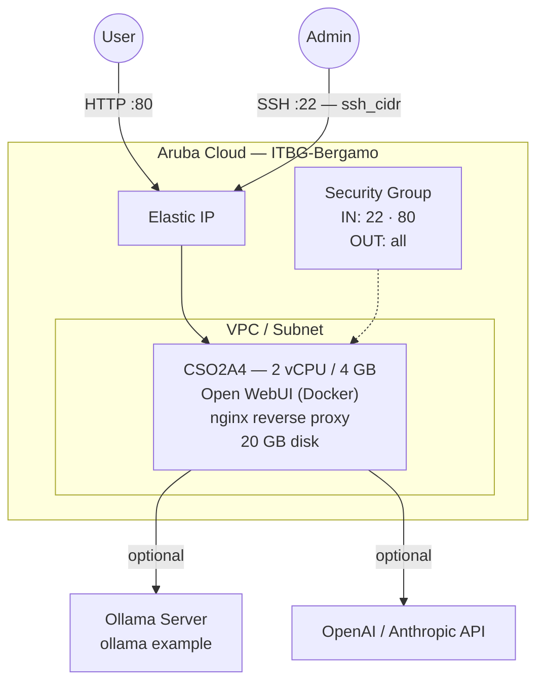

# Open WebUI on Aruba Cloud

Deploy [Open WebUI](https://openwebui.com/) — a self-hosted web interface for interacting with LLMs — on Aruba Cloud using Terraform and cloud-init. Connects to [Ollama](../ollama/README.md) for local models, OpenAI, Anthropic, or any OpenAI-compatible endpoint.

> **Provider version:** arubacloud/arubacloud `~> 0.5` | **Terraform:** ≥ 1.9

---

## Introduction

Open WebUI provides a polished, ChatGPT-like interface for local and cloud LLMs. It supports multi-user access, chat history, model switching, and RAG (retrieval-augmented generation). This example deploys:

- **Open WebUI** via the official Docker image
- **nginx** reverse proxy on port 80
- Optional connection to an **Ollama** server or **OpenAI** API
- First registered user becomes the admin

---

## Architecture Overview



---

## Infrastructure Created

| Resource | Name pattern | Description |
|----------|-------------|-------------|
| `arubacloud_project` | `owui-prod` | Project container |
| `arubacloud_vpc` | `owui-prod-vpc` | Virtual Private Cloud |
| `arubacloud_subnet` | `owui-prod-subnet` | Basic subnet |
| `arubacloud_securitygroup` | `owui-prod-vm-sg` | Security group |
| `arubacloud_securityrule` | `owui-prod-vm-ssh` | SSH ingress |
| `arubacloud_securityrule` | `owui-prod-vm-http` | HTTP ingress |
| `arubacloud_elasticip` | `owui-prod-vm-eip` | VM public IP |
| `arubacloud_blockstorage` | `owui-prod-boot` | 20 GB boot disk (Performance) |
| `arubacloud_keypair` | `owui-prod-keypair` | SSH public key |
| `arubacloud_cloudserver` | `owui-prod-vm` | CloudServer VM |

---

## Estimated Monthly Cost

| Resource | Spec | Est. cost/mo |
|----------|------|-------------|
| CloudServer VM | CSO2A4 — 2 vCPU / 4 GB | ~€20 |
| Boot disk | 20 GB Performance | ~€3 |
| Elastic IP | — | ~€3 |
| **Total** | | **~€26/mo** |

---

## Requirements

- Terraform ≥ 1.9
- ArubaCloud Terraform Provider `~> 0.5`
- An ArubaCloud account with OAuth2 API credentials
- An SSH key pair
- An Ollama server and/or an OpenAI-compatible API key

---

## Variables

### Required

| Variable | Description |
|----------|-------------|
| `arubacloud_client_id` | ArubaCloud OAuth2 client ID |
| `arubacloud_client_secret` | ArubaCloud OAuth2 client secret |
| `ssh_public_key` | SSH public key content |

### Optional

| Variable | Default | Description |
|----------|---------|-------------|
| `app_name` | `"owui"` | Short name used in all resource names |
| `environment` | `"prod"` | Environment label |
| `location` | `"ITBG-Bergamo"` | ArubaCloud region |
| `zone` | `"ITBG-1"` | Availability zone |
| `billing_period` | `"Hour"` | `"Hour"` or `"Month"` |
| `vm_flavor` | `"CSO2A4"` | CloudServer flavor |
| `vm_disk_size_gb` | `20` | Boot disk size in GB |
| `ssh_cidr` | `"0.0.0.0/0"` | CIDR for SSH |
| `ollama_base_url` | `""` | Ollama server URL (e.g. `http://10.0.0.10:11434`) |
| `openai_api_key` | `""` | OpenAI API key for cloud model access |
| `webui_secret_key` | `""` | Session secret key (auto-generated if empty) |
| `open_webui_version` | `"main"` | Docker image tag |

---

## Outputs

| Output | Description |
|--------|-------------|
| `webui_url` | Open WebUI URL |
| `vm_public_ip` | Public IP address of the VM |
| `ssh_command` | SSH command to connect to the VM |

---

## Deployment Instructions

### 1. Clone and navigate

```bash
git clone https://github.com/arubacloud/terraform-arubacloud-examples.git
cd terraform-arubacloud-examples/open-webui
```

### 2. Configure variables

```bash
cp terraform.tfvars.example terraform.tfvars
```

Point to your Ollama server or set an API key:

```hcl
ollama_base_url = "http://10.0.0.10:11434"
# openai_api_key = "sk-..."
```

### 3. Deploy

```bash
terraform init
terraform plan
terraform apply
```

Bootstrap takes approximately **2–3 minutes**.

### 4. Access the UI

Navigate to `http://<IP>` and register the first admin account.

---

## Security Recommendations

1. **Add HTTPS.** Place a Caddy or Nginx reverse proxy (in this repository) in front, or use the Certbot integration in the nginx config.

2. **Restrict SSH access.** Set `ssh_cidr` to your IP address.

3. **Use a strong secret key.** Set `webui_secret_key` to a random 32+ character string.

---

## References

- [Open WebUI Documentation](https://docs.openwebui.com/)
- [Open WebUI GitHub](https://github.com/open-webui/open-webui)
- [Ollama Example](../ollama/README.md)
- [ArubaCloud Terraform Provider](https://registry.terraform.io/providers/arubacloud/arubacloud/latest/docs)
