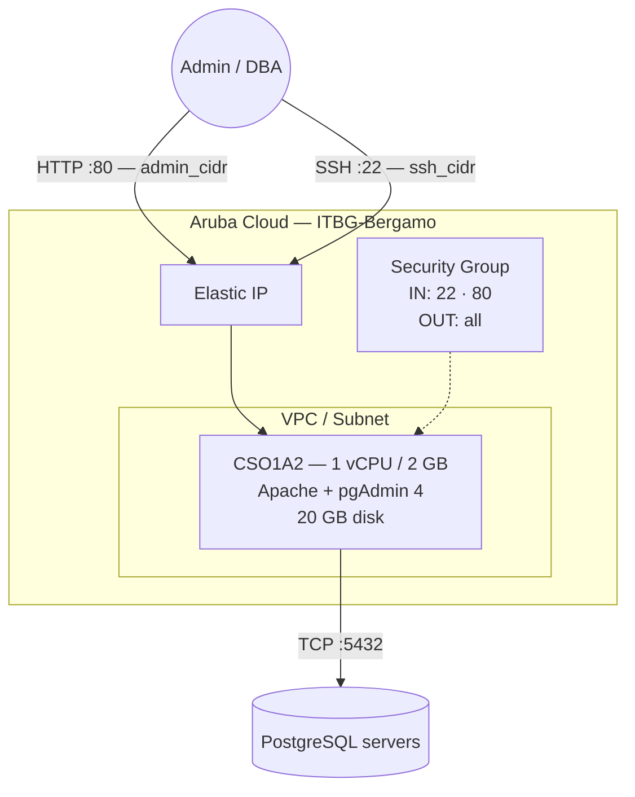

# pgAdmin on Aruba Cloud

Deploy [pgAdmin 4](https://www.pgadmin.org) — the leading open-source PostgreSQL administration tool — on Aruba Cloud using Terraform and cloud-init. pgAdmin is installed from the official pgAdmin apt repository in web mode, served by Apache on port 80.

> **Provider version:** arubacloud/arubacloud `~> 0.5` | **Terraform:** ≥ 1.9

---

## Introduction

pgAdmin 4 is a comprehensive GUI for managing PostgreSQL databases. This example provisions a dedicated pgAdmin instance on Aruba Cloud with:

- pgAdmin 4 installed from the **official pgAdmin apt repository** (web mode)
- **Apache** configured automatically by the pgAdmin setup script
- Port 80 restricted to `admin_cidr` — pgAdmin must never be exposed to the public internet
- Admin email and password configured at bootstrap time

> **Security note:** pgAdmin has access to all PostgreSQL databases you add to it. Always restrict `admin_cidr` to your specific management IP and use a strong password. Consider pairing this example with the [WireGuard](wireguard.md) VPN so pgAdmin is only reachable from your VPN tunnel.

---

## Architecture Overview



---

## Infrastructure Created

| Resource | Name pattern | Description |
|----------|-------------|-------------|
| `arubacloud_project` | `pgadmin-prod` | Project container |
| `arubacloud_vpc` | `pgadmin-prod-vpc` | Virtual Private Cloud |
| `arubacloud_subnet` | `pgadmin-prod-subnet` | Basic subnet |
| `arubacloud_securitygroup` | `pgadmin-prod-vm-sg` | Security group |
| `arubacloud_securityrule` | `pgadmin-prod-vm-ssh` | SSH ingress |
| `arubacloud_securityrule` | `pgadmin-prod-vm-admin-ui` | Admin UI ingress TCP 80 |
| `arubacloud_elasticip` | `pgadmin-prod-vm-eip` | VM public IP |
| `arubacloud_blockstorage` | `pgadmin-prod-boot` | 20 GB boot disk (Performance) |
| `arubacloud_keypair` | `pgadmin-prod-keypair` | SSH public key |
| `arubacloud_cloudserver` | `pgadmin-prod-vm` | CloudServer VM |

---

## Estimated Monthly Cost

| Resource | Spec | Est. cost/mo |
|----------|------|-------------|
| CloudServer VM | CSO1A2 — 1 vCPU / 2 GB | ~€9 |
| Boot disk | 20 GB Performance | ~€3 |
| Elastic IP | — | ~€3 |
| **Total** | | **~€15/mo** |

---

## Requirements

- Terraform ≥ 1.9
- ArubaCloud Terraform Provider `~> 0.5`
- An ArubaCloud account with OAuth2 API credentials
- An SSH key pair
- One or more PostgreSQL servers reachable from the VM

---

## Variables

### Required

| Variable | Description |
|----------|-------------|
| `arubacloud_client_id` | ArubaCloud OAuth2 client ID |
| `arubacloud_client_secret` | ArubaCloud OAuth2 client secret |
| `ssh_public_key` | SSH public key content |
| `pgadmin_email` | Login email address for pgAdmin |
| `pgadmin_password` | Login password for pgAdmin (min 8 chars) |

### Optional

| Variable | Default | Description |
|----------|---------|-------------|
| `app_name` | `"pgadmin"` | Short name used in all resource names |
| `environment` | `"prod"` | Environment label |
| `location` | `"ITBG-Bergamo"` | ArubaCloud region |
| `zone` | `"ITBG-1"` | Availability zone |
| `billing_period` | `"Hour"` | `"Hour"` or `"Month"` |
| `vm_flavor` | `"CSO1A2"` | CloudServer flavor |
| `vm_image` | `"LU22-001"` | Boot disk image (Ubuntu 22.04 LTS) |
| `vm_disk_size_gb` | `20` | Boot disk size in GB |
| `ssh_cidr` | `"0.0.0.0/0"` | CIDR for SSH — restrict in production |
| `admin_cidr` | `"0.0.0.0/0"` | CIDR for web UI — **always restrict** |

---

## Outputs

| Output | Description |
|--------|-------------|
| `pgadmin_url` | pgAdmin web interface URL |
| `pgadmin_email` | Login email address |
| `vm_public_ip` | Public IP address of the VM |
| `ssh_command` | SSH command to connect to the VM |

---

## Deployment Instructions

### 1. Clone and navigate

```bash
git clone https://github.com/arubacloud/terraform-arubacloud-examples.git
cd terraform-arubacloud-examples/pgadmin
```

### 2. Configure variables

```bash
cp terraform.tfvars.example terraform.tfvars
```

Set credentials, email, password, and **restrict CIDRs**:

```hcl
pgadmin_email    = "admin@example.com"
pgadmin_password = "your-strong-password"
admin_cidr       = "203.0.113.42/32"
ssh_cidr         = "203.0.113.42/32"
```

### 3. Deploy

```bash
terraform init
terraform plan
terraform apply
```

Bootstrap takes approximately **5–8 minutes** (pgAdmin package download + Apache setup).

### 4. Open pgAdmin

```bash
terraform output pgadmin_url
```

Log in with `pgadmin_email` and `pgadmin_password`. pgAdmin 4 opens at `/pgadmin4`.

### 5. Add a PostgreSQL server

In the pgAdmin UI: **Object → Register → Server**

- **General → Name:** any friendly name
- **Connection → Host:** IP or hostname of your PostgreSQL server
- **Connection → Port:** 5432
- **Connection → Username / Password:** your PostgreSQL credentials

The pgAdmin VM must be able to reach the PostgreSQL server on TCP port 5432. Ensure the PostgreSQL server's security group or firewall allows inbound connections from the pgAdmin VM IP.

---

## Security Recommendations

1. **Always restrict `admin_cidr`.** pgAdmin stores PostgreSQL credentials — never expose it to `0.0.0.0/0` in production.

2. **Use VPN access.** The most secure setup is to keep `admin_cidr` set to your WireGuard VPN tunnel CIDR and access pgAdmin only from within the VPN. See the [WireGuard example](wireguard.md).

3. **Use SSH tunnelling as an alternative.** If you prefer not to expose port 80 at all, set `admin_cidr = "127.0.0.1/32"` and access pgAdmin via an SSH tunnel:

   ```bash
   ssh -L 5050:localhost:80 ubuntu@<vm-ip>
   # Then open http://localhost:5050/pgadmin4 in your browser
   ```

---

## Troubleshooting

### pgAdmin page not loading

```bash
sudo systemctl status apache2
sudo cat /var/log/apache2/error.log | tail -20
sudo cat /var/log/cloud-init-output.log | tail -30
```

### Cannot connect to PostgreSQL

From the pgAdmin VM, verify TCP connectivity:

```bash
nc -zv <postgres-host> 5432
```

Check that the PostgreSQL `pg_hba.conf` allows connections from the pgAdmin VM IP, and that any security group or firewall on the PostgreSQL server permits port 5432.

---

## References

- [pgAdmin Documentation](https://www.pgadmin.org/docs/)
- [pgAdmin apt Repository](https://www.pgadmin.org/download/pgadmin-4-apt/)
- [ArubaCloud Terraform Provider](https://registry.terraform.io/providers/arubacloud/arubacloud/latest/docs)
