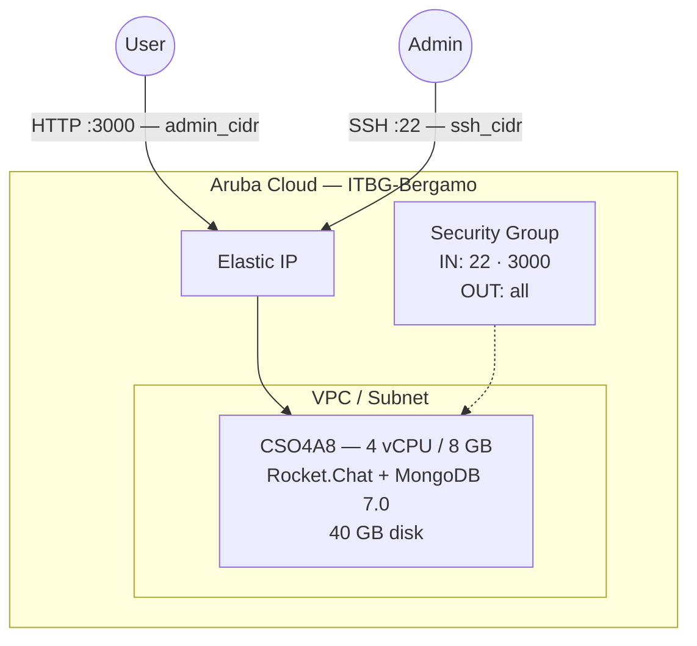

# Rocket.Chat on Aruba Cloud

Deploy [Rocket.Chat](https://rocket.chat) — an open-source team messaging and collaboration platform — on Aruba Cloud using Terraform and cloud-init. Rocket.Chat and MongoDB 7.0 run as Docker Compose services with the admin account pre-configured at bootstrap time.

> **Provider version:** arubacloud/arubacloud `~> 0.5` | **Terraform:** ≥ 1.9

---

## Introduction

Rocket.Chat is a self-hosted alternative to Slack and Microsoft Teams, offering real-time messaging, video calls, and file sharing. This example provisions:

- **Rocket.Chat** (latest stable) and **MongoDB 7.0** via Docker Compose
- MongoDB replica set initialised automatically (required by Rocket.Chat for oplog tailing)
- Admin account created on first start via environment variables — no manual setup wizard
- Port 3000 for the web UI, restricted to `admin_cidr`

> **Compared to Mattermost:** Rocket.Chat is more feature-rich but heavier (MongoDB vs. PostgreSQL). For a simpler team messaging solution with lower resource usage, consider the [Mattermost example](mattermost.md).

---

## Architecture Overview



---

## Infrastructure Created

| Resource | Name pattern | Description |
|----------|-------------|-------------|
| `arubacloud_project` | `rc-prod` | Project container |
| `arubacloud_vpc` | `rc-prod-vpc` | Virtual Private Cloud |
| `arubacloud_subnet` | `rc-prod-subnet` | Basic subnet |
| `arubacloud_securitygroup` | `rc-prod-vm-sg` | Security group |
| `arubacloud_securityrule` | `rc-prod-vm-ssh` | SSH ingress |
| `arubacloud_securityrule` | `rc-prod-vm-admin-ui` | Web UI ingress TCP 3000 |
| `arubacloud_elasticip` | `rc-prod-vm-eip` | VM public IP |
| `arubacloud_blockstorage` | `rc-prod-boot` | 40 GB boot disk (Performance) |
| `arubacloud_keypair` | `rc-prod-keypair` | SSH public key |
| `arubacloud_cloudserver` | `rc-prod-vm` | CloudServer VM |

---

## Estimated Monthly Cost

| Resource | Spec | Est. cost/mo |
|----------|------|-------------|
| CloudServer VM | CSO4A8 — 4 vCPU / 8 GB | ~€35 |
| Boot disk | 40 GB Performance | ~€6 |
| Elastic IP | — | ~€3 |
| **Total** | | **~€44/mo** |

---

## Requirements

- Terraform ≥ 1.9
- ArubaCloud Terraform Provider `~> 0.5`
- An ArubaCloud account with OAuth2 API credentials
- An SSH key pair

---

## Variables

### Required

| Variable | Description |
|----------|-------------|
| `arubacloud_client_id` | ArubaCloud OAuth2 client ID |
| `arubacloud_client_secret` | ArubaCloud OAuth2 client secret |
| `ssh_public_key` | SSH public key content |
| `admin_email` | Rocket.Chat admin email address |
| `admin_password` | Rocket.Chat admin password (min 8 chars) |

### Optional

| Variable | Default | Description |
|----------|---------|-------------|
| `app_name` | `"rc"` | Short name used in all resource names |
| `environment` | `"prod"` | Environment label |
| `location` | `"ITBG-Bergamo"` | ArubaCloud region |
| `zone` | `"ITBG-1"` | Availability zone |
| `billing_period` | `"Hour"` | `"Hour"` or `"Month"` |
| `vm_flavor` | `"CSO4A8"` | CloudServer flavor |
| `vm_image` | `"LU22-001"` | Boot disk image (Ubuntu 22.04 LTS) |
| `vm_disk_size_gb` | `40` | Boot disk size in GB |
| `ssh_cidr` | `"0.0.0.0/0"` | CIDR for SSH |
| `admin_cidr` | `"0.0.0.0/0"` | CIDR for web UI port 3000 |
| `admin_username` | `"admin"` | Rocket.Chat admin username |
| `admin_fullname` | `"Administrator"` | Rocket.Chat admin display name |

---

## Outputs

| Output | Description |
|--------|-------------|
| `rocketchat_url` | Rocket.Chat web UI URL |
| `vm_public_ip` | Public IP address of the VM |
| `ssh_command` | SSH command to connect to the VM |

---

## Deployment Instructions

### 1. Clone and navigate

```bash
git clone https://github.com/arubacloud/terraform-arubacloud-examples.git
cd terraform-arubacloud-examples/rocketchat
```

### 2. Configure variables

```bash
cp terraform.tfvars.example terraform.tfvars
```

### 3. Deploy

```bash
terraform init
terraform plan
terraform apply
```

Bootstrap takes approximately **5–8 minutes** (Docker install + MongoDB replica set init + Rocket.Chat first-start).

### 4. Access Rocket.Chat

```bash
terraform output rocketchat_url
```

Log in with `admin_username` / `admin_password`. Allow 2–3 minutes for Rocket.Chat to fully initialise on first start.

---

## Troubleshooting

### Rocket.Chat not loading

```bash
ssh ubuntu@$(terraform output -raw vm_public_ip)
docker compose -f /opt/rocketchat/docker-compose.yml ps
docker compose -f /opt/rocketchat/docker-compose.yml logs rocketchat --tail 50
```

### MongoDB replica set not initialised

```bash
docker compose -f /opt/rocketchat/docker-compose.yml exec mongo mongosh \
  --eval "rs.status()"
```

If `rs.status()` returns an error, initialise manually:

```bash
docker compose -f /opt/rocketchat/docker-compose.yml exec mongo mongosh \
  --eval "rs.initiate({_id:'rs0',members:[{_id:0,host:'localhost:27017'}]})"
```

---

## References

- [Rocket.Chat Documentation](https://docs.rocket.chat)
- [Rocket.Chat Docker Compose Guide](https://docs.rocket.chat/deploy/deploy-rocket.chat/deploy-with-docker-and-docker-compose)
- [Mattermost Example](mattermost.md)
- [ArubaCloud Terraform Provider](https://registry.terraform.io/providers/arubacloud/arubacloud/latest/docs)
