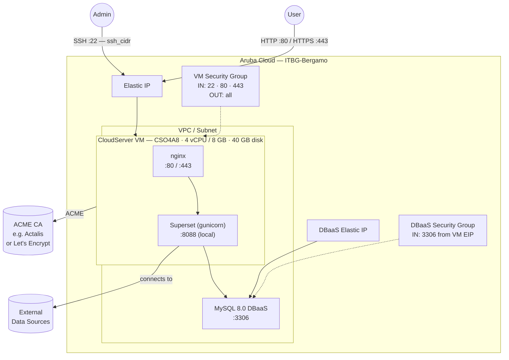

# Apache Superset on Aruba Cloud

Deploy [Apache Superset](https://superset.apache.org) — the modern, open-source data exploration and visualisation platform — on Aruba Cloud using Terraform and cloud-init. This example provisions Superset with a Managed MySQL DBaaS metadata store, gunicorn as the application server, and nginx as a reverse proxy with optional automatic HTTPS.

> **Provider version:** arubacloud/arubacloud `~> 1.0` | **Terraform:** ≥ 1.9

---

## Introduction

Apache Superset is a data exploration and business intelligence platform that supports hundreds of databases and data sources. This example provisions:

| Component | Role | Port |
|-----------|------|------|
| **Superset** (gunicorn) | Web UI — dashboards, charts, SQL Lab | 8088 (proxied by nginx) |
| **MySQL DBaaS** | Superset metadata DB (dashboards, datasets, users) | 3306 (DBaaS Elastic IP) |
| **nginx** | Reverse proxy on 80/443 | 80 / 443 |

> **Bootstrap time:** approximately **20–30 minutes** — Superset and its many Python dependencies install via pip.

---

## Architecture Overview



---

## Infrastructure Created

| Resource | Name pattern | Description |
|----------|-------------|-------------|
| `arubacloud_project` | `superset-prod` | Project container |
| `arubacloud_vpc` | `superset-prod-vpc` | Virtual Private Cloud |
| `arubacloud_subnet` | `superset-prod-subnet` | Basic subnet |
| `arubacloud_securitygroup` | `superset-prod-vm-sg` | VM security group |
| `arubacloud_securitygroup` | `superset-prod-dbaas-sg` | DBaaS security group |
| `arubacloud_securityrule` | `superset-prod-vm-ssh` | SSH ingress |
| `arubacloud_securityrule` | `superset-prod-vm-http` | HTTP ingress TCP 80 |
| `arubacloud_securityrule` | `superset-prod-vm-https` | HTTPS ingress TCP 443 |
| `arubacloud_securityrule` | `superset-prod-db-mysql` | MySQL ingress from VM Elastic IP |
| `arubacloud_elasticip` | `superset-prod-vm-eip` | VM public IP |
| `arubacloud_elasticip` | `superset-prod-dbaas-eip` | DBaaS public IP |
| `arubacloud_blockstorage` | `superset-prod-boot` | 40 GB boot disk (Performance) |
| `arubacloud_keypair` | `superset-prod-keypair` | SSH public key |
| `arubacloud_dbaas` | `superset-prod-dbaas` | Managed MySQL 8.0 DBaaS |
| `arubacloud_database` | `superset` | Superset metadata database |
| `arubacloud_dbaasuser` | `superset` | Superset DB user |
| `arubacloud_cloudserver` | `superset-prod-vm` | CloudServer VM |

---

## Estimated Monthly Cost

| Resource | Spec | Est. cost/mo |
|----------|------|-------------|
| CloudServer VM | CSO4A8 — 4 vCPU / 8 GB | ~€36 |
| Boot disk | 40 GB Performance | ~€6 |
| Elastic IP (VM) | — | ~€3 |
| MySQL DBaaS | DBO2A8 | ~€35 |
| Elastic IP (DBaaS) | — | ~€3 |
| **Total** | | **~€83/mo** |

---

## Requirements

- Terraform ≥ 1.9
- ArubaCloud Terraform Provider `~> 1.0`
- An ArubaCloud account with OAuth2 API credentials
- An SSH key pair

---

## Variables

### Required

| Variable | Description |
|----------|-------------|
| `arubacloud_client_id` | ArubaCloud OAuth2 client ID |
| `arubacloud_client_secret` | ArubaCloud OAuth2 client secret |
| `ssh_public_key` | SSH public key content |
| `db_password` | MySQL password for the Superset metadata DB user |
| `admin_password` | Password for the initial Superset admin account |

### Optional

| Variable | Default | Description |
|----------|---------|-------------|
| `app_name` | `"superset"` | Short name used in all resource names |
| `environment` | `"prod"` | Environment label |
| `location` | `"ITBG-Bergamo"` | ArubaCloud region |
| `zone` | `"ITBG-1"` | Availability zone |
| `billing_period` | `"Hour"` | `"Hour"` or `"Month"` |
| `vm_flavor` | `"CSO4A8"` | CloudServer flavor |
| `vm_disk_size_gb` | `40` | Boot disk size in GB |
| `ssh_cidr` | `"0.0.0.0/0"` | CIDR for SSH — **restrict to your IP in production** |
| `dbaas_flavor` | `"DBO2A8"` | DBaaS flavor |
| `db_storage_gb` | `20` | DBaaS initial storage in GB |
| `admin_username` | `"admin"` | Superset admin username |
| `admin_email` | `"admin@example.com"` | Superset admin email |
| `superset_version` | `"4.1.1"` | Superset version to install |
| `domain` | `""` | Custom domain for ACME HTTPS |

---

## Outputs

| Output | Description |
|--------|-------------|
| `app_url` | Superset web interface URL |
| `vm_public_ip` | Public IP address of the VM |
| `ssh_command` | SSH command to connect to the VM |
| `admin_password` | Superset admin password (sensitive) |

---

## Deployment Instructions

### 1. Clone and navigate

```bash
git clone https://github.com/arubacloud/terraform-arubacloud-examples.git
cd terraform-arubacloud-examples/superset
```

### 2. Configure variables

```bash
cp terraform.tfvars.example terraform.tfvars
```

Set `db_password`, `admin_password`, your credentials, and SSH key.

### 3. Deploy

```bash
terraform init
terraform plan
terraform apply
```

> Bootstrap takes **20–30 minutes**. Monitor progress:
>
> ```bash
> ssh ubuntu@$(terraform output -raw vm_public_ip)
> sudo tail -f /var/log/cloud-init-output.log
> ```

### 4. Open Superset

```bash
terraform output app_url
```

Log in with the `admin_username` (default: `admin`) and your `admin_password`.

### 5. Connect a data source

Go to **Settings → Database Connections → + Database** and add your data source. Superset supports PostgreSQL, MySQL, ClickHouse, Snowflake, BigQuery, and many more.

---

## Enabling HTTPS (ACME)

When `domain` is set to a real domain:

1. Create a DNS A record: `bi.example.com → <vm_public_ip>`
2. Set `domain = "bi.example.com"` in `terraform.tfvars`
3. Re-apply — Certbot provisions a certificate via an ACME provider such as [Actalis ACME Certificates](https://guide.actalis.com/it/ssl/attivazione/acme) or Let's Encrypt

---

## Security Recommendations

1. **Restrict SSH to your IP.** Set `ssh_cidr = "your.ip/32"`.
2. **Use HTTPS.** Set `domain` before inviting users — credentials travel in cleartext over HTTP.
3. **Enable row-level security** for multi-tenant deployments via Superset's built-in RLS feature.
4. **Rotate `SECRET_KEY`** if you migrate the deployment — a new key invalidates all existing sessions.

---

## Troubleshooting

### Superset not loading after 30 minutes

```bash
ssh ubuntu@$(terraform output -raw vm_public_ip)
sudo systemctl status superset
sudo journalctl -u superset -n 50
sudo tail -100 /var/log/cloud-init-output.log
```

### "CSRF token missing" errors

Set `domain` and enable HTTPS. CSRF protection works best with a real domain and TLS.

---

## References

- [Apache Superset Documentation](https://superset.apache.org/docs/intro)
- [Superset Configuration Reference](https://superset.apache.org/docs/configuration/configuring-superset)
- [Supported Databases](https://superset.apache.org/docs/databases/installing-database-drivers)
- [ArubaCloud Terraform Provider](https://registry.terraform.io/providers/arubacloud/arubacloud/latest/docs)
- [cloud-init Reference](https://cloudinit.readthedocs.io/)
