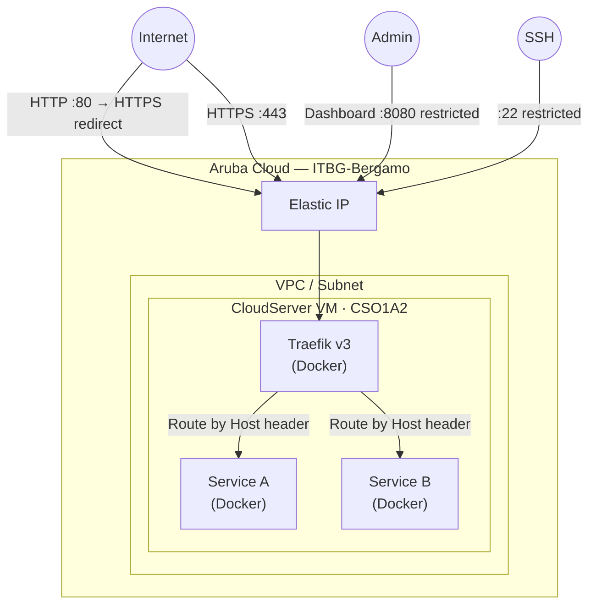

# Traefik on Aruba Cloud

Deploy [Traefik v3](https://traefik.io/traefik/) — a cloud-native reverse proxy with automatic Let's Encrypt TLS — on Aruba Cloud. Use it as the HTTPS entry point for any other service running on the same VM or in the same Docker network.

> **Provider version:** arubacloud/arubacloud `~> 0.5` | **Terraform:** ≥ 1.9

---

## Introduction

Traefik automatically discovers Docker containers and proxies HTTPS traffic to them using service labels. TLS certificates are issued and renewed by Let's Encrypt with zero manual intervention. Add any Docker container to the `traefik-public` network and label it — Traefik routes traffic automatically.

---

## Architecture Overview



---

## Infrastructure Created

| Resource | Description |
|----------|-------------|
| `arubacloud_cloudserver` | `traefik-prod-vm` (CSO1A2) |
| `arubacloud_blockstorage` | 20 GB boot disk |
| `arubacloud_elasticip` | Public IP |
| `arubacloud_securitygroup` | TCP 80/443/8080/22 ingress |

---

## Estimated Monthly Cost

| Resource | Est. cost/mo |
|----------|-------------|
| CSO1A2 VM | ~€10 |
| 20 GB disk | ~€3 |
| Elastic IP | ~€5 |
| **Total** | **~€18/mo** |

---

## Variables

### Required

`arubacloud_client_id`, `arubacloud_client_secret`, `ssh_public_key`, `acme_email`

### Optional

| Variable | Default | Description |
|----------|---------|-------------|
| `traefik_version` | `"v3.2"` | Docker image tag |
| `enable_dashboard` | `true` | Enable web dashboard on port 8080 |
| `dashboard_cidr` | `"0.0.0.0/0"` | Dashboard source CIDR — **restrict to your IP** |
| `ssh_cidr` | `"0.0.0.0/0"` | SSH source CIDR — restrict to your IP |

---

## Deployment

```bash
cd terraform-arubacloud-examples/traefik
cp terraform.tfvars.example terraform.tfvars
# Set acme_email in terraform.tfvars
terraform init && terraform apply
```

## Adding a service behind Traefik

SSH into the VM and add a Docker container with Traefik labels:

```yaml
# In any docker-compose.yml on the same VM
services:
  myapp:
    image: nginx
    labels:
      - "traefik.enable=true"
      - "traefik.http.routers.myapp.rule=Host(`myapp.example.com`)"
      - "traefik.http.routers.myapp.entrypoints=websecure"
      - "traefik.http.routers.myapp.tls.certresolver=letsencrypt"
    networks:
      - traefik-public

networks:
  traefik-public:
    external: true
```

---

## Destroy

```bash
terraform destroy
```

---

## Security Recommendations

1. **Restrict `dashboard_cidr`** — the dashboard shows all routes and configuration. Limit to your IP.
2. **Disable the dashboard in production** (`enable_dashboard = false`) if you don't actively use it.
3. **Use middlewares** for authentication: `basicAuth` or `forwardAuth` (with Keycloak/Authentik) in front of services.

---

## Troubleshooting

### Certificates not issuing

- DNS A record must point to the Elastic IP before the first request.
- Check Traefik logs: `ssh ubuntu@<IP> 'docker logs traefik --tail 100'`
- Port 80 must be reachable (Traefik uses HTTP-01 challenge).

### Dashboard not accessible

```bash
docker ps  # Verify traefik container is running
docker logs traefik
```

---

## References

- [Traefik Documentation](https://doc.traefik.io/traefik/)
- [Docker provider configuration](https://doc.traefik.io/traefik/providers/docker/)
- [Let's Encrypt with Traefik](https://doc.traefik.io/traefik/https/acme/)
